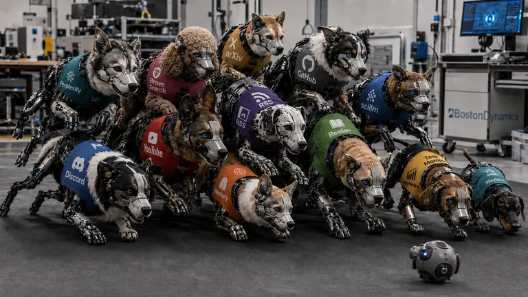
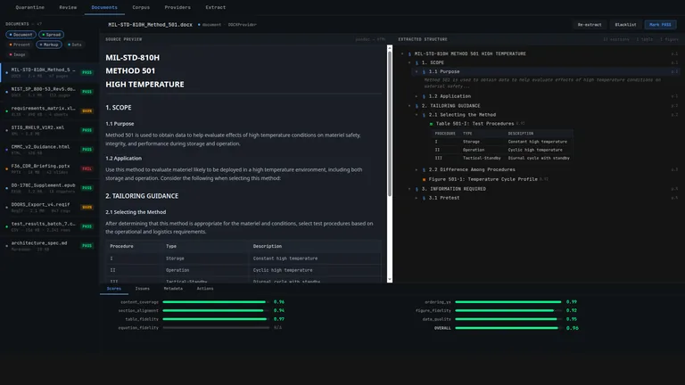

# Agent Skills


Reusable skills, bounded agents, persona contracts, scheduler jobs, and lifecycle
hooks for agent work. This repository is the source of truth; deployed copies
and project-local links are consumers.

The important distinction:

| Path | What it is | Use it when |
|---|---|---|
| `skills/` | Reusable capabilities with `SKILL.md` contracts and usually `run.sh` entrypoints | You need a capability such as browser automation, memory recall, video analysis, review, planning, or model calls |
| `agents/` | Bounded project-agent/OpenCode workers with `AGENTS.md`, `persona.yaml`, and optional `services.yaml` | You need a role-bounded worker, reviewer, monitor, or scheduled maintainer |
| `personas/` | Persona registry and contract layer for identities, memory probes, and voice readiness | You need to know which personas exist, where their source lives, and what evidence supports memory or voice lanes |
| `hooks/` | Lifecycle gates and prompt hooks | You need memory-first behavior, quality gates, or completion discipline around agent sessions |
| `reports/agent-maintainer/` | Latest report-only sweep over skills and agents | You need a triage surface before maintenance decisions |

## Start Here

```bash
# Deploy skills and hooks to local agent homes
./deploy.sh

# Check what deployment would change
./deploy.sh --check

# Find skill contracts
find skills -maxdepth 2 -name SKILL.md | sort

# Find agent contracts
find agents -maxdepth 2 \( -name AGENTS.md -o -name persona.yaml \) | sort

# Read the persona registry guide
sed -n '1,160p' personas/README.md
```

If a user names a skill, read that skill's `SKILL.md` before acting. The
`README.md` files are human guides; `SKILL.md` files are operational contracts.

## What I'm Working On

I maintain projects and skills continuously. Here's my current focus:

<table>
  <tr>
    <td align="center">
      <a href="https://github.com/grahama1970/tau">
        
      </a>
      <br/><strong>T'au</strong> — Goal-locked agent harness
    </td>
    <td align="center">
      <a href="https://github.com/grahama1970/agent-skills/tree/main/skills/surf">
        
      </a>
      <br/><strong>Surf</strong> — Browser automation &amp; WebGPT transport
    </td>
    <td align="center">
      <a href="https://github.com/grahama1970/agent-skills/tree/main/skills/dogpile">
        
      </a>
      <br/><strong>Dogpile</strong> — Multi-source research evidence
    </td>
  </tr>
  <tr>
    <td align="center">
      <a href="https://github.com/grahama1970/agent-skills/tree/main/skills/persona-dream">
        
      </a>
      <br/><strong>Persona Dream</strong> — Memory-to-storyboard packets
    </td>
    <td align="center">
      <a href="https://github.com/grahama1970/agent-skills/tree/main/skills/extractor">
        
      </a>
      <br/><strong>Extractor</strong> — Preset-first document ingestion
    </td>
    <td align="center">
      <a href="https://github.com/grahama1970/agent-skills/tree/main/skills/pdf-lab">
        
      </a>
      <br/><strong>PDF Lab</strong> — Extraction convergence loop
    </td>
  </tr>
  <tr>
    <td align="center">
      <a href="https://github.com/grahama1970/agent-skills/tree/main/skills/battle">
        
      </a>
      <br/><strong>Battle</strong> — Red vs Blue security competitions
    </td>
    <td align="center">
      <a href="https://github.com/grahama1970/agent-skills/tree/main/skills/watch">
        
      </a>
      <br/><strong>Watch</strong> — Video evidence extraction
    </td>
    <td align="center">
      <a href="https://github.com/grahama1970/agent-skills/tree/main/skills/debugger">
        
      </a>
      <br/><strong>Debugger</strong> — Runtime state inspection
    </td>
  </tr>
</table>

## Current Inventory

Latest local sweep used for this README: `msh-20260628-084135`.

| Inventory | Count |
|---|---:|
| Skills scanned | 330 |
| Skills with `run.sh` | 285 |
| Skills with `sanity.sh` | 278 |
| Agent directories inventoried | 72 |
| Agents with `AGENTS.md` | 69 |
| Agents with `persona.yaml` | 47 |
| Agents with `services.yaml` | 6 |

The sweep reported 171 healthy skills, 158 warning skills, 1 critical skill
finding, and 28 shallow agent contract findings. Those numbers prove inventory
and triage only; they do not prove semantic correctness or live behavior.

Reports:

```text
reports/agent-maintainer/latest.md
reports/agent-maintainer/latest.json
reports/agent-maintainer/latest.html
reports/agent-maintainer/runs/<run_id>/
```

## Repository Map

```text
agent-skills/
  skills/                  reusable capabilities with SKILL.md contracts
  agents/                  bounded workers, reviewers, monitors, maintainers
  personas/                persona registry, schemas, and guide
  hooks/                   lifecycle gates and prompt hooks
  scripts/                 repo maintenance, checks, and queue runners
  reports/agent-maintainer latest repo sweep for human decisions
  deploy.sh                broadcast skills and hooks to local agent homes
  workers-registry.json    generated worker registry
```

## Choosing The Right Surface

| Work | Go to | Why |
|---|---|---|
| Invoke an existing capability | `skills/<name>/run.sh` and `skills/<name>/SKILL.md` | Skills own executable behavior, routing rules, artifacts, and proof language |
| Learn how a capability is used | `skills/<name>/README.md` | Skill READMEs are operator-facing guides |
| Repair or extend a capability | `skills/<name>/SKILL.md`, scripts, tests, `sanity.sh` | Contract changes need a focused implementation and proof |
| Delegate bounded work | `agents/<name>/AGENTS.md` plus `persona.yaml` | Agents define ownership, denied scope, allowed skills, receipts, and stop conditions |
| Inspect persona availability | `personas/registry.yaml` and `personas/README.md` | Personas are registry records, not generated corpora |
| Enforce session behavior | `hooks/` | Hooks inject memory, block unsafe exits, and enforce evidence discipline |
| Make maintenance decisions | `reports/agent-maintainer/latest.md` | Reports are decision surfaces, not dashboards |

## Skills

Each skill is a directory under `skills/`. A production skill usually has:

```text
skills/<name>/
  SKILL.md            required contract for agents
  README.md           human/operator guide when useful
  run.sh              stable entrypoint
  sanity.sh           cheap local proof
  scripts/            implementation details
  references/         schemas, examples, templates
```

Use a skill when it already owns the job. Do not write a parallel utility for
browser automation, LLM calls, memory recall, report writing, GitHub tickets,
code review, video analysis, or scheduled monitoring until you have checked the
skill list and maintainer report.

Typical invocation:

```bash
cd skills/surf
./run.sh tab.list --json
```

## Agents

Agents live under `agents/`. They are not broadcast like skills; they are
referenced by project-agent/OpenCode configuration and maintainer routing.

A good agent has a narrow owner boundary:

- what it owns
- what it does not own
- which skills it may call
- what artifacts prove a turn
- when it must stop or ask for help

Normal shape:

```text
agents/<name>/
  AGENTS.md
  persona.yaml
  services.yaml       only for scheduled jobs
```

Missing `persona.yaml` findings are contract-normalization candidates, not proof
that the worker is broken.

## Personas

`personas/` is not where generated character assets live. It is the roster and
contract layer for persona work:

```text
personas/
  README.md
  registry.yaml
  schemas/persona-registry.schema.json
```

The registry points to source directories, memory probes, and voice-readiness
receipts. Runtime persona memory lives in `$memory`; generated media and voice
artifacts live under their own storage or skill job paths.

## Maintainer Loop

There are two maintainer roles:

| Role | Owns | Does not own |
|---|---|---|
| `agent-maintainer` | Scheduled report-only sweeps over `skills/` and `agents/`; latest reports; candidate next actions | Automatic deprecation, deletion, repair, or issue closure |
| `skill-maintainer` | One GitHub issue lease at a time; repair routing; verifier/review/WebGPT evidence bundle; proof-based issue disposition | Broad untracked cleanup, multi-issue repair, closure from WebGPT alone |

Run the report-only sweep:

```bash
mkdir -p reports/agent-maintainer
skills/monitor-skill-health/run.sh audit \
  --no-memory \
  --no-deep-review \
  --repo-report \
  --json > reports/agent-maintainer/last_run.json
```

The scheduled job is registered in `agents/agent-maintainer/services.yaml` and
disabled by default. Enable it only when the scheduler environment is ready and
the human wants the cron active.

## Hooks

Hooks run around agent lifecycle events. They keep behavior honest: memory
first, no destructive shell shortcuts, no fake green exits, and no vague
completion claims without evidence.

Important paths:

```text
hooks/memory-first.sh
hooks/quality-gate.sh
hooks/task-complete-gate.sh
hooks/prompts/
```

Deploy hooks with:

```bash
./deploy.sh --hooks
```

## Adding Things

Add a skill when the capability is reusable and needs a contract, entrypoint,
and proof. Add an agent when a bounded role, receipts, and stop conditions matter.
Keep one-off scripts, product features, broad cleanup, and standalone prompts out
of this repo unless they belong to an existing skill or agent contract.

For new skills:

- put the operating contract in `SKILL.md`
- use `run.sh` as the stable entrypoint
- add `sanity.sh` for cheap local proof
- reuse existing skills before adding infrastructure
- keep generated outputs and heavy artifacts out of the skill directory unless
  the skill contract explicitly says otherwise

For new agents:

- define the owner boundary in `AGENTS.md`
- encode the role in `persona.yaml`
- add `services.yaml` only for scheduled jobs
- avoid agents that own detection, mutation, queueing, and closure all at once

## Proof And Non-Claims

The maintainer sweep used for this README was local and deterministic:

```text
mocked: no
live: no
exercised: monitor-skill-health audit over 330 skills plus shallow agents/ metadata inventory
unverified: semantic correctness of each skill, runtime behavior of each agent, live scheduler daemon registration, live GitHub issue mutation
```

Use `reports/agent-maintainer/latest.md` before final maintenance decisions, and
rerun the sweep after substantial changes.
