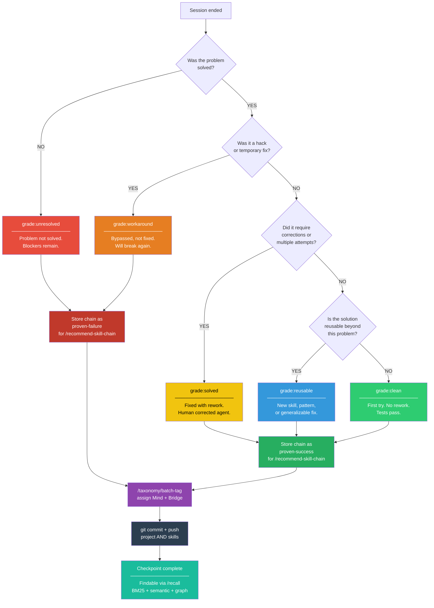
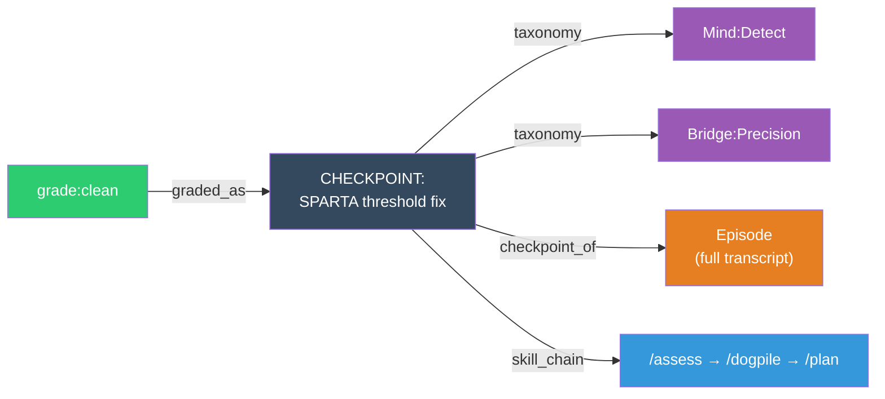

# Checkpoint Session Rubric v1

## Grades

Five levels. Each is a graph node in ArangoDB. Pick the ONE that matches.

| Grade | Label | Criteria | Tag |
|-------|-------|----------|-----|
| **1** | `unresolved` | Problem not solved. Session ended without a working solution. Blockers remain. | `grade:unresolved` |
| **2** | `workaround` | Problem bypassed, not solved. Hack, manual fix, or "good enough for now." Will break again. | `grade:workaround` |
| **3** | `solved` | Problem solved with rework. Took multiple attempts, corrections, or human intervention to get right. | `grade:solved` |
| **4** | `clean` | Problem solved first try or with minimal iteration. No rework. Tests pass. | `grade:clean` |
| **5** | `reusable` | Solution is generalizable. Created a new skill, pattern, or approach that applies beyond this specific problem. | `grade:reusable` |

## How to Pick (decision tree for agents)

Follow this chart top-to-bottom. Take the first exit that matches.



## Observable Signals (for automatic grading)

| Signal | Maps to |
|--------|---------|
| Session has unresolved blockers | `unresolved` |
| User said "stop", "nevermind", "skip" | `unresolved` |
| User said "good enough", "for now", "hack" | `workaround` |
| Agent received corrections ("no, not that", "try again") | `solved` |
| Tests passed on first run, no rework | `clean` |
| New skill created, or solution stored for reuse | `reusable` |

## Graph Structure

Each grade is a **node** in the `checkpoint_grades` collection. Checkpoints link to their grade via `graded_as` edges. This enables:

```
/memory recall "clean solutions for SPARTA validation"
    → BM25 matches "SPARTA validation" in problem text
    → filter by tag grade:clean
    → returns only first-try clean solutions

/trace from grade:reusable
    → traverses graded_as edges → checkpoints → taxonomy edges → related controls
    → finds all generalizable solutions and what domains they apply to

/trace from grade:unresolved
    → traverses graded_as edges → checkpoints → episode edges → full transcripts
    → finds all unsolved problems with their conversation history
```

### Multi-hop traversal example



**Query:** "What clean solutions exist for Detect+Precision problems?"
→ Start at `grade:clean` → follow `graded_as` → filter by `Mind:Detect` + `Bridge:Precision` → return skill chains

## Rubric Version

Store `rubric_version: 1` in every checkpoint solution_doc. When the rubric changes (levels added/renamed), bump the version. This enables:
- Drift detection: "grades assigned under v1 may not compare to v2"
- Migration: batch-retag old checkpoints when rubric changes
