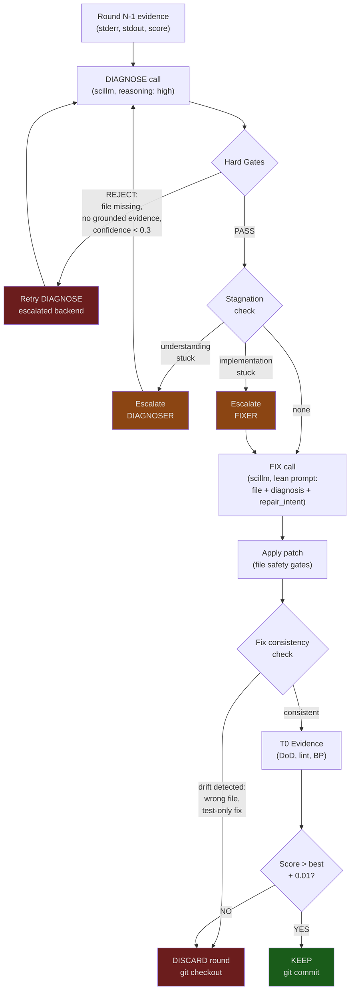

# /plan → /orchestrate → /code-runner v2: Reliability Walkthrough

**Date:** 2026-04-06
**Files:** `.pi/skills/code-runner/diagnose.py` (375 lines), `code_runner.py` (main loop changes at L575-830)
**Status:** Production (grade: solved, checkpoint 2026-04-06)
**Reviewed by:** Nico Bailon (Senior Embry OS Developer)
**User concerns addressed:** Round 2 unreliability, persona mismatch (Tim is reviewer not builder)

---

## Why Previous Versions Failed

### Failure 1: Combined analyze+fix call
**What we did:** Single scillm call asked to both diagnose the error AND produce a fix.
**Why it failed:** The LLM would anchor on its first (often wrong) diagnosis and produce a fix that addressed a phantom problem. When the fix failed, the next round got the same combined call, made the same wrong diagnosis, and produced the same wrong fix. Round 2+ was a circle.

### Failure 2: No validation of diagnosis quality
**What we did:** Accepted whatever the LLM said about the error. If it hallucinated a file path or claimed evidence that wasn't in stderr, we passed that garbage downstream.
**Why it failed:** Bad diagnosis → bad fix → wasted round → same bad diagnosis repeats → all 5 rounds burned on a hallucinated root cause.

### Failure 3: Fix drifted from diagnosis
**What we did:** Even when diagnosis was correct, the LLM would fix a DIFFERENT problem than the one diagnosed — adding error handling to the wrong function, editing a test file when the source was broken.
**Why it failed:** No consistency check between "what we diagnosed" and "what we fixed." The fix could silently ignore the diagnosis entirely.

### Failure 4: "Understanding stuck" vs "implementation stuck" conflated
**What we did:** When the same error repeated, we escalated the fixer (bigger model, higher temperature).
**Why it failed:** If the DIAGNOSIS was wrong (understanding stuck), escalating the FIXER doesn't help. You need to escalate the DIAGNOSER. Two different failure modes need different escalation paths.

---

## What v2 Changes

### Change 1: Diagnose/Fix Split (diagnose.py, full file)

Two separate scillm calls instead of one combined call:

1. **DIAGNOSE** — high-effort call that returns structured JSON only. No code.
   - Pydantic schema: `failure_kind`, `confidence`, `root_cause`, `primary_target`, `evidence`, `repair_intent`, `do_not_do`
   - Diagnoser always runs at `reasoning: "high"` regardless of fixer's reasoning level

2. **FIX** — minimal prompt with ONLY the file content + diagnosis + repair intent
   - Fixer sees a clear, singular repair intent instead of raw error output
   - `do_not_do` list prevents common bad-fix patterns for that failure type

**What this fixes:** Failure 1 (combined call anchoring) and Failure 4 (conflated escalation)
**What could still go wrong:** The diagnose call doubles the latency and token cost per round.
**Honest risk level:** LOW — 5 rounds max × 2 calls = 10 calls worst case. If scillm is slow, fix scillm, don't add parallel plumbing here.

### Change 2: Hard Diagnosis Gates (diagnose.py:146-232)

Three hard validation checks that REJECT bad diagnoses (not warn):

1. **File existence** (L183-187): `primary_target.file` must exist on disk. Hallucinated paths → rejected.
2. **Evidence grounding** (L192-208): At least one evidence line must appear as substring in actual stderr/stdout. Fabricated evidence → rejected.
3. **Confidence floor** (L210-214): `confidence < 0.3` → rejected as a guess.

On rejection: `DiagnosisRejected` exception → round is retried with escalated diagnoser backend, not escalated fixer.

**What this fixes:** Failure 2 (hallucinated diagnoses)
**What could still go wrong:** The 40-char substring match (L197) for evidence grounding is fragile. Reformatted error messages, ANSI color codes, or multiline tracebacks could fail the match even when the evidence IS grounded.
**Honest risk level:** MEDIUM — false negatives will burn a retry but won't produce wrong code

### Change 3: Fix Consistency Check (diagnose.py:235-299)

Post-fix validation that the patch addresses the diagnosis:

1. **Target touched** (L263-268): Fix must edit the diagnosed target file (fuzzy: basename match)
2. **Source vs test** (L276-283): If diagnosis targets source code, fix must not ONLY edit test files
3. **Allowlist compliance** (L287-294): Fix must not escape the allowlist

On inconsistency: round is discarded (git checkout) and the violation is logged. Next round gets the consistency violation in its prompt.

**What this fixes:** Failure 3 (fix drifting from diagnosis)
**What could still go wrong:** Filename-based matching doesn't catch semantic drift — fix could edit the right file but change the wrong function. Would need treesitter diffing to catch that, which isn't implemented.
**Honest risk level:** LOW — catches the common case (wrong file); rare case (right file, wrong function) still possible but less damaging

### Change 4: Stagnation Detection (diagnose.py:302-340)

Detects two distinct stagnation modes:

1. **Understanding stuck**: Same `root_cause` + same `primary_target` + same `failure_kind` + same `evidence` → diagnoser is repeating itself → escalate DIAGNOSER (bigger model)
2. **Implementation stuck**: Different diagnoses but score not improving → fixer can't execute → escalate FIXER

**What this fixes:** Failure 4 (wrong escalation target)
**What could still go wrong:** Evidence comparison uses set equality, which misses reworded-but-same evidence. The diagnoser could rephrase and bypass dedup.
**Honest risk level:** LOW — worst case is a wasted round, not a wrong fix

---

## Expert Commentary

**Nico Bailon** — Senior Embry OS Developer, F-36 Plant

> **What I'm satisfied with:**
> - Clean separation of concerns: `diagnose.py` is self-contained, testable, no side effects
> - Hard gates (reject, not warn) — the old "warning" pattern let garbage through silently
> - Pydantic schemas enforce the JSON contract between diagnose and fix calls
> - `do_not_do` list is clever — prevents the LLM's default bad-fix instincts per failure type
>
> **What concerns me:**
> - 40-char substring match for evidence grounding is a magic number. ANSI escapes, Unicode, or reformatted tracebacks could cause false rejections
> - ~~Claude fallback drops `response_format: json_object`~~ **FIXED**: now uses `common/json_utils.clean_json_string()` with retry
> - Integration tests for the full diagnose → validate → fix → consistency path belong in `/plan` task generation, not as a separate scillm call — `/plan` should emit `blind_tests` that exercise the gate interactions
>
> **What I'd watch for in the first hour:**
> - Ratio of hard rejections to total rounds — if > 30%, gates are too strict
> - Stagnation detection firing rate — should see "understanding" type in ~20% of multi-round runs
> - Whether fix consistency check catches real drift or just creates false positives

---

## Data Flow: Diagnose/Fix Split



---

## Risk Matrix

| Change | Fixes | Risk | Observable Failure |
|--------|-------|------|--------------------|
| Diagnose/fix split | Combined-call anchoring | MEDIUM | Double latency, timeout on slow scillm |
| Hard diagnosis gates | Hallucinated diagnoses | MEDIUM | >30% rejection rate = gates too strict |
| Fix consistency check | Fix drifting from diagnosis | LOW | False positives from filename matching |
| Stagnation detection | Wrong escalation target | LOW | "understanding" type never fires = broken dedup |

---

## Remaining Risks (Honest Assessment)

### Risk 1: Claude JSON parsing (FIXED)
`response_format: json_object` is stripped for Claude models. Claude could return markdown-wrapped JSON or narrative text.

**Fix applied:** Replaced manual fence-stripping with `common/json_utils.clean_json_string()` (markdown fence extraction → regex JSON extraction → `json_repair` library). If that still fails, retries once with explicit "return ONLY JSON" instruction appended to the conversation. Only raises `ValueError` if both attempts fail.

### Risk 2: Evidence grounding false negatives (MEDIUM)
The 40-char prefix match (diagnose.py:197) will fail when:
- stderr has ANSI color codes (`\033[31m`) that the diagnosis strips
- Error messages are reformatted by the LLM (paraphrased vs exact)
- Multiline tracebacks where no single line matches but the combination does

**Mitigation:** Normalize both evidence and output (strip ANSI, lowercase, collapse whitespace) before matching. Currently only lowercases.

### Risk 3: clone_pdf.py inlineData still uses PNGs (from checkpoint)
Not related to code-runner reliability but flagged in the resume instruction. Needs separate fix.

### Risk 4: Hook paths need absolute paths (from checkpoint)
Hook cwd drift when code-runner runs in worktree. Relative paths resolve against worktree, not project root.

---

## What Success Looks Like

| Metric | Healthy | Warning | Sick |
|--------|---------|---------|------|
| Round 2 success rate | >60% | 40-60% | <40% |
| Hard gate rejection rate | 5-20% | 20-30% | >30% |
| Stagnation detection fires | 15-25% of multi-round | <5% or >40% | Never fires |
| Fix consistency violations | <10% | 10-20% | >20% |
| Avg rounds to DoD pass | 1.5-2.5 | 2.5-3.5 | >3.5 |

---

## How to Launch / Monitor / Kill

```bash
# Run a single code-runner task to test
.pi/skills/code-runner/run.sh run \
  --prompt "Fix the auth timeout in src/auth.py" \
  --dod "python -m pytest tests/test_auth.py" \
  --allowlist src/auth.py \
  --cwd /path/to/project

# Check round-by-round results
cat output/logs/round_*_context.json | python -m json.tool

# Check diagnosis quality
grep "DiagnosisRejected" output/logs/*.txt

# Check fix consistency
grep "consistency" output/*.rounds.jsonl

# Kill stuck run
kill $(cat .git/code-runner.lock 2>/dev/null) || true
```

---

## Bottom Line

**Will it work?** Yes, for the specific failure modes it addresses. The diagnose/fix split solves the round-2 death spiral by forcing structured root-cause analysis before code generation. Hard gates prevent hallucinated diagnoses from poisoning downstream fixes. Consistency checks catch the "fix ignores diagnosis" drift pattern.

**What's genuinely different this time?**
1. Two scillm calls (diagnose + fix) instead of one combined call — forces structured thinking
2. Hard rejection gates instead of soft warnings — bad diagnoses are blocked, not logged and ignored
3. Stagnation detection separates "don't understand the problem" from "can't implement the solution" — escalates the right thing
4. Fix consistency check prevents the patch from ignoring the diagnosis

**What's the same?**
- Scoring formula unchanged (DoD dominant, 0.49/0.50 split)
- File safety model unchanged (5-layer deny/allow/lint/boundary/atomic)
- Blind evaluation barrier unchanged (orchestrate strips blind_tests)
- Strategy escalation chain unchanged (direct_fix → structured_analysis → different_approach → simplify → escalate)
- Git state machine unchanged (stash/commit/checkout/pop)

The core loop is the same. The new code wraps the LLM call with structured diagnosis and validation. If the gates are too strict, worst case is extra rounds burned on retries — not wrong code shipped.

---

## Next Steps — Your Call

**1. Run a live test of the diagnose/fix split?**
   - a) Run against a known-failing task from the test suite — controlled, measurable
   - b) Run against a real task from the current plan — higher risk, higher signal
   - c) Skip testing, ship it — the unit tests + checkpoint grade (solved) are sufficient

**2. Fix the remaining items from checkpoint?**
   - a) Fix `clone_pdf.py` inlineData (PNGs → proper format) — separate task
   - b) Fix hook paths to absolute — prevents cwd drift in worktrees
   - c) Both, sequentially

**3. Evidence grounding hardening?**
   - a) Add ANSI stripping + whitespace normalization now — small, safe change
   - b) Leave it — the 40-char match is good enough for now, revisit if rejection rate spikes
   - c) Switch to embedding-based similarity instead of substring — more robust but heavier
