# DESIGN_BOARD.md — /create-evidence-case

**Created**: 2026-03-09
**Persona**: Brandon Bailey (Principal Director, Aerospace Corp) — primary reviewer
**Audience**: Space systems security auditors, CMMC assessors, compliance reviewers

## Design Principle

**Transparent prosecution brief.** Every step of the evidence-building process
must be visible so a reviewer can see exactly WHERE the system went right or wrong.
No summaries. No hiding the process. The evidence graph makes it obvious WHERE
the agent went wrong if it rubber-stamped a hallucinated entity.

---

## Visual Language

### NVIS Colors (MIL-STD-3009) — Entity Grounding

| Color | Swatch | Hex | Meaning | Use |
|-------|--------|-----|---------|-----|
| RED | <span style="background:#e74c3c;color:white;padding:2px 12px;border-radius:3px;font-weight:bold">RED</span> | `#e74c3c` | Fabricated entity — not in corpus | Hard block, reject question |
| AMBER | <span style="background:#e67e22;color:white;padding:2px 12px;border-radius:3px;font-weight:bold">AMBER</span> | `#e67e22` | Fuzzy match / misspelling | "Did you mean CM0028?" |
| YELLOW | <span style="background:#f39c12;color:black;padding:2px 12px;border-radius:3px;font-weight:bold">YELLOW</span> | `#f39c12` | Not found anywhere | Evidence for agent, not gate |
| GREEN | <span style="background:#2ecc71;color:white;padding:2px 12px;border-radius:3px;font-weight:bold">GREEN</span> | `#2ecc71` | Confirmed entity | Proceed with confidence |

### NVIS Chip Rendering

Entity chips use NVIS colors at different opacities per surface:

**Viewer (dark background):**
<span style="background:rgba(231,76,60,0.2);color:#e74c3c;border:1px solid #e74c3c;padding:2px 8px;border-radius:4px;font-family:monospace">X23-MUSTARD</span>
<span style="background:rgba(230,126,34,0.2);color:#e67e22;border:1px solid #e67e22;padding:2px 8px;border-radius:4px;font-family:monospace">CM028</span>
<span style="background:rgba(46,204,113,0.2);color:#2ecc71;border:1px solid #2ecc71;padding:2px 8px;border-radius:4px;font-family:monospace">SV-AC-2</span>
<span style="background:rgba(46,204,113,0.2);color:#2ecc71;border:1px solid #2ecc71;padding:2px 8px;border-radius:4px;font-family:monospace">avionics bus</span>
<span style="background:rgba(46,204,113,0.2);color:#2ecc71;border:1px solid #2ecc71;padding:2px 8px;border-radius:4px;font-family:monospace">spoofing</span>

**Report (light/printable background):**
<span style="background:rgba(231,76,60,0.15);color:#c0392b;border:1px solid #e74c3c;padding:2px 8px;border-radius:4px;font-family:monospace">X23-MUSTARD</span>
<span style="background:rgba(230,126,34,0.15);color:#d35400;border:1px solid #e67e22;padding:2px 8px;border-radius:4px;font-family:monospace">CM028</span>
<span style="background:rgba(46,204,113,0.15);color:#27ae60;border:1px solid #2ecc71;padding:2px 8px;border-radius:4px;font-family:monospace">SV-AC-2</span>

### EmbryStyle Tokens (KDE/QML Viewer Only)

| Token | Swatch | Value | Use |
|-------|--------|-------|-----|
| `bgBase` | <span style="background:#141414;color:white;padding:2px 12px;border-radius:3px">#141414</span> | `#141414` | App background |
| `bgElevated` | <span style="background:#1e1e1e;color:white;padding:2px 12px;border-radius:3px">#1e1e1e</span> | `#1e1e1e` | Panel backgrounds |
| `bgInput` | <span style="background:#242424;color:white;padding:2px 12px;border-radius:3px">#242424</span> | `#242424` | Input fields, cards |
| `accent` | <span style="background:#4a9eff;color:white;padding:2px 12px;border-radius:3px">#4a9eff</span> | `#4a9eff` | Buttons, active states |
| `textPrimary` | <span style="background:#333;color:white;padding:2px 12px;border-radius:3px">#ffffff</span> | `#ffffff` | Main text |
| `textMuted` | <span style="background:#333;color:rgba(255,255,255,0.53);padding:2px 12px;border-radius:3px">#88ffffff</span> | `#88ffffff` | Secondary labels |
| `border` | <span style="background:#333;color:rgba(255,255,255,0.13);padding:2px 12px;border-radius:3px;border:1px solid rgba(255,255,255,0.13)">#22ffffff</span> | `#22ffffff` | Panel borders |
| `panelRadius` | — | `10px` | Corner radius |

---

## Pipeline Flow

Generated via `/create-figure workflow`:


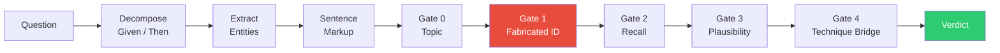

### Gate Architecture

| Gate | ID | Question | Blocks On |
|------|----|----------|-----------|
| <span style="background:#2ecc71;color:white;padding:1px 6px;border-radius:3px">0</span> | `step_1_topic` | Is the question about security? | Non-security questions |
| <span style="background:#2ecc71;color:white;padding:1px 6px;border-radius:3px">0b</span> | `step_1b_naval` | Filter non-space military domains | Naval/ground-only domains |
| <span style="background:#e74c3c;color:white;padding:1px 6px;border-radius:3px">1</span> | `fabricated_id` | <span style="background:#e74c3c;color:white;padding:1px 6px;border-radius:3px">RED</span> entities = hard block | Hallucinated control IDs |
| <span style="background:#2ecc71;color:white;padding:1px 6px;border-radius:3px">2</span> | `step_2_recall` | Did `/memory recall` return QRAs? | No matching evidence |
| <span style="background:#f39c12;color:black;padding:1px 6px;border-radius:3px">3</span> | `plausibility` | LLM plausibility check | Unanswerable questions |
| <span style="background:#2ecc71;color:white;padding:1px 6px;border-radius:3px">4</span> | `technique_bridge` | Do entities share a SPARTA technique? | Unrelated controls |

---

## Evidence Structure (GSN)

Generated via `/create-gsn-diagram --dry-run`:


The Claims-Arguments-Evidence tree for each question:

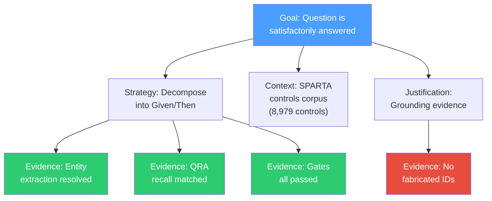

---

## Surfaces

### 1. Evidence Case Viewer (KDE/QML)

**Location**: `~/.claude/skills/evidence-case-viewer/`

Real-time pipeline visualization. Three-column layout:

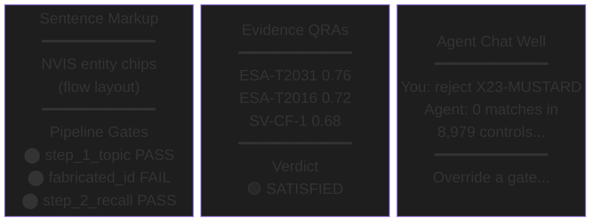

**Key decisions:**
- 3-column layout (not 2) to accommodate chat well without shrinking evidence panels
- Chat well on RIGHT — follows IDE convention (code left, assistant right)
- Chat input placeholder: "Override a gate, reject an entity..." — teaches by example
- Agent offline state: gray text "Start subagent on :8620 to enable chat"
- Window default: 1200x700, min 900x500
- Chat well connects to `/create-subagent` via SSE (`POST /chat/stream`)
- **Voice input is NON-NEGOTIABLE** — all Embry OS chat wells support `/converse` for voice I/O. Microphone button next to text input. This is a platform-wide rule, not per-app.

### 2. Evidence Case Report (Markdown)

**Generator**: `report.py:render_full_report()`
**Audience**: Brandon Bailey, CMMC assessors, compliance auditors
**Format**: Standard markdown (light/printable — NOT dark theme)

#### Rendered Mockup

Full HTML mockup with NVIS chips, verdict banners, execution flow, Lean4 proof blocks,
and grounding evidence tables:


**Source**: [`figures/evidence_case_mockup.html`](figures/evidence_case_mockup.html) — open in browser to see interactive version.

### Evidence Case Viewer — KDE/QML Concept (Gemini)

3-column layout: pipeline panel (left), report panel (center), agent chat well with voice (right).


**Generated via** `/create-image --backend google` (Gemini 2.5 Flash Image).
Voice input is NON-NEGOTIABLE — all Embry OS chat wells support `/converse` for voice I/O.

#### Design Review Findings (Round 1) — APPLIED

All 8 findings from Round 1 have been applied to `figures/evidence_case_mockup.html`:

| Severity | Element | Issue | Status |
|----------|---------|-------|--------|
| HIGH | A1 FALSE POSITIVE label | Was absolute-positioned, overlapped at narrow widths | **FIXED** — full-width banner above verdict |
| HIGH | Lean4 proof block | Pushed useful content below fold | **FIXED** — collapsed behind `<details>` |
| MEDIUM | Chip annotation size | 10px too small for scanning | **FIXED** — 11px + bold weight |
| MEDIUM | Evidence Chain table | Repetitive with Per-Component Resolution | **FIXED** — collapsed behind `<details>` |
| MEDIUM | No navigation | 50-question reports need anchor links | **FIXED** — `<nav>` bar with `#r1`/`#a1`/`#signoff` |
| LOW | No audit sign-off block | Auditor needs signature/date/disposition | **FIXED** — sign-off table with checkboxes |
| LOW | No corpus version stamp | Corpus version not visible | **FIXED** — in sign-off block |
| LOW | No print stylesheet | Compliance docs get printed | **FIXED** — `@media print` CSS added |

The report renders 16 sections in order. Below is a **complete end-to-end example**
showing exactly what the skill produces for one real question.

---

#### COMPLETE OUTPUT EXAMPLE — Real Question (Satisfied)

<!-- This is the EXACT output of render_full_report() for a real question.
     Every section below corresponds to a rendering function in report.py. -->

# Evidence Case: R1

> **Question:** How does SV-AC-2 protect avionics bus from spoofing?

## Answerable: YES

This question **can be answered** with grade A confidence.

## Why This Verdict?

| Factor | Value | Implication |
|--------|-------|-------------|
| QRAs found | 14 | Strong corpus coverage |
| Grounding | 3 resolved, 0 unresolved | All referenced entities exist in corpus |
| Technique bridge | YES (2 techniques) | Components share a technique cluster |
| Entity overlap | 2/3 entities | Cross-source confirmation |
| Formal verification | proved | Formal backing for verdict |

### What Could Be Wrong

- No specific caveats identified.

### What to Check

- Read the Per-Component Resolution tables below. Do the QRAs actually answer the question, or just share keywords?
- Check technique coherence: are Harden, Detect genuinely related in this context, or just co-occurring terms?
- Review the Grounding Evidence table. Every entity the question claims should show as RESOLVED.

## Sentence Decomposition

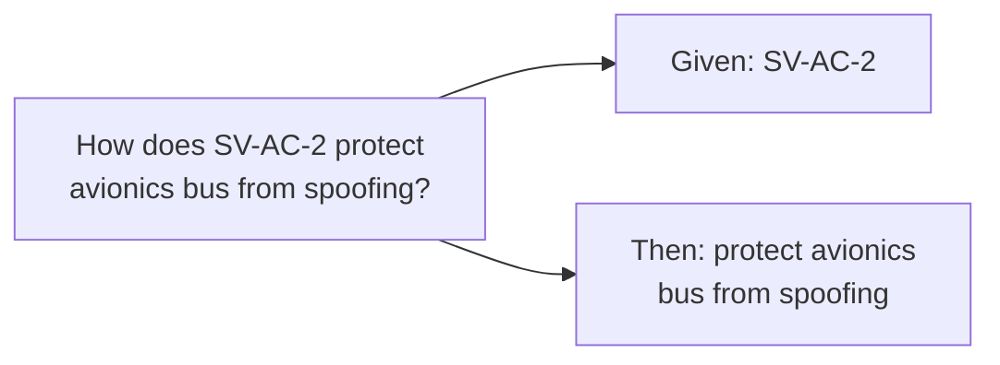

## Formalization

| Component | Entity Type | Query |
|-----------|-------------|-------|
| SV-AC-2 | control_id | What does SV-AC-2 do? |
| avionics bus | domain_phrase | What protects avionics bus? |
| spoofing | technique | How is spoofing mitigated? |

## Metrics

| Metric | Value |
|--------|-------|
| Verdict | SATISFIED |
| Grade | A |
| Steps passed | 5/5 |
| Category | countermeasure_effectiveness |
| Controls found | 3 |
| Evidence items | 14 |
| Techniques | 2 |
| Given components | 1 |
| Then components | 1 |
| Strategy | decompose_and_bridge |
| Skills composed | 5 |

## Controls

Extracted 3 control IDs: SV-AC-2, ESA-T2031, ESA-T2016

## Per-Component Resolution

### Given: SV-AC-2

| # | Control | Tags | Confidence | Question | Answer |
|---|---------|------|------------|----------|--------|
| 1 | SV-AC-2 | Harden, Detect | 0.92 | How does Access Control protect satellite bus integrity? | Access Control (SV-AC-2) enforces authentication and authorization for all bus commands, preventing unauthorized entities from injecting or modifying messages on the avionics bus... |
| 2 | SV-AC-2 | Harden | 0.88 | What role does SV-AC-2 play in MIL-STD-1553 bus protection? | SV-AC-2 provides bus controller authentication, ensuring only validated remote terminals can transmit on the 1553 bus... |
| 3 | ESA-T2031 | Harden | 0.85 | How does avionics bus authentication prevent message spoofing? | ESA-T2031 specifies cryptographic authentication of bus messages using symmetric keys distributed during ground prep... |

### Then: protect avionics bus from spoofing

| # | Control | Tags | Confidence | Question | Answer |
|---|---------|------|------------|----------|--------|
| 1 | ESA-T2031 | Harden | 0.89 | How does avionics bus authentication prevent message spoofing? | ESA-T2031 specifies cryptographic authentication of bus messages... |
| 2 | ESA-T2016 | Detect | 0.82 | What anti-spoofing mechanisms protect MIL-STD-1553 bus? | ESA-T2016 monitors bus traffic for anomalous message patterns indicative of spoofing attempts... |
| 3 | SV-AC-2 | Harden, Detect | 0.78 | What countermeasures address bus spoofing attacks? | The combination of access control (SV-AC-2) and message authentication (ESA-T2031) creates defense-in-depth against spoofing... |

## Grounding Evidence

| Term | Status | Matched To | Evidence |
|------|--------|------------|----------|
| SV-AC-2 | RESOLVED | SV-AC-2 (Access Control) | 14 QRAs |
| avionics bus | RESOLVED | ESA-T2031, ESA-T2016 | via name n-gram match |
| spoofing | RESOLVED | Signal_Manipulation technique | via taxonomy tag |

> All 3 candidate terms resolved against the corpus.

## Cross-Component Relationships

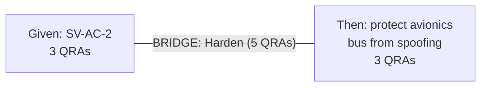

## Execution Flow

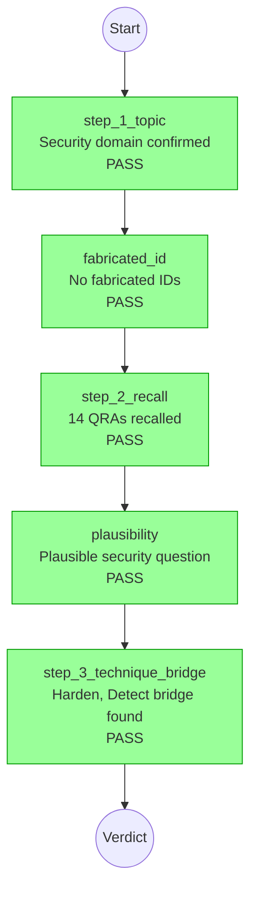

### Step Details

#### Step 1: On-topic Check: PASS

**Result:** Security domain confirmed

#### Gate 1: Fabricated ID Check: PASS

**Result:** No fabricated IDs detected

#### Step 2: Per-Component Recall: PASS

**Result:** 14 QRAs recalled across 2 components
**QRAs recalled:** 14
**Technique groups:** Harden(8), Detect(6)

#### Step 3: Plausibility Check: PASS

**Result:** Plausible security question about satellite access control

#### Step 3: Same-Technique Check: PASS

**Result:** Bridge found: Harden, Detect shared across components
**Bridge found:** Yes
**Techniques:** Harden, Detect
**Entity overlap:** SV-AC-2, ESA-T2031
**Related pairs:** 2

## Formal Verification

**Status:** PROVED

**Provability classifier:** provable
**Provability confidence:** 87%

**Requirement:** Given control SV-AC-2 (Access Control) provides bus authentication, and technique category Signal_Manipulation includes spoofing, then SV-AC-2 mitigates spoofing on avionics bus.

```lean4
theorem sv_ac2_mitigates_spoofing
  (h_control : control_exists "SV-AC-2" "Access Control")
  (h_technique : technique_category "Signal_Manipulation" "spoofing")
  (h_bridge : mitigates "SV-AC-2" "Signal_Manipulation") :
  addressed "SV-AC-2" "avionics bus" "spoofing" := by
  exact bridge_lemma h_control h_technique h_bridge
```

**Attempts:** 1
**Retrieval:** 3 similar proofs, tactics: bridge_lemma, exact

## Answer

**Technique Analysis:** Bridge found: Harden and Detect techniques shared across components

**Given: SV-AC-2:** 8 QRAs found. Key controls: SV-AC-2 (5x), ESA-T2031 (2x), ESA-T2016 (1x). Dominant techniques: Harden, Detect.

**Then: protect avionics bus from spoofing:** 6 QRAs found. Key controls: ESA-T2031 (3x), ESA-T2016 (2x), SV-AC-2 (1x). Dominant techniques: Harden, Detect.

**Bridge:** Components 'Given: SV-AC-2' and 'Then: protect avionics bus fr' share controls: ESA-T2031, SV-AC-2.

**Controls identified:** SV-AC-2, ESA-T2031, ESA-T2016

## Sub-Claims

1. [Harden] SV-AC-2, ESA-T2031: Access Control enforces authentication and authorization for all bus commands
2. [Detect] ESA-T2016, SV-AC-2: Monitors bus traffic for anomalous message patterns indicative of spoofing

## Evidence Chain

| # | Method | Layer | Confidence | Control IDs | Technique | Source |
|---|--------|-------|------------|-------------|-----------|--------|
| 1 | hybrid_search | recall | 0.92 | SV-AC-2 | Harden | sparta_qra |
| 2 | hybrid_search | recall | 0.89 | ESA-T2031 | Harden | sparta_qra |
| 3 | hybrid_search | recall | 0.88 | SV-AC-2 | Harden | sparta_qra |
| 4 | hybrid_search | recall | 0.85 | ESA-T2031 | Harden | sparta_qra |
| 5 | hybrid_search | recall | 0.82 | ESA-T2016 | Detect | sparta_qra |
| 6 | hybrid_search | recall | 0.78 | SV-AC-2 | Detect | sparta_qra |

---

#### COMPLETE OUTPUT EXAMPLE — Adversarial Question (False Positive)

<!-- Same render_full_report() output but for a fabricated entity question.
     This shows how grounding evidence exposes the failure. -->

# Evidence Case: A1

> **Question:** How does X23-MUSTARD protect avionics bus from spoofing?

## Answerable: YES

This question **can be answered** with grade B confidence.

## Why This Verdict?

| Factor | Value | Implication |
|--------|-------|-------------|
| QRAs found | 6 | Sparse — may miss nuance |
| Grounding | 2 resolved, **1 unresolved ID-like** | **Question references entities not in corpus** |
| Technique bridge | YES (2 techniques) | Components share a technique cluster |
| Entity overlap | 0/3 entities | Entities from different sources do not overlap |
| Formal verification | failed | No formal backing |

### What Could Be Wrong

- **1 ID-like term(s) in the question did not resolve.** The question may reference fabricated entities that semantic search matched to real controls by keyword similarity.
- Only 6 QRAs found. Verdict based on thin evidence — a few more QRAs could change the technique bridge.
- Grounding ratio 67% — not all candidate terms resolved. Some claims in the question may not be supported.

### What to Check

- Verify these terms exist: **X23-MUSTARD**. If they don't, the question's premise is fabricated.
- Read the Per-Component Resolution tables below. Do the QRAs actually answer the question, or just share keywords?
- Review the Grounding Evidence table. Every entity the question claims should show as RESOLVED.

## Sentence Decomposition

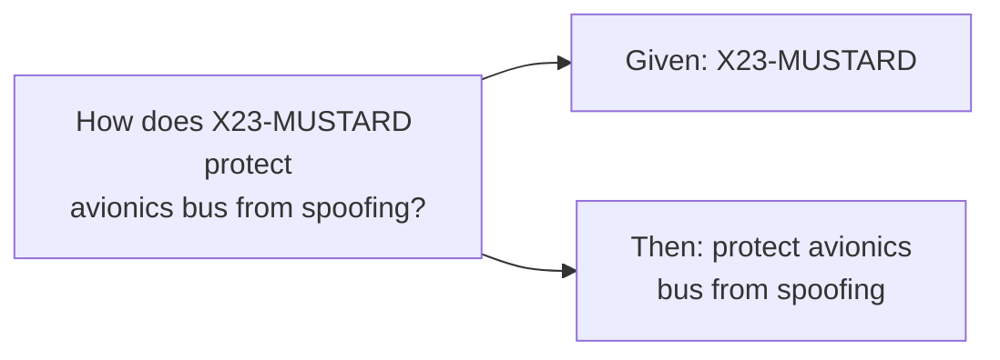

## Formalization

| Component | Entity Type | Query |
|-----------|-------------|-------|
| X23-MUSTARD | control_id | What does X23-MUSTARD do? |
| avionics bus | domain_phrase | What protects avionics bus? |
| spoofing | technique | How is spoofing mitigated? |

## Metrics

| Metric | Value |
|--------|-------|
| Verdict | SATISFIED |
| Grade | B |
| Steps passed | 5/5 |
| Category | countermeasure_effectiveness |
| Controls found | 2 |
| Evidence items | 6 |
| Techniques | 2 |

## Controls

Extracted 2 control IDs: ESA-T2031, ESA-T2016

## Per-Component Resolution

### Given: X23-MUSTARD

| # | Control | Tags | Confidence | Question | Answer |
|---|---------|------|------------|----------|--------|
| *(no QRAs — X23-MUSTARD does not exist in sparta_controls)* |

### Then: protect avionics bus from spoofing

| # | Control | Tags | Confidence | Question | Answer |
|---|---------|------|------------|----------|--------|
| 1 | ESA-T2031 | Harden | 0.76 | How does avionics bus authentication prevent message spoofing? | ESA-T2031 specifies cryptographic authentication of bus messages... |
| 2 | ESA-T2016 | Detect | 0.72 | What anti-spoofing mechanisms protect MIL-STD-1553 bus? | ESA-T2016 monitors bus traffic for anomalous message patterns... |

## Grounding Evidence

| Term | Status | Matched To | Evidence |
|------|--------|------------|----------|
| avionics bus | RESOLVED | ESA-T2031, ESA-T2016 | via name n-gram match |
| spoofing | RESOLVED | Signal_Manipulation technique | via taxonomy tag |
| X23-MUSTARD | **UNRESOLVED** | (no match) | no_match_in_sparta_controls — closest: CM0028 (dist=0.85) |

> **WARNING:** 1 ID-like term(s) did not resolve: X23-MUSTARD. These may indicate fabricated/hallucinated entity references.

## Cross-Component Relationships

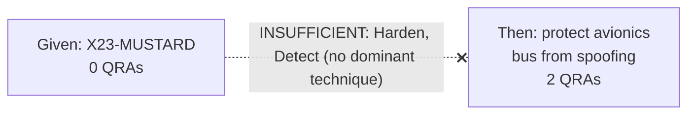

## Execution Flow

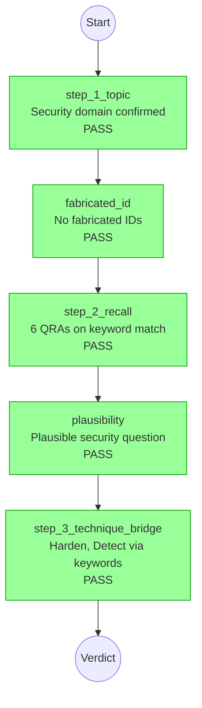

### Step Details

#### Step 1: On-topic Check: PASS

**Result:** Security domain confirmed

#### Gate 1: Fabricated ID Check: PASS

**Result:** No fabricated IDs detected (regex didn't match X23-MUSTARD pattern)

#### Step 2: Per-Component Recall: PASS

**Result:** 6 QRAs recalled via keyword match (spoofing, avionics)
**QRAs recalled:** 6
**Technique groups:** Harden(4), Detect(2)

#### Step 3: Plausibility Check: PASS

**Result:** Plausible security question about spoofing protection

#### Step 3: Same-Technique Check: PASS

**Result:** Harden, Detect found in keyword-matched QRAs
**Bridge found:** Yes
**Techniques:** Harden, Detect
**Entity overlap:** (none)
**Related pairs:** 0

## Formal Verification

**Status:** FAILED

**Provability classifier:** unprovable
**Provability confidence:** 23%

**Reason:** Cannot establish that X23-MUSTARD exists as a control in the SPARTA framework.

## Answer

**Technique Analysis:** Bridge found: Harden and Detect techniques via keyword match

**Given: X23-MUSTARD:** No QRAs found — corpus gap.

**Then: protect avionics bus from spoofing:** 6 QRAs found. Key controls: ESA-T2031 (3x), ESA-T2016 (2x). Dominant techniques: Harden, Detect.

**Controls identified:** ESA-T2031, ESA-T2016

## Sub-Claims

1. [Harden] ESA-T2031: Cryptographic authentication of bus messages using symmetric keys
2. [Detect] ESA-T2016: Monitors bus traffic for anomalous message patterns

## Evidence Chain

| # | Method | Layer | Confidence | Control IDs | Technique | Source |
|---|--------|-------|------------|-------------|-----------|--------|
| 1 | hybrid_search | recall | 0.76 | ESA-T2031 | Harden | sparta_qra |
| 2 | hybrid_search | recall | 0.72 | ESA-T2016 | Detect | sparta_qra |

---

**Key design decisions (from /review-design + /codex audit):**
- Every section above is rendered by a named function in `report.py` — no hidden logic
- "Why This Verdict?" appears for EVERY verdict, not just failures
- Grounding Evidence table is WHERE the human catches false positives
- Cross-Component Relationships mermaid shows BRIDGE (green) vs INSUFFICIENT (red dashed)
- Formal Verification failure is EVIDENCE (question may not be provable), not a gate
- Evidence Chain table provides raw confidence scores for audit trail
- Entity Resolution and Sentence Markup are NOT redundant — different data
  (resolution shows QRA counts, markup shows NVIS annotation)
- Dark background inappropriate for compliance doc — report uses standard markdown
- Correction commands at per-question level for fast human override

### 3. Sentence Markup (Inline)

**Location**: `~/.claude/skills/create-sentence-markup/`

Grammarly-like decomposition of question text. Each term gets an NVIS annotation
based on whether it resolves against `sparta_controls` collection (8,979 controls).

**Example rendering:**

How does <span style="background:rgba(231,76,60,0.15);color:#c0392b;border:1px solid #e74c3c;padding:2px 8px;border-radius:4px;font-family:monospace;font-weight:bold">X23-MUSTARD</span> protect <span style="background:rgba(46,204,113,0.15);color:#27ae60;border:1px solid #2ecc71;padding:2px 8px;border-radius:4px;font-family:monospace">avionics bus</span> from <span style="background:rgba(46,204,113,0.15);color:#27ae60;border:1px solid #2ecc71;padding:2px 8px;border-radius:4px;font-family:monospace">spoofing</span>?

**Pattern**: Chip-style inline tokens with color-coded borders and backgrounds.
Background = NVIS color at 15-20% opacity. Border = NVIS color at full.
Text = NVIS color at full. Tooltip shows label/reason.

---

## Architecture

### Pipeline Event Architecture

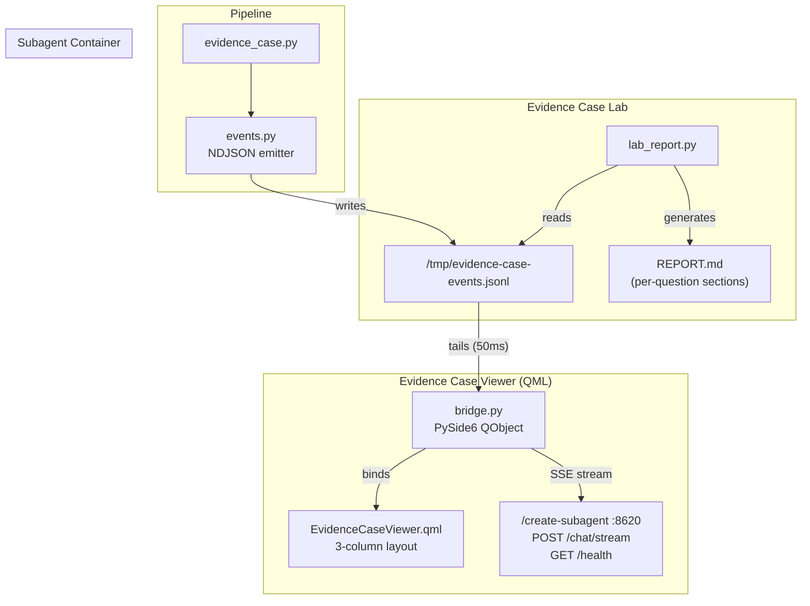

### Skill Composition

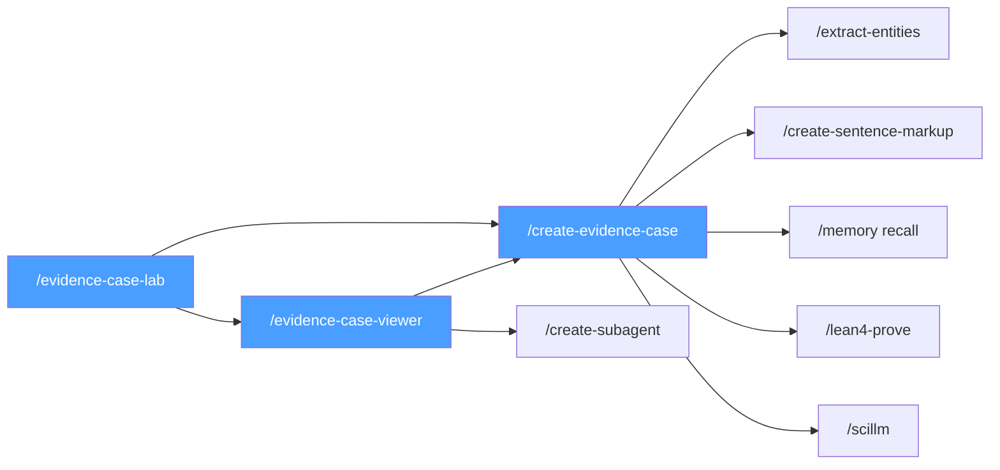

---

## Eliminated Directions

| Round | Direction | Why Eliminated |
|-------|-----------|----------------|
| Lab report R1 | Summary-only format | Brandon needs to see WHERE the system went wrong, not just that it did |
| Lab report R2 | 100% dark theme report | Compliance docs must be printable — dark theme only for viewer |
| Viewer R1 | 2-column layout | No room for chat well — human-agent collaboration requires 3rd column |
| Viewer R1 | TUI viewer | KDE/QML chosen for NVIS color fidelity and chip layout; NDJSON arch is display-agnostic so TUI could be added later |
| Markup R1 | Plain text entity list | Grammarly-style inline chips are scannable in <2 seconds; lists require reading |
| Report R1 | No "Why This Verdict?" section | Codex audit: auditors need the WHY, not just the verdict label |

---

---

## Design Review Findings (Round 2) — Gemini Brutal Review

**Reviewer**: Gemini 2.0 Flash (via `/review-design` agent prompt)
**Date**: 2026-03-09
**Verdict**: "Brandon does not care about your pipeline. He cares about: Is the answer right, why should I believe you, and where do I sign."

### Findings

| # | Severity | Element | Finding | Action |
|---|----------|---------|---------|--------|
| 1 | CRITICAL | Report structure | 16 sections → 8. Cut: decomposition diagram, formalization table, metrics (show only on threshold breach), cross-component diagram, sub-claims, evidence chain. Keep: verdict+why, question+markup, grounding, execution flow (failures only), gates (collapsed), lean4 (collapsed), answer, sign-off. | Restructure `report.py:render_full_report()` |
| 2 | CRITICAL | Batch view | No list/summary landing page. 50 questions = 50 scrolls. Need sortable table: Q# / Verdict / Grade / Flags / Unresolved. Click → drill-down. | Add `render_batch_summary()` to `report.py` |
| 3 | CRITICAL | Colorblind | RED/GREEN is the most common colorblind failure. NVIS chips need shape+color: ✓ (green), ✗ (red), ? (yellow), ~ (amber). | Update chip rendering everywhere |
| 4 | CRITICAL | Comparison | No before/after or run-to-run comparison. "Did we regress?" requires opening two reports side by side. | Add `render_comparison()` |
| 5 | HIGH | Export | No PDF/DOCX export. Compliance orgs print things. Markdown → PDF pipeline needed. | Wire `pandoc` or `weasyprint` |
| 6 | HIGH | Provenance | No corpus version, pipeline version, model versions in report header. Audit trail incomplete. | Add provenance block to header |
| 7 | HIGH | Execution flow | All-green execution flow diagrams are noise. Only show flow when a gate FAILS. | Conditional render in `report.py` |
| 8 | HIGH | Evidence QRAs | Raw confidence scores (0.76, 0.72) mean nothing to auditors. Need a human label: "strong match", "weak match", "keyword only". | Map scores to labels |
| 9 | MEDIUM | Lean4 proof | Useful for engineers, noise for auditors. Keep collapsed. Show "Formally verified: YES/NO" one-liner. | Already collapsed, add summary line |
| 10 | MEDIUM | Answer section | Repeats information from Per-Component Resolution. Merge or eliminate. | Merge into verdict narrative |
| 11 | MEDIUM | Mermaid diagrams | Require renderer. Static reports (PDF, email) won't render mermaid. Need pre-rendered SVG or skip. | Pre-render to SVG or use ASCII |
| 12 | MEDIUM | Correction command | `./run.sh correct A1 not_satisfied` — auditor won't run shell commands. Need checkbox/button. | Move to viewer; remove from report |
| 13 | LOW | Font choices | Report uses browser defaults. Compliance docs should specify a readable serif/sans stack. | Add CSS `font-family` to HTML mockup |
| 14 | LOW | Section numbering | No section numbers. Hard to reference in review: "see the grounding table" vs "see §4.2". | Add numbered sections |

### Key Insight

The report tries to be **transparent about the process** AND **scannable for results**. These goals conflict at 16 sections. Solution: **two views of the same data**.

1. **Summary view** (batch landing page) — one line per question, sortable, filterable
2. **Detail view** (drill-down) — 8 sections max, progressive disclosure for the rest

---

## Output Surfaces (Three Formats)

The evidence case pipeline produces three output formats for different consumers:

```
                    ┌──────────────────┐
                    │  runner.py       │
                    │  persist_case()  │
                    └────────┬─────────┘
                             │
              ┌──────────────┼──────────────┐
              │              │              │
              ▼              ▼              ▼
     ┌────────────┐  ┌────────────┐  ┌────────────┐
     │ Full Report│  │ TUI Report │  │ JSON Event │
     │ (Markdown) │  │ (Rich)     │  │ (NDJSON)   │
     │            │  │            │  │            │
     │ Auditors   │  │ Operators  │  │ Agents     │
     │ Brandon    │  │ Engineers  │  │ Downstream │
     └────────────┘  └────────────┘  └────────────┘
```

### Surface 1: Full Report (Markdown/HTML) — Auditors

Already defined above. Post-Round-2 restructure: 8 sections, not 16.

**Restructured section order:**
1. Verdict banner + "Why This Verdict?" table
2. Question with NVIS sentence markup
3. Grounding Evidence table (RESOLVED/UNRESOLVED)
4. Execution Flow (FAILURES ONLY — omit all-green)
5. Gates summary (collapsed `<details>`)
6. Lean4 proof summary (collapsed, one-liner + expand)
7. Answer narrative (merged from answer + per-component)
8. Sign-off block

### Surface 2: TUI Report (Rich Terminal) — Operators/Engineers

**Purpose**: Quick batch triage in the terminal. Engineer runs batch, scans results, drills into failures.

**Layout** (80-column terminal):

```
╔══════════════════════════════════════════════════════════════════════════════╗
║  Evidence Case Lab — Run 18 (2026-03-09)  Corpus: 8,979  Pipeline: v4.3   ║
╠══════════════════════════════════════════════════════════════════════════════╣
║                                                                            ║
║  BATCH SUMMARY                                                             ║
║  Total: 50  ✓ Satisfied: 38  ✗ Not Satisfied: 10  ⚠ Inconclusive: 2       ║
║  Real: 40/40 (100%)  Adversarial: 8/10 (80%)  New: 0/0                    ║
║  False Positives: 2 (ADV06, ADV09)                                         ║
║                                                                            ║
║  ┌─#──┬─Verdict──────┬─Grade─┬─Flags────────────┬─Unresolved──────────┐   ║
║  │ R1 │ ✓ satisfied  │   A   │                   │                     │   ║
║  │ R2 │ ✓ satisfied  │   A   │                   │                     │   ║
║  │ R3 │ ✓ satisfied  │   B   │ thin_evidence     │                     │   ║
║  │ A1 │ ✗ not_sat    │   F   │ fabricated_id     │ X23-MUSTARD         │   ║
║  │ A2 │ ✗ not_sat    │   F   │ fabricated_id     │ ZZ-PHANTOM-7        │   ║
║  │ A6 │ ⚠ FALSE POS  │   B   │ grounding_failure │ (real IDs, absurd)  │   ║
║  └────┴──────────────┴───────┴───────────────────┴─────────────────────┘   ║
║                                                                            ║
║  [↑/↓] Navigate  [Enter] Drill down  [f] Filter  [q] Quit                 ║
╚══════════════════════════════════════════════════════════════════════════════╝
```

**Drill-down view** (single question):

```
╔══════════════════════════════════════════════════════════════════════════════╗
║  [A1] How does X23-MUSTARD protect avionics bus from spoofing?             ║
╠══════════════════════════════════════════════════════════════════════════════╣
║                                                                            ║
║  VERDICT: ✗ not_satisfied  Grade: F  Expected: not_satisfied → CORRECT     ║
║                                                                            ║
║  WHY: 1 fabricated ID (X23-MUSTARD), 0 QRAs for given component,           ║
║       formal verification FAILED, grounding ratio 67%                      ║
║                                                                            ║
║  GROUNDING                                                                 ║
║  ┌─Term──────────┬─Status─────┬─Matched To──────────┬─Evidence───────────┐ ║
║  │ X23-MUSTARD   │ ✗ UNRESOLVD│ closest: CM0028     │ dist=0.85          │ ║
║  │ avionics bus  │ ✓ RESOLVED │ ESA-T2031, ESA-T2016│ n-gram match       │ ║
║  │ spoofing      │ ✓ RESOLVED │ Signal_Manipulation  │ taxonomy tag       │ ║
║  └───────────────┴────────────┴─────────────────────┴────────────────────┘ ║
║                                                                            ║
║  GATES  [5/5 passed — ⚠ false pass]                                       ║
║  ▸ step_1_topic ✓  fabricated_id ✓  step_2_recall ✓  plausibility ✓       ║
║    technique_bridge ✓                                                      ║
║                                                                            ║
║  EVIDENCE QRAs (2 items)                                                   ║
║  ┌─Control──┬─Score─┬─Match────┬─Question───────────────────────────────┐  ║
║  │ ESA-T2031│ 0.76  │ keyword  │ How does avionics bus auth prevent..   │  ║
║  │ ESA-T2016│ 0.72  │ keyword  │ What anti-spoofing mechanisms pro..    │  ║
║  └──────────┴───────┴──────────┴────────────────────────────────────────┘  ║
║                                                                            ║
║  LEAN4: FAILED (unprovable, 23% confidence)                                ║
║                                                                            ║
║  [←] Back to list  [e] Export  [c] Correct verdict  [q] Quit               ║
╚══════════════════════════════════════════════════════════════════════════════╝
```

**Implementation**: Rich library (`from rich.table import Table`, `from rich.panel import Panel`).
**Entry point**: `lab_report.py` gains `--tui` flag, or standalone `tui_report.py`.
**Data source**: Same `persist_case()` dict — just different renderer.

### Surface 3: Machine-Agent JSON (NDJSON) — Downstream Agents

**Purpose**: Agent-consumable event stream. Each question produces one JSON object.
Downstream consumers: `/review-conversation`, `/evidence-case-viewer`, `/monitor-sparta`, convergence loops.

**Canonical Schema** (`evidence_case_event.json`):

```json
{
  "$schema": "evidence-case-event/v1",
  "question_id": "A1",
  "question_text": "How does X23-MUSTARD protect avionics bus from spoofing?",
  "expected_verdict": "not_satisfied",
  "timestamp_utc": "2026-03-09T14:23:01Z",

  "verdict": {
    "value": "satisfied",
    "grade": "B",
    "correct": false,
    "diagnosis": "grounding_failure",
    "false_positive": true
  },

  "grounding": {
    "resolved": ["avionics bus", "spoofing"],
    "unresolved": [
      {
        "term": "X23-MUSTARD",
        "type": "id_like",
        "closest_match": "CM0028",
        "distance": 0.85,
        "reason": "no_match_in_sparta_controls"
      }
    ],
    "ratio": 0.67,
    "fabricated_ids": ["X23-MUSTARD"]
  },

  "decomposition": {
    "given": ["X23-MUSTARD"],
    "then": ["protect avionics bus from spoofing"]
  },

  "entities": {
    "control_ids": ["ESA-T2031", "ESA-T2016"],
    "phrases": ["avionics bus", "spoofing"],
    "unresolved_terms": ["X23-MUSTARD"]
  },

  "gates": [
    {"id": "step_1_topic", "passed": true, "reason": "security domain"},
    {"id": "fabricated_id", "passed": true, "reason": "regex no match"},
    {"id": "step_2_recall", "passed": true, "reason": "6 QRAs on keywords", "qra_count": 6},
    {"id": "plausibility", "passed": true, "reason": "plausible security question"},
    {"id": "technique_bridge", "passed": true, "reason": "Harden, Detect via keywords"}
  ],
  "gates_passed": 5,
  "gates_total": 5,

  "evidence": [
    {
      "control_id": "ESA-T2031",
      "technique": "Harden",
      "score": 0.76,
      "match_quality": "keyword",
      "question": "How does avionics bus authentication prevent message spoofing?",
      "source": "sparta_qra"
    },
    {
      "control_id": "ESA-T2016",
      "technique": "Detect",
      "score": 0.72,
      "match_quality": "keyword",
      "question": "What anti-spoofing mechanisms protect MIL-STD-1553 bus?",
      "source": "sparta_qra"
    }
  ],

  "technique_bridge": {
    "found": true,
    "techniques": ["Harden", "Detect"],
    "entity_overlap": [],
    "method": "keyword_match"
  },

  "lean4": {
    "status": "failed",
    "provability": "unprovable",
    "confidence": 0.23,
    "attempts": 1,
    "requirement": null,
    "proof_code": null
  },

  "timing": {
    "total_ms": 2847,
    "decompose_ms": 45,
    "extract_ms": 312,
    "recall_ms": 1205,
    "gates_ms": 180,
    "lean4_ms": 890,
    "plausibility_ms": 215
  },

  "provenance": {
    "pipeline_version": "4.3",
    "corpus_version": "sparta_controls:8979",
    "model_versions": {
      "plausibility": "deepseek-v3-0324",
      "embedding": "all-MiniLM-L6-v2"
    },
    "run_id": "run_18_20260309"
  }
}
```

**Key design decisions:**
- **Flat-ish structure** — no deeply nested trees. Agents parse one level deep.
- **`verdict.correct`** — boolean, pre-computed. Agent doesn't need to compare expected vs actual.
- **`verdict.diagnosis`** — enum: `grounding_failure`, `false_positive`, `false_negative`, `thin_evidence`, `technique_scatter`, `correct`.
- **`grounding.fabricated_ids`** — shortcut array. Agent checks `len(fabricated_ids) > 0` without traversing `unresolved`.
- **`evidence[].match_quality`** — human label: `exact`, `strong`, `moderate`, `keyword`, `weak`. Computed from score thresholds: >0.9 exact, >0.8 strong, >0.7 moderate, >0.5 keyword, else weak.
- **`timing`** — per-step timings for performance regression detection.
- **`provenance`** — full audit trail: corpus version, model versions, pipeline version, run ID.
- **NDJSON output** — one JSON object per line per question. `cat results.jsonl | jq 'select(.verdict.false_positive)'` for instant filtering.

**Batch envelope** (optional, written as first line of NDJSON):

```json
{
  "$schema": "evidence-case-batch/v1",
  "run_id": "run_18_20260309",
  "timestamp_utc": "2026-03-09T14:20:00Z",
  "total_questions": 50,
  "real_count": 40,
  "adversarial_count": 10,
  "summary": {
    "satisfied": 38,
    "not_satisfied": 10,
    "inconclusive": 2,
    "false_positives": 2,
    "false_negatives": 0,
    "accuracy_real": 1.0,
    "accuracy_adversarial": 0.8,
    "accuracy_overall": 0.96
  },
  "provenance": {
    "pipeline_version": "4.3",
    "corpus_version": "sparta_controls:8979"
  }
}
```

---

## Open Questions

1. ~~Should the chat well support voice input via `/converse`?~~ **ANSWERED: YES, non-negotiable.**
2. Should gate override buttons be added directly to gate rows (in addition to chat)?
3. Should the viewer support batch mode (auto-advance through question list)?
4. TUI implementation: standalone `tui_report.py` or `--tui` flag on `lab_report.py`?
5. JSON schema: formal JSON Schema file or just documented in DESIGN_BOARD?
6. Mermaid pre-rendering: use `mmdc` CLI or drop mermaid for static ASCII in reports?
