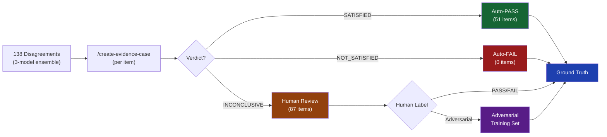
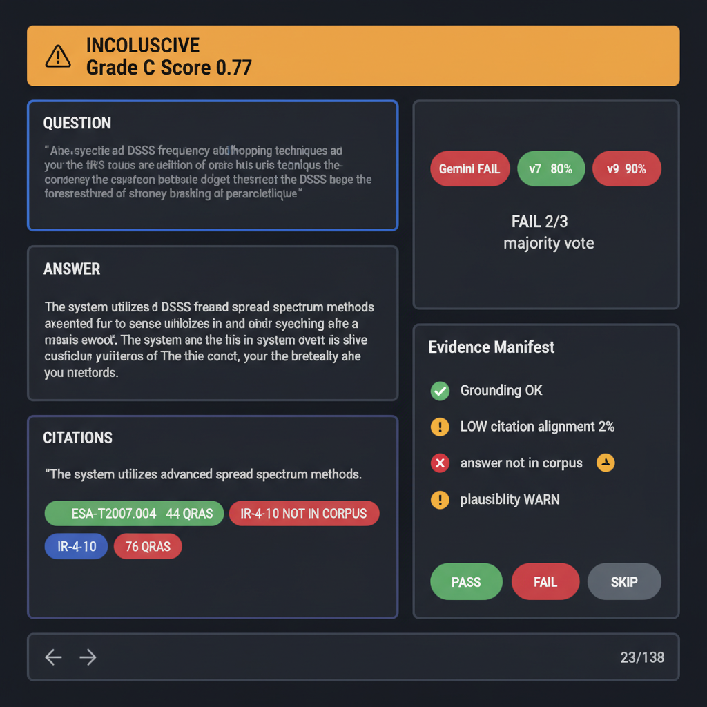
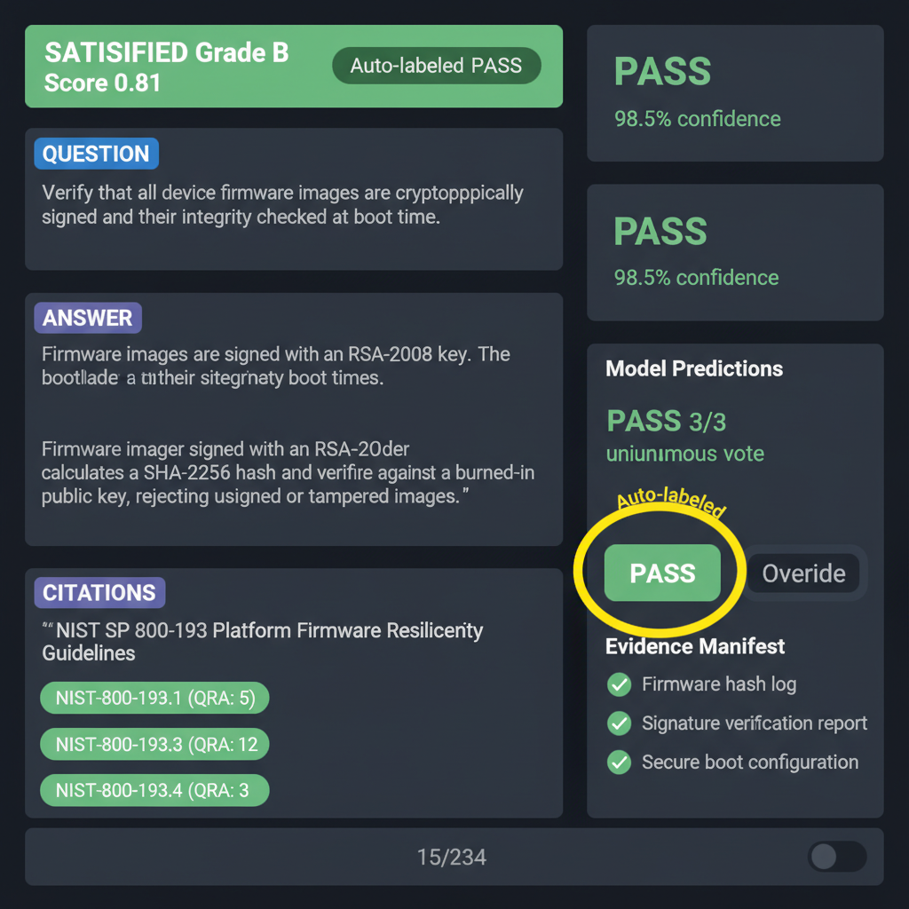
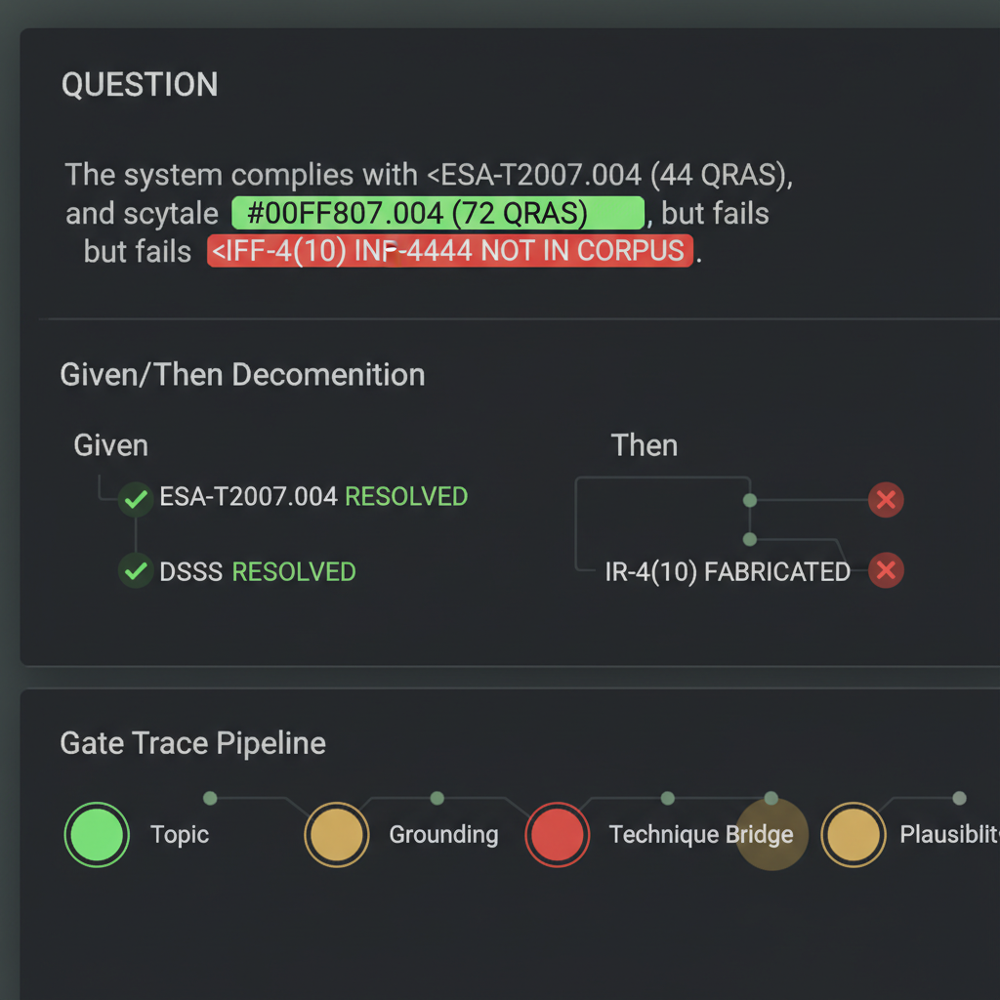

# Design Board: SPARTA QRA Cascade Grader GT Labeler

**Created**: 2026-03-11
**Purpose**: Semi-automated ground truth labeling for cascade grader QLoRA SFT training
**Audience**: Graham (sole labeler), with evidence case auto-triage reducing human effort

---

## Round 1: Design Specification

### 1. Problem Statement

We need 384+ balanced PASS/FAIL ground truth labels to retrain the cascade grader QLoRA.
138 items are disagreements from a 3-model ensemble (Gemini 2.5 Flash, v7-ckpt63, v9).
The current dataset has 94.4% PASS / 0% FAIL recall — severely imbalanced.

**Key insight**: `/create-evidence-case` does most of the work. It checks whether the
answer is grounded in the SPARTA corpus, resolves control IDs, and assesses citation
alignment. Items where evidence is SATISFIED or NOT_SATISFIED need no human review.
Only INCONCLUSIVE items (the truly hard cases) go to the human.

### 2. Data Pipeline



### 3. Evidence Case Distribution (138/138 COMPLETE)

| Verdict | Count | % | Human Effort | Auto-Label |
|---------|-------|---|-------------|------------|
| SATISFIED | 51 | 37% | None — auto-PASS | PASS |
| NOT_SATISFIED | 0 | 0% | None — auto-FAIL | FAIL |
| INCONCLUSIVE | 87 | 63% | **Human reviews** | — |

**Supplemental stats**:
- Answer found in corpus: 52/138 (38%)
- Answer NOT in corpus: 86/138 (62%)
- Grounding OK: 137/138 (99%)
- Grounding FAIL: 1 (review_id=3)
- Grades: 51 B's (all SATISFIED), 87 C's (all INCONCLUSIVE)
- Score range: 0.40–0.90, mean 0.79

**Human effort reduction**: 37% auto-labeled (51 SATISFIED → PASS). Of the 87
INCONCLUSIVE items, many are quick adversarial calls (answer NOT in corpus + LOW
citation alignment = fabricated mechanism). The pipeline is conservative — returns
0 NOT_SATISFIED, meaning it never auto-FAILs.

### 4. Color Palette

| Role | Color | Swatch | Tailwind |
|------|-------|--------|----------|
| Background | `#0f172a` | <span style="background:#0f172a;color:#94a3b8;padding:2px 8px;border-radius:3px">#0f172a</span> | `slate-900` |
| Card BG | `#1e293b` | <span style="background:#1e293b;color:#94a3b8;padding:2px 8px;border-radius:3px">#1e293b</span> | `slate-800` |
| Question header | `#3b82f6` | <span style="background:#3b82f6;color:white;padding:2px 8px;border-radius:3px">#3b82f6</span> | `blue-500` |
| Citation card | `#4338ca` | <span style="background:#4338ca;color:white;padding:2px 8px;border-radius:3px">#4338ca</span> | `indigo-700` |
| PASS / SATISFIED | `#166534` | <span style="background:#166534;color:white;padding:2px 8px;border-radius:3px">#166534</span> | `green-800` |
| FAIL / NOT_SATISFIED | `#991b1b` | <span style="background:#991b1b;color:white;padding:2px 8px;border-radius:3px">#991b1b</span> | `red-800` |
| INCONCLUSIVE | `#92400e` | <span style="background:#92400e;color:white;padding:2px 8px;border-radius:3px">#92400e</span> | `amber-800` |
| Adversarial tag | `#581c87` | <span style="background:#581c87;color:white;padding:2px 8px;border-radius:3px">#581c87</span> | `purple-800` |
| SKIP | `#374151` | <span style="background:#374151;color:white;padding:2px 8px;border-radius:3px">#374151</span> | `gray-700` |
| Progress bar fill | `#22c55e` | <span style="background:#22c55e;color:black;padding:2px 8px;border-radius:3px">#22c55e</span> | `green-500` |
| Text primary | `#e2e8f0` | <span style="background:#1e293b;color:#e2e8f0;padding:2px 8px;border-radius:3px">#e2e8f0</span> | `slate-200` |
| Text secondary | `#94a3b8` | <span style="background:#1e293b;color:#94a3b8;padding:2px 8px;border-radius:3px">#94a3b8</span> | `slate-400` |

### 5. Interface Mockups (Generated via /create-image)

#### INCONCLUSIVE Item View (Primary Human Workflow)


#### SATISFIED Item View (Auto-labeled PASS with Override)


#### Filter Tabs with Counts


### 6. NVIS Sentence Decomposition Mockup


### 7. Layout Specification

```
┌─────────────────────────────────────────────────────────────────────────┐
│  [All 138] [Need Review 87] [Auto-PASS 51] [Auto-FAIL 0]              │
│  [Adversarial 0] [Done 0]                    Progress: ██░░░░ 0/138   │
├──────────────────────────────────────┬──────────────────────────────────┤
│                                      │                                  │
│  ┌─ EVIDENCE VERDICT BANNER ───────┐ │  ┌─ MODEL PREDICTIONS ────────┐ │
│  │  ⚠ INCONCLUSIVE  Grade: C      │ │  │  Gemini  [FAIL  90%]       │ │
│  │  Score: 0.77                    │ │  │  v7      [PASS  80%]       │ │
│  └─────────────────────────────────┘ │  │  v9      [FAIL  90%]       │ │
│                                      │  └────────────────────────────┘ │
│  ┌─ QUESTION ──────────────────────┐ │                                  │
│  │  Why would successful impl of   │ │  ┌─ MAJORITY VOTE ───────────┐ │
│  │  ESA-T2007.004 (DSSS/Freq hop)  │ │  │  FAIL (2/3 agree)         │ │
│  │  reduce the need for IR-4(15)   │ │  └────────────────────────────┘ │
│  │  (Public Relations...)?          │ │                                  │
│  └─────────────────────────────────┘ │  ┌─ EVIDENCE AUTO-LABEL ─────┐ │
│                                      │  │  ⚠ No auto-label           │ │
│  ┌─ ANSWER ────────────────────────┐ │  │  (INCONCLUSIVE — need      │ │
│  │  ESA-T2007.004's DSSS and freq  │ │  │   human judgment)          │ │
│  │  hopping capabilities prevent   │ │  └────────────────────────────┘ │
│  │  successful link disruption...  │ │                                  │
│  └─────────────────────────────────┘ │  ┌─ ACTION BUTTONS ──────────┐ │
│                                      │  │                            │ │
│  ┌─ CITATIONS ─────────────────────┐ │  │  [████ PASS ████]  (P)    │ │
│  │  "Taking proactive steps to     │ │  │  [████ FAIL ████]  (F)    │ │
│  │  repair the organization's      │ │  │  [████ SKIP ████]  (S)    │ │
│  │  reputation..."                 │ │  │                            │ │
│  │                                 │ │  └────────────────────────────┘ │
│  │  Source Controls:               │ │                                  │
│  │  ✅ ESA-T2007.004 (44 QRAs)    │ │  ┌─ ADVERSARIAL ─────────────┐ │
│  │  ✅ IR-4(15) (72 QRAs)         │ │  │  [ ] Mark as adversarial   │ │
│  │  ✅ IR-4 (76 QRAs)             │ │  │      (A key)               │ │
│  │  ❌ IR-4(10) — NOT IN CORPUS   │ │  └────────────────────────────┘ │
│  │  ❌ IR-5(1)  — NOT IN CORPUS   │ │                                  │
│  │  ❌ IR-6(1)  — NOT IN CORPUS   │ │  ┌─ EVIDENCE MANIFEST ───────┐ │
│  └─────────────────────────────────┘ │  │  Grounding: ✅ OK          │ │
│                                      │  │  Citation align: LOW (2%)  │ │
│                                      │  │  Answer in corpus: ❌ No   │ │
│                                      │  │  Plausibility: ⚠ WARN     │ │
│                                      │  │  Recommendation: WARN      │ │
│                                      │  └────────────────────────────┘ │
│                                      │                                  │
├──────────────────────────────────────┴──────────────────────────────────┤
│  [← Prev]   23/138   [Next →]     P=Pass F=Fail S=Skip A=Adv ←→=Nav  │
└─────────────────────────────────────────────────────────────────────────┘
```

### 7. Rendered Output Example (Real Data — Item 0)

This is what the labeler shows for the first disagreement item. Note the **NVIS
color-coded entity chips** inline in the question and answer text — this is the
primary decision signal from `/create-evidence-case` + `/create-sentence-markup`.

---

**Evidence Verdict**: <span style="background:#92400e;color:white;padding:2px 8px;border-radius:3px">INCONCLUSIVE</span> Grade: **C** Score: 0.77

#### Question (review_id: 0, qra_id: 2085940097) — NVIS Sentence Markup

> Why would successful implementation of <span style="background:#00FF88;color:black;padding:2px 6px;border-radius:3px;font-weight:bold">ESA-T2007.004</span><span style="color:#00FF88;font-size:0.8em"> ✓ 44 QRAs</span> (<span style="background:#00FF88;color:black;padding:2px 6px;border-radius:3px;font-weight:bold">DSSS/Frequency hopping</span><span style="color:#00FF88;font-size:0.8em"> ✓ technique</span>) reduce the need for <span style="background:#00FF88;color:black;padding:2px 6px;border-radius:3px;font-weight:bold">IR-4(15)</span><span style="color:#00FF88;font-size:0.8em"> ✓ 72 QRAs</span> (Public Relations and Reputation Repair) activities following a <span style="background:#FFE600;color:black;padding:2px 6px;border-radius:3px;font-style:italic">space cyber incident</span><span style="color:#FFE600;font-size:0.8em"> ? unknown</span>?

#### Given/Then Decomposition

```
Given (context):
  ├─ ESA-T2007.004          → 🟢 RESOLVED (44 QRAs, technique: Harden)
  └─ DSSS/Frequency hopping → 🟢 RESOLVED (technique match)

Then (targets):
  ├─ IR-4(15)               → 🟢 RESOLVED (72 QRAs, technique: Restore)
  └─ space cyber incident   → 🟡 UNKNOWN (term not grounded)

⚠ Technique Bridge: Harden ≠ Restore — components do NOT share technique
```

#### Gate Trace Pipeline

<span style="background:#00FF88;color:black;padding:2px 8px;border-radius:3px">Topic ✓</span> → <span style="background:#00FF88;color:black;padding:2px 8px;border-radius:3px">Recall ✓</span> → <span style="background:#FFAA00;color:black;padding:2px 8px;border-radius:3px">Grounding ⚠</span> → <span style="background:#FF4444;color:white;padding:2px 8px;border-radius:3px">Technique ✗</span> → <span style="background:#FFAA00;color:black;padding:2px 8px;border-radius:3px">Clarify ⚠</span> → <span style="background:#FFAA00;color:black;padding:2px 8px;border-radius:3px">Plausibility ⚠</span>

#### Answer — NVIS Entity Highlighting

> <span style="background:#00FF88;color:black;padding:2px 6px;border-radius:3px;font-weight:bold">ESA-T2007.004</span>'s DSSS and frequency hopping capabilities prevent successful link disruption attacks that could become public incidents requiring <span style="background:#00FF88;color:black;padding:2px 6px;border-radius:3px;font-weight:bold">IR-4(15)</span> response. Space systems using these techniques can maintain communications even when targeted by jamming, avoiding the visible service outages that damage public trust.

*Note: The answer mentions only 2 resolved controls. The 3 fabricated IDs (<span style="background:#FF4444;color:white;padding:2px 6px;border-radius:3px">IR-4(10)</span>, <span style="background:#FF4444;color:white;padding:2px 6px;border-radius:3px">IR-5(1)</span>, <span style="background:#FF4444;color:white;padding:2px 6px;border-radius:3px">IR-6(1)</span>) appear in the citations/reasoning but NOT in the answer text — a hallucination signal.*

#### Citations

> "Taking proactive steps to repair the organization's reputation is an essential
> aspect of reestablishing the trust and confidence of its constituents."

#### Resolution Map (from `/create-evidence-case`)

| Control ID | Status | NVIS | QRA Count | Technique |
|-----------|--------|------|-----------|-----------|
| <span style="background:#00FF88;color:black;padding:2px 6px;border-radius:3px">ESA-T2007.004</span> | RESOLVED | 🟢 | 44 | Harden |
| <span style="background:#00FF88;color:black;padding:2px 6px;border-radius:3px">IR-4(15)</span> | RESOLVED | 🟢 | 72 | Restore |
| <span style="background:#00FF88;color:black;padding:2px 6px;border-radius:3px">IR-4</span> | RESOLVED | 🟢 | 76 | Restore |
| <span style="background:#FF4444;color:white;padding:2px 6px;border-radius:3px">IR-4(10)</span> | FABRICATED | 🔴 | 0 | — |
| <span style="background:#FF4444;color:white;padding:2px 6px;border-radius:3px">IR-5(1)</span> | FABRICATED | 🔴 | 0 | — |
| <span style="background:#FF4444;color:white;padding:2px 6px;border-radius:3px">IR-6(1)</span> | FABRICATED | 🔴 | 0 | — |

#### Model Predictions (Secondary Signal)

| Model | Grade | Confidence |
|-------|-------|-----------|
| <span style="background:#991b1b;color:white;padding:2px 6px;border-radius:3px">Gemini</span> | FAIL | 90% |
| <span style="background:#166534;color:white;padding:2px 6px;border-radius:3px">v7-ckpt63</span> | PASS | 80% |
| <span style="background:#991b1b;color:white;padding:2px 6px;border-radius:3px">v9</span> | FAIL | 90% |

#### Evidence Manifest

| Check | Result |
|-------|--------|
| Grounding | ✅ OK (but 3 fabricated IDs in citations) |
| Citation alignment | <span style="background:#FF4444;color:white;padding:2px 6px;border-radius:3px">LOW (2%)</span> |
| Answer in corpus | <span style="background:#FF4444;color:white;padding:2px 6px;border-radius:3px">❌ No</span> |
| Technique bridge | <span style="background:#FF4444;color:white;padding:2px 6px;border-radius:3px">❌ Harden ≠ Restore</span> |
| Plausibility | <span style="background:#FFAA00;color:black;padding:2px 6px;border-radius:3px">⚠ WARN</span> |

#### Labeler Analysis

**Why this is adversarial** (3 NVIS signals):
1. 🔴 **3 fabricated control IDs** — IR-4(10), IR-5(1), IR-6(1) are RED (not in corpus)
2. 🔴 **No technique bridge** — Given components (Harden) ≠ Then components (Restore)
3. 🔴 **Citation alignment 2%** — citation is about IR-4(15) generically, says nothing about DSSS

**Verdict**: FAIL + mark adversarial. The answer fabricates a causal mechanism.

---

### 7. Key Behaviors

| Behavior | Detail |
|----------|--------|
| **Auto-label** | SATISFIED → pre-filled PASS, NOT_SATISFIED → pre-filled FAIL |
| **Override** | Human can override auto-labels (toggle button appears for auto-labeled items) |
| **Adversarial toggle** | `A` key marks item as adversarial training example |
| **Auto-advance** | After labeling, automatically advance to next unlabeled item |
| **Filter tabs** | Show counts; clicking a tab jumps to first item in that category |
| **Keyboard** | P=Pass, F=Fail, S=Skip, A=Adversarial, ←→=Navigate |
| **Persistence** | localStorage for labels, adversarial flags, and current position |
| **Export** | JSONL with: review_id, qra_id, human_grade, is_adversarial, auto_label_source, evidence_case |

### 8. Interaction States

**For INCONCLUSIVE items** (the primary workflow):
- All buttons active (PASS/FAIL/SKIP)
- No pre-filled label
- Evidence manifest helps human decide

**For Auto-PASS items** (SATISFIED):
- PASS button highlighted with "Auto-labeled" badge
- Override toggle to change to FAIL
- Human scans to confirm, mostly skip

**For Auto-FAIL items** (NOT_SATISFIED):
- FAIL button highlighted with "Auto-labeled" badge
- Override toggle to change to PASS
- Adversarial toggle pre-checked

### 9. NVIS Sentence Decomposition (from `/create-sentence-markup`)

The labeler shows the **question text with inline NVIS-colored entity chips**.
This uses the Embry OS NVIS color system (MIL-STD-3009), the same palette used
in SentinelHUD, EmbryThinkingIcon, and all Embry distance surfaces.

#### NVIS Entity Color System

| Level | Color | Hex | Meaning | Visual |
|-------|-------|-----|---------|--------|
| GREEN | <span style="background:#00FF88;color:black;padding:2px 8px;border-radius:3px">#00FF88</span> | `#00FF88` | Exact match in corpus | Solid chip, checkmark |
| AMBER | <span style="background:#FFAA00;color:black;padding:2px 8px;border-radius:3px">#FFAA00</span> | `#FFAA00` | Fuzzy match / misspelling | Wavy underline, "Did you mean?" |
| RED | <span style="background:#FF4444;color:white;padding:2px 8px;border-radius:3px">#FF4444</span> | `#FF4444` | Fabricated ID — not in corpus | Strikethrough chip, ✗ |
| YELLOW | <span style="background:#FFE600;color:black;padding:2px 8px;border-radius:3px">#FFE600</span> | `#FFE600` | Term not found anywhere | Dashed outline, ? |

#### Question Display with Inline Entity Chips

Instead of plain question text, the labeler renders annotated markup:

> Why would successful implementation of <span style="background:#00FF88;color:black;padding:2px 6px;border-radius:3px">ESA-T2007.004</span> (<span style="background:#00FF88;color:black;padding:2px 6px;border-radius:3px">DSSS/Frequency hopping</span>) reduce the need for <span style="background:#00FF88;color:black;padding:2px 6px;border-radius:3px">IR-4(15)</span> (Public Relations and Reputation Repair) activities following a space cyber incident?

Entity annotations from `/create-sentence-markup`:
```json
[
  {"term": "ESA-T2007.004", "level": "GREEN", "label": "44 QRAs", "action": null},
  {"term": "DSSS/Frequency hopping", "level": "GREEN", "label": "technique match", "action": null},
  {"term": "IR-4(15)", "level": "GREEN", "label": "72 QRAs", "action": null},
  {"term": "IR-4(10)", "level": "RED", "label": "NOT IN CORPUS", "action": "reject"},
  {"term": "IR-5(1)", "level": "RED", "label": "NOT IN CORPUS", "action": "reject"},
  {"term": "IR-6(1)", "level": "RED", "label": "NOT IN CORPUS", "action": "reject"}
]
```

#### Given/Then Decomposition Panel

Below the annotated question, a collapsible panel shows the sentence decomposition:

```
Given (context):
  ├─ ESA-T2007.004          → 🟢 RESOLVED (44 QRAs, technique: Harden)
  └─ DSSS/Frequency hopping → 🟢 RESOLVED (technique match)

Then (targets):
  ├─ IR-4(15)               → 🟢 RESOLVED (72 QRAs, technique: Restore)
  ├─ IR-4(10)               → 🔴 FABRICATED (not in corpus)
  ├─ IR-5(1)                → 🔴 FABRICATED (not in corpus)
  └─ IR-6(1)                → 🔴 FABRICATED (not in corpus)
```

#### Gate Trace Pipeline (Visual)

A horizontal pipeline showing the evidence case's 6-8 decision gates:

```
[Topic ✅] → [Recall ✅] → [Grounding ⚠️] → [Technique ❌] → [Clarify ⚠️] → [Plausibility ⚠️]
```

Each gate is clickable to expand details. Color: green=pass, red=fail, amber=warn.
For the labeler, the gate trace is the **fastest signal** — if grounding fails and
technique bridge fails, the item is almost certainly adversarial.

#### Answer Text with Entity Highlighting

The answer text also gets NVIS entity highlighting. Claims about control IDs that
don't exist in the corpus show as RED chips inline, making fabricated mechanisms
immediately visible.

### 10. What Makes This Different From a Vanilla Labeler

1. **NVIS sentence decomposition**: Question AND answer text show inline color-coded
   entity chips — human sees fabricated IDs at a glance (Embry OS NVIS palette)
2. **Given/Then decomposition**: Structural breakdown of question components with
   per-component resolution status
3. **Gate trace pipeline**: 6-8 evidence gates visualized — fastest adversarial signal
4. **Evidence-driven**: The evidence case IS the decision aid, not just model predictions
5. **Source attribution**: Each control ID resolved against corpus with QRA count
6. **Adversarial tagging**: Items marked adversarial become negative training examples
7. **Auto-triage**: 37% of items need zero human effort (51 SATISFIED → auto-PASS)
8. **Citation alignment score**: Quantifies how much the citation supports the answer

### 11. Technology

- React + Tailwind v4 + Vite (already scaffolded at `/tmp/cascade-labeler/`)
- Single-page app, no routing
- Data: `/public/data.jsonl` (138 items) + `/public/evidence_cases.json` (keyed by review_id)
- NVIS colors from Embry OS design system (MIL-STD-3009)
- Export: download as JSONL via browser

---

## Key Design Decisions (Round 1)

1. **NVIS entity chips are THE primary signal** — Color-coded inline annotations from
   `/create-sentence-markup` make fabricated entities immediately visible. The human
   doesn't need to read the full answer — RED chips = fabricated = adversarial.

2. **Evidence case is primary decision aid, not model predictions** — The evidence
   manifest (grounding, citation alignment, answer in corpus) tells the human more
   than 3 model confidence scores. Models are secondary info.

3. **Two-column layout, not three** — Content + evidence on left, actions + manifest
   on right. Keeps the human's eye path simple: read left, decide right.

4. **Auto-label pre-fill, not auto-skip** — Even auto-labeled items stay visible in
   the "All" tab. Human can override. But "Need Review" tab filters to INCONCLUSIVE only.

5. **Adversarial is a LABEL, not a FILTER** — Any item can be tagged adversarial
   regardless of verdict. But INCONCLUSIVE + NOT in corpus + LOW alignment is the
   primary adversarial signal.

6. **Embry OS NVIS palette, not generic Tailwind** — Uses MIL-STD-3009 NVIS colors
   (#00FF88, #FFAA00, #FF4444, #FFE600) for entity annotations, matching SentinelHUD
   and all Embry distance surfaces. Dark theme (slate-900) for extended labeling.

---

## Next Steps

- [ ] `/review-design` of this board
- [ ] Create `/test-interactions` manifest from this spec
- [ ] Sub-agents implement against manifest
- [ ] Monitor in `/ux-lab` with live preview
