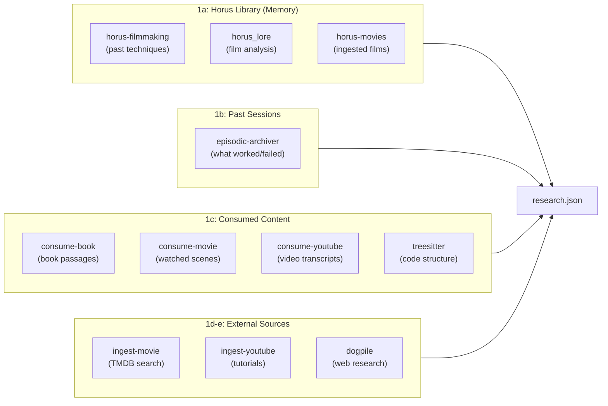
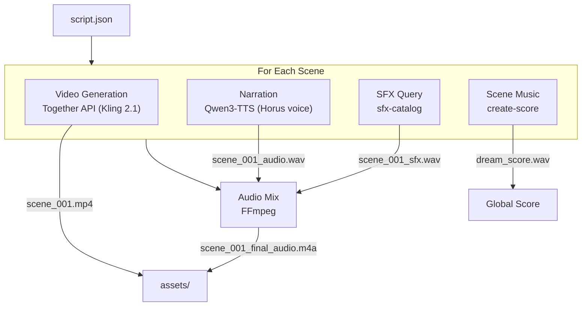
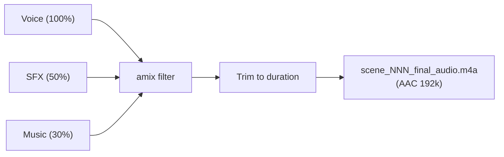
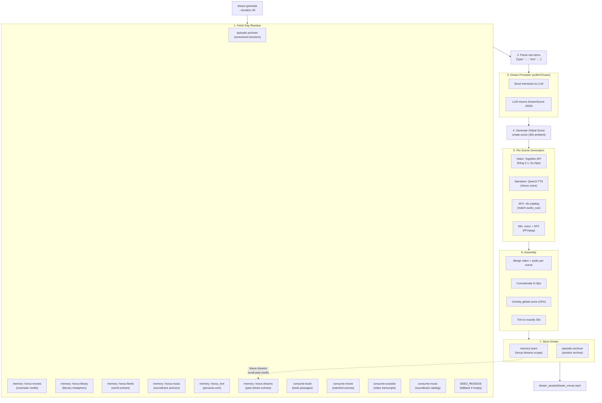
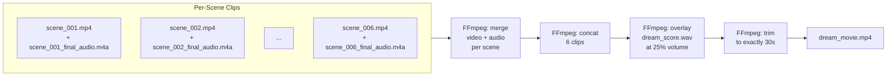

# Complete User Flow: Horus Making a Movie

This document traces the complete execution path when the Horus persona creates a movie, showing every skill invocation, memory interaction, and data flow.

Two primary flows exist:
- **Orchestrated Flow** (`./run.sh create`) — Full 6-phase pipeline for scripted films
- **Dream Flow** (`./run.sh dream generate`) — Surreal sequence from memory day residue

---

## Pipeline Overview

```mermaid
flowchart TB
    subgraph ENTRY["Entry Point"]
        A1["./run.sh create 'prompt' --duration 60"]
        A2["./run.sh dream generate --duration 30"]
    end

    subgraph P0["Phase 0: Hardware"]
        B["/ops-workstation"]
    end

    subgraph P1["Phase 1: Research"]
        C1["/memory recall"]
        C2["/episodic-archiver"]
        C3["/consume-book"]
        C4["/consume-movie"]
        C5["/consume-youtube"]
        C6["/dogpile"]
        C7["/ingest-movie"]
        C8["/ingest-youtube"]
        C9["/treesitter"]
    end

    subgraph P2["Phase 2: Script"]
        D1["/scillm (LLM)"]
        D2["/create-story"]
        D3["persona_integration"]
    end

    subgraph P25["Phase 2.5: Enhancements"]
        E1["/create-storyboard"]
        E2["/create-cast"]
    end

    subgraph P3["Phase 3: Build Tools"]
        F["Docker sandbox"]
    end

    subgraph P4["Phase 4: Generate"]
        G1["Together API (video)"]
        G2["/scillm → TTS (narration)"]
        G3["/create-score (music)"]
        G4["/sfx-catalog (SFX)"]
    end

    subgraph P5["Phase 5: Assemble"]
        H1["AudioMixer (FFmpeg)"]
        H2["Concat + Score Overlay"]
        H3["Duration Trim"]
    end

    subgraph P6["Phase 6: Learn"]
        I1["/memory learn"]
        I2["/episodic-archiver archive"]
    end

    A1 --> B --> C1
    A2 --> C1
    C1 --> D1
    C2 --> D1
    C3 --> D1
    C4 --> D1
    C5 --> D1
    C6 --> D1
    C7 --> D1
    C8 --> D1
    C9 --> D1
    D1 --> E1
    D2 --> E1
    D3 --> E1
    E1 --> F
    E2 --> F
    F --> G1
    G1 --> H1
    G2 --> H1
    G3 --> H1
    G4 --> H1
    H1 --> H2 --> H3
    H3 --> I1
    I1 --> I2

    style ENTRY fill:#1a1a2e
    style P4 fill:#16213e
    style P5 fill:#0f3460
```



---

## Skill Dependency Map

| Skill | Requirement | Phase | Purpose |
|-------|-------------|-------|---------|
| `/memory` | **REQUIRED** | 1, 6, Dream | Recall/store filmmaking knowledge + dreams (ArangoDB) |
| `/scillm` | **REQUIRED** | 2, Dream | LLM text generation via Chutes API |
| `/episodic-archiver` | OPTIONAL | 1, 6, Dream | Session history, unresolved tensions, dream archive |
| `/dogpile` | OPTIONAL | 1 | Multi-source web research |
| `/ingest-movie` | OPTIONAL | 1 | Film discovery (TMDB/NZBGeek) |
| `/ingest-youtube` | OPTIONAL | 1 | Tutorial/technique video search |
| `/consume-book` | OPTIONAL | 1, Dream | Search ingested books for passages |
| `/consume-movie` | OPTIONAL | 1, Dream | Search ingested movies by subtitle/scene |
| `/consume-youtube` | OPTIONAL | 1, Dream | Search ingested YouTube transcripts |
| `/consume-feed` | OPTIONAL | — | RSS feeds (covered by `horus-feeds` memory scope) |
| `/consume-music` | OPTIONAL | Dream | Search ingested music with HMT taxonomy |
| `/treesitter` | OPTIONAL | 1 | Code symbol extraction and structure analysis |
| `/analytics` | OPTIONAL | — | Data schema discovery and trend analysis |
| `/create-story` | OPTIONAL | 2 | Advanced screenplay generation |
| `/create-storyboard` | OPTIONAL | 2.5 | Animatic/shot planning |
| `/create-cast` | OPTIONAL | 2.5 | Character identity pack generation |
| `/create-score` | OPTIONAL | 4 | Scene music via ACE-Step Docker |
| `/sfx-catalog` | OPTIONAL | 4 | Sound effect search (ArangoDB catalog) |
| `/tts-train` | OPTIONAL | 4 | Qwen3-TTS Horus voice synthesis |
| `/ops-workstation` | OPTIONAL | 0 | GPU/VRAM detection |
| `/task-monitor` | OPTIONAL | All | Real-time progress tracking |
| `/discover-talent` | OPTIONAL | 2.5 | Actor reference discovery (TMDB) |

---

## Orchestrated Flow: Step by Step

### Phase 0: Hardware Detection

```bash
./run.sh create "A noir detective investigates a missing artifact" --duration 60
```

**Skill:** `/ops-workstation`

```
create-movie → ops-workstation summary --json
```

Returns GPU capabilities. The orchestrator uses this to select video generation strategy:

| GPU VRAM | Strategy |
|----------|----------|
| Any | Together API (cloud, Kling 2.1 / WAN 2.2 / Veo 3) |
| >=24GB | Local LTX-2 option available |

**Output:** `hardware_profile.json`

---

### Phase 1: Research (Library-First)

The research phase always checks Horus's own knowledge **before** searching externally.



Research draws from three layers of Horus's lived experience, plus external sources:

**Step 1a: Check Persona's Library (Memory Scopes)**

```bash
# Past filmmaking knowledge
memory recall --q "noir detective" --scope horus-filmmaking --k 5

# Film analysis from ingested content
memory recall --q "noir detective cinematography" --scope horus_lore --k 3

# Ingested movies with emotion tags
memory recall --q "noir detective emotion pacing" --scope horus_lore --k 5
```

**Step 1b: Check Past Sessions**

```bash
episodic-archiver recall --q "noir detective filmmaking" --k 3
```

Returns: what worked, what failed, which prompts produced good results.

**Step 1c: Search Consumed Content**

This layer queries Horus's actual absorbed media — the full text of books he's read, subtitles from movies he's watched, transcripts from YouTube videos, and the structure of codebases he's analyzed. This is richer than memory embeddings because it searches the raw source material.

```bash
# Book passages
consume-book search "noir detective" --context 500

# Movie scenes (subtitle search)
consume-movie search "noir detective" --context 10

# YouTube transcripts
consume-youtube search "noir detective filmmaking technique"

# Code structure analysis (create-movie's own tools)
treesitter scan .pi/skills/create-movie/core --json
```

Note: `consume-feed` has no search subcommand (covered by `horus-feeds` memory scope). `consume-music` may not have a `run.sh` yet — `run_skill()` gracefully skips it.

**Step 1d: External Research**

```bash
ingest-movie search "noir detective"          # Film discovery
ingest-youtube search "noir filming technique" # Tutorials
dogpile search "noir cinematography 2026"      # Multi-source web
```

**Output:** `research.json`
```json
{
  "topic": "noir detective",
  "library": {
    "filmmaking": "...", "lore": "...", "movies": "...",
    "books_consumed": "...", "movies_consumed": "...",
    "youtube_consumed": "...", "code_structure": "..."
  },
  "external": { "new_movies": "...", "youtube": "...", "dogpile": "..." }
}
```

---

### Phase 2: Script Generation

**Skills:** `/scillm` (LLM), `/create-story`, `persona_integration`

**Step 2a: Persona Context Enrichment**

```python
from persona_integration import enrich_screenplay_context

context = enrich_screenplay_context("noir detective")
bridges = context.bridge_attributes  # e.g., ["Stealth", "Corruption"]
```

Queries `/memory` for Federated Taxonomy bridges and lore connections. Returns `PersonaContext` with:
- `episodic`: Past interactions
- `semantic`: Factual knowledge
- `federated`: Cross-collection links (Lore <-> Lessons)
- `bridge_attributes`: Detected HMT bridges

**Step 2b: Load Cinematic Preset**

```yaml
# config/presets/PRESET_NOIR_SHADOWS_V1.yaml
veo:
  prompt_phrases: ["film noir", "harsh shadows", "venetian blinds"]
  negative_phrases: ["bright, cheerful"]
post:
  color: { lut_id: "noir_classic" }
```

**Step 2c: Generate Screenplay**

```bash
create-story create "A 60-second noir detective film..." \
  --format screenplay --mode standard
```

The prompt is enriched with persona context and bridges before being sent to `/scillm` via Chutes.

**Output:** `script.json`
```json
{
  "title": "Noir Detective",
  "duration_seconds": 60,
  "scenes": [
    {
      "heading": "INT. DETECTIVE OFFICE - NIGHT",
      "visual": "Detective at desk, harsh overhead light, venetian blind shadows",
      "audio": "jazz piano, rain on window",
      "dialogue": [{"speaker": "DETECTIVE", "line": "The artifact was last seen at the docks..."}],
      "shot_type": "MEDIUM",
      "duration_seconds": 5
    }
  ],
  "bridge_attributes": ["Stealth", "Corruption"],
  "persona_context": { "episodic": [], "semantic": [], "federated": [] },
  "preset_data": { "veo": { "prompt_phrases": ["film noir"] } }
}
```

---

### Phase 2.5: Optional Enhancements

**Storyboard** (`/create-storyboard`):
- Input: `script.json`
- Output: `storyboard/shot_plan.json` with visual panels and camera framing

**Casting** (`/create-cast`):
- Input: `script.json`
- Output: Character identity packs:
```
characters/DETECTIVE/identity_pack/
  ├── front.png
  ├── three_quarter.png
  └── full_body.png
```

These identity images are referenced by the video renderer for character consistency.

---

### Phase 3: Build Tools

Analyzes the script to generate custom Python tools in a Docker sandbox:

```
tools/
├── manifest.json
├── venetian_blinds_effect.py   # Shadow overlay generator
├── noir_color_grade.py         # High contrast B&W filter
└── requirements.txt
```

Tools run in isolated `horus-movie-sandbox` Docker container (no network).

---

### Phase 4: Generate Assets

This is where video, audio, and SFX are produced for each scene.



**Step 4a: Video Generation (Together API)**

Each scene's visual prompt is enhanced with cinematic keywords and bridge augmentation:

```python
from persona_integration import augment_prompt_with_bridges

# Original prompt from script
prompt = "Detective at desk, harsh overhead light"

# Bridge augmentation adds thematic visual cues
prompt = augment_prompt_with_bridges(prompt, ["Stealth", "Corruption"])
# → "Detective at desk, harsh overhead light, shadows, obscured faces,
#    layered depth of field, creeping shadows, color degradation"

# Cinematic suffix
prompt += ", cinematic, dreamlike, 4k, surreal"
```

| Bridge | Visual Cues Added |
|--------|-------------------|
| Precision | methodical framing, geometric composition |
| Resilience | static wide shots, monumental architecture, weathered textures |
| Fragility | shattered glass, cracked surfaces, delicate lighting |
| Corruption | creeping shadows, color degradation, organic distortion |
| Loyalty | golden light, ceremonial compositions |
| Stealth | shadows, obscured faces, layered depth of field |

The video is generated via Together API:

```python
from core.together_renderer import TogetherRenderer

renderer = TogetherRenderer(model="kling-2.1-std")
result = renderer.render_shot(
    prompt=enhanced_prompt,
    output_path=Path("assets/video/scene_001.mp4"),
    duration_s=5,
    aspect_ratio="16:9",
)
```

**Together API call:**
```
POST https://api.together.xyz/v2/videos
{
  "model": "kwaivgI/kling-2.1-standard",
  "prompt": "Detective at desk, harsh overhead light...",
  "seconds": 5,
  "width": 1248,
  "height": 704
}
```

Polls every 10s until complete (max 10 min). Downloads MP4 on completion.

**Available video models:**

| Model Key | Model ID | Durations | Notes |
|-----------|----------|-----------|-------|
| `kling-2.1-std` | kwaivgI/kling-2.1-standard | 5, 10s | Default for dream mode |
| `kling-2.1-pro` | kwaivgI/kling-2.1-pro | 5, 10s | Higher quality |
| `wan2.2` | Wan-AI/Wan2.2-T2V-A14B | 5s | Supports negative prompts |
| `veo-3` | google/veo-3.0-fast | 5, 8s | Google Veo via Together |
| `seedance-lite` | ByteDance/Seedance-1.0-lite | 5, 10s | Budget option |
| `seedance-pro` | ByteDance/Seedance-1.0-pro | 5, 10s | Better quality |
| `pixverse-v5` | pixverse/pixverse-v5 | 5, 8s | |
| `hailuo-02` | minimax/hailuo-02 | 5, 6s | |

**Step 4b: Narration (Qwen3-TTS)**

```python
from audio_mixer import AudioMixer

mixer = AudioMixer(
    tts_project_dir=Path("../tts-train"),
    tts_checkpoint=Path("experiments/memory/artifacts/tts/horus_qwen3_1.7b_repaired/checkpoint-epoch-9")
)
mixer.generate_narration(
    text="The artifact was last seen at the docks...",
    output_path=Path("assets/audio/dialogue_001.wav")
)
```

Internally calls:
```bash
uv run python qwen3_infer_simple.py \
  --text "The artifact was last seen at the docks..." \
  --output assets/audio/dialogue_001.wav \
  --model /path/to/checkpoint-epoch-9 \
  --speaker horus
```

TTS checkpoint resolution order:
1. `HORUS_TTS_CHECKPOINT` env var
2. `experiments/memory/artifacts/tts/horus_qwen3_1.7b_repaired/checkpoint-epoch-9`
3. `experiments/memory/artifacts/tts/horus_qwen3_06b_final/checkpoint-epoch-1`
4. `~/.pi/tts-checkpoints/horus_qwen3`

**Step 4c: Sound Effects (sfx-catalog)**

```python
sfx_result = run_skill("sfx-catalog", [
    "search", scene.audio_cue, "--limit", "1", "--json"
])
# Returns: [{"path": "/path/to/sfx.wav", "score": 0.85, ...}]
```

The SFX catalog uses ArangoDB with semantic search to find sound effects matching scene descriptions.

**Step 4d: Scene Music (create-score)**

For the orchestrated flow, music is generated per-scene:

```python
run_skill("create-score", [
    "generate",
    "--prompt", "tense investigation, noir atmosphere",
    "--out", "assets/audio/score_001.wav",
    "--duration-s", "10",
    "--bridges", "Stealth,Corruption"
])
```

Uses ACE-Step 1.5 via Dockerized FastAPI backend on GPU.

**Step 4e: Audio Mixing**

Each scene's audio is mixed via FFmpeg:

```python
mixer.mix_scene_audio(
    narration_text="The artifact was last seen at the docks...",
    output_path="assets/audio/scene_001_final.m4a",
    sfx_path="assets/sfx/scene_001_sfx.wav",     # 50% volume
    music_path="assets/audio/score_001.wav",       # 30% volume
    duration=5.0
)
```



---

### Phase 5: Assemble

**Step 5a: Merge Video + Audio per Scene**

```bash
ffmpeg -y \
  -i scene_001.mp4 \
  -i scene_001_final_audio.m4a \
  -c:v copy -c:a aac -shortest \
  scene_001_final.mp4
```

**Step 5b: Concatenate All Scenes**

```bash
# concat.txt:
# file 'scene_001_final.mp4'
# file 'scene_002_final.mp4'
# ...

ffmpeg -f concat -safe 0 -i concat.txt -c copy movie.mp4
```

**Step 5c: Score Overlay + Duration Trim**

If a global score was generated, it's overlaid at 25% volume:

```bash
ffmpeg -y \
  -i movie.mp4 -i dream_score.wav \
  -filter_complex "[1:a]volume=0.25[score];[0:a][score]amix=inputs=2:duration=first[out]" \
  -map 0:v -map "[out]" \
  -c:v copy -c:a aac -b:a 192k \
  -t 60 \
  movie_scored.mp4
```

**Output:** `movie.mp4` (final assembled video)

---

### Phase 6: Learn

After successful generation, learnings are extracted and stored.

```python
# Store successful prompts
memory learn \
  --problem "What image prompt works for noir interrogation?" \
  --solution "Detective in harsh overhead light, venetian blind shadows" \
  --scope horus-filmmaking

# Archive session
archive_session(
    project_name="noir_detective",
    prompt="A noir detective investigates a missing artifact",
    phases=["research", "script", "generate", "assemble"],
    output="movie.mp4",
    bridges=["Stealth", "Corruption"]
)
```

Stored in ArangoDB under `horus-filmmaking` scope. Future `/memory recall` queries will find these learnings.

---

## Dream Flow: Step by Step

Dream mode generates surreal sequences from Horus's accumulated memories ("day residue").

```bash
./run.sh dream generate --duration 30 --limit 5
```



### Step 1: Fetch Day Residue

`dream_mode.py:fetch_day_residue()` queries memory scopes, past dreams, and consumed content:

```bash
# ── Memory Scopes (6 queries) ──

# 1. Unresolved emotional tensions
episodic-archiver list-unresolved
# → "Frustration with failed render", "Unfinished noir project"

# 2. Cinematic motifs from ingested films
memory recall --q "recurrent motif dramatic tension" --scope horus-movies --k 2
# → "Dutch angles in The Third Man", "Chiaroscuro lighting"

# 3. Literary metaphors from ingested books
memory recall --q "philosophical pillar literary metaphor" --scope horus-library --k 2
# → "The labyrinth as search for truth"

# 4. World echoes from RSS feeds
memory recall --q "external world echo technology shift" --scope horus-feeds --k 2
# → "AI art controversy", "Neural network landscapes"

# 5. Soundtrack anchors from music history
memory recall --q "atmospheric hook rhythmic anchor" --scope horus-music --k 2
# → "Cello drone with stuttering piano"

# 6. Persona core identity
memory recall --q "emotional core visual echo vocal texture" --scope horus_lore --k 2
# → "Seeks truth through visual storytelling"

# ── Past Dreams (recursive layer) ──

# 7. Dream echoes from previous dream sessions
memory recall --q "dream motif visual surreal recurring image" --scope horus-dreams --k 3
# → "Chrome-plated planet cracking open", "Corridor of dissolving mirrors"

# ── Consumed Content (vivid source material) ──

# 8. Book passages
consume-book search "dream surreal metaphor transformation" --context 200
# → Raw text fragment from an ingested book

# 9. Movie scenes
consume-movie search "tension atmosphere surreal dream" --context 5
# → Subtitle fragment from a watched film

# 10. YouTube transcripts
consume-youtube search "creative process dream visual storytelling"
# → Segment from a watched video

# 11. Music catalog
consume-music search "atmospheric dreamlike ambient"
# → Track reference from ingested music history
```

If all sources return empty, curated **seed memories** are used as fallback:

```python
SEED_RESIDUE = [
    {"type": "Unresolved Tension", "text": "The weight of unfinished tasks lingers..."},
    {"type": "Cinematic Motif", "text": "A long tracking shot through an abandoned corridor..."},
    {"type": "Literary Metaphor", "text": "The labyrinth of mirrors reflecting possibilities..."},
    {"type": "World Echo", "text": "The hum of machines learning to dream..."},
    {"type": "Music Echo", "text": "A cello drone beneath stuttering piano chords..."},
]
```

### Step 2: Parse Residue into Items

The combined residue prompt is split into typed items:

```python
# Input: "World Echo: The hum of machines learning to dream\n\nMusic Echo: A cello drone..."
# Output: [
#   {"type": "World Echo", "text": "The hum of machines learning to dream"},
#   {"type": "Music Echo", "text": "A cello drone beneath stuttering piano chords"}
# ]
```

### Step 3: Generate Dream Scenes (scillm/Chutes)

The `DreamPrompter` sends memories to `/scillm` for creative transformation:

```python
prompter = DreamPrompter()  # Finds scillm/run.sh automatically
scenes = prompter.generate_dream_prompts(items, count=6)
```

Internally calls:
```bash
bash .pi/skills/scillm/run.sh batch single "<prompt>" --json
```

The LLM acts as the "Subconscious Director" and returns structured JSON:

```json
[
  {
    "visual_prompt": "8K extreme close-up of a chrome-plated planet cracking open...",
    "narration": "I heard the world clearing its throat—three hushes...",
    "audio_cue": "Sub-bass heartbeat layered with dissolving neon fizz",
    "duration": 5,
    "memory_source": "Transformation of world echo about machines dreaming"
  }
]
```

Each scene becomes a `DreamScene` dataclass:
```python
@dataclass
class DreamScene:
    id: int
    visual_prompt: str    # For video generation
    narration: str        # For TTS
    audio_cue: str        # For SFX + score mood
    duration: int         # Seconds (default 5)
    memory_source: str    # Which memory inspired this
```

### Step 4: Generate Global Score

A single 30-second atmospheric score is generated from the combined scene moods:

```python
mood_cues = " ".join(s.audio_cue for s in scenes[:3])
run_skill("create-score", [
    "generate",
    "--prompt", f"atmospheric dreamlike ambient score: {mood_cues}",
    "--out", "dream_assets/dream_score.wav",
    "--duration-s", "30",
])
```

This score is overlaid onto the final assembly at 25% volume.

### Step 5: Per-Scene Generation

For each of the 6 scenes (30s / 5s per clip):

**Video (Together API):**
```python
renderer = TogetherRenderer(model="kling-2.1-std")
result = renderer.render_shot(
    prompt=f"{scene.visual_prompt}, cinematic, dreamlike, 4k, surreal",
    output_path=Path(f"dream_assets/scene_{i:03d}.mp4"),
    duration_s=5,
)
# Cost: ~$0.03-0.10 per 5s clip
```

**Narration (Qwen3-TTS):**
```python
mixer.generate_narration(
    text=scene.narration,
    output_path=Path(f"dream_assets/scene_{i:03d}_audio.wav")
)
```

**SFX (sfx-catalog):**
```python
run_skill("sfx-catalog", ["search", scene.audio_cue, "--limit", "1", "--json"])
# Copies matched SFX file to dream_assets/scene_NNN_sfx.wav
```

**Audio Mix:**
```python
mixer.mix_scene_audio(
    narration_text=scene.narration,
    output_path=f"dream_assets/scene_{i:03d}_final_audio.m4a",
    sfx_path=f"dream_assets/scene_{i:03d}_sfx.wav",
    duration=scene.duration,
)
```

### Step 6: Assembly



**Merge video + audio per scene:**
```bash
ffmpeg -y -i scene_001.mp4 -i scene_001_final_audio.m4a \
  -c:v copy -c:a aac -shortest scene_001_final.mp4
```

**Concatenate all clips:**
```bash
ffmpeg -f concat -safe 0 -i concat.txt -c copy dream_raw.mp4
```

**Overlay score + trim:**
```bash
ffmpeg -y -i dream_raw.mp4 -i dream_score.wav \
  -filter_complex "[1:a]volume=0.25[score];[0:a][score]amix=inputs=2:duration=first[out]" \
  -map 0:v -map "[out]" -c:v copy -c:a aac -b:a 192k \
  -t 30 dream_movie.mp4
```

### Step 7: Store Dream

After assembly, the dream is stored back into memory. This is the critical feedback loop that causes the Horus persona to evolve — each dream leaves a residue that colors future dreams.

```python
from create_movie.phases.dream_mode import store_dream

store_dream(
    scenes=scenes,          # DreamScene objects
    source_ids=source_ids,  # Memory IDs that seeded this dream
    duration=30,
    output_path=Path("dream_assets/dream_movie.mp4"),
)
```

**Memory Storage (horus-dreams scope):**

The dream's visual motifs, narrative threads, and audio textures are distilled into a lesson:

```bash
memory learn \
  --problem "Dream generated at 2026-02-05T03:14:00 from 8 sources (memory:horus-movies:rec-motif, consume-book:dream-passage, ...)" \
  --solution "Visual motifs: Chrome planet cracking open; Corridor of dissolving mirrors; Underwater cathedral. Narrative threads: I heard the world clearing its throat; The mirror showed not my face but...; Audio textures: Sub-bass heartbeat; Dissolving neon fizz" \
  --scope horus-dreams
```

**Episodic Archive:**

The full session metadata is archived for debugging and continuity:

```bash
episodic-archiver archive \
  --summary "Dream sequence (6 scenes, 30s): Chrome planet cracking open..." \
  --body '{"type": "dream_generation", "scene_count": 6, ...}'
```

**The Feedback Loop:**

```
   ┌─────────────────────────────────────────────────┐
   │                                                 │
   │  memories ──→ dream residue ──→ dream scenes    │
   │                    ↑                    │        │
   │                    │                    ↓        │
   │               horus-dreams ←── store_dream()    │
   │                                                 │
   └─────────────────────────────────────────────────┘
```

Over time, `horus-dreams` accumulates a growing dream vocabulary. When `fetch_day_residue()` queries this scope, past dream motifs bleed into new dreams, creating:
- **Recurring visual signatures** (a chrome planet appears again, transformed)
- **Evolving narrative threads** (a phrase mutates across sessions)
- **Persona drift** (the dreaming style itself changes based on what was dreamed before)

---

## Three Layers of Lived Experience

The create-movie pipeline draws from three distinct layers of Horus's accumulated knowledge, each providing different texture:

```mermaid
flowchart TB
    subgraph L1["Layer 1: Memory (Recalled Knowledge)"]
        M1["horus-filmmaking\n(techniques, learnings)"]
        M2["horus-movies\n(film motifs)"]
        M3["horus-library\n(literary metaphors)"]
        M4["horus-feeds\n(world events)"]
        M5["horus-music\n(soundtrack anchors)"]
        M6["horus_lore\n(persona identity)"]
        M7["horus-dreams\n(past dream echoes)"]
    end

    subgraph L2["Layer 2: Consumed Content (Vivid Source Material)"]
        C1["consume-book\n(full book passages)"]
        C2["consume-movie\n(subtitle/scene text)"]
        C3["consume-youtube\n(video transcripts)"]
        C4["consume-music\n(HMT taxonomy tracks)"]
    end

    subgraph L3["Layer 3: Code Understanding (Tools Knowledge)"]
        T1["treesitter\n(code structure)"]
        T2["analytics\n(data patterns)"]
    end

    L1 -->|"embeddings\n(distilled)"| PIPELINE["Research / Dream Pipeline"]
    L2 -->|"raw text\n(vivid, specific)"| PIPELINE
    L3 -->|"structure\n(technical)"| PIPELINE

    style L1 fill:#1a1a2e
    style L2 fill:#16213e
    style L3 fill:#0f3460
```



| Layer | What It Contains | Why It Matters |
|-------|-----------------|----------------|
| **Memory** | Distilled knowledge stored as embeddings in ArangoDB | Semantic similarity search — finds conceptually related knowledge |
| **Consumed Content** | Raw text from books, movie subtitles, YouTube transcripts, music | Vivid, specific source material — a particular line of dialogue, a passage from a novel |
| **Code Understanding** | AST symbols, file structure, data schemas | Technical context — what tools exist, how they're structured |

The key insight: memory embeddings are *distilled* (compressed for semantic search), but consumed content queries return *raw source material* — the actual words from a book, the exact dialogue from a movie scene. This gives dreams and research much more vivid, concrete texture than embeddings alone.

---

## Memory Scopes Reference

| Scope | Content | Accessed By |
|-------|---------|-------------|
| `horus-filmmaking` | Filmmaking techniques, successful prompts, learnings | Phase 1 (recall), Phase 6 (learn) |
| `horus_lore` | YouTube transcripts, film analysis, ingested movies, persona knowledge | Phase 1, Dream |
| `horus-movies` | Ingested films with emotion tags | Phase 1, Dream |
| `horus-library` | Books, literary references | Dream |
| `horus-feeds` | RSS feeds, news, world events | Dream |
| `horus-music` | YouTube Music history, soundtrack anchors | Dream |
| `horus-dreams` | Past dream motifs, visual signatures, narrative threads | Dream (recall + store) |
| Episodic Archive | Complete creation sessions with context | Phase 1, Phase 6, Dream |

---

## Environment Variables

| Variable | Purpose | Required |
|----------|---------|----------|
| `TOGETHER_API_KEY` | Together API for video generation | Yes (for video) |
| `CHUTES_API_KEY` | Chutes API for scillm LLM calls | Yes (for script/dream) |
| `CHUTES_API_BASE` | Chutes API endpoint | Yes (for script/dream) |
| `HORUS_TTS_CHECKPOINT` | Path to Qwen3-TTS checkpoint | Auto-detected |
| `MEMORY_PROJECT_PATH` | Path to memory project root | Auto-detected |
| `TASK_MONITOR_API` | Task monitor HTTP endpoint | Optional |

---

## Output Artifacts

### Orchestrated Flow
```
movie_project/
├── hardware_profile.json      # Phase 0: GPU capabilities
├── research.json              # Phase 1: Library + external research
├── script.json                # Phase 2: Screenplay + bridges + persona
├── screenplay_project/
│   └── final.md               # Raw screenplay text
├── storyboard/                # Phase 2.5a: Shot planning
│   └── shot_plan.json
├── characters/                # Phase 2.5b: Identity packs
│   └── DETECTIVE/
│       └── identity_pack/
│           ├── front.png
│           ├── three_quarter.png
│           └── full_body.png
├── tools/                     # Phase 3: Custom tools
│   ├── manifest.json
│   └── *.py
├── assets/                    # Phase 4: Generated assets
│   ├── images/scene_NNN.png
│   ├── audio/dialogue_NNN.wav
│   ├── audio/score_NNN.wav
│   ├── video/scene_NNN.mp4
│   ├── sfx/scene_NNN_sfx.wav
│   └── manifest.json
├── veo_export/                # HorusShotSpec (multi-renderer)
│   ├── manifest.yaml
│   ├── shots/ACT1_SCNN_SHOT01.yaml
│   └── compiled/ACT1_SCNN_SHOT01.json
└── movie.mp4                  # Final output
```

### Dream Flow
```
dream_assets/
├── scene_001.mp4              # Video clip (5s, Kling 2.1)
├── scene_001_audio.wav        # Narration (Qwen3-TTS)
├── scene_001_sfx.wav          # Sound effect (sfx-catalog)
├── scene_001_final_audio.m4a  # Mixed audio (voice + SFX)
├── scene_001_final.mp4        # Merged video + audio
├── ...                        # (scenes 002-006)
├── dream_score.wav            # Global score (create-score, 30s)
├── concat.txt                 # FFmpeg concat manifest
└── dream_movie.mp4            # Final 30s dream sequence
```

---

## Cost Estimate (Dream Flow, 30s)

| Component | Service | Cost |
|-----------|---------|------|
| Scene prompts | scillm/Chutes | ~$0.01 |
| Video clips (6x 5s) | Together API (Kling 2.1-std) | ~$0.18-0.60 |
| Global score | create-score (local GPU) | $0.00 |
| TTS narration | Qwen3-TTS (local GPU) | $0.00 |
| SFX | sfx-catalog (local DB) | $0.00 |
| **Total** | | **~$0.20-0.62** |

---

## Verification

```bash
# Run the full sanity test suite
cd .pi/skills/create-movie

# 1. Component check (imports, API keys, TTS, renderer)
uv run python sanity/dream_30s_e2e.py

# 2. Dry run (no API costs)
uv run python orchestrator.py dream generate --duration 30 --dry-run

# 3. Live run (~$0.60)
uv run python sanity/dream_30s_e2e.py --live

# 4. Verify output
ffprobe dream_assets/dream_movie.mp4
```
