# Full Parity Report

- **Fixtures**: 9 PDFs
- **Source**: `tests/fixtures`

## Summary: 0 PASS / 9 FAIL out of 9 PDFs

# Parity Report: column_span_2

- **PDF**: `tests/fixtures/column_span_2.pdf`
- **Our tables**: 1
- **Camelot tables**: 1

## Table 0

- Shape: 11x7
- BBox: (79.2, 90.7, 532.8, 338.2)

### 1. PDF Screenshot

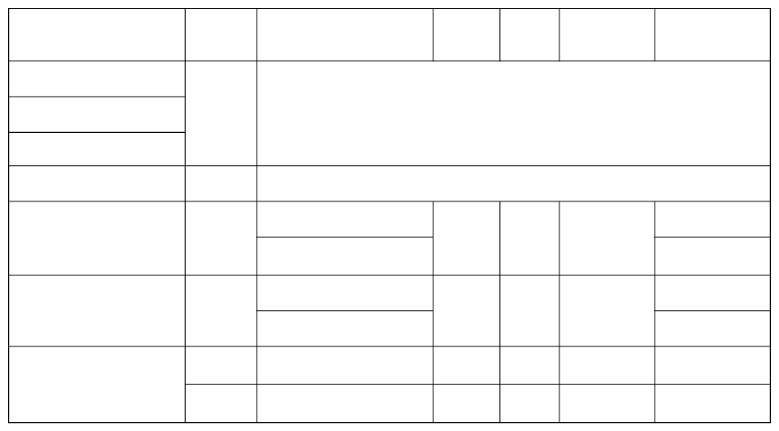

### 2. Detected Grid

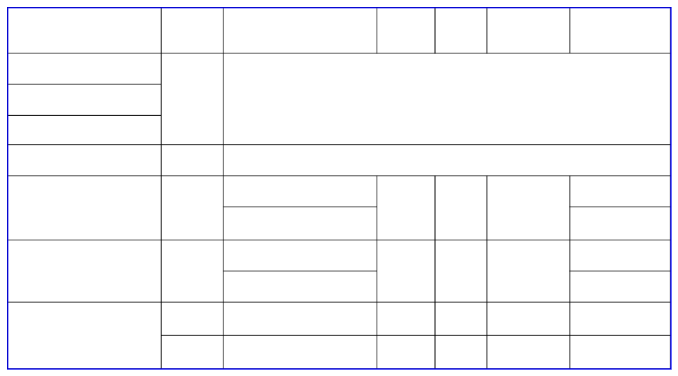

### 3. Our Extracted Text

| Investigations | No. of  HHs | Age/Sex/  Physiological   | column_3 | column_4 | column_5 | column_6 |
| --- | --- | --- | --- | --- | --- | --- |
| Anthropometry | 2400 | All the available individuals |  |  |  |  |
| Clinical Examination |  |  |  |  |  |  |
| History of morbidity |  |  |  |  |  |  |
| Diet survey | 1200 | All the individuals partaking  |  |  |  |  |
| Blood Pressure # | 2400 | Men (≥ 18yrs) | 10% | 95% | 20% | 1728 |
|  |  | Women (≥ 18 yrs) |  |  |  | 1728 |
| Fasting blood glucose | 2400 | Men (≥ 18 yrs) | 5% | 95% | 20% | 1825 |
|  |  | Women (≥ 18 yrs) |  |  |  | 1825 |
| Knowledge &  Practices on HTN  | 2400 | Men (≥ 18 yrs) | - | - | - | 1728 |
|  | 2400 | Women (≥ 18 yrs) | - | - | - | 1728 |

### 4. Camelot Extracted Text

| 0 | 1 | 2 | 3 | 4 | 5 | 6 |
| --- | --- | --- | --- | --- | --- | --- |
| Investigations | No. of HHs | Age/Sex/ Preva- C.I* Relative  |  |  |  |  |
| Anthropometry | 2400 | All the available individuals |  |  |  |  |
| Clinical Examination |  |  |  |  |  |  |
| History of morbidity |  |  |  |  |  |  |
| Diet survey | 1200 | All the individuals partaking  |  |  |  |  |
| Blood Pressure # | 2400 | Men (≥ 18yrs) | 10% | 95% | 20% | 1728 |
|  |  | Women (≥ 18 yrs) |  |  |  | 1728 |
| Fasting blood glucose | 2400 | Men (≥ 18 yrs) | 5% | 95% | 20% | 1825 |
|  |  | Women (≥ 18 yrs) |  |  |  | 1825 |
| Knowledge & Practices on HTN & | 2400 | Men (≥ 18 yrs) | - | - | - | 1728 |
| ... (1 more rows) |

### 5. Cell Diffs

**SHAPE MISMATCH**: ours=(10, 7) camelot=(11, 7)

---

# Parity Report: foo

- **PDF**: `tests/fixtures/foo.pdf`
- **Our tables**: 1
- **Camelot tables**: 1

## Table 0

- Shape: 7x7
- BBox: (120.2, 557.8, 491.8, 674.9)

### 1. PDF Screenshot

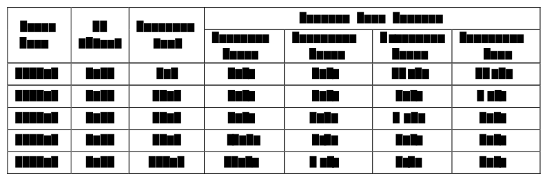

### 2. Detected Grid

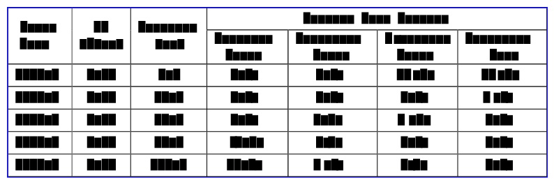

### 3. Our Extracted Text

| Cycle  Name | KI  (1/km) | Distance  (mi) | Percent Fuel Savings | column_4 | column_5 | column_6 |
| --- | --- | --- | --- | --- | --- | --- |
|  |  |  | Improved  Speed | Decreased  Accel | Eliminate  Stops | Decreased  Idle |
| 2012_2 | 3.30 | 1.3 | 5.9% | 9.5% | 29.2% | 17.4% |
| 2145_1 | 0.68 | 11.2 | 2.4% | 0.1% | 9.5% | 2.7% |
| 4234_1 | 0.59 | 58.7 | 8.5% | 1.3% | 8.5% | 3.3% |
| 2032_2 | 0.17 | 57.8 | 21.7% | 0.3% | 2.7% | 1.2% |
| 4171_1 | 0.07 | 173.9 | 58.1% | 1.6% | 2.1% | 0.5% |

### 4. Camelot Extracted Text

| 0 | 1 | 2 | 3 | 4 | 5 | 6 |
| --- | --- | --- | --- | --- | --- | --- |
| Cycle  Name | KI  (1/km) | Distance  (mi) | Percent Fuel Savings |  |  |  |
|  |  |  | Improved  Speed | Decreased  Accel | Eliminate  Stops | Decreased  Idle |
| 2012_2 | 3.30 | 1.3 | 5.9% | 9.5% | 29.2% | 17.4% |
| 2145_1 | 0.68 | 11.2 | 2.4% | 0.1% | 9.5% | 2.7% |
| 4234_1 | 0.59 | 58.7 | 8.5% | 1.3% | 8.5% | 3.3% |
| 2032_2 | 0.17 | 57.8 | 21.7% | 0.3% | 2.7% | 1.2% |
| 4171_1 | 0.07 | 173.9 | 58.1% | 1.6% | 2.1% | 0.5% |

### 5. Cell Diffs

**SHAPE MISMATCH**: ours=(6, 7) camelot=(7, 7)

---

## health

> FAILED: column with name 'Total' has more than one occurrence

---

## multiple_tables

> FAILED: column with name '1' has more than one occurrence

---

# Parity Report: row_span_1

- **PDF**: `tests/fixtures/row_span_1.pdf`
- **Our tables**: 1
- **Camelot tables**: 1

## Table 0

- Shape: 40x4
- BBox: (35.8, 35.8, 626.9, 545.8)

### 1. PDF Screenshot

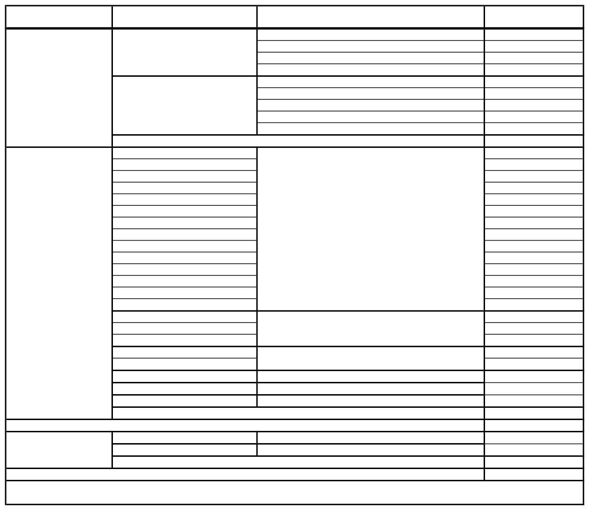

### 2. Detected Grid

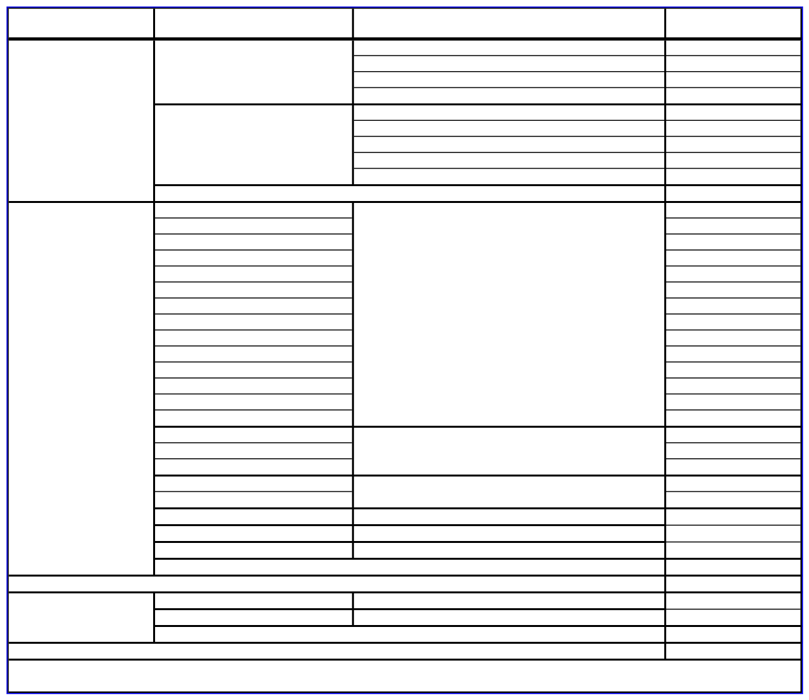

### 3. Our Extracted Text

| Plan Type | County | Plan Name | Totals |
| --- | --- | --- | --- |
| GMC | Sacramento | Anthem Blue Cross | 164,380 |
|  |  | Health Net | 126,547 |
|  |  | Kaiser Foundation | 74,620 |
|  |  | Molina Healthcare | 59,989 |
|  | San Diego | Care 1st Health Plan | 71,831 |
|  |  | Community Health Group | 264,639 |
|  |  | Health Net | 72,404 |
|  |  | Kaiser | 50,415 |
|  |  | Molina Healthcare | 206,430 |
|  | Total GMC Enrollment |  | 1,091,255 |
| ... (29 more rows) |

### 4. Camelot Extracted Text

| 0 | 1 | 2 | 3 |
| --- | --- | --- | --- |
| Plan Type | County | Plan Name | Totals |
| GMC | Sacramento | Anthem Blue Cross | 164,380 |
|  |  | Health Net | 126,547 |
|  |  | Kaiser Foundation | 74,620 |
|  |  | Molina Healthcare | 59,989 |
|  | San Diego | Care 1st Health Plan | 71,831 |
|  |  | Community Health Group | 264,639 |
|  |  | Health Net | 72,404 |
|  |  | Kaiser | 50,415 |
|  |  | Molina Healthcare | 206,430 |
| ... (30 more rows) |

### 5. Cell Diffs

**SHAPE MISMATCH**: ours=(39, 4) camelot=(40, 4)

---

# Parity Report: row_span_2

- **PDF**: `tests/fixtures/row_span_2.pdf`
- **Our tables**: 1
- **Camelot tables**: 1

## Table 0

- Shape: 7x10
- BBox: (24.0, 25.9, 819.4, 520.1)

### 1. PDF Screenshot

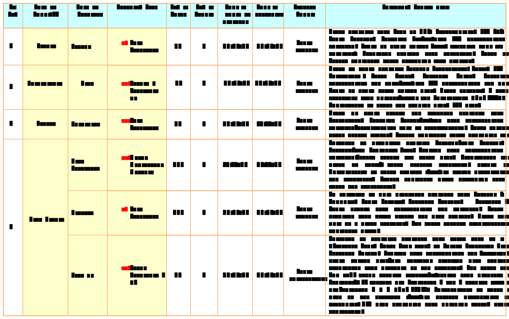

### 2. Detected Grid

### 3. Our Extracted Text

| Sl.  No. | Name of  State/UT | Name of  District | Disease/ Illness | No. of  Cases | No. of  Deaths | Date of  start of  outbre | Date of  reporting | Current  Status | Comments/ Action taken |
| --- | --- | --- | --- | --- | --- | --- | --- | --- | --- |
| 1 | Kerala | Kollam | i.  Food  Poisoning | 19 | 0 | 31/12/13 | 03/01/14 | Under  control | Cases reported from Ward no II |
| 2 | Maharashtra | Beed | i.  Dengue &  Chikungun  ya | 11 |  | 03/01/14 | 04/01/14 | Under  control | Cases  of  fever reported from |
| 3 | Odisha | Kalahandi | iii. Food  Poisoning | 42 | 0 | 02/01/14 | 03/01/14 | Under  control | Cases  of  loose  motion  and  |
| 4 | West Bengal | West  Medinipur | iv. Acute  Diarrhoeal  Disease | 145 | 0 | 04/01/14 | 05/01/14 | Under  control | Outbreak  of  diarrhoea  repor |
|  |  | Birbhum | v.  Food  Poisoning | 199 | 0 | 31/12/13 | 31/12/13 | Under  control | An  outbreak  of  food  poison |
|  |  | Howrah | vi. Viral  Hepatitis A  &E | 85 | 0 | 26/12/13 | 27/12/13 | Under  surveillance | Outbreak  of jaundice  reporte |

### 4. Camelot Extracted Text

| 0 | 1 | 2 | 3 | 4 | 5 | 6 | 7 | 8 | 9 |
| --- | --- | --- | --- | --- | --- | --- | --- | --- | --- |
| Sl.  No. | Name of  State/UT | Name of  District | Disease/ Illness | No. of  Cases | No. of  Deaths | Date of  start of  outbreak | Date of  reporting | Current  Status | Comments/ Action taken |
| 1 | Kerala | Kollam | i.  Food  Poisoning | 19 | 0 | 31/12/13 | 03/01/14 | Under  control | Cases reported from Ward no II |
| 2 | Maharashtra | Beed | i i.  Dengue &  Chikungun ya | 11 | 0 | 03/01/14 | 04/01/14 | Under  control | Cases  of  fever reported from |
| 3 | Odisha | Kalahandi | iii. Food  Poisoning | 42 | 0 | 02/01/14 | 03/01/14 | Under  control | Cases  of  loose  motion  and  |
| 4 | West Bengal | West  Medinipur | iv. Acute  Diarrhoeal  Disease | 145 | 0 | 04/01/14 | 05/01/14 | Under  control | Outbreak  of  diarrhoea  repor |
|  |  | Birbhum | v.  Food  Poisoning | 199 | 0 | 31/12/13 | 31/12/13 | Under  control | An  outbreak  of  food  poison |
|  |  | Howrah | vi. Viral  Hepatitis A  &E | 85 | 0 | 26/12/13 | 27/12/13 | Under  surveillance | Outbreak  of  jaundice  report |

### 5. Cell Diffs

**SHAPE MISMATCH**: ours=(6, 10) camelot=(7, 10)

---

# Parity Report: superscript

- **PDF**: `tests/fixtures/superscript.pdf`
- **Our tables**: 1
- **Camelot tables**: 0

## Table 0

- Shape: 38x6
- BBox: (99.2, 81.9, 650.5, 699.6)

### 1. PDF Screenshot

### 2. Detected Grid

### 3. Our Extracted Text

| column_0 | column_1 | column_2 | (As at end-March) | column_4 | column_5 |
| --- | --- | --- | --- | --- | --- |
|  |  |  |  |  | ( ` Billion) |
| States | Total | Market | NSSF WMA Loans Loans Loans Loa | Loans | Loans |
|  | Internal | Loans | from from from from from | from SBI | from |
|  | Debt |  | RBI Banks LIC GIC NABARD | & Other | NCDC |
|  |  |  | & FIs | Banks |  |
|  | 12= | 3 | 4 5 6= 78 |  | 91011 |
|  | (3 to 6)+14 |  | (7 to13) |  |  |
| Andhra Pradesh | 48.11 | 40.45 | - 3.26 4.4 2.62 - | 0.91 | - 0.25 |
| Arunachal Pradesh | 1.23 | 1.1 | - - 0.13 - - | - | - - |
| Assam | 12.69 | 10.02 | - 2.41 0.26 0.08 - | -0.06 | 0.01 0.24 |
| ... (27 more rows) |

---

# Parity Report: twotables_1

- **PDF**: `tests/fixtures/twotables_1.pdf`
- **Our tables**: 2
- **Camelot tables**: 2

## Table 0

- Shape: 3x10
- BBox: (23.8, 14.4, 818.7, 240.2)

### 1. PDF Screenshot

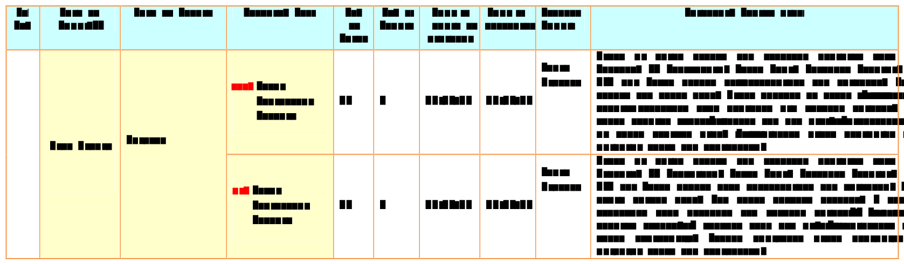

### 2. Detected Grid

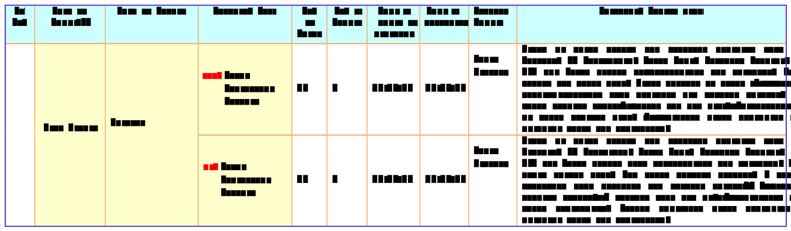

### 3. Our Extracted Text

| Sl.  No. | Name of  State/UT | Name of District | Disease/ Illness | No.  of  Cases | No. of  Deaths | Date of  start of  outbre | Date of  reporting | Current  Status | Comments/ Action taken |
| --- | --- | --- | --- | --- | --- | --- | --- | --- | --- |
|  | West Bengal | Bankura | xix.  Acute  Diarrhoeal  Disea | 46 | 0 | 10/11/13 | 15/11/13 | Under  Control | Cases  of  loose  motion  and  |
|  |  |  | xx.  Acute  Diarrhoeal  Diseas | 34 | 0 | 10/11/13 | 14/11/13 | Under  Control | Cases  of  loose  motion  and  |

### 4. Camelot Extracted Text

| 0 | 1 | 2 | 3 | 4 | 5 | 6 | 7 | 8 | 9 |
| --- | --- | --- | --- | --- | --- | --- | --- | --- | --- |
| Sl.  No. | Name of  State/UT | Name of District | Disease/ Illness | No.  of  Cases | No. of  Deaths | Date of  start of  outbreak | Date of  reporting | Current  Status | Comments/ Action taken |
|  | West Bengal | Bankura | xix.  Acute  Diarrhoeal  Disea | 46 | 0 | 10/11/13 | 15/11/13 | Under  Control | Cases  of  loose  motion  and  |
|  |  |  | xx.  Acute  Diarrhoeal  Diseas | 34 | 0 | 10/11/13 | 14/11/13 | Under  Control | Cases  of  loose  motion  and  |

### 5. Cell Diffs

**SHAPE MISMATCH**: ours=(2, 10) camelot=(3, 10)

---

## Table 1

- Shape: 5x9
- BBox: (23.5, 273.7, 818.7, 529.3)

### 1. PDF Screenshot

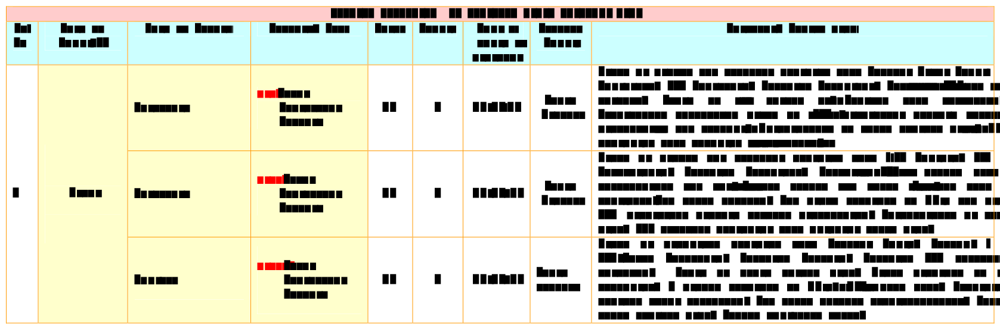

### 2. Detected Grid

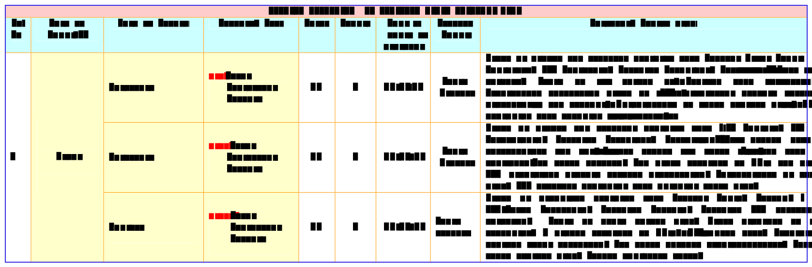

### 3. Our Extracted Text

| DISEASE OUTBREAKS  OF PRE | column_1 | column_2 | column_3 | column_4 | column_5 | column_6 | column_7 | column_8 |
| --- | --- | --- | --- | --- | --- | --- | --- | --- |
| Sl.  No | Name of  State/UT | Name of District | Disease/ Illness | Cases | Deaths | Date of  start of  outbreak | Current  Status | Comments/ Action taken |
| 1 | Bihar | Madhubani | xxi. Acute  Diarrhoeal  Diseas | 69 | 0 | 30/09/13 | Under  Control | Cases of diarrhoea and vomitin |
|  |  | Madhubani | xxii. Acute  Diarrhoeal  Disea | 30 | 1 | 28/10/13 | Under  Control | Cases  of  diarrhoea  and  vom |
|  |  | Katihar | xxiii. Acute  Diarrhoeal  Dise | 13 | 3 | 24/10/13 | Under  control | Cases  of  diarrhoea  reported |

### 4. Camelot Extracted Text

| 0 | 1 | 2 | 3 | 4 | 5 | 6 | 7 | 8 |
| --- | --- | --- | --- | --- | --- | --- | --- | --- |
| DISEASE OUTBREAKS  OF PREVIOUS |  |  |  |  |  |  |  |  |
| Sl.  No | Name of  State/UT | Name of District | Disease/ Illness | Cases | Deaths | Date of  start of  outbreak | Current  Status | Comments/ Action taken |
| 1 | Bihar | Madhubani | xxi. Acute  Diarrhoeal  Diseas | 69 | 0 | 30/09/13 | Under  Control | Cases of diarrhoea and vomitin |
|  |  | Madhubani | xxii. Acute  Diarrhoeal  Disea | 30 | 1 | 28/10/13 | Under  Control | Cases  of  diarrhoea  and  vom |
|  |  | Katihar | xxiii. Acute  Diarrhoeal  Dise | 13 | 3 | 24/10/13 | Under  control | Cases  of  diarrhoea  reported |

### 5. Cell Diffs

**SHAPE MISMATCH**: ours=(4, 9) camelot=(5, 9)

---

# Parity Report: twotables_2

- **PDF**: `tests/fixtures/twotables_2.pdf`
- **Our tables**: 2
- **Camelot tables**: 2

## Table 0

- Shape: 13x8
- BBox: (81.1, 100.8, 531.8, 338.9)

### 1. PDF Screenshot

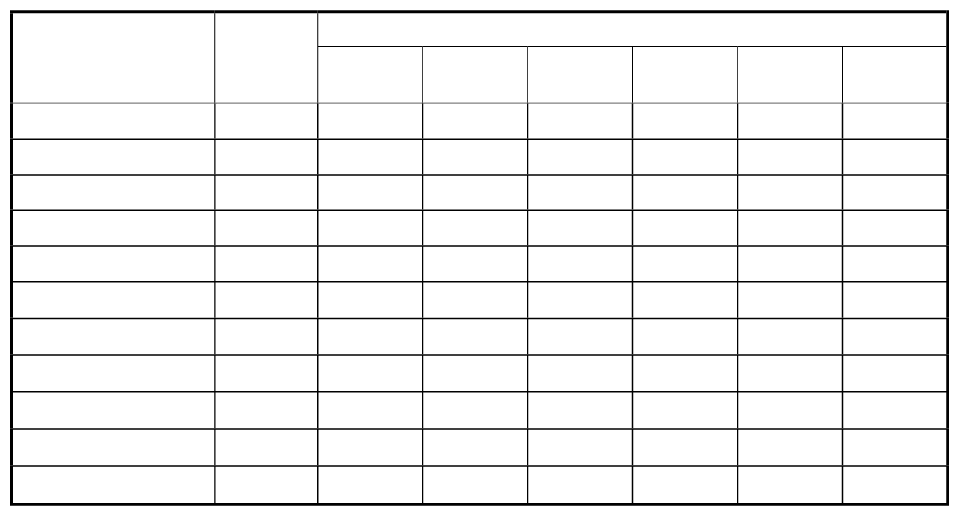

### 2. Detected Grid

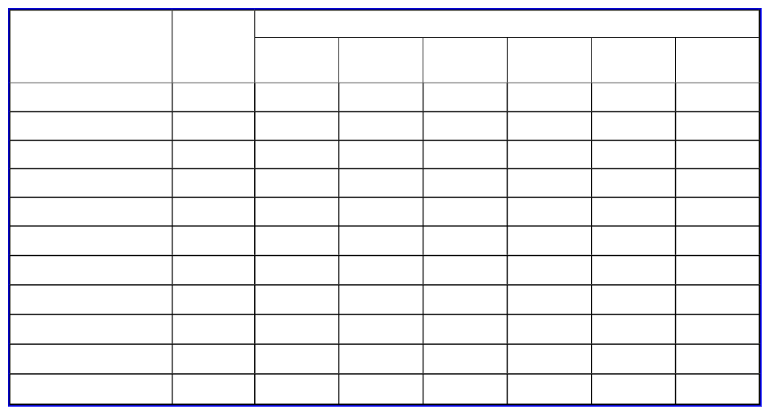

### 3. Our Extracted Text

| State | n | Literacy Status | column_3 | column_4 | column_5 | column_6 | column_7 |
| --- | --- | --- | --- | --- | --- | --- | --- |
|  |  | Illiterate | Read &  Write | 1-4 std. | 5-8 std. | 9-12 std. | College |
| Kerala | 2400 | 7.2 | 0.5 | 25.3 | 20.1 | 41.5 | 5.5 |
| Tamil Nadu | 2400 | 21.4 | 2.3 | 8.8 | 35.5 | 25.8 | 6.2 |
| Karnataka | 2399 | 37.4 | 2.8 | 12.5 | 18.3 | 23.1 | 5.8 |
| Andhra Pradesh | 2400 | 54.0 | 1.7 | 8.4 | 13.2 | 18.8 | 3.9 |
| Maharashtra | 2400 | 22.0 | 0.9 | 17.3 | 20.3 | 32.6 | 7.0 |
| Gujarat | 2390 | 28.6 | 0.1 | 14.4 | 23.1 | 26.9 | 6.8 |
| Madhya Pradesh | 2402 | 29.1 | 3.4 | 8.5 | 35.1 | 13.3 | 10.6 |
| Orissa | 2405 | 33.2 | 1.0 | 10.4 | 25.7 | 21.2 | 8.5 |
| West Bengal | 2293 | 41.7 | 4.4 | 13.2 | 17.1 | 21.2 | 2.4 |
| ... (2 more rows) |

### 4. Camelot Extracted Text

| 0 | 1 | 2 | 3 | 4 | 5 | 6 | 7 |
| --- | --- | --- | --- | --- | --- | --- | --- |
| State | n | Literacy Status |  |  |  |  |  |
|  |  | Illiterate | Read &  Write | 1-4 std. | 5-8 std. | 9-12 std. | College |
| Kerala | 2400 | 7.2 | 0.5 | 25.3 | 20.1 | 41.5 | 5.5 |
| Tamil Nadu | 2400 | 21.4 | 2.3 | 8.8 | 35.5 | 25.8 | 6.2 |
| Karnataka | 2399 | 37.4 | 2.8 | 12.5 | 18.3 | 23.1 | 5.8 |
| Andhra Pradesh | 2400 | 54.0 | 1.7 | 8.4 | 13.2 | 18.8 | 3.9 |
| Maharashtra | 2400 | 22.0 | 0.9 | 17.3 | 20.3 | 32.6 | 7.0 |
| Gujarat | 2390 | 28.6 | 0.1 | 14.4 | 23.1 | 26.9 | 6.8 |
| Madhya Pradesh | 2402 | 29.1 | 3.4 | 8.5 | 35.1 | 13.3 | 10.6 |
| Orissa | 2405 | 33.2 | 1.0 | 10.4 | 25.7 | 21.2 | 8.5 |
| ... (3 more rows) |

### 5. Cell Diffs

**SHAPE MISMATCH**: ours=(12, 8) camelot=(13, 8)

---

## Table 1

- Shape: 13x8
- BBox: (81.1, 410.2, 531.8, 649.0)

### 1. PDF Screenshot

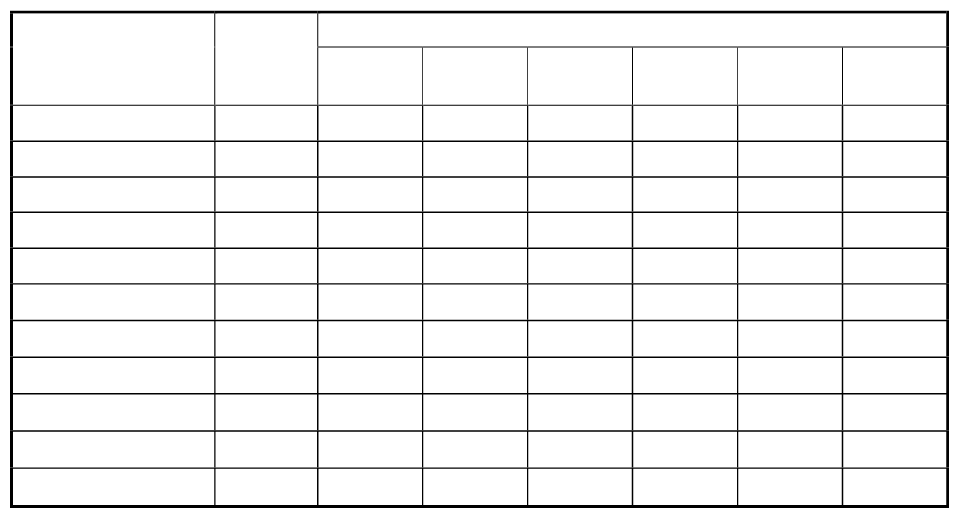

### 2. Detected Grid

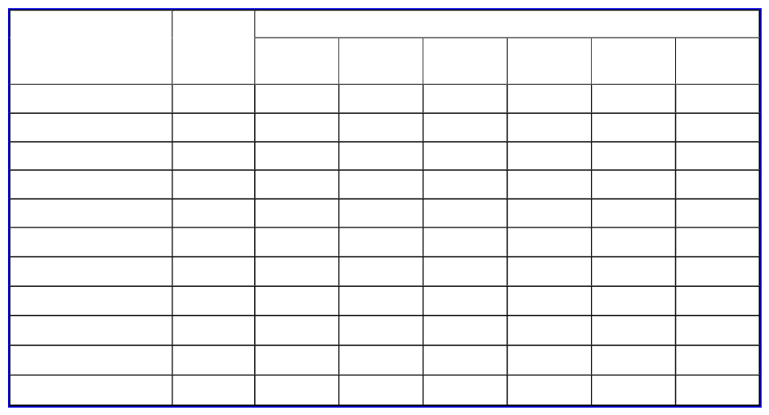

### 3. Our Extracted Text

| State | n | Literacy Status | column_3 | column_4 | column_5 | column_6 | column_7 |
| --- | --- | --- | --- | --- | --- | --- | --- |
|  |  | Illiterate | Read &  Write | 1-4 std. | 5-8 std. | 9-12 std. | College |
| Kerala | 2400 | 8.8 | 0.3 | 20.1 | 17.0 | 45.6 | 8.2 |
| Tamil Nadu | 2400 | 29.9 | 1.5 | 8.5 | 33.1 | 22.3 | 4.8 |
| Karnataka | 2399 | 47.9 | 2.5 | 10.2 | 18.8 | 18.4 | 2.3 |
| Andhra Pradesh | 2400 | 66.4 | 0.7 | 6.8 | 12.9 | 11.4 | 1.8 |
| Maharashtra | 2400 | 41.3 | 0.6 | 14.1 | 20.1 | 21.6 | 2.2 |
| Gujarat | 2390 | 57.6 | 0.1 | 10.3 | 16.5 | 12.9 | 2.7 |
| Madhya Pradesh | 2402 | 58.7 | 2.2 | 6.6 | 24.1 | 5.3 | 3.0 |
| Orissa | 2405 | 50.0 | 0.9 | 8.1 | 21.9 | 15.1 | 4.0 |
| West Bengal | 2293 | 49.1 | 4.8 | 11.2 | 16.8 | 17.1 | 1.1 |
| ... (2 more rows) |

### 4. Camelot Extracted Text

| 0 | 1 | 2 | 3 | 4 | 5 | 6 | 7 |
| --- | --- | --- | --- | --- | --- | --- | --- |
| State | n | Literacy Status |  |  |  |  |  |
|  |  | Illiterate | Read &  Write | 1-4 std. | 5-8 std. | 9-12 std. | College |
| Kerala | 2400 | 8.8 | 0.3 | 20.1 | 17.0 | 45.6 | 8.2 |
| Tamil Nadu | 2400 | 29.9 | 1.5 | 8.5 | 33.1 | 22.3 | 4.8 |
| Karnataka | 2399 | 47.9 | 2.5 | 10.2 | 18.8 | 18.4 | 2.3 |
| Andhra Pradesh | 2400 | 66.4 | 0.7 | 6.8 | 12.9 | 11.4 | 1.8 |
| Maharashtra | 2400 | 41.3 | 0.6 | 14.1 | 20.1 | 21.6 | 2.2 |
| Gujarat | 2390 | 57.6 | 0.1 | 10.3 | 16.5 | 12.9 | 2.7 |
| Madhya Pradesh | 2402 | 58.7 | 2.2 | 6.6 | 24.1 | 5.3 | 3.0 |
| Orissa | 2405 | 50.0 | 0.9 | 8.1 | 21.9 | 15.1 | 4.0 |
| ... (3 more rows) |

### 5. Cell Diffs

**SHAPE MISMATCH**: ours=(12, 8) camelot=(13, 8)

---
