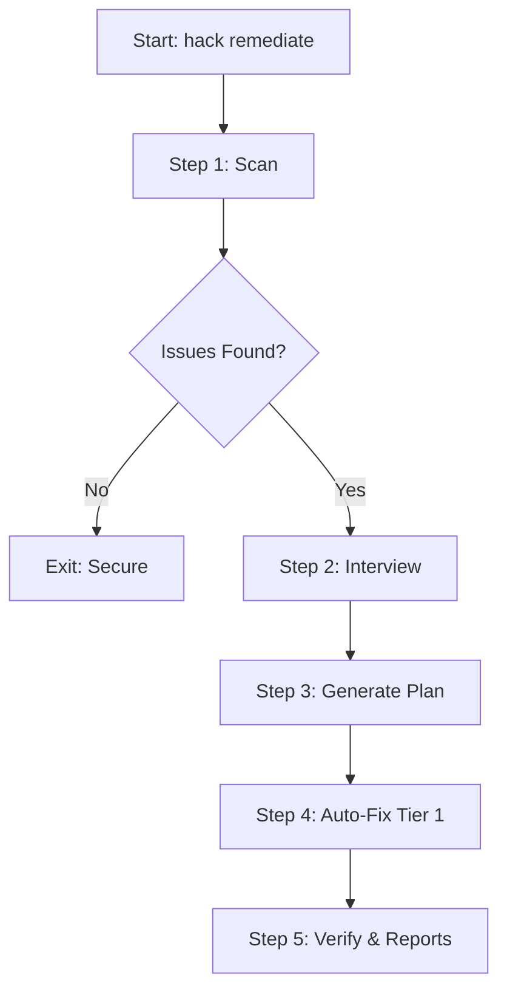

# Hack Skill: Interactive Security Remediation Walkthrough

The `hack` skill now features a complete, interactive security remediation workflow triggered via `hack remediate`. This workflow automates the transition from discovery to fixing.

## Features

- **Multi-Scanner Support**: Uses Docker-isolated `semgrep` with `auto`, `python`, and `security-audit` configurations.
- **Intelligent Classification**: Automatically identifies "Tier 1" issues (e.g., MD5, hardcoded secrets, simple SQL injection) that are safe for automated fixing.
- **Skill Integration**:
  - **/interview**: Gathers user preferences for fix approach and verification.
  - **/plan**: Generates a structured `0N_SECURITY_TASKS.md` for `/orchestrate`.
- **Automated Verification**: Re-scans after fixes to ensure vulnerabilities are resolved and no new ones were introduced.

## Workflow Overview



## Example Usage

### 1. Interactive Mode (Default)

```bash
hack remediate /path/to/target
```

- Gathers preferences via `/interview`.
- Generates `0N_SECURITY_TASKS.md`.

### 2. Auto-Fix Mode

```bash
hack remediate /path/to/target --auto-fix
```

- Skips interview.
- Applies all Tier 1 fixes immediately.
- Verifies results.

### 4. Profile-Aware Remediation

```bash
hack remediate /path/to/target --profile state-actor
```

- Adjusts scanner sensitivity and stealth.
- Deepens the audit for high-value targets.

## Hybrid Verification & Correlation

The workflow now leverages `correlation.py` to match **DAST** findings with **SAST** origins.

- **Confidence Boosting**: Issues verified by both black-box and white-box scans are highlighted as **HIGH CONFIDENCE / VERIFIED**.
- **Context Enrichment**: Auto-fixes are applied with greater precision by mapping external endpoints back to source code locations.

## Validation Results

Tested with `/tmp/test_vuln.py` containing:

- SQL Injection (sqlite3 string formatting)
- Weak Crypto (MD5)
- Hardcoded Secret

**Results**:

- ✓ Successfully detected all 3 vulnerabilities.
- ✓ Corrected path mapping (Host ↔ Docker Container).
- ✓ Correctly identified MD5 as Auto-fixable.
- ✓ Generated comprehensive `0N_SECURITY_TASKS.md`.

---

**Status**: Ready for production usage.
