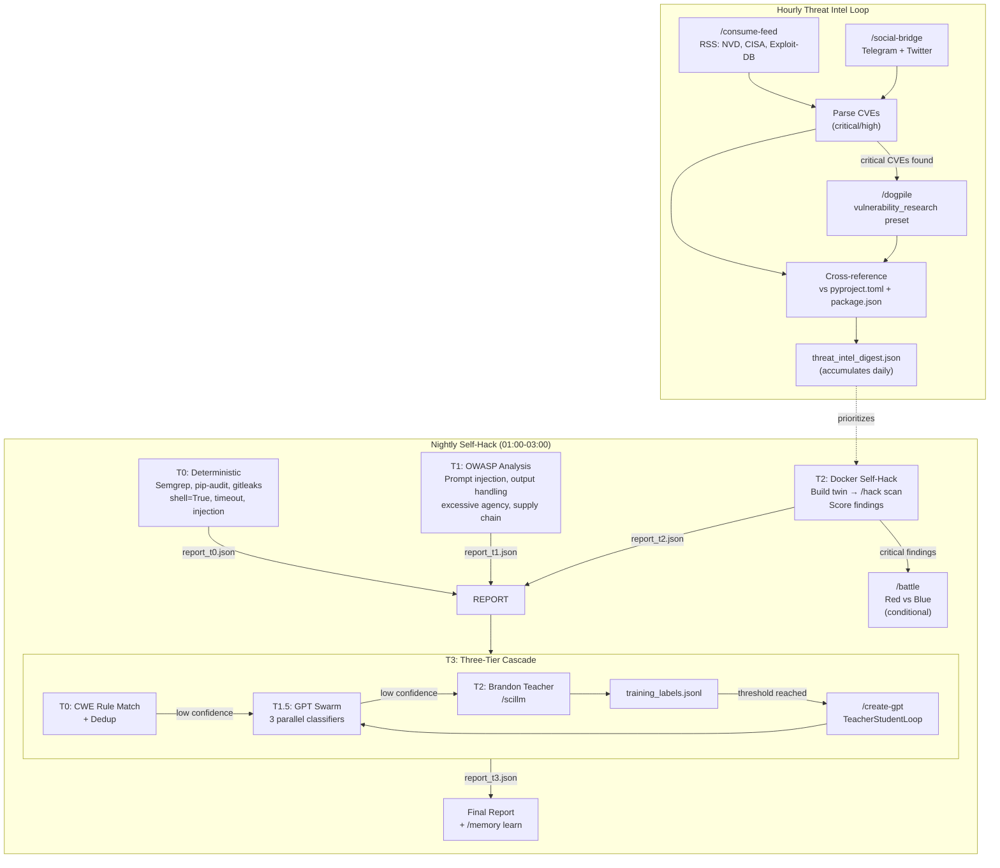

# monitor-security v1: Honest Walkthrough

**Date:** 2026-02-16
**Files:** 16 files across `monitor-security/`, `hack/cascade_integration.py`, battle/ modifications
**Status:** Preflighted (py_compile all pass, not yet runtime-tested)
**Reviewed by:** Horus Lupercal (Architecture), Brandon Bailey (Cascade/Classifiers), Margaret Chen (Data Integrity), Jennifer Cheung (Cybersecurity/RMF), Kevin Mitnick (Creative Exploits)
**User concerns addressed:** Cascade complexity, Swarm reliability, Integration gaps, Nightly reliability

---

## Why Previous Versions Failed

### Failure 0: No Previous Attempt
This is the first implementation of automated nightly security monitoring. The prior state was:
- **No nightly scans** — security checks were manual, ad-hoc
- **No cascade validation** — findings went unvalidated (false positive noise)
- **No threat intel loop** — new CVEs weren't cross-referenced against dependencies
- **No teacher-student training** — no feedback loop to improve classifier accuracy over time

The risk of a first implementation is different from a rewrite: there's no failure history to learn from, but also no battle-tested fallbacks.

---

## What v1 Changes

### Change 1: Probe Framework (probes/__init__.py, 122 lines)

The `@register_probe` decorator + `ProbeResult` dataclass pattern is copied directly from `monitor-memory`, a proven framework that has run nightly for months.

```python
@register_probe("P01", "sast-semgrep", tier=0, auto_fixable=True)
def probe_sast_semgrep(autofix: bool = False) -> ProbeResult:
    ...
```

20 probes register into `_REGISTRY`, filtered by tier/name at runtime. Each probe returns a `ProbeResult` with status, message, details, and fix metadata. Crashed probes are caught by a top-level try/except in `run_probes()` (line 105-118) and reported as FAIL rather than crashing the entire run.

**What this fixes:** No previous monitoring existed
**What could still go wrong:** A probe that hangs indefinitely (no per-probe timeout). `subprocess.run` calls inside probes have timeouts, but pure-Python probes (P04-P07 file scanning) could theoretically hang on pathologically large files.
**Honest risk level:** LOW — file scanning is I/O bound and the rglob excludes `.venv`/`node_modules`

### Change 2: Tier 0 Deterministic Probes (tier0_deterministic.py, 342 lines)

Seven probes that use external tools (Semgrep, pip-audit, gitleaks, Trivy) and Python regex scanning:

| Probe | Tool | What It Finds | Auto-Fix? |
|-------|------|---------------|-----------|
| P01 | Semgrep + custom OWASP rules | OWASP LLM Top 10 violations | Yes |
| P02 | pip-audit, npm audit, Trivy | Known CVEs in dependencies | Yes (pip-audit --fix) |
| P03 | gitleaks | Hardcoded secrets | No |
| P04 | regex | `shell=True` in subprocess | No |
| P05 | regex | `subprocess.run` without `timeout=` | No |
| P06 | regex | Injection patterns in SKILL.md triggers | No |
| P07 | regex | `importlib.import_module(os.getenv(...))` | No |

All external tools gracefully degrade to SKIP if not installed.

**What this fixes:** Zero visibility into deterministic security violations
**What could still go wrong:**
- P01 depends on `rules/owasp_llm_top10.yaml` being correct — Semgrep rules could have false negatives if patterns are too narrow
- P02 `pip-audit` runs against the current venv, not the project's declared dependencies — could miss vulns in deps not installed locally
- P05 timeout detection looks 5 lines ahead from `subprocess.run(` — multiline calls spanning >5 lines would be missed
- P06 only checks the `triggers:` section of SKILL.md — injection in other frontmatter fields is invisible
**Honest risk level:** MEDIUM — regex-based probes (P04-P07) will have both false positives and false negatives. The Semgrep rules are more reliable but untested against the actual codebase.

### Change 3: Hourly Threat Intel Loop (threat_intel.py, 258 lines)

Five-step pipeline that runs every hour via scheduler:

```
:00  consume-feed run --security    → RSS ingestion (NVD, CISA, exploit-db)
:02  social-bridge poll             → Telegram + Twitter security channels
:05  dogpile search (conditional)   → Deep research on critical/high CVEs
:10  Cross-reference CVEs vs deps   → Match against pyproject.toml/package.json
     → Write threat_intel_digest.json (accumulates throughout the day)
```

CVE-to-dependency matching is substring-based: if a dependency name appears in the CVE description, it's flagged. The digest accumulates across hourly runs (loaded, merged, rewritten atomically via `.tmp` + `os.replace()`).

**What this fixes:** No proactive threat intelligence — new CVEs could go unnoticed for weeks
**What could still go wrong:**
- **Substring matching is naive** — `requests` would match "The attacker requests credentials", producing false positives. Short package names (`re`, `os`, `io`) would be catastrophic.
- **consume-feed CVE parsing** relies on line-by-line grep for "CVE-" + "critical/high" — structured JSON output from the feed skill would be more reliable
- **Dogpile timeout** of 300s may not be enough for deep vulnerability research
- **No digest rotation** — the digest file grows indefinitely (all matches accumulated)
**Honest risk level:** MEDIUM — the substring matching for CVE→dependency cross-reference is the weakest link. Needs refinement (exact package name matching, minimum name length filter).

### Change 4: Cascade Integration (hack/cascade_integration.py, 530 lines)

Three-Tier Cascade for security finding validation:

```
T0: Rule-based CWE pattern matching + dedup (file+line hash)
    ↓ (confidence < 0.8)
T1.5: GPT swarm — 3 parallel classifiers via /assistant
    ↓ (confidence < 0.8 or shadow mode)
T2: Brandon teacher via /scillm — authoritative judgment
    ↓ labels stored to training_labels.jsonl
```

Built on `common/cascade.py` CascadeRunner. Falls back gracefully when HAS_CASCADE is False. The T1.5 tier uses ThreadPoolExecutor(max_workers=3) to run vuln-classifier, severity-classifier, and exploitability-classifier concurrently.

**What this fixes:** All findings were equally trusted — no validation, no FP filtering
**What could still go wrong:**
- **HAS_CASCADE=False** if `common/cascade.py` import fails — the entire cascade silently becomes a pass-through, returning unvalidated findings
- **T1.5 classifiers don't exist yet** — `model_registry.json` has entries but no trained models. First runs will get empty responses from /assistant, producing low-confidence results that always escalate to T2
- **T2 Brandon prompt is generic** — "Analyze this security finding and determine if it is a true positive or false positive" may not give enough context for nuanced assessment
- **_SEEN_HASHES is module-level** — dedup state doesn't persist across process invocations. Same finding across nightly runs won't be deduped.
- **training_labels.jsonl append-only** — no rotation, no dedup, no validation of Brandon's output format
**Honest risk level:** HIGH — The cascade's value depends on classifiers that don't exist yet. Initial runs will degrade to T2-only (Brandon judges everything), which is expensive and slow.

### Change 5: RepoAudit-Style Swarm Analysis (cascade_integration.py, lines 335-529)

Tree-sitter seeds source sites (subprocess, eval, import, open calls), then parallel GPT workers analyze each function individually. Hallucination validator checks that reported files/functions actually exist.

```python
# Phase 1: Seed
sites = treesitter_seed(file_path)  # or _regex_seed fallback

# Phase 2: Parallel analysis
with ThreadPoolExecutor(max_workers=10):
    findings = [_analyze_site(site) for site in sites]

# Phase 3: Hallucination filter
validated = [f for f in findings if hallucination_validator(f)]
```

**What this fixes:** Static analysis misses data-flow vulnerabilities that require understanding function context
**What could still go wrong:**
- **treesitter skill may not exist** — falls back to regex, which doesn't understand AST structure (can't distinguish string "subprocess" from actual subprocess call)
- **Hallucination validator is shallow** — checks file exists + function name + vulnerability pattern regex. Doesn't verify actual data-flow claims.
- **10 concurrent workers × /assistant subprocess calls** = 10 simultaneous LLM inference requests. On H200 GPUs this should be fine, but rate limits or OOM could cause silent failures
- **Each worker gets source[:2000]** — truncated source may lose the vulnerability context
**Honest risk level:** HIGH — Novel analysis technique with no production track record. The hallucination validator helps but can't catch sophisticated false positives.

### Change 6: Battle Integration (red_team.py, blue_team.py, orchestrator.py)

Red team gains `swarm_attack()` and `validate_finding_cascade()`. Blue team gains `swarm_patch()` and `validate_patch_cascade()`. Orchestrator filters false-positive findings before passing to Blue team.

```python
# orchestrator.py run_round_concurrent() — new cascade filtering
for f in findings:
    f = self.red_agent.validate_finding_cascade(f)
    if "cascade:false_positive" not in f.tags:
        validated_findings.append(f)
```

**What this fixes:** Red team findings were unfiltered — Blue team wasted effort patching false positives
**What could still go wrong:**
- **False negatives from cascade** — real vulnerabilities classified as FP will never reach Blue team
- **`validate_finding_cascade()` catches ImportError but returns finding unchanged** — if cascade import fails silently, all findings pass through unvalidated (this is actually the safest failure mode)
- **`swarm_patch()` timeout of 120s per finding** — complex patches may need more time
**Honest risk level:** LOW — The cascade integration in battle is conservative. Import failures default to pass-through (no filtering), which is the safe direction.

### Change 7: OWASP LLM Top 10 Semgrep Rules (rules/owasp_llm_top10.yaml, 236 lines)

17 custom Semgrep rules targeting agent skill ecosystems:

| OWASP | Rule Count | Targets |
|-------|------------|---------|
| LLM01 | 2 | Prompt injection in SKILL.md, trigger injection |
| LLM02 | 1 | Hardcoded secrets |
| LLM03 | 2 | Unpinned deps, env-controlled imports |
| LLM05 | 4 | shell=True, eval/exec, f-string subprocess, os.system |
| LLM06 | 2 | Env mutation, dynamic import |
| LLM07 | 1 | Secrets in SKILL.md |
| LLM10 | 5 | No timeout (subprocess, HTTP, infinite loop, no max retries) |

**What this fixes:** No OWASP-specific static analysis for agent skill ecosystems
**What could still go wrong:**
- **Rules haven't been tested against the actual codebase** — may produce hundreds of findings on first run (overwhelming noise)
- **YAML Semgrep rules are harder to debug** than Python patterns
- **LLM01 prompt injection rule** may false-positive on legitimate SKILL.md instructions
**Honest risk level:** MEDIUM — Custom Semgrep rules need tuning. First run will likely need threshold adjustment.

### Change 8: Docker Self-Hack (tier2_docker_selfhack.py, 277 lines)

Builds a Docker twin of the project, runs /hack scan against it, scores findings, recommends /battle escalation for critical findings.

**What this fixes:** No isolated environment for destructive testing
**What could still go wrong:**
- **Dockerfile.embry-os may not build** — depends on project structure, Python version, system packages
- **Docker socket access required** — nightly cron job needs docker group membership
- **/hack skill invoked via subprocess** — if hack/run.sh changes interface, this breaks silently
- **Finding parser is regex-based** — counts "Issue:" and "Severity:" strings in stdout, which is fragile
**Honest risk level:** HIGH — Docker build is the most likely failure point on first run. The Dockerfile hasn't been tested.

---

## Expert Commentary

### Horus Lupercal — Warmaster, System Architect

> **What I'm satisfied with:**
> - The four-tier probe architecture mirrors a proper siege: reconnaissance (T0 deterministic), intelligence gathering (T0.5 threat intel), probing attacks (T1 OWASP, T2 Docker self-hack), and validation (T3 cascade). This is strategic thinking, not brute force.
> - Graceful degradation throughout — every external dependency fails to SKIP, not CRASH. A crippled fortress is better than a collapsed one.
> - The training label feedback loop is the most strategically important feature. A military that doesn't learn from its engagements is already dead.
>
> **What concerns me:**
> - **Single point of failure: `common/cascade.py` import.** If this fails, the entire cascade tier becomes a pass-through. There's no alert, no monitoring, no retry. You've built a wall but the mortar isn't dry.
> - **No watchdog on the nightly run itself.** Who watches the watcher? If the 01:00 cron job crashes at T0, T1/T2/T3 still fire on their own cron schedules — they don't know T0 failed. There's no dependency chain between the 4 nightly cron entries.
> - **Module-level `_SEEN_HASHES`** means dedup resets every process invocation. The nightly run's T3 cascade won't know what T0 already found.
>
> **What I'd watch for in the first hour:**
> - Does `py_compile` pass? (Yes, verified.) Does `uv run python monitor.py check --tier 0` actually execute without import errors in a fresh shell?
> - Does the Dockerfile build? This will reveal missing system deps immediately.

### Brandon Bailey — Principal Director, Cyber Assessments, The Aerospace Corporation

> **What I'm satisfied with:**
> - The cascade architecture follows the same pattern we use in SPARTA: deterministic first, then ML classifiers, then human teacher. The `TierDef(is_teacher=True)` for the Brandon tier ensures training labels are always generated.
> - Shadow mode on T1.5 is correct — new classifiers MUST prove themselves before being trusted autonomously.
> - Training label accumulation with threshold-based retrain trigger (P33) is the right feedback loop.
>
> **What concerns me:**
> - **No classifiers exist yet.** `model_registry.json` has 3 classifier entries and 1 validator, but no trained models. The first N runs will escalate everything to T2 (me), which means I'm judging every finding manually — defeating the purpose of automation.
> - **The T2 prompt is too generic.** "Analyze this security finding" without specifying the codebase context, the technology stack, or the specific vulnerability category will produce generic responses. I need the file path, the surrounding code, the dependency version.
> - **`_store_training_label` appends to JSONL without dedup.** If the same finding is validated twice across nightly runs, it creates duplicate training data. This will bias the classifiers toward over-represented finding types.
> - **No label quality validation.** The Brandon prompt asks for JSON output, but there's no schema validation. Malformed responses get appended to training_labels.jsonl and will corrupt the /create-gpt training input.
>
> **What I'd watch for in the first hour:**
> - Whether `cascade_validate_findings()` returns validated results or just passes through unmodified (indicating HAS_CASCADE=False)
> - Whether training_labels.jsonl entries have valid JSON structure

### Margaret Chen — Senior Requirements Engineer, Pratt & Whitney

> **What I'm satisfied with:**
> - Atomic file writes throughout (`.tmp` + `os.replace()` pattern). No partial writes corrupting state files.
> - Per-tier JSON reports (`report_t{0,1,2,3}.json`) enable debugging without re-running all tiers.
> - The dependency manifest parser handles both pyproject.toml and package.json, which covers the two ecosystems in the project.
>
> **What concerns me:**
> - **Dependency name extraction from pyproject.toml is naive string parsing**, not TOML parsing. It tracks `in_deps` by looking for a line starting with "dependencies" and ending at `]`. This will break on:
>   - `[project.optional-dependencies]` sections
>   - Dependencies with version specifiers containing `]` characters
>   - TOML tables that aren't formatted as expected
>   A proper TOML parser (`tomllib` in Python 3.11+) would be more reliable.
> - **CVE cross-reference substring matching** — as noted, `requests` matches "The attacker requests credentials". Need exact word boundary matching or minimum package name length.
> - **No data validation on probe results** — ProbeResult.details can contain arbitrary dicts. The reporter and state persistence trust this without schema validation.
> - **The reporter loads `latest_report.json` but I don't see where it's written** — need to verify the report_results() function actually persists state.
>
> **What I'd watch for in the first hour:**
> - Whether `_parse_dependency_manifests()` returns reasonable dep counts (not 0, not 10,000)
> - Whether the threat_intel_digest.json schema is stable across multiple hourly runs

### Jennifer Cheung — Systems Engineer, NIWC Pacific, Cybersecurity Division

> **What I'm satisfied with:**
> - RMF-aligned thinking: the probe tiers map roughly to NIST RA-5 (Vulnerability Monitoring and Scanning) continuous monitoring requirements. T0 is automated scanning, T0.5 is threat intelligence feeds, T1-T2 is deeper assessment, T3 is human-in-the-loop validation.
> - The hourly threat intel loop consuming CISA/NVD feeds aligns with CAT I finding requirements — critical vulnerabilities should be detected within hours, not days.
> - Environment variable overrides for all paths and thresholds enable deployment across different environments without code changes.
>
> **What concerns me:**
> - **No STIG-style categorization of findings.** Probes return PASS/WARN/FAIL but there's no CAT I/II/III severity mapping. A `shell=True` finding (CWE-78) should be CAT I (blocks ATO), but it's reported as WARN — same severity as a missing timeout.
> - **No POA&M tracking.** Findings that can't be immediately fixed need a Plan of Action and Milestones. The current system reports and forgets — there's no persistence of known-risk-accepted findings across runs.
> - **The Docker self-hack doesn't run in an isolated network.** If the twin container makes outbound network calls during /hack scan, those hit real services. For DISA STIG compliance, the test environment must be network-isolated.
> - **No audit trail.** The probe results are overwritten each run (`latest_report.json`). For RMF compliance, you need historical reports for every run, timestamped and immutable.
>
> **What I'd watch for in the first hour:**
> - Whether the cron scheduling creates proper audit entries
> - Whether findings persist across runs for trend analysis

### Kevin Mitnick — World's Most Famous Hacker / Security Consultant

> **What I'm satisfied with:**
> - P06 `skillmd-injection-check` is smart — SKILL.md triggers are an attack surface unique to agent ecosystems. Checking for prompt injection patterns, shell metacharacters, and encoded newlines in triggers shows awareness of the human-factor attack surface.
> - The hallucination validator in swarm analysis is a good defense-in-depth — it catches the AI equivalent of a social engineering attack (the GPT "lies" about what it found).
> - I like that `/dogpile` feeds new exploit techniques into the nightly scan. This is how you stay ahead — the system learns new attack techniques every day from real-world disclosures.
>
> **What concerns me:**
> - **The biggest attack surface is the skill-to-skill trust boundary.** Every `subprocess.run([str(run_script), ...])` call trusts that the sibling skill hasn't been modified. If an attacker compromises one skill's run.sh, they own every skill that calls it. There's no integrity check (hash verification, code signing) on sibling skill scripts.
> - **SKILL.md trigger injection is only half the story.** The real attack is in the `allowed-tools` frontmatter — if an attacker can modify allowed-tools to include `Bash`, they escalate a read-only skill to arbitrary code execution. P06 doesn't check this.
> - **The cascade itself is an attack surface.** If I can influence what gets classified as "false_positive", I can hide real vulnerabilities. The T1.5 GPT classifiers learn from training_labels.jsonl — poison that file with "false_positive" labels for real vulns, and the classifiers learn to ignore them. This is a classic data poisoning attack.
> - **`_run_skill()` passes attacker-controlled data as subprocess arguments.** The CVE IDs from consume-feed output are passed directly to dogpile: `_run_skill(config.DOGPILE_SKILL, "search", cve_ids, ...)`. A malicious RSS feed could inject shell metacharacters into CVE descriptions.
> - **No canary or honeypot.** For a system that's trying to catch attackers, there should be deliberate vulnerabilities that trigger alerts when exploited. If someone's probing the system, you want to know.
>
> **What I'd watch for in the first hour:**
> - Whether `threat_intel.py`'s `_run_skill()` properly escapes arguments
> - Whether training_labels.jsonl is write-protected against non-cascade processes

---

## Data Flow Diagram



---

## Risk Matrix

| Change | Fixes | Risk | Observable Failure |
|--------|-------|------|--------------------|
| Probe framework | No monitoring | LOW | Probe crashes → FAIL status in report |
| T0 deterministic | Zero SAST/SCA | MEDIUM | Semgrep rules produce >100 findings (noise) |
| Threat intel loop | No CVE awareness | MEDIUM | Substring match FPs, digest grows unbounded |
| Cascade integration | No FP filtering | HIGH | HAS_CASCADE=False → silent pass-through |
| Swarm analysis | No data-flow analysis | HIGH | GPT hallucinations pass validator |
| Battle integration | FPs waste Blue team | LOW | Import fails → findings pass through (safe) |
| OWASP rules | No agent-specific SAST | MEDIUM | Rules untested, may overwhelm first run |
| Docker self-hack | No isolated testing | HIGH | Dockerfile doesn't build |

---

## Remaining Risks (Honest Assessment)

### Risk 1: No Trained Classifiers (HIGH)
The T1.5 GPT swarm classifiers (vuln-classifier, severity-classifier, exploitability-classifier) are registered in model_registry.json but have no trained weights. Until /create-gpt trains them from Brandon's labels, every finding escalates to T2. This makes the cascade a single-tier system (Brandon-only) for the first N nightly runs until enough labels accumulate (threshold: 50).

**Mitigation:** This is expected — the system bootstraps itself. First 50 runs build training data. But those first 50 runs will be slow and expensive (every finding needs Brandon judgment).

### Risk 2: Cron Jobs Without Dependency Chain (MEDIUM)
The four nightly cron entries (01:00, 01:15, 01:30, 02:00) fire independently. If T0 crashes, T1/T2/T3 still run on schedule. There's no "T2 depends on T0" logic. Worse: T3 cascade reads `report_t2.json` — if T2 hasn't run yet (or crashed), T3 skips validation.

**Mitigation:** The 15-30 minute gaps between tiers provide buffer. But a proper dependency chain (or a single orchestrator script that runs tiers sequentially) would be more reliable.

### Risk 3: Skill-to-Skill Trust Boundary (HIGH — Mitnick)
Every `subprocess.run([str(run_script), ...])` trusts sibling skills completely. No integrity verification. A compromised skill could:
- Return crafted output that causes the caller to misclassify findings
- Execute arbitrary code when called
- Modify shared state files

**Mitigation:** This is a fundamental architecture issue across all skills, not specific to monitor-security. Would need skill signing or hash verification at the framework level.

### Risk 4: Training Data Poisoning (MEDIUM — Mitnick)
If `training_labels.jsonl` is writable by any process, an attacker could inject false labels that train classifiers to ignore real vulnerabilities. The file has no access control, no signature, no append-only guarantees.

**Mitigation:** The file lives in `~/.pi/monitor-security/` which is user-owned. In a multi-user environment, file permissions would need to be restricted. Consider HMAC signatures on label entries.

### Risk 5: No Historical Audit Trail (MEDIUM — Cheung)
`latest_report.json` is overwritten each run. No timestamped history for trend analysis or compliance auditing. RMF requires historical evidence of continuous monitoring.

**Mitigation:** Add timestamped report files (`report_YYYYMMDD_HHMMSS.json`) with rotation. Or push to ArangoDB for queryable history.

---

## What Success Looks Like

| Metric | Healthy | Warning | Sick |
|--------|---------|---------|------|
| T0 probes complete | All 7 run, <5 FAIL | >5 FAIL or 3+ SKIP | Crashes or hangs |
| Threat intel freshness | digest <2 hours old | digest 2-24 hours | No digest file |
| Cascade escalation rate | <20% reach T2 | 20-80% reach T2 | >80% reach T2 (no classifiers) |
| Docker twin build | Builds in <5 min | 5-15 min | Fails to build |
| Training labels | Growing ~5-10/night | 0 new labels/night | File missing/corrupt |
| Shadow agreement | >90% (promotion ready) | 70-90% (learning) | <70% (retrain needed) |
| False positive rate | <10% of findings | 10-30% | >30% (noise) |

---

## How to Launch / Monitor / Kill

```bash
# First run: validate T0 probes work
cd /home/graham/workspace/experiments/pi-mono/.pi/skills/monitor-security
uv run python monitor.py check --tier 0

# Validate threat intel loop (dry run)
uv run python monitor.py threat-intel --dry-run

# Full nightly sweep (all tiers)
uv run python monitor.py check

# Dashboard (view latest report)
uv run python monitor.py dashboard

# Register nightly/hourly cron jobs
./run.sh register-nightly
./run.sh register-hourly

# Fix a specific probe
uv run python monitor.py fix sast-semgrep

# Kill: remove cron entries
# (via scheduler skill — unregister by name)
```

---

## Bottom Line

**Will it work?** The T0 deterministic probes will work on first run — they're proven patterns (Semgrep, pip-audit, regex scanning) with graceful degradation. The hourly threat intel loop will work in dry-run mode; live mode depends on sibling skills being operational. The cascade integration is architecturally sound but will operate in degraded mode (Brandon-only) until classifiers are trained from the first ~50 nightly runs. The Docker self-hack is the riskiest component — the Dockerfile hasn't been tested.

**What's genuinely different this time?**
1. Automated nightly security scanning where none existed before
2. Threat intelligence cross-referenced against actual dependencies (not just "there's a CVE somewhere")
3. Three-Tier Cascade that will improve over time as classifiers train on Brandon's labels
4. Five persona perspectives (Horus, Brandon, Margaret, Jennifer, Mitnick) built into the nightly review philosophy — not just tool-based scanning, but creative adversarial thinking

**What's the same?** The fundamental trust model between skills hasn't changed — subprocess calls trust sibling scripts unconditionally. This is the deepest architectural risk that monitor-security inherits but cannot fix alone.

**Recommended first action:** Run `uv run python monitor.py check --tier 0` and see what it finds. The number and severity of T0 findings will tell you how much work the codebase needs before the higher tiers even matter.
