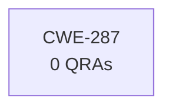

# Evidence Case: "What countermeasures protect the F-36 avionics from CWE-287?"

## Entity Graph

## Metrics

| Entity | Exists | QRAs | Grounding | Path |
|--------|--------|------|-----------|------|
| CWE-287 | Y | 0 | - | - |

## Gates

| # | Gate | Result | Time |
|---|------|--------|------|
| 1 | Extract entities | Y | 8823ms |
| 2 | Verify existence | N | 1049ms |

**Classification: INVALID_IDS** (9872ms total)