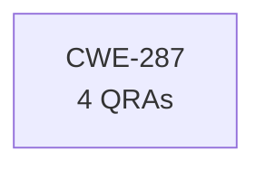

# Evidence Case: "What countermeasures protect the F-36 avionics from CWE-287?"

## Entity Graph

## Metrics

| Entity | Exists | QRAs | Grounding | Path |
|--------|--------|------|-----------|------|
| CWE-287 | Y | 4 | 0.80 | - |

## Gates

| # | Gate | Result | Time |
|---|------|--------|------|
| 1 | Extract entities | Y | 7617ms |
| 2 | Verify existence | Y | 2417ms |
| 3 | Check relations | Y | <1ms |
| 4 | Decompose | Y | <1ms |
| 5 | Formalize + QRAs | Y | 126ms |

**Classification: ANSWERABLE** (10160ms total)