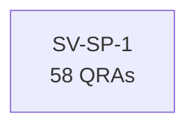

# Evidence Case: "What is the description of SV-SP-1?"

## Entity Graph

## Metrics

| Entity | Exists | QRAs | Grounding | Path |
|--------|--------|------|-----------|------|
| SV-SP-1 | Y | 58 | 0.80 | - |

## Gates

| # | Gate | Result | Time |
|---|------|--------|------|
| 1 | Extract entities | Y | 8430ms |
| 2 | Verify existence | Y | 2744ms |
| 3 | Check relations | Y | <1ms |
| 4 | Decompose | Y | <1ms |
| 5 | Formalize + QRAs | Y | 126ms |

**Classification: ANSWERABLE** (11301ms total)