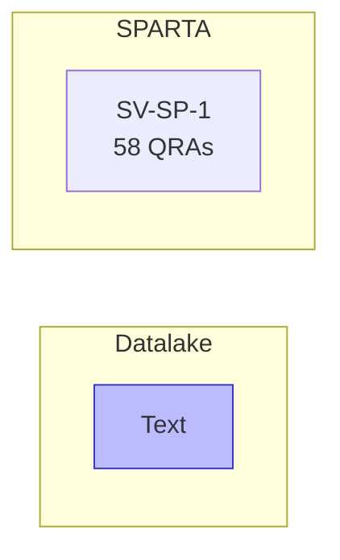

# Evidence Case: "What is the description of SV-SP-1?"

## Entity Graph

## Datalake Context

| Category | Recall Conf | Avg Graph | Shared Bridges | Connected Controls |
|----------|-------------|-----------|----------------|-------------------|
| Text | 14.60 | - | - | 0 controls |

## Metrics

| Entity | Exists | QRAs | Grounding | Path |
|--------|--------|------|-----------|------|
| SV-SP-1 | Y | 58 | 0.80 | - |

## Gates

| # | Gate | Result | Time |
|---|------|--------|------|
| 1 | Extract entities | Y | 9602ms |
| 2 | Verify existence | Y | 2751ms |
| 6 | Datalake connection | N | 1941ms |

**Classification: DATALAKE_NOT_CONNECTED** (14295ms total)