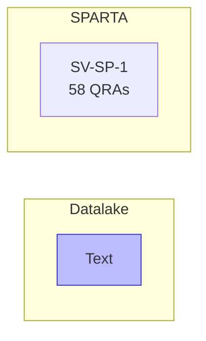

# Evidence Case: "What is the description of SV-SP-1?"

## Entity Graph

## Datalake Context

| Category | Recall Conf | Avg Graph | Shared Bridges | Connected Controls |
|----------|-------------|-----------|----------------|-------------------|
| Text | 0.49 | - | - | 0 controls |

## Metrics

| Entity | Exists | QRAs | Grounding | Path |
|--------|--------|------|-----------|------|
| SV-SP-1 | Y | 58 | 0.80 | - |

## Gates

| # | Gate | Result | Time |
|---|------|--------|------|
| 1 | Extract entities | Y | 24536ms |
| 2 | Verify existence | Y | 8436ms |
| 6 | Datalake connection | Y | 4965ms |
| 3 | Check relations | Y | <1ms |
| 4 | Decompose | Y | <1ms |
| 5 | Formalize + QRAs | Y | 268ms |

**Classification: ANSWERABLE** (38206ms total)