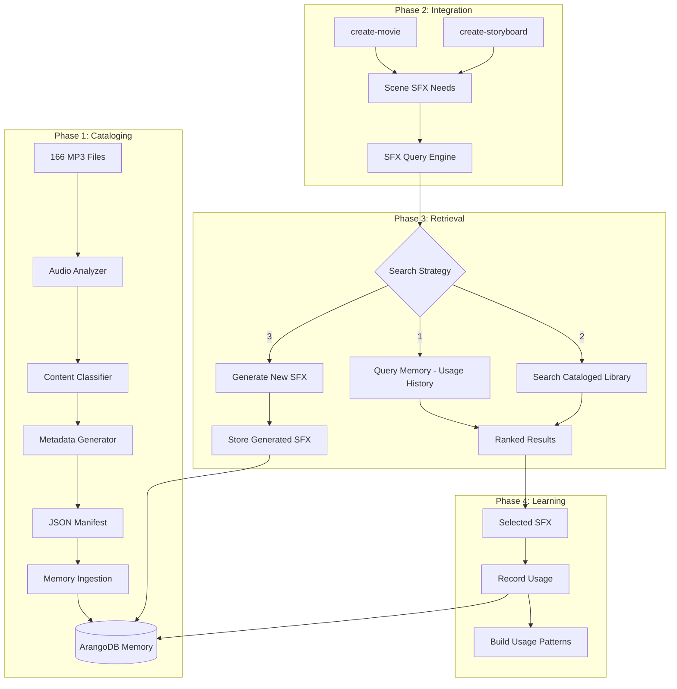

# SFX Catalog System Architecture

## Overview

The SFX Catalog system provides **discoverable, reusable, and learnable** sound effects management for Horus's filmmaking pipeline. It combines audio analysis, semantic search, and memory integration to make the right sound effect available at the right time.

## System Diagram



## Core Components

### 1. Audio Analyzer ([`audio_analyzer.py`](audio_analyzer.py))

**Purpose**: Extract technical characteristics from audio files.

**Technology Stack**:

- `librosa` - Audio analysis library
- `scipy` - Signal processing
- `numpy` - Numerical operations
- `soundfile` - Audio I/O

**Extracted Features**:

```python
{
    "duration_seconds": 2.34,
    "sample_rate": 48000,
    "channels": 2,
    "bit_depth": 24,

    # Spectral features
    "frequency_profile": {
        "dominant_freq_hz": 440.0,
        "freq_centroid_hz": 1250.5,
        "spectral_bandwidth_hz": 850.2,
        "spectral_rolloff_hz": 5000.0
    },

    # Temporal features
    "envelope": {
        "attack_ms": 50,
        "decay_ms": 200,
        "sustain_level_db": -12,
        "release_ms": 500,
        "envelope_type": "percussive"  # vs "sustained", "impulsive"
    },

    # Energy distribution
    "loudness": {
        "peak_db": -3.5,
        "rms_db": -18.2,
        "dynamic_range_db": 14.7
    },

    # Perceptual
    "zero_crossing_rate": 0.042,  # Noisiness indicator
    "harmonic_ratio": 0.65,       # Harmonic vs percussive
    "tempo_bpm": None              # For rhythmic sounds
}
```

**Implementation Notes**:

- Batch processing with progress reporting to [`task-monitor`](.pi/skills/task-monitor/SKILL.md)
- Parallel processing where safe (CPU-bound, no memory issues)
- Cache results to avoid reprocessing

---

### 2. Content Classifier ([`content_classifier.py`](content_classifier.py))

**Purpose**: Categorize sounds semantically for searchability.

**Strategy**: Hierarchical multi-label classification

**Technology Options**:

| Approach                       | Pros                             | Cons               | Recommended |
| ------------------------------ | -------------------------------- | ------------------ | ----------- |
| **Rule-Based**                 | Fast, deterministic, no training | Limited accuracy   | ✓ Phase 1   |
| **Audio Fingerprinting**       | Works offline, small models      | Needs labeled data | Phase 2     |
| **Zero-Shot Audio Classifier** | No training, good accuracy       | Requires API/GPU   | Phase 2     |
| **Fine-tuned CLAP**            | Best accuracy                    | Complex setup      | Future      |

**Phase 1 Approach**: Rule-based classifier using audio features:

```python
def classify_sound(features: dict) -> list[str]:
    """
    Classify based on feature heuristics.

    Returns list of applicable categories (multi-label).
    """
    categories = []

    # Envelope-based
    if features["envelope"]["attack_ms"] < 20:
        categories.append("impact")
    if features["envelope"]["envelope_type"] == "sustained":
        categories.append("ambient")

    # Frequency-based
    if features["frequency_profile"]["dominant_freq_hz"] < 150:
        categories.append("low_frequency")
        categories.append("rumble")

    # Harmonic ratio
    if features["harmonic_ratio"] < 0.3:
        categories.append("foley")  # More noise-like

    # Zero-crossing rate (roughness)
    if features["zero_crossing_rate"] > 0.1:
        categories.append("texture")

    return categories
```

**Category Taxonomy** (expandable):

```
├── impact (hits, crashes, explosions)
├── ambient (continuous, environmental)
├── foley (footsteps, cloth, handling)
├── transition (whooshes, risers, sweeps)
├── ui (beeps, clicks, interface)
├── texture (granular, noisy)
├── tonal (musical, harmonic)
├── vocal (speech-like, breaths)
└── nature (wind, water, animals)
```

---

### 3. Metadata Generator ([`metadata_generator.py`](metadata_generator.py))

**Purpose**: Create human-readable, searchable descriptions.

**Strategy**: LLM-assisted description generation from audio features

**Input**: Audio features + categories + optional filename context  
**Output**: Searchable natural language description

**Example Flow**:

```python
# Input
features = {
    "duration": 1.8,
    "envelope_type": "impulsive",
    "categories": ["impact", "low_frequency"],
    "filename": "01-pro_studio_library-3d_sound_effect_1.mp3"
}

# LLM Prompt (via scillm skill)
prompt = f"""
Generate a concise, searchable description for this sound effect:

Duration: {features['duration']}s
Envelope: {features['envelope_type']}
Categories: {', '.join(features['categories'])}
Characteristics: {json.dumps(features['characteristics'])}

Provide 3 things:
1. A 1-sentence description
2. 3-5 searchable keywords
3. Suggested use cases

Format as JSON.
"""

# Output
{
    "description": "Deep, punchy impact with quick attack and medium decay",
    "keywords": ["impact", "hit", "boom", "low-end", "cinematic"],
    "use_cases": ["dramatic reveal", "door slam", "explosion tail"],
    "generated_name": "deep_cinematic_impact_1"
}
```

**LLM Integration**:

- Use [`scillm`](.pi/skills/scillm/SKILL.md) skill for batch generation
- Local model preferred (fast, no API costs)
- Fallback to simple template-based generation if LLM unavailable

---

### 4. Memory Integration ([`memory_bridge.py`](memory_bridge.py))

**Purpose**: Connect SFX catalog to ArangoDB-based memory system.

**API Functions**:

```python
from common.memory_client import MemoryClient, MemoryScope

class SFXMemoryBridge:
    """Bridge between SFX catalog and memory system."""

    def __init__(self):
        self.client = MemoryClient(scope=MemoryScope.HORUS_LORE)

    def ingest_catalog(self, manifest_path: str) -> dict:
        """
        Ingest SFX manifest into memory.

        Stores:
        - sfx_library documents (searchable)
        - Embeddings for semantic search
        - Categories for filtering
        """
        pass

    def search_sfx(
        self,
        query: str,
        categories: list[str] = None,
        duration_range: tuple[float, float] = None,
        k: int = 5
    ) -> list[dict]:
        """
        Search SFX library using semantic + structured filters.

        Example:
            results = bridge.search_sfx(
                "deep explosion",
                categories=["impact"],
                duration_range=(1.0, 5.0)
            )
        """
        pass

    def record_usage(
        self,
        sfx_id: str,
        project_name: str,
        scene_description: str,
        timestamp_in_scene: float,
        rationale: str
    ):
        """
        Record when/where/why an SFX was used.

        Builds usage patterns over time.
        """
        pass

    def recall_prior_usage(self, scene_description: str) -> list[dict]:
        """
        Find SFX used in similar scenes before.

        "Memory First" pattern for SFX selection.
        """
        pass
```

**Memory Scopes Used**:

- `horus_lore` - For SFX catalog and usage history
- `horus-filmmaking` - For cross-referencing with movie creation learnings

---

### 5. CLI Interface ([`cli.py`](cli.py))

**Purpose**: Command-line interface following skill conventions.

**Commands**:

```bash
# Catalog existing library
./run.sh catalog /mnt/storage12tb/media/sfx/ \
    --output sfx_manifest.json \
    --parallel 4

# Ingest into memory
./run.sh ingest sfx_manifest.json \
    --scope horus_lore

# Search catalog
./run.sh search "door creak" \
    --categories foley \
    --duration 1-3 \
    --limit 5

# Record usage
./run.sh record-usage \
    --sfx-id abc123 \
    --project "Dark Horizon" \
    --scene "INT. APARTMENT - Sarah enters" \
    --timestamp 2.5 \
    --rationale "Adds tension to entrance"

# Query prior usage
./run.sh recall-usage "tense entrance scene"

# Status check
./run.sh status
```

---

### 6. Query Engine ([`query_engine.py`](query_engine.py))

**Purpose**: Multi-stage search strategy with fallbacks.

**Search Strategy** (cascading):

```python
class SFXQueryEngine:
    """
    Intelligent SFX search with fallbacks.

    Search order:
    1. Memory First - Check prior usage in similar scenes
    2. Semantic Search - Vector similarity in catalog
    3. Structured Filter - Category + duration constraints
    4. Generation - Create if no match found
    """

    def find_sfx(
        self,
        scene_description: str,
        categories: list[str] = None,
        duration_target: float = None,
        generate_if_missing: bool = False
    ) -> list[dict]:
        """
        Find best SFX for a scene.

        Returns ranked results with confidence scores.
        """
        results = []

        # Strategy 1: Check memory for prior usage
        prior_usage = self.memory.recall_prior_usage(scene_description)
        if prior_usage:
            results.extend(prior_usage)
            results[-1]["source"] = "memory_usage"

        # Strategy 2: Semantic search in catalog
        semantic_results = self.memory.search_sfx(
            query=scene_description,
            categories=categories,
            k=10
        )
        results.extend(semantic_results)

        # Strategy 3: Filter by constraints
        filtered = self._apply_constraints(
            results,
            duration_target=duration_target
        )

        # Strategy 4: Generate if needed and enabled
        if not filtered and generate_if_missing:
            generated = self._generate_sfx(scene_description, categories)
            filtered.append(generated)

        return self._rank_results(filtered)
```

---

## Integration Points

### create-movie Integration

**Hook Point**: Phase 4 - Generate

```python
# In create-movie/generate.py

from sfx_catalog.query_engine import SFXQueryEngine

def generate_scene_audio(scene: dict, script: dict):
    """Generate audio for a scene."""
    sfx_engine = SFXQueryEngine()

    # Extract audio cues from script
    audio_cues = parse_audio_cues(scene["action_lines"])

    for cue in audio_cues:
        # Query SFX catalog
        sfx_results = sfx_engine.find_sfx(
            scene_description=scene["description"],
            categories=cue["suggested_categories"],
            duration_target=cue["duration"],
            generate_if_missing=True
        )

        # Use top result
        selected_sfx = sfx_results[0]

        # Record usage for learning
        sfx_engine.record_usage(
            sfx_id=selected_sfx["id"],
            project_name=script["title"],
            scene_description=scene["description"],
            timestamp_in_scene=cue["timestamp"],
            rationale=f"Audio cue: {cue['description']}"
        )

        # Add to scene assembly
        add_audio_track(selected_sfx["file_path"], cue["timestamp"])
```

### create-storyboard Integration

**Hook Point**: Panel generation phase

```python
# In create-storyboard/panel_generator.py

from sfx_catalog.query_engine import SFXQueryEngine

def suggest_sfx_for_shot(shot: dict):
    """
    Suggest SFX during storyboard planning.

    Returns suggestions as creative recommendations.
    """
    sfx_engine = SFXQueryEngine()

    # Build query from shot context
    query = f"{shot['camera_movement']} {shot['action']} {shot['mood']}"

    results = sfx_engine.find_sfx(
        scene_description=query,
        categories=infer_categories(shot),
        duration_target=shot["duration"]
    )

    # Return as suggestion
    return {
        "suggestion": f"For this shot, I'm thinking: {results[0]['description']}",
        "alternatives": results[1:3],
        "rationale": f"The {shot['mood']} mood suggests this sound profile"
    }
```

---

## Data Flow

### Cataloging Workflow

```
1. User runs: ./run.sh catalog /path/to/sfx/

2. For each MP3 file:
   a. Extract audio features (audio_analyzer)
   b. Classify categories (content_classifier)
   c. Generate description (metadata_generator + LLM)
   d. Build manifest entry

3. Write JSON manifest with all metadata

4. User runs: ./run.sh ingest manifest.json

5. Memory bridge:
   a. Create ArangoDB documents (sfx_library collection)
   b. Generate embeddings for semantic search
   c. Create category indices
   d. Store file hashes to detect duplicates
```

### Query Workflow

```
1. create-movie needs SFX for "door creaking ominously"

2. Query engine searches:
   a. Memory: "door creak" in prior projects → Found 2 matches
   b. Catalog: Semantic search → Found 8 matches
   c. Combine + rank by:
      - Prior usage (higher weight)
      - Semantic similarity
      - Feature match (duration, categories)

3. Return top 5 results with confidence scores

4. User/agent selects #1

5. Record usage to memory for future learning
```

### Learning Workflow

```
1. After each SFX use, record:
   - Which SFX was chosen
   - What scene it was used in
   - Why it was chosen
   - User feedback (implicit: reused = good)

2. Build pattern graph:
   - Scene type → Preferred SFX
   - Mood → Sound characteristics
   - Director style → SFX choices

3. Enable "memory first" for future projects:
   - "Show me SFX used in tense interior scenes"
   - "What did we use for footsteps before?"
```

---

## Technology Stack

### Core Libraries

- **Audio Analysis**: `librosa`, `scipy`, `soundfile`
- **Classification**: Rule-based initially, optional `laion-clap` later
- **Description Generation**: [`scillm`](.pi/skills/scillm/SKILL.md) skill
- **Memory**: ArangoDB via [`memory`](.pi/skills/memory/SKILL.md) skill
- **CLI**: `typer`, `rich` (following skill conventions)
- **Progress**: [`task-monitor`](.pi/skills/task-monitor/SKILL.md)

### External Dependencies

- FFmpeg (for audio format conversion if needed)
- Python 3.11+
- ArangoDB (already installed for memory system)

---

## Performance Considerations

### Cataloging Performance

- **166 files**: ~5-10 minutes total (parallel processing)
- **Audio analysis**: ~2-3 seconds per file
- **LLM description**: ~1 second per file (batched)
- **Memory ingestion**: ~1 second for all files

### Query Performance

- **Memory query**: <100ms (indexed ArangoDB)
- **Semantic search**: <200ms (pre-computed embeddings)
- **Total query time**: <500ms end-to-end

### Scalability

- Designed for 166 files, but scales to 10,000+ files
- Parallel processing for cataloging
- Indexed searches for queries
- Embedding caching to avoid recomputation

---

## Future Enhancements

### Phase 2 (Post-MVP)

1. **Zero-shot audio classifier** for better categorization
2. **Audio fingerprinting** for duplicate detection
3. **Similarity clustering** to find related sounds
4. **Generated SFX caching** to avoid regeneration

### Phase 3 (Advanced)

1. **Fine-tuned CLAP model** for domain-specific classification
2. **Multi-hop reasoning** (scene → mood → sound characteristics)
3. **Collaborative filtering** (if other directors share catalogs)
4. **Automatic tagging** from video context (if integrated with vision models)

---

## Security & Privacy

### Data Storage

- **Library files**: Read-only access from `/mnt/storage12tb/media/sfx/`
- **Generated metadata**: Stored in `~/.pi/sfx-catalog/` (follows conventions)
- **Memory data**: ArangoDB with standard memory skill access patterns

### API Keys

- No external APIs required for Phase 1
- Optional: LLM API for description generation (fallback to local model)

---

## Testing Strategy

### Unit Tests

- Audio feature extraction accuracy
- Category classification correctness
- Metadata generation quality

### Integration Tests

- Memory ingestion end-to-end
- Query engine search accuracy
- Usage recording and recall

### Sanity Checks

```bash
./sanity/test_audio_analysis.sh    # Verify librosa works
./sanity/test_memory_connection.sh # Verify ArangoDB access
./sanity/test_search.sh            # Verify query returns results
```

---

## Next Steps

See [`ROADMAP.md`](ROADMAP.md) for implementation phases and timeline.
