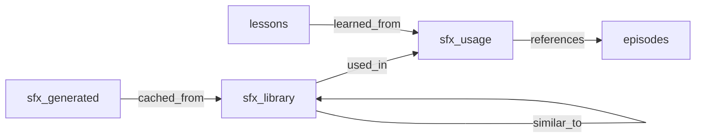

# SFX Memory Schema

## Overview

The SFX system extends ArangoDB's memory architecture with specialized collections for sound effect cataloging, usage tracking, and generation caching. It follows the existing memory skill patterns while adding domain-specific optimizations for audio content.

## Collection Architecture



## Collections

### 1. `sfx_library` - Cataloged Sound Effects

**Purpose**: Master catalog of all available sound effects (library + generated).

**Schema**:

```json
{
  "_key": "sfx_abc123",
  "_id": "sfx_library/sfx_abc123",

  "file_path": "/mnt/storage12tb/media/sfx/volume1/01-pro_studio_library-3d_sound_effect_1.mp3",
  "file_hash": "sha256:a1b2c3...",
  "file_size_bytes": 245678,

  "description": "Deep, punchy impact with quick attack and medium decay",
  "generated_name": "deep_cinematic_impact_1",
  "original_filename": "01-pro_studio_library-3d_sound_effect_1.mp3",

  "keywords": ["impact", "hit", "boom", "low-end", "cinematic"],
  "categories": ["impact", "low_frequency"],
  "use_cases": ["dramatic reveal", "door slam", "explosion tail"],

  "source": "library",

  "audio_features": {
    "duration_seconds": 2.34,
    "sample_rate": 48000,
    "channels": 2,
    "bit_depth": 24,

    "frequency_profile": {
      "dominant_freq_hz": 440.0,
      "freq_centroid_hz": 1250.5,
      "spectral_bandwidth_hz": 850.2,
      "spectral_rolloff_hz": 5000.0
    },

    "envelope": {
      "attack_ms": 50,
      "decay_ms": 200,
      "sustain_level_db": -12,
      "release_ms": 500,
      "envelope_type": "percussive"
    },

    "loudness": {
      "peak_db": -3.5,
      "rms_db": -18.2,
      "dynamic_range_db": 14.7
    },

    "zero_crossing_rate": 0.042,
    "harmonic_ratio": 0.65,
    "tempo_bpm": null
  },

  "embedding": [0.123, -0.456, ...],

  "usage_count": 5,
  "last_used": "2026-01-28T14:30:00Z",

  "created_at": "2026-01-25T10:00:00Z",
  "updated_at": "2026-01-28T14:30:00Z"
}
```

**Indices**:

```python
# Full-text search on description + keywords
db.collection("sfx_library").ensureIndex({
    "type": "fulltext",
    "fields": ["description", "keywords"],
    "minLength": 3
})

# Category filtering (skiplist for range queries)
db.collection("sfx_library").ensureIndex({
    "type": "skiplist",
    "fields": ["categories[*]"]
})

# Duration range queries
db.collection("sfx_library").ensureIndex({
    "type": "skiplist",
    "fields": ["audio_features.duration_seconds"]
})

# File hash for deduplication
db.collection("sfx_library").ensureIndex({
    "type": "hash",
    "fields": ["file_hash"],
    "unique": true
})

# Source filtering (library vs generated)
db.collection("sfx_library").ensureIndex({
    "type": "hash",
    "fields": ["source"]
})
```

**Source Types**:

- `library` - Original 166 studio library files
- `generated` - AI-generated via Stable Audio Open
- `recorded` - User-recorded sounds
- `external` - Downloaded/purchased

---

### 2. `sfx_usage` - Usage Tracking

**Purpose**: Track when/where/why effects were used to build usage patterns.

**Schema**:

```json
{
  "_key": "usage_xyz789",
  "_id": "sfx_usage/usage_xyz789",

  "sfx_id": "sfx_library/sfx_abc123",

  "project_name": "Dark Horizon",
  "project_type": "short_film",

  "scene_description": "INT. APARTMENT - Sarah enters cautiously, thunder rumbling",
  "scene_number": 3,
  "shot_number": 5,

  "timestamp_in_scene": 2.5,
  "duration_used": 2.34,

  "rationale": "Adds tension to entrance, reinforces stormy atmosphere",
  "context": {
    "mood": "tense",
    "camera_movement": "dolly_in",
    "lighting": "low_key",
    "prior_action": "door creak"
  },

  "alternatives_considered": [
    "sfx_library/sfx_def456",
    "sfx_library/sfx_ghi789"
  ],

  "user_feedback": {
    "rating": 5,
    "reused": true,
    "notes": "Perfect for the mood"
  },

  "embedding": [0.789, -0.234, ...],

  "created_at": "2026-01-28T14:30:00Z"
}
```

**Indices**:

```python
# Query by SFX to see where it's been used
db.collection("sfx_usage").ensureIndex({
    "type": "hash",
    "fields": ["sfx_id"]
})

# Query by project
db.collection("sfx_usage").ensureIndex({
    "type": "hash",
    "fields": ["project_name"]
})

# Full-text on scene descriptions (for similarity search)
db.collection("sfx_usage").ensureIndex({
    "type": "fulltext",
    "fields": ["scene_description", "rationale"]
})

# Temporal queries
db.collection("sfx_usage").ensureIndex({
    "type": "skiplist",
    "fields": ["created_at"]
})
```

---

### 3. `sfx_generated` - Generation Cache

**Purpose**: Cache AI-generated sound effects to avoid regeneration.

**Schema**:

```json
{
  "_key": "gen_mno345",
  "_id": "sfx_generated/gen_mno345",

  "prompt": "deep ominous thunder rumble, cinematic, low frequency",
  "prompt_embedding": [0.456, -0.123, ...],

  "model": "stable-audio-open",
  "model_version": "1.0",
  "generation_params": {
    "duration": 3.0,
    "steps": 100,
    "cfg_scale": 7.0,
    "seed": 42
  },

  "file_path": "/mnt/storage12tb/media/sfx/generated/thunder_deep_ominous_20260128.mp3",
  "file_hash": "sha256:x1y2z3...",

  "linked_sfx_id": "sfx_library/sfx_pqr678",

  "audio_features": { },

  "reuse_count": 3,
  "last_reused": "2026-01-30T09:15:00Z",

  "generation_time_seconds": 45.2,
  "cost_usd": 0.0,

  "quality_score": 0.85,
  "user_approved": true,

  "created_at": "2026-01-28T15:00:00Z",
  "updated_at": "2026-01-30T09:15:00Z"
}
```

**Indices**:

```python
# Semantic search on prompts (avoid regenerating similar requests)
db.collection("sfx_generated").ensureIndex({
    "type": "fulltext",
    "fields": ["prompt"]
})

# Link to library entries
db.collection("sfx_generated").ensureIndex({
    "type": "hash",
    "fields": ["linked_sfx_id"]
})

# Reuse tracking
db.collection("sfx_generated").ensureIndex({
    "type": "skiplist",
    "fields": ["reuse_count"],
    "sparse": false
})
```

---

## Edge Collections

### 1. `sfx_used_in` - Usage Relations

**Purpose**: Link SFX to usage records.

```json
{
  "_from": "sfx_library/sfx_abc123",
  "_to": "sfx_usage/usage_xyz789",
  "used_at": "2026-01-28T14:30:00Z"
}
```

### 2. `sfx_similar_to` - Similarity Graph

**Purpose**: Link acoustically/semantically similar sounds for recommendations.

```json
{
  "_from": "sfx_library/sfx_abc123",
  "_to": "sfx_library/sfx_def456",
  "similarity_type": "acoustic",
  "similarity_score": 0.87,
  "similar_features": ["envelope", "frequency_profile"]
}
```

### 3. `sfx_generated_from` - Generation Lineage

**Purpose**: Track which generated SFX came from which prompts.

```json
{
  "_from": "sfx_generated/gen_mno345",
  "_to": "sfx_library/sfx_pqr678",
  "generation_method": "stable-audio-open",
  "quality_score": 0.85
}
```

---

## Search Views

### 1. `sfx_search_view` - Hybrid Search

**Purpose**: Unified view combining full-text + semantic search.

**AQL**:

```aql
FOR doc IN sfx_library
  SEARCH ANALYZER(
    PHRASE(doc.description, @query) OR
    PHRASE(doc.keywords[*], @query) OR
    PHRASE(doc.use_cases[*], @query),
    "text_en"
  )

  LET semantic_score = COSINE_SIMILARITY(doc.embedding, @query_embedding)
  LET text_score = BM25(doc)
  LET combined_score = (semantic_score * 0.6) + (text_score * 0.4)

  SORT combined_score DESC
  LIMIT @k
  RETURN MERGE(doc, {
    score: combined_score,
    text_score: text_score,
    semantic_score: semantic_score
  })
```

### 2. `sfx_usage_history_view` - Prior Usage Lookup

**Purpose**: Find SFX used in similar scenes.

**AQL**:

```aql
FOR usage IN sfx_usage
  SEARCH ANALYZER(
    PHRASE(usage.scene_description, @scene_query) OR
    PHRASE(usage.rationale, @scene_query),
    "text_en"
  )

  LET sfx = DOCUMENT(usage.sfx_id)
  LET semantic_score = COSINE_SIMILARITY(usage.embedding, @scene_embedding)

  FILTER semantic_score > @threshold

  SORT semantic_score DESC, usage.created_at DESC
  LIMIT @k

  RETURN {
    usage: usage,
    sfx: sfx,
    score: semantic_score,
    source: "memory_usage"
  }
```

---

## Query Patterns

### 1. Semantic Search with Filters

```aql
// Find impact sounds, 1-3 seconds, high energy
FOR sfx IN sfx_library
  SEARCH ANALYZER(PHRASE(sfx.description, "impact"), "text_en")

  FILTER "impact" IN sfx.categories
  FILTER sfx.audio_features.duration_seconds >= 1.0
  FILTER sfx.audio_features.duration_seconds <= 3.0
  FILTER sfx.audio_features.loudness.peak_db > -10

  LET semantic_score = COSINE_SIMILARITY(sfx.embedding, @query_embedding)

  SORT semantic_score DESC
  LIMIT 5
  RETURN sfx
```

### 2. Memory First - Prior Usage

```aql
// Given a scene, find SFX used in similar scenes
LET scene_embedding = @scene_embedding

// Find similar usage records
FOR usage IN sfx_usage
  LET score = COSINE_SIMILARITY(usage.embedding, scene_embedding)
  FILTER score > 0.7
  SORT score DESC
  LIMIT 10

  // Get the SFX details
  LET sfx = DOCUMENT(usage.sfx_id)

  // Boost if reused successfully
  LET boosted_score = usage.user_feedback.reused ? score * 1.2 : score

  RETURN {
    sfx: sfx,
    usage: usage,
    score: boosted_score,
    source: "memory"
  }
```

### 3. Find Alternatives (Similar Sounds)

```aql
// Given an SFX, find similar alternatives
FOR edge IN sfx_similar_to
  FILTER edge._from == @sfx_id
  FILTER edge.similarity_score > 0.75
  SORT edge.similarity_score DESC
  LIMIT 5

  LET similar_sfx = DOCUMENT(edge._to)
  RETURN {
    sfx: similar_sfx,
    similarity_score: edge.similarity_score,
    similar_features: edge.similar_features
  }
```

### 4. Check Generation Cache

```aql
// Before generating, check if similar prompt exists
FOR gen IN sfx_generated
  LET prompt_similarity = COSINE_SIMILARITY(gen.prompt_embedding, @prompt_embedding)
  FILTER prompt_similarity > 0.90
  FILTER gen.user_approved == true
  SORT prompt_similarity DESC
  LIMIT 1

  // Get the linked SFX
  LET sfx = DOCUMENT(gen.linked_sfx_id)

  RETURN {
    cached: true,
    sfx: sfx,
    generation_record: gen,
    prompt_similarity: prompt_similarity
  }
```

### 5. Usage Analytics

```aql
// Most used SFX (top 10)
FOR sfx IN sfx_library
  SORT sfx.usage_count DESC
  LIMIT 10
  RETURN {
    name: sfx.generated_name,
    usage_count: sfx.usage_count,
    categories: sfx.categories
  }
```

```aql
// Category usage distribution
FOR usage IN sfx_usage
  LET sfx = DOCUMENT(usage.sfx_id)
  COLLECT category = sfx.categories[*]
  AGGREGATE count = COUNT(1)
  SORT count DESC
  RETURN { category, count }
```

---

## Migration Strategy

### Phase 1: Initial Ingestion

```python
from arango import ArangoClient
from pathlib import Path
import json

def migrate_sfx_catalog(manifest_path: Path):
    """
    Ingest SFX catalog into ArangoDB.

    Creates collections, indices, and inserts documents.
    """
    client = ArangoClient()
    db = client.db("memory", username="...", password="...")

    # Create collections if not exist
    if not db.has_collection("sfx_library"):
        sfx_lib = db.create_collection("sfx_library")

        # Create indices
        sfx_lib.add_fulltext_index(fields=["description", "keywords"])
        sfx_lib.add_skiplist_index(fields=["categories[*]"])
        sfx_lib.add_skiplist_index(fields=["audio_features.duration_seconds"])
        sfx_lib.add_hash_index(fields=["file_hash"], unique=True)
        sfx_lib.add_hash_index(fields=["source"])

    if not db.has_collection("sfx_usage"):
        usage = db.create_collection("sfx_usage")
        usage.add_hash_index(fields=["sfx_id"])
        usage.add_hash_index(fields=["project_name"])
        usage.add_fulltext_index(fields=["scene_description", "rationale"])
        usage.add_skiplist_index(fields=["created_at"])

    if not db.has_collection("sfx_generated"):
        generated = db.create_collection("sfx_generated")
        generated.add_fulltext_index(fields=["prompt"])
        generated.add_hash_index(fields=["linked_sfx_id"])
        generated.add_skiplist_index(fields=["reuse_count"])

    # Create edge collections
    if not db.has_collection("sfx_used_in"):
        db.create_collection("sfx_used_in", edge=True)

    if not db.has_collection("sfx_similar_to"):
        db.create_collection("sfx_similar_to", edge=True)

    if not db.has_collection("sfx_generated_from"):
        db.create_collection("sfx_generated_from", edge=True)

    # Load manifest
    with open(manifest_path) as f:
        manifest = json.load(f)

    # Insert documents
    sfx_lib = db.collection("sfx_library")
    for item in manifest["items"]:
        try:
            sfx_lib.insert(item, overwrite_mode="ignore")
        except Exception as e:
            print(f"Error inserting {item['_key']}: {e}")
```

### Phase 2: Compute Similarity Edges

```python
from sklearn.metrics.pairwise import cosine_similarity
import numpy as np

def compute_similarity_graph(db, threshold=0.80):
    """
    Compute acoustic similarity edges between all SFX.

    Uses embeddings + feature similarity.
    """
    sfx_lib = db.collection("sfx_library")
    edges = db.collection("sfx_similar_to")

    # Get all SFX with embeddings
    cursor = db.aql.execute("""
        FOR sfx IN sfx_library
        FILTER sfx.embedding != null
        RETURN {id: sfx._id, embedding: sfx.embedding, features: sfx.audio_features}
    """)

    items = list(cursor)
    embeddings = np.array([item["embedding"] for item in items])

    # Compute pairwise similarity
    similarities = cosine_similarity(embeddings)

    # Create edges for high similarity
    for i, item_i in enumerate(items):
        for j, item_j in enumerate(items):
            if i >= j:
                continue

            score = similarities[i, j]
            if score > threshold:
                edges.insert({
                    "_from": item_i["id"],
                    "_to": item_j["id"],
                    "similarity_type": "acoustic",
                    "similarity_score": float(score),
                    "similar_features": ["embedding"]
                }, overwrite_mode="ignore")
```

---

## Backup & Maintenance

### Backup Strategy

```bash
# Backup SFX collections (incremental)
arangodump \
  --server.endpoint tcp://127.0.0.1:8529 \
  --server.database memory \
  --output-directory ~/.pi/sfx-catalog/backups/$(date +%Y%m%d) \
  --include-collection sfx_library \
  --include-collection sfx_usage \
  --include-collection sfx_generated \
  --include-collection sfx_used_in \
  --include-collection sfx_similar_to \
  --include-collection sfx_generated_from
```

### Integrity Checks

```aql
// Check for orphaned usage records (sfx_id doesn't exist)
FOR usage IN sfx_usage
  LET sfx_exists = DOCUMENT(usage.sfx_id) != null
  FILTER !sfx_exists
  RETURN usage
```

```aql
// Check for missing embeddings
FOR sfx IN sfx_library
  FILTER sfx.embedding == null OR LENGTH(sfx.embedding) == 0
  RETURN sfx._key
```

### Maintenance Tasks

```python
# Run weekly via scheduler
def maintenance():
    # 1. Update usage counts
    db.aql.execute("""
        FOR sfx IN sfx_library
          LET count = COUNT(
            FOR usage IN sfx_usage
            FILTER usage.sfx_id == sfx._id
            RETURN 1
          )
          UPDATE sfx WITH {usage_count: count} IN sfx_library
    """)

    # 2. Recompute embeddings for new items
    recompute_missing_embeddings()

    # 3. Update similarity edges
    compute_similarity_graph(db, threshold=0.80)
```

---

## Integration with Existing Memory

### Scope Usage

The SFX system uses existing memory scopes:

```python
from common.memory_client import MemoryScope

# SFX catalog goes into horus_lore (Horus's filmmaking knowledge)
client = MemoryClient(scope=MemoryScope.HORUS_LORE)
```

### Cross-Collection Queries

```aql
// Link SFX usage to episodic memory (conversation archives)
FOR usage IN sfx_usage
  FOR episode IN episodes
    FILTER episode.project_name == usage.project_name
    FILTER episode.timestamp >= usage.created_at - 3600
    FILTER episode.timestamp <= usage.created_at + 3600

    RETURN {
      sfx_usage: usage,
      conversation_context: episode.summary
    }
```

---

## Performance Benchmarks

### Expected Query Times

| Operation                  | Documents         | Time   | Notes                    |
| -------------------------- | ----------------- | ------ | ------------------------ |
| Semantic search            | 166               | <50ms  | With embedding index     |
| Full-text search           | 166               | <30ms  | With fulltext index      |
| Hybrid search              | 166               | <100ms | Combined semantic + text |
| Prior usage lookup         | 500 usage records | <150ms | Filtered by similarity   |
| Category filter            | 166               | <10ms  | Hash index               |
| Similarity graph traversal | 166               | <20ms  | Edge collection          |

### Scaling Estimates

| Library Size | Embeddings Size | Query Time | Storage |
| ------------ | --------------- | ---------- | ------- |
| 166 files    | ~0.5MB          | 50-100ms   | 50MB    |
| 1,000 files  | ~3MB            | 100-200ms  | 300MB   |
| 10,000 files | ~30MB           | 200-500ms  | 3GB     |

---

## Next Steps

See [`API.md`](API.md) for programmatic access patterns and [`ROADMAP.md`](ROADMAP.md) for implementation timeline.
