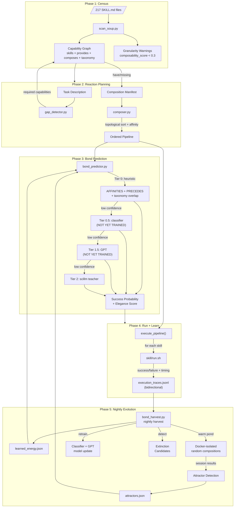

# Skill-Lab v1: Honest Walkthrough

**Date:** 2026-02-16
**Files:** 7 scripts in `scripts/` (~2,800 LOC total), `run.sh` (317 lines), `SKILL.md`
**Status:** Infrastructure complete, cold-start (no warm pond data yet)
**Reviewed by:** Horus Lupercal (Architecture), Margaret Chen (V&V), Brandon Bailey (Knowledge Graph)
**User concerns addressed:** "We don't know if this approach works yet. We will have to test it."

---

## What This System Is

Skill-lab is a **self-composing skill creation engine** modeled on biological
symbiogenesis (Agüera y Arcas BFF paper, arxiv:2406.19108). Instead of building
new skills from scratch, it scans the existing 217 skills, identifies capability
gaps, composes existing skills to fill them, and uses evolutionary pressure (warm
pond simulations, bond prediction, battle competition) to select winners.

The biological metaphor: skills are chemical elements. `provides:` and `composes:`
in SKILL.md frontmatter are their valence shells. Composition is a chemical reaction.
Bond prediction estimates whether two skills will react successfully. The warm pond
is Darwin's primordial soup — randomized experiments that reveal natural affinities.

### The Seven Scripts

| Script | Lines | Role | Analogy |
|--------|-------|------|---------|
| `scan_soup.py` | 302 | Parse all SKILL.md, build capability graph | Census of the soup |
| `gap_detector.py` | ~200 | Decompose task → required capabilities → gaps | Diagnosis |
| `composer.py` | 387 | Build + execute skill pipelines for tasks | Run a reaction |
| `bond_predictor.py` | ~990 | 3-tier cascade predicting bond success | Affinity tables |
| `bond_teacher.py` | ~300 | Scillm-based ground truth labeling | Expert opinion |
| `bond_harvest.py` | ~700 | Warm pond simulations, nightly harvest, attractors | Evolution engine |
| `scaffolder.py` | ~200 | Generate new skill directories from manifests | Assembly |

---

## Why Previous Approaches Failed

### Failure 1: Manual Wiring Breaks

**What we did:** Skills were composed by hand — an agent would write a script that
called `review-pdf/run.sh` then `memory/run.sh learn`, hardcoding the chain.

**Why it failed:** Any change to skill A's interface broke skill B's caller. No
validation that the composition still worked. Silent failures accumulated. The agent
that wired it wasn't the agent that discovered the breakage.

**What skill-lab does instead:** `composer.py` builds pipelines dynamically from the
capability graph. If `extractor` changes its `provides:` list, `scan_soup.py` reflects
that change immediately. The bond predictor estimates whether the new composition works
before executing.

### Failure 2: No Feedback Loop

**What we did:** Skills were created, deployed, and forgotten. No mechanism to learn
which compositions worked vs failed in production.

**Why it failed:** The skill ecosystem grew to 217 skills but nobody knew which
pairings were reliable. The same failing composition would be attempted repeatedly
because there was no institutional memory of failure.

**What skill-lab does instead:** Every pipeline execution logs bidirectional traces
to `execution_traces.jsonl`. The nightly harvest aggregates these into learned energy
costs. Warm pond simulations generate thousands of randomized composition trials.
Over time, the system learns which bonds are strong (covalent) vs weak (van der Waals)
vs impossible.

### Failure 3: Coarse-Grained Skills

**What we did:** Skills grew organically. Some became monoliths — 5,000+ lines of
code with only 1-2 `provides:` entries. They couldn't be meaningfully composed because
they were too big and too specific.

**Why it failed:** In BFF terms, this is the SUBLEQ problem. SUBLEQ is Turing-complete
(one instruction can compute anything), but BFF fails on it because random composition
of too-coarse elements never produces useful results. You need instruction density.

**What skill-lab does instead:** `scan_soup.py` computes `composability_score` for
every skill: `provides_count / max(1, log2(lines_of_code))`. Skills below 0.3 get
flagged as too coarse. The bond predictor applies a +2 ATP penalty to chains containing
coarse skills, steering composition toward finer-grained alternatives.

### Failure 4: No Visibility

**What we did:** Skill composition was invisible. No way to see which skills bonded
well, which were extinction candidates, which compositions the system converged on.

**Why it failed:** Without visibility, you can't steer evolution. You can't debug
failing compositions. You can't identify attractor patterns that should be promoted.

**What skill-lab does instead:** Multiple visibility surfaces:
- `./run.sh bond-stats` — training data statistics
- `./run.sh granularity` — composability score table for all 217 skills
- `./run.sh attractors` — detected convergent compositions
- `./run.sh evolve --status` — health report with extinction candidates
- `./run.sh run --task "..." --json` — elegance scoring for any proposed chain

---

## What v1 Changes (BFF Alignment)

### Change 1: Bidirectional Trace Logging (bond_predictor.py:47-85)

When skills A and B compose, both are modified — A learns from B's output and B
learns from A's input. Previous logging only captured the forward direction.

Now `log_execution_trace()` writes two entries per pair:
- Forward: `extractor+memory` at full weight (1.0)
- Reverse: `memory+extractor` at 0.7x weight

**What this fixes:** Failure 2 (no feedback loop) — captures the full interaction.
**What could still go wrong:** The 0.7x weight for reverse bonds is arbitrary. It
should be learned from data, but we need warm pond data first to calibrate it.
**Honest risk level:** LOW — worst case, reverse bonds are slightly over/under-weighted.

### Change 2: Learnable Energy Model (bond_predictor.py:128-175)

Replaces hand-tuned `ENERGY_COSTS` dict with energy learned from execution traces:
```
energy = log2(mean_latency_ms + 1) + (1 - success_rate) * 5 + len(composes) * 0.3
```

`estimate_skill_energy()` checks `learned_energy.json` first, falls back to
`ENERGY_COSTS` when no trace data exists for a skill.

**What this fixes:** Failure 2 — energy emerges from execution dynamics, not intuition.
**What could still go wrong:** With only 8 traces and 2 skills profiled, the learned
energy is unreliable. The log2(latency) formula may not capture real energy costs for
skills with high setup time but fast execution.
**Honest risk level:** MEDIUM — the fallback to hand-tuned values is safe, but learned
values could mislead the system if traces are too few or skewed.

### Change 3: Attractor Detection (bond_harvest.py:detect_attractors)

Analyzes warm pond simulation sessions to find skill pairs that evolution converges
on reliably: high frequency, cross-session stability, positive convergence trend.

**What this fixes:** Failure 4 (no visibility) — surfaces natural affinities.
**What could still go wrong:** No warm pond data exists yet. The function returns an
empty list. When data does arrive, the min_frequency and min_sessions thresholds are
guesses — they need tuning against real results.
**Honest risk level:** LOW — returns empty gracefully. Risk is in the thresholds once
data flows.

### Change 4: Granularity Checker (scan_soup.py:112-138)

Computes `composability_score` per skill and flags coarse-grained skills.
Bond predictor applies +2 ATP penalty for coarse skills in chain energy.

**What this fixes:** Failure 3 (coarse-grained skills) — quantifies the problem.
**What could still go wrong:** The formula `provides_count / log2(lines_of_code)` is
simplistic. A skill with 10 provides and 10,000 LOC scores 0.75 — acceptable. But a
well-designed monolith might be penalized unfairly. The 0.3 threshold and +2 ATP
penalty are both arbitrary.
**Honest risk level:** LOW — it's a warning, not a blocker. Worst case: some useful
skills get flagged.

### Change 5: Continuous Evolution (bond_harvest.py:register_nightly_evolution)

Registers with `/scheduler` for 3 AM nightly runs. Includes extinction detection:
skills with zero co-occurrence across recent sessions get flagged.

**What this fixes:** BFF principle: system "never settles into a static state."
**What could still go wrong:** Scheduler might not be running. The extinction detector
flags skills as candidates based on co-occurrence, but some skills are correctly
standalone (e.g., `ops-workstation` doesn't compose with anything). False positives.
**Honest risk level:** LOW — extinction is advisory, not automatic deletion.

### Change 6: Elegance Scoring in Composer (composer.py:320-344)

Pipeline selection now computes elegance: `success_probability / (energy + 0.1) * brevity`.
Grades: elegant > efficient > adequate > bloated > wasteful.
`--optimize` flag attempts to shorten bloated chains.

**What this fixes:** Failure 4 (no visibility) — every composition gets a quality score.
**What could still go wrong:** Elegance depends on bond prediction accuracy, which
depends on training data, which is minimal. Early elegance scores are unreliable.
The `_optimize_pipeline()` function only tries removing one skill at a time — it can't
find optimizations that require substituting one skill for another.
**Honest risk level:** MEDIUM — elegance scoring is visible and useful, but could give
false confidence early.

---

## Expert Commentary

### Horus Lupercal — Warmaster, Strategist

> **What I'm satisfied with:**
> - The 3-tier cascade (heuristic → classifier → GPT → teacher) follows the same
>   escalation pattern as a good siege — cheap probes before committing heavy forces.
>   `CascadeRunner` from `common/cascade.py` is battle-tested infrastructure shared
>   across multiple skills. Good engineering discipline.
> - The warm pond's Docker isolation is correct. You don't run evolutionary experiments
>   on your production infrastructure. The security profile (`--cap-drop ALL`,
>   `--read-only`, seccomp) is what I'd specify for a containment zone.
> - Graceful degradation throughout. Missing data returns empty, not crashes. The
>   hand-tuned ENERGY_COSTS dict serving as fallback is the right instinct — you don't
>   abandon your fortifications just because you built better ones.
>
> **What concerns me:**
> - **Single point of failure: `scan_soup.py`.** Everything depends on correctly parsing
>   SKILL.md frontmatter. If a skill has malformed YAML, it silently vanishes from the
>   graph. 217 skills, each with hand-written frontmatter — guaranteed some are wrong.
>   The fallback YAML parser (when PyYAML isn't installed) is naive: it can't handle
>   nested structures, quoted strings with colons, or multiline values properly.
> - **The AFFINITIES dict in composer.py is hand-tuned.** Lines 30-59. This is the exact
>   kind of prescriptive fitness function BFF argues against. You built a learned energy
>   model but left the affinity weights as static constants. These should also be learned.
> - **No circuit breaker in `execute_pipeline()`.** If step 1 of 5 fails, it continues
>   executing steps 2-5. Sometimes you should abort the chain on first failure.
>
> **What I'd watch for in the first hour:**
> - Run `./run.sh scan` and count skills with missing `provides:` fields. If it's over
>   50%, the capability graph is too sparse for meaningful composition.
> - Run `./run.sh granularity` and look at how many skills score below 0.3. If most of
>   the soup is coarse-grained, warm pond simulations will mostly produce failures.

### Margaret Chen — Senior Requirements Engineer (V&V), Pratt & Whitney

> **What I'm satisfied with:**
> - The Definition of Done tests for each BFF alignment task are concrete and verifiable.
>   Task 1's test actually checks that both forward and reverse pairs exist in the trace
>   file. Task 4's test verifies composability_score appears in scan output. This is
>   proper V&V.
> - The sanity.sh cascade now has 8 checks covering all new features. The checks are
>   functional (they run the commands and parse output) not just structural (file exists).
> - The `composability_score` formula is documented with its derivation. I can trace
>   why a score of 0.3 was chosen as the threshold (though I'd want data to validate it).
>
> **What concerns me:**
> - **No regression testing.** You added bidirectional traces, learned energy, attractors,
>   granularity, and elegance scoring — but there are no pytest unit tests. The sanity.sh
>   checks are integration-level. If `log_execution_trace()` silently corrupts the JSONL
>   format, nothing catches it until downstream consumers fail.
> - **The 0.7x reverse weight is undocumented rationale.** In DO-178C terms, this is a
>   derived requirement with no traceability. Why 0.7? Not 0.5 or 0.9? The system will
>   learn better values eventually, but the initial value biases the learning.
> - **`bond_metrics.jsonl` grows unbounded.** No rotation, no archival. After months of
>   nightly harvests, this file will be enormous. Same for `execution_traces.jsonl`.
>
> **What I'd watch for in the first hour:**
> - Verify `learned_energy.json` has a `timestamp` field and isn't overwritten on every
>   single pipeline execution (it should only update during nightly harvest).
> - Check that the 137 granularity warnings actually make sense — manually inspect 5-10
>   flagged skills and confirm they're genuinely too coarse.

### Brandon Bailey — SPARTA Knowledge Graph / D3FEND

> **What I'm satisfied with:**
> - The capability graph structure in `scan_soup.py` is correct graph modeling:
>   nodes (skills), edges (composes), properties (provides, taxonomy). This maps cleanly
>   to ArangoDB's document-edge model if you ever want to persist it beyond JSON.
> - The taxonomy integration — skills with overlapping `taxonomy:` tags can discover
>   each other even without explicit `composes:` edges. This is the same multi-hop
>   traversal pattern we use in SPARTA for CWE→D3FEND connections.
> - The attractor detection is a good signal. In SPARTA terms, these are "frequently
>   co-cited" controls — pairs that practitioners apply together. Worth surfacing.
>
> **What concerns me:**
> - **`gap_detector.py` uses keyword matching to decompose tasks.** The `CAPABILITY_KEYWORDS`
>   dict maps words like "extract" → "extraction", "scan" → "security-scanning". This is
>   brittle. "Extract the key findings" maps to "extraction" (correct) but "extract a
>   tooth" would too (wrong). There's no semantic understanding of task context.
> - **The capability vocabulary is implicit.** `provides:` values are free-text strings
>   across 217 SKILL.md files. There's no controlled vocabulary, no ontology. Two skills
>   might provide "pdf-extraction" and "pdf-extract" — these won't match. The graph
>   depends on consistent naming that nobody enforces.
> - **No provenance tracking on compositions.** When a pipeline runs, the trace logs
>   skills and success/failure, but not the actual capability requirements that led to
>   that pipeline. You can't ask "why was this skill included?" after the fact.
>
> **What I'd watch for in the first hour:**
> - Run `./run.sh scan --json | jq '.capabilities | keys | length'` and compare to the
>   number of unique `provides:` values. If there's significant duplication or near-misses,
>   the graph has naming inconsistency problems.
> - Check how many skills have both `provides:` AND `composes:` — skills with only one
>   or neither can't participate in composition. They're dark matter in the soup.

---

## Data Flow Diagram



---

## Risk Matrix

| Change | Fixes | Risk | Observable Failure |
|--------|-------|------|--------------------|
| Bidirectional traces | No feedback loop | LOW | Reverse pairs missing from JSONL |
| Learned energy | Hand-tuned bias | MEDIUM | Energy values wildly different from reality after first harvest |
| Attractor detection | No visibility | LOW | Empty results forever (no warm pond runs) |
| Granularity checker | Coarse skills | LOW | Good skills flagged as coarse (false positive) |
| Continuous evolution | Static system | LOW | Scheduler not running, no nightly harvests |
| Elegance scoring | No quality signal | MEDIUM | Misleading grades due to sparse training data |
| `_optimize_pipeline()` | Bloated chains | LOW | Only removes redundant skills, can't substitute |

---

## Remaining Risks (Honest Assessment)

### Risk 1: Cold Start is the Real Test (HIGH)

The entire learning loop depends on data that doesn't exist yet:
- `warm_pond/` — 0 sessions (need 200+ for meaningful attractors)
- `attractors.json` — doesn't exist
- `shadow_log.jsonl` — doesn't exist
- Classifier models — 0 trained
- `learned_energy.json` — 2 skills profiled out of 217

The system degrades gracefully (falls back to heuristics), but the question is:
**does the learning actually improve predictions once data flows?** We literally
cannot know until we run the warm pond.

**Mitigation:** Run `./run.sh warm-pond --iterations 50 --no-docker` as a quick
local test. If the learned energy values after 50 iterations make more sense than
the hand-tuned ones, the approach works.

### Risk 2: Gap Detector Keyword Matching (MEDIUM)

`gap_detector.py` uses a `CAPABILITY_KEYWORDS` dict to map task descriptions to
capabilities. This is the weakest link in the chain. "Extract tables from PDF" works.
"Pull the data out of this document" probably doesn't match anything.

**Mitigation:** The LLM decomposition path (when available) handles natural language
better. The keyword dict is a fast fallback, not the primary decomposition method.

### Risk 3: Affinity Table is Still Hand-Tuned (MEDIUM)

The AFFINITIES dict in `composer.py` lines 30-59 contains hand-tuned weights like
`("extractor", "memory", 0.8)`. These were the user's concern about "manual wiring
breaks." We added learned energy for costs but left affinities static.

**Why this is the same problem:** If someone adds a new skill that composes beautifully
with `extractor`, it won't appear in AFFINITIES until a human adds it. The warm pond
should eventually generate learned affinities, but the infrastructure to replace the
static dict isn't wired yet.

**Mitigation:** Once warm pond data flows, `detect_attractors()` provides the learned
equivalent. But the composer doesn't yet USE attractors to override AFFINITIES.

### Risk 4: No Unit Tests (MEDIUM)

All 7 scripts have zero pytest tests. Sanity.sh provides integration-level smoke tests
(8 checks), but no unit tests for individual functions. If `_topological_sort()` has an
edge case with cycles, or `log_execution_trace()` produces malformed JSON, nothing
catches it until production.

**Mitigation:** The DoD tests from the orchestration tasks serve as basic regression
tests. But they test happy paths only.

---

## What Success Looks Like

| Metric | Healthy | Warning | Sick |
|--------|---------|---------|------|
| Skills with `provides:` | >80% (>170) | 50-80% | <50% |
| Execution traces | Growing daily | Static | Shrinking/corrupt |
| Learned energy skills | >50 profiled | 10-50 | <10 |
| Warm pond sessions | >10 | 1-10 | 0 |
| Attractor compositions | >5 detected | 1-5 | 0 |
| Cascade tier distribution | Mostly T0, some T0.5 | All T0 | All fallback |
| Granularity warnings | <30% of skills | 30-60% | >60% |
| Elegance scores | Spread across grades | All "adequate" | All "wasteful" |

---

## How to Launch / Monitor / Kill

```bash
# Quick health check
cd /home/graham/workspace/experiments/pi-mono/.pi/skills/skill-lab
bash sanity.sh

# See the soup
./run.sh scan
./run.sh scan --json | python3 -c "import sys,json; g=json.load(sys.stdin); print(f'Skills: {g[\"stats\"][\"total_skills\"]}  Caps: {g[\"stats\"][\"total_capabilities\"]}  Edges: {g[\"stats\"][\"total_edges\"]}')"

# Check granularity (how many skills are too coarse?)
./run.sh granularity

# Test a composition
./run.sh run --task "extract PDF and store to memory" --json

# Bootstrap warm pond (LOCAL, no Docker — quick test)
./run.sh warm-pond --iterations 10 --no-docker

# Full warm pond (Docker-isolated, overnight)
./run.sh warm-pond --iterations 200

# Detect attractors
./run.sh attractors --json

# Register nightly evolution
./run.sh evolve

# Check evolution health
./run.sh evolve --status

# Full nightly harvest (traces + warm pond + retrain)
./run.sh harvest
```

---

## Bottom Line

**Will it work?** We genuinely don't know yet — and that's the honest answer. The
infrastructure is solid: 7 scripts, ~2,800 LOC, 3-tier cascade from battle-tested
`common/cascade.py`, Docker isolation for warm pond, graceful degradation everywhere.
The BFF alignment adds real improvements: bidirectional traces, learned energy, attractor
detection, granularity awareness, elegance scoring.

But the system is in cold-start. Zero warm pond sessions. Two skills profiled out of
217. No classifier trained. The learning loop exists in code but hasn't been exercised.

**What's genuinely different this time?**
1. Skills discover each other through capability graphs instead of hardcoded wiring
2. Composition quality is measured (elegance scoring) instead of invisible
3. Failure data feeds back into bond prediction instead of being forgotten
4. Coarse-grained skills are identified and penalized instead of silently failing
5. The system is designed to improve overnight via scheduled evolution

**What's the same?**
- AFFINITIES dict is still hand-tuned (learned affinities not wired into composer yet)
- Gap detector still uses keyword matching as primary decomposition
- No unit tests — relying on integration-level sanity checks
- The 0.7x reverse weight, 0.3 granularity threshold, and +2 ATP penalty are all
  arbitrary constants awaiting empirical validation

**The test:** Run 50 warm pond iterations. If learned energy values are more predictive
than hand-tuned ones, and if attractor compositions match intuition (e.g., extractor →
memory appearing as a strong attractor), then the BFF approach works. If learned values
are random noise, the biological metaphor is just a narrative and we should simplify.
