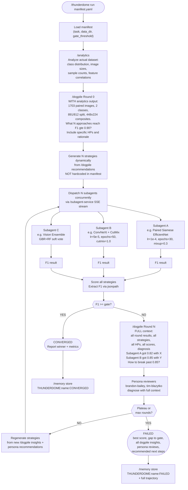

# /thunderdome Architecture

```mermaid
flowchart TD
    START(["/thunderdome run manifest.yaml"]) --> LOAD["Load manifest<br/>(task, data_dir, gate_threshold)"]

    LOAD --> ANALYTICS["/analytics<br/>Analyze actual dataset:<br/>class distribution, image sizes,<br/>sample counts, feature correlations"]

    ANALYTICS --> DOGPILE_0["/dogpile Round 0<br/>WITH analytics output:<br/>1703 paired images, 2 classes,<br/>891/812 split, 448x224 composites.<br/>What N approaches reach F1 gte 0.90?<br/>Include specific HPs and rationale"]

    DOGPILE_0 --> GENERATE["Generate N strategies dynamically<br/>from /dogpile recommendations<br/>NOT hardcoded in manifest"]

    GENERATE --> DISPATCH["Dispatch N subagents concurrently<br/>via /subagent-service SSE stream"]

    DISPATCH --> SA1["Subagent A<br/>e.g. Paired Siamese EfficientNet<br/>lr=1e-4, epochs=30, mixup=0.3"]
    DISPATCH --> SA2["Subagent B<br/>e.g. ConvNeXt + CutMix<br/>lr=5e-5, epochs=50, cutmix=1.0"]
    DISPATCH --> SA3["Subagent C<br/>e.g. Vision Ensemble<br/>GBR+RF soft vote"]

    SA1 --> R1["F1 result"]
    SA2 --> R2["F1 result"]
    SA3 --> R3["F1 result"]

    R1 --> SCORE["Score all strategies<br/>Extract F1 via jsonpath"]
    R2 --> SCORE
    R3 --> SCORE

    SCORE --> GATE{{"F1 >= gate?"}}

    GATE -->|YES| SUCCESS(["CONVERGED<br/>Report winner + metrics"])

    GATE -->|NO| DOGPILE_N["/dogpile Round N<br/>FULL context:<br/>all round results, all strategies,<br/>all HPs, all scores, diagnosis<br/>Subagent A got 0.82 with X<br/>Subagent B got 0.85 with Y<br/>How to break past 0.85?"]

    DOGPILE_N --> PERSONA["Persona reviewers<br/>brandon-bailey, tim-blazytko<br/>diagnose with full context"]

    PERSONA --> PLATEAU{{"Plateau or<br/>max rounds?"}}

    PLATEAU -->|NO| REGENERATE["Regenerate strategies<br/>from new /dogpile insights +<br/>persona recommendations"]
    REGENERATE --> DISPATCH

    PLATEAU -->|YES| FAIL(["FAILED<br/>best score, gap to gate,<br/>all dogpile insights,<br/>persona reviews,<br/>recommended next steps"])

    SUCCESS --> MEMORY_OK["/memory store<br/>THUNDERDOME:name:CONVERGED"]
    FAIL --> MEMORY_FAIL["/memory store<br/>THUNDERDOME:name:FAILED<br/>+ full trajectory"]
```
