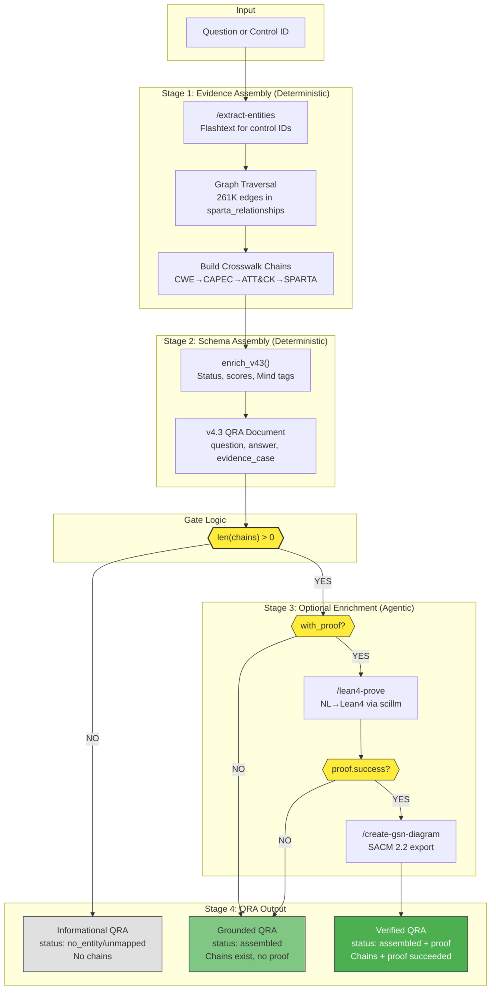

# /create-evidence-case v4.3: Standards-Constrained QRA Generation Pipeline

**Date:** 2026-04-12  
**Files:** `daemon_client.py` (500 lines), `SKILL.md`  
**Status:** Production-tested (scale), not validated (correctness)  
**Reviewed by:** Brandon Bailey (SPARTA Security Analyst, The Aerospace Corporation)

---

## What This Skill Does

Generates **candidate Question-Reasoning-Answer (QRA) artifacts** from heterogeneous project evidence using deterministic retrieval and graph-based crosswalk assembly. QRAs can optionally be enriched with formal proofs and SACM references before storage.

**The system's product is a QRA artifact with explicit status fields**, not a match and not a proof.

**Pipeline stages (current implementation):**
1. **Evidence assembly** — entity extraction + graph traversal (deterministic)
2. **Schema assembly** — build v4.3 QRA document with status/scores/Mind tags (deterministic)
3. **Optional enrichment** — formal proof via Lean4, SACM export (agentic, gated)
4. **Storage** — persist to `sparta_qra` collection with `review_status: "pending"`

**Human blessing is a separate workflow** — not part of this pipeline. QRAs start as `pending` and can be promoted to `approved` by human review.

---

## Status Fields (Distinct, Not Conflated)

The walkthrough previously conflated "validated" across multiple meanings. These are now explicit:

| Field | Values | Meaning |
|-------|--------|---------|
| `status` | `no_entity`, `unmapped`, `assembled`, `error` | Assembly outcome — did chains exist? |
| `formal_proof.success` | `true`, `false`, `null` | Proof outcome — did Lean4 succeed? |
| `review_status` | `pending`, `approved`, `rejected` | Human review state |

**Key insight:** A QRA with `status: assembled` and `review_status: pending` is **generated and assembled**, but NOT yet **human-blessed**. Only `review_status: approved` makes it trusted grounding.

---

## Trust Boundary

Trust enters the system **only** at `review_status: approved`.

- Generated, assembled, or proof-bearing QRAs are **not trusted grounding** until human-approved
- Approved QRAs may require **re-review** when upstream evidence, graph state, or derived lemmas change
- The approval mechanism (who can approve, what checklist, whether one reviewer is enough) is **not defined by this pipeline** — it is a workflow concern external to `/create-evidence-case`

**Lifecycle gap:** The current system does not automatically invalidate approvals when source evidence changes. This is a known limitation. See "Freshness / Revalidation Policy" below.

---

## Freshness / Revalidation Policy

**Current state:** Lineage tracking is now implemented. QRAs record dependencies via the `lineage` field, enabling future staleness detection.

**Known staleness triggers:**

| Event | Impact | Current Handling |
|-------|--------|------------------|
| Graph edge added/removed | Crosswalk chains may change | **Tracked** — `lineage.graph_edges` records edge IDs |
| Source document updated | Entity extraction may change | **Tracked** — `lineage.source_hash` records content hash |
| Embedding model changed | Recall scores may change | **Planned** — not yet in lineage |
| Lemma breaks in continuous layer | Downstream reasoning may be invalidated | **Planned** — no cascade notification yet |
| SPARTA control retired/deprecated | QRA may reference stale control | **Tracked** — `lineage.control_ids` records referenced controls |

**What's now implemented:**

1. **Lineage tracking** — Every QRA records dependencies in the `lineage` field (see schema below)
2. **Batch backfill** — `staleness_detector.py backfill-lineage` populates lineage for existing QRAs
3. **Server-side filtering** — `/list` with `filters={"lineage": null}` finds QRAs missing lineage

**What remains (target state):**

1. **Change detection** — When a dependency changes, mark dependent QRAs as `review_status: stale`
2. **Cascade notification** — Alert reviewers when approved QRAs become stale
3. **Re-review queue** — Surface stale QRAs for human re-approval or rejection
4. **Auto-demote threshold** — If N dependencies change within M days, auto-demote to `pending`

**Risk:** An approved QRA may be used as grounding by downstream agents even after its source evidence no longer supports it. Lineage tracking provides the foundation for detecting this, but cascade notification is not yet implemented.

---

## Lineage Schema

Every QRA now includes a `lineage` field recording its dependencies:

```json
{
  "lineage": {
    "graph_edges": ["e_cwe79_capec86", "e_capec86_t1059"],
    "control_ids": ["CWE-79", "CAPEC-86", "T1059", "SV-AC-2"],
    "source_hash": "a7f3b2c1...",
    "assembled_at": "2026-04-12T18:30:00Z",
    "chain_count": 3,
    "hop_depth": 2
  }
}
```

| Field | Type | Description |
|-------|------|-------------|
| `graph_edges` | list[str] | Edge IDs from `sparta_relationships` used in chains |
| `control_ids` | list[str] | All control IDs referenced (CWE, CAPEC, ATT&CK, SPARTA) |
| `source_hash` | str | SHA256 of source question + control context |
| `assembled_at` | str | ISO 8601 timestamp of assembly |
| `chain_count` | int | Number of crosswalk chains |
| `hop_depth` | int | Maximum hop depth across all chains |

**Staleness detection query** (future):
```aql
FOR qra IN sparta_qra
  LET stale_edges = (
    FOR edge_id IN qra.lineage.graph_edges
      LET edge = DOCUMENT(CONCAT("sparta_relationships/", edge_id))
      FILTER edge == null OR edge.updated_at > qra.lineage.assembled_at
      RETURN edge_id
  )
  FILTER LENGTH(stale_edges) > 0
  RETURN {_key: qra._key, stale_edges}
```

---

## Lineage Backfill Operations

The `staleness_detector.py` script manages lineage backfill for existing QRAs.

### Commands

```bash
# Check how many QRAs are missing lineage
python staleness_detector.py backfill-lineage --limit 100 --dry-run

# Run backfill on a batch
python staleness_detector.py backfill-lineage --limit 25000 --execute

# Monitor progress
tail -f /tmp/lineage_backfill.log
```

### Batch Processing Strategy

**Why batches?** The `sparta_qra` collection contains ~225K documents. Loading all at once causes:
- Memory pressure on the daemon (502 errors at ~27K docs)
- Timeout on `/list` requests
- Risk of partial failures losing progress

**Recommended batch size:** 25,000 documents per batch

**Full backfill schedule:**
- 9 batches × 25K = 225K QRAs
- ~3 hours per batch at 2 docs/sec
- Total: ~27 hours for full backfill

### Progress Tracking

Each batch logs progress to `/tmp/lineage_backfill.log`:
```
2026-04-12 18:53:35 | INFO | Lineage backfill: batch_size=100, max_docs=25000, dry_run=False
2026-04-12 18:56:58 | INFO | 25000 QRAs missing lineage
2026-04-12 19:02:00 | INFO | Processed 5000/25000 (20%)
```

### Lessons Learned: /memory /list Anti-Patterns

The lineage backfill exposed several anti-patterns in `/memory` usage:

| Anti-Pattern | Symptom | Fix |
|--------------|---------|-----|
| **Client-side filtering** | Load all docs, filter in Python | Use `filters` param for server-side filtering |
| **Missing field filter** | `filters={"lineage": null}` returns 0 | AQL uses `!HAS(doc, 'field')` for missing fields |
| **Unbounded /list** | 502 timeout fetching 225K docs | Batch with `limit` and `offset` |
| **Load-all-then-process** | OOM on large result sets | Process each batch immediately |

**Correct pattern for missing-field queries:**
```python
# Server-side filter for missing lineage (daemon handles HAS() vs null)
resp = client.post("/list", json={
    "collection": "sparta_qra",
    "limit": 500,
    "offset": 0,
    "filters": {"lineage": None}  # None means "missing or null"
})
```

### /memory Misuse Guard

The `/memory` daemon now includes a misuse guard (`_misuse_guard.py`) that:
1. Logs large result sets (>25K matching docs) to `misuse_events` collection
2. Warns but does not block — callers must handle pagination responsibly
3. Enables `/monitor-misuse` to detect and propose corrections

**Misuse event logged:**
```json
{
  "_key": "abc123...",
  "skill": "memory",
  "endpoint": "/list",
  "error_type": "large_result_set",
  "sent_value": "collection=sparta_qra total=225000",
  "correct_value": "Process in streaming batches, not load-all-then-process",
  "ts": 1712951615
}
```

---

## Four Levels (Conceptual Model)

| Level | How Achieved | Current System? |
|-------|--------------|-----------------|
| **Generated** | Pipeline produced it | Yes — `status` field set |
| **Enriched** | Proof/SACM attempted | Yes — `formal_proof`, `sacm_ref` fields |
| **Human-blessed** | Person approved it | Via workflow — `review_status: approved` |
| **Authoritative** | Safe as final truth | **No** — system cannot claim this |

You may have the first three without honestly claiming the fourth.

---

## What This Output Cannot Establish

The evidence case **cannot** establish:

- **Control sufficiency** — that a control fully addresses a weakness
- **Requirement satisfaction** — that an engineering requirement is met
- **Mitigation completeness** — that all attack paths are blocked
- **Certification compliance** — that DO-178C/ISO 26262 obligations are fulfilled
- **Operational effectiveness** — that deployed controls work in practice

The evidence case provides **QRA artifacts with explicit status fields for human review**, not automated compliance judgment.

---

## What a Chain Means

A path like `CWE-79 → CAPEC-86 → T1059 → SV-MA-1` means:

- These entities are **reachable** in the knowledge graph
- The edges represent **documented relationships** from MITRE sources
- Edges have a `method` field indicating **provenance** (e.g., "curated:CAPEC_Related_Weaknesses", "curated:ATT&CK_Technique_Mapping")

This does **NOT** automatically mean:
- The requirement is satisfied
- The control mitigates the weakness
- The chain is a valid justification for compliance

**Why not?** Edges record **provenance** (where the relationship came from), not **semantic type** (what the relationship means). There is no `relationship_type` field — only `method`. Multi-hop traversal establishes **reachability**, not **typed entailment**.

**Current state:** 261K edges with provenance methods but no formal composition algebra. The chains are evidence of documented connections, not proofs of semantic relationships.

---

## How It Works (Exact Pipeline)

### Entry Points

| Function | Use Case | Speed |
|----------|----------|-------|
| `assemble_evidence(question)` | General question, entity extraction needed | ~500ms |
| `assemble_evidence_fast(source_id)` | Known control ID (e.g., "CWE-287") | ~50ms |
| `create_qra(question, ...)` | Full pipeline: assemble → enrich → store | ~600ms |
| `enrich_evidence_case(qra, ...)` | Add proof/SACM to existing QRA | ~5-60s |

### Step 1: Entity Extraction (Deterministic)

**Input:** Question text (e.g., "How does CWE-79 relate to SPARTA countermeasures?")

**Process:** Daemon `/extract-entities` endpoint:
1. **Flashtext** — O(n) keyword extraction for control IDs (CWE-79, CAPEC-86, T1059, SV-AC-2)
2. Returns `glossary[]` with `{id, framework, description}` per entity

**Output:** `glossary: [{id: "CWE-79", framework: "CWE", description: "..."}]`

### Step 2: Graph Traversal (Deterministic)

**Input:** Extracted entity IDs

**Process:** Daemon traverses `sparta_relationships` edges:
1. For each entity, find outbound edges to related entities
2. Edges have `method` field indicating provenance (e.g., "curated:CAPEC_Related_Weaknesses")
3. Build BFS paths from source entity to SPARTA countermeasures

**Output:** `crosswalk_chains: [{source: "CWE-79", hops: [...], method: "curated:..."}]`

### Step 3: QRA Recall (Optional)

**Input:** Question text

**Process:** Daemon `/recall` against `sparta_qra` collection:
1. BM25 lexical match + cosine similarity (embedding service at :8602)
2. Returns prior QRAs that match the question semantically

**Output:** `prior_qra_evidence: [{question, answer, scores}]`

### Step 4: Schema Assembly (enrich_v43)

**Input:** Raw evidence from steps 1-3

**Process:** `daemon_client.enrich_v43()`:
1. **Status determination:**
   - `error` — daemon returned error
   - `no_entity` — glossary is empty
   - `unmapped` — glossary exists but no crosswalk chains
   - `assembled` — chains exist
2. **Score calculation:**
   - `retrieval_score` — from daemon (BM25 + cosine)
   - `chain_density` — `min(1.0, len(chains) * 0.2)`
3. **Mind tag extraction** — SPARTA technique prefixes → Mind tags (DE- → Detect, EX- → Exploit, etc.)
4. **Difficulty classification:**
   - `single_hop` — no chains or single direct edge
   - `multi_hop` — chains with 2 hops
   - `synthesis` — chains with >2 hops

**Output:** v4.3 QRA document ready for storage

### Step 5: Gate Logic (Before Expensive Operations)

```python
chains = evidence_case.get("chains") or []
has_chains = len(chains) > 0
if with_proof and evidence_case.get("formal_proof") is None and has_chains:
    # Only then call lean4-prove
```

**Why this matters:**
- Lean4 proofs cost ~$0.01-0.05 per call (scillm tokens)
- Without the gate, 218K QRAs × $0.03 = $6,540 wasted on non-assembled cases
- The gate ensures proofs only run when chains provide something to formalize

### Step 6: Formal Proof (Optional, Agentic)

**Input:** `requirement` field from QRA

**Process:** `prove_requirement()` calls lean4-prove-service at :8604:
1. NL→Lean4 translation via scillm
2. Lean4 compilation with tactic search
3. Returns `{success, code, attempts, errors}`

**Output:** `formal_proof: {success: true/false, code: "...", proved_at: timestamp}`

### Step 7: SACM Export (Optional, Deterministic)

**Input:** `source_control_id` from QRA

**Process:** `generate_sacm_ref()` calls `/create-gsn-diagram/run.sh export-sacm`:
1. Builds Goal Structuring Notation node for the control
2. Returns XML snippet conforming to OMG SACM 2.2

**Output:** `sacm_ref: {gid: "G_CWE-79", xml_snippet: "...", generated_at: timestamp}`

### Step 8: Storage (Optional)

**Input:** Enriched QRA document

**Process:** `store()` calls daemon `/store` with `collection="sparta_qra"`

**Output:** Document persisted with `_key` derived from `question|source_control_id`

---

## Data Flow Diagram



---

## Status Codes (Current Implementation)

Status is separate from `evidence_case` presence. Every response includes both.

| Status | Meaning | evidence_case.chains | Implementation |
|--------|---------|---------------------|----------------|
| `no_entity` | No recognizable control ID or term extracted | `[]` | Current |
| `unmapped` | Entity found but no edges exist in graph | `[]` | Current |
| `assembled` | Chains constructed successfully | `[...]` | Current |
| `error` | Service or assembly failure | `[]` or `null` | Current |

**Note:** Earlier versions documented `partial_chain` and `threshold_suppressed` statuses. These do not exist in the current implementation — chains either exist (`assembled`) or don't (`unmapped`).

**Schema:**

```json
{
  "status": "assembled",
  "evidence_case": {
    "chains": [...],
    "formal_proof": null,
    "sacm_ref": null
  },
  "scores": {
    "retrieval_score": 0.71,
    "chain_density": 0.42
  }
}
```

For non-assembled cases:

```json
{
  "status": "unmapped",
  "evidence_case": {
    "chains": [],
    "formal_proof": null,
    "sacm_ref": null
  },
  "scores": {
    "retrieval_score": 0.0,
    "chain_density": 0.0
  }
}
```

**Note:** `confidence` has been split into `retrieval_score` (BM25 + cosine) and `chain_density` (edge coverage). There is no `match_confidence` because calibrated matching confidence does not exist.

---

## Gate Logic

The gate at `daemon_client.py` prevents wasted LLM calls:

```python
chains = evidence_case.get("chains") or []
has_chains = len(chains) > 0

if with_proof and evidence_case.get("formal_proof") is None and has_chains:
    # Only then call lean4-prove
```

**Why this matters:**
- Lean4 proofs cost ~$0.01-0.05 per call (scillm tokens)
- Without the gate, 218K QRAs × $0.03 = $6,540 wasted on non-assembled cases
- The gate ensures proofs only run when chains provide something to formalize

---

## Lean4 Proofs: What They Actually Prove

The Lean4 proof checks a **formal proposition derived from the assembled evidence case**.

Example derived proposition:
> "If edge E1 connects CWE-79 to CAPEC-86, and edge E2 connects CAPEC-86 to T1059, then T1059 is transitively reachable from CWE-79 via the composition of E1 and E2."

This proves **logical consistency of the derived proposition**, not:
- That the NL→Lean translation is correct
- That the claim text is satisfied in the real world
- That the control actually mitigates the weakness
- That the edge composition supports the intended claim type

**Note:** The field containing the text to prove is called `requirement` in the schema (for historical reasons), but this does NOT mean the system proves requirement satisfaction. The name is misleading — it should be understood as "claim_text" or "formalization_target."

**Vacuity risk:** A theorem can be provable for bad reasons (over-strong assumptions, mistranslation, trivialization). No vacuity check is currently implemented.

---

## Provenance Fields

Each evidence case records (implementation status marked):

| Field | Description | Status |
|-------|-------------|--------|
| `graph_version` | Version of sparta_relationships graph | **Planned** — currently `"unknown"` |
| `traversal_method` | Algorithm used (bfs, dfs, weighted) | Current — defaults to `"bfs"` |
| `assembled_at` | ISO 8601 assembly timestamp | Current |
| `service_version` | daemon_client.py version | **Planned** — not yet populated |
| `translator_version` | NL→Lean prompt version (if proof requested) | **Planned** — not yet populated |
| `proof_checker_version` | Lean4 version | **Planned** — not yet populated |
| `proof_artifact_hash` | SHA256 of proof output | **Planned** — not yet populated |

**Note:** Fields marked "Planned" exist in the schema but are not populated by the current daemon. They will show default values until upstream is updated.

---

## Three-Tier Output Architecture

| Tier | Status | Fields Set | Use Case |
|------|--------|------------|----------|
| **Informational** | `no_entity`, `unmapped` | `status` only | Lookups, explanations — no chains exist |
| **Grounded** | `assembled`, `formal_proof: null` | `status`, `chains`, `scores` | Evidence review — chains exist, no proof |
| **Verified** | `assembled`, `formal_proof: {success: true}` | All above + `formal_proof`, `sacm_ref` | Proof succeeded — full enrichment |

**"Verified" means:** A derived formal proposition succeeded in Lean4. It does **not** mean the underlying engineering claim is established. The proof checks logical consistency of the formalized statement, not real-world satisfaction.

**Key distinctions:**
- All three tiers are **Generated** (pipeline produced them)
- Grounded outputs are **Assembled** (chains/scores populated)
- Verified outputs are **Enriched** (formal proof and/or SACM fields populated)
- None are **Human-blessed** — that requires `review_status: approved`
- None are **Authoritative** — the system cannot claim final truth

**Grounded can exist without proof.** The data flow shows proof is optional, not required for Grounded status.

**Key insight:** Informational status is NOT a failure — it's a deterministic signal about graph state. Agents should not retry or escalate.

---

## Expert Commentary

**Brandon Bailey** — SPARTA Security Analyst, The Aerospace Corporation

> **What I'm satisfied with:**
> - CWE→CAPEC→ATT&CK→SPARTA chain follows MITRE's documented relationships
> - Deterministic-first approach (flashtext for control IDs) before expensive LLM ops
> - Three-tier output gives operators clear triage levels
> - Gate logic prevents wasted calls on informational-only queries
>
> **What concerns me:**
> - The ATT&CK→SPARTA hop is sparse — not all ATT&CK techniques have SPARTA mappings
> - Agents might misinterpret "Informational" as "invalid" when it just means "no crosswalk chain"
> - Lean4 proofs are semantic approximations, not actual functional entailment
> - Multi-hop chains establish reachability, not typed entailment
>
> **What I'd watch for in the first hour:**
> - Agents calling `enrich_evidence_case(with_proof=True)` for every QRA
> - Confusing retrieval_score with correctness
> - Rate limits on scillm affecting lean4-prove availability

---

## Standards Inspiration (Not Compliance)

The architecture is **inspired by** patterns in:

| Standard | Pattern Borrowed |
|----------|------------------|
| **DO-178C/DO-333** | Separation of traceability from verification |
| **ISO 26262 Part 6** | Refinement checking concept (clause 6.4.7) |
| **OMG SACM 2.2** | Self-contained evidence packages |
| **NIST OSCAL** | Crosswalk structure with method attribution |

**This is NOT certification-grade tooling.** No tool qualification, review workflow, or human signoff process is defined. The system provides evidence material, not compliance determination.

---

## What Would Be Needed for Requirement Matching

To claim "requirement-to-control matching," you would need:

1. **Requirement parsing** — extract subject/action/object/constraints/modality (shall, must, may not)
2. **Obligation semantics** — typed comparison between requirement claims and control claims
3. **Edge composition rules** — formal algebra specifying which edge sequences support which claim types
4. **Coverage judgment** — gap analysis showing which requirement aspects are/aren't addressed
5. **Calibrated confidence** — probabilistic score with known precision/recall characteristics
6. **Gold-standard evaluation** — hand-labeled pairs with inter-rater agreement metrics

**Relative to authoritative requirement-to-control matching**, the current system provides the evidence-gathering and QRA-construction foundation; typed obligation matching and calibrated coverage judgment remain future work.

---

## Risk Matrix

| Issue | Severity | Observable Signal |
|-------|----------|-------------------|
| Overclaiming proof semantics | HIGH | Lean4 success interpreted as claim satisfaction |
| Unbounded /list calls | HIGH | 502 timeout, daemon OOM at ~27K docs |
| Edge composition misread | MEDIUM | Multi-hop chain treated as entailment |
| Status collapse | MEDIUM | `no_entity` vs `unmapped` both return empty chains |
| Stale lineage not detected | MEDIUM | QRA used after upstream edge deleted |
| Sparse ATT&CK→SPARTA | LOW | `unmapped` status even for ATT&CK techniques |
| lean4-prove rate limited | LOW | `formal_proof: {error: "timeout"}` |
| Batch backfill partial failure | LOW | Lineage populated for subset of QRAs |

---

## What Success Looks Like

| Metric | Healthy | Warning | Sick |
|--------|---------|---------|------|
| Informational → proof calls | 0% | >5% | >20% |
| Lean4 proof success rate | >80% | 50-80% | <50% |
| SACM export success rate | >90% | 70-90% | <70% |
| Evidence assembly time | <500ms | 500ms-2s | >2s |
| QRAs with lineage | >95% | 80-95% | <80% |
| Lineage backfill rate | >2/sec | 0.5-2/sec | <0.5/sec |
| /list batch size | ≤500 | 500-5000 | >5000 |

**Note:** "218K QRAs processed" is a scale metric, not a validation metric. Precision, recall, and human acceptance rate are not measured.

### Lineage Coverage Query

```bash
# Check lineage coverage
python staleness_detector.py backfill-lineage --limit 1 --dry-run 2>&1 | grep "QRAs missing lineage"
```

---

## How to Launch / Monitor / Kill

```bash
# Test single evidence assembly
cd ~/.claude/skills/create-evidence-case
python3 -c "from daemon_client import assemble_evidence; print(assemble_evidence('CWE-79'))"

# Check lean4-prove service
curl -s http://127.0.0.1:8604/health | jq

# Monitor scillm rate limits
curl -s http://localhost:4001/v1/scillm/stats | jq '.rate_limits'

# Check memory daemon
curl --unix-socket /run/user/1000/embry/memory.sock http://localhost/health | jq

# --- Lineage Backfill Operations ---

# Check how many QRAs need lineage backfill
python staleness_detector.py backfill-lineage --limit 1 --dry-run

# Run lineage backfill batch (25K recommended)
nohup python -u staleness_detector.py backfill-lineage --limit 25000 --execute \
  > /tmp/lineage_backfill.log 2>&1 &
echo "Started: PID $!"

# Monitor backfill progress
tail -f /tmp/lineage_backfill.log

# Check for 502 errors (daemon overload)
grep -c "502" /tmp/lineage_backfill.log

# Kill runaway backfill
pkill -f "staleness_detector.py backfill-lineage"
```

---

## Bottom Line

**What this system does:** Generates QRA artifacts from heterogeneous project evidence using deterministic retrieval and graph-based crosswalk assembly. QRAs can optionally be enriched with formal proofs. Human review determines what becomes trusted grounding.

**The system's product is a QRA artifact with explicit status fields**, not a match and not a proof.

**What this system does not do:** Match requirements to controls with obligation semantics, prove claim satisfaction, or establish certification compliance.

**What's genuinely useful:**
1. Multi-stage QRA construction at scale (218K processed)
2. Explicit status fields: `status`, `formal_proof.success`, `review_status`
3. Gate logic preventing wasted LLM calls on informational-only queries
4. Structured QRA artifacts that serve as grounding constraints for downstream agents

**The human blessing workflow:**
- QRAs start with `review_status: "pending"` (generated, not yet reviewed)
- Human review can promote to `review_status: "approved"` (human-blessed)
- Human-blessed QRAs become trusted grounding material for downstream agents
- Agents using these QRAs are constrained by them (anti-hallucination scaffolding)

**What's the same risk it always was:**
- Sparse ATT&CK→SPARTA mapping (not all techniques have SPARTA countermeasures)
- Edges have provenance but no semantic types (reachability, not entailment)
- Proofs check derived propositions, not real-world claims
- "Enriched" ≠ "Authoritative" — the system cannot claim final truth

---

## Target State: Continuous Reasoning Infrastructure

The current pipeline provides the foundation for a larger target-state reasoning layer: a continuous reasoning infrastructure that reduces human toil while maintaining human oversight for high-impact decisions.

### Two Coupled Systems

**1. Confidence-Gated QRA Factory**
- Generate candidate QRAs at scale
- Aggressively reject/quarantine weak ones (confidence < threshold)
- Surface only the subset likely worth human blessing
- Steadily reduce reviewer load over time

**2. Continuous Formal-Analysis Layer**
- Recompute lemmas as the datalake changes
- Detect broken assumptions and cascading inconsistencies
- Keep downstream reasoning artifacts from silently drifting out of date
- Flag only the changes that matter

### Proposed Target Metrics

These are target-state operating goals, not metrics currently instrumented in production.

| Goal | Success Criteria |
|------|------------------|
| Fewer weak QRAs reaching human review | <10% of generated QRAs escalated |
| Faster identification of stale reasoning | <1hr lemma staleness after data change |
| Better targeting of human attention | <20% false positive rate on escalations |
| Fewer silent error cascades | <6hr cascade detection latency |

### Non-Goals

- **Authoritative requirement matching** — the system does not claim controls satisfy requirements
- **Certification-grade compliance proof** — no tool qualification, no signoff workflow
- **Replacing human accountability** — humans still govern standards, audits, and high-impact decisions

### Architectural Requirements

| Requirement | Why It Matters |
|-------------|----------------|
| **Strong reject/abstain path** | System should be eager to discard weak QRAs before they reach humans |
| **Lineage tracking** | Every derived artifact needs dependencies: docs, edges, extraction pass, model version, prior lemmas |
| **Incremental recomputation** | Dependency graph enables targeted recalculation, not blind full reruns |
| **Confidence as routing** | auto-reject / auto-hold / escalate / allow — not just a display number |
| **Formal methods as change detectors** | Lemma staleness, chain inconsistency, broken assumptions — not proof theater |

### Architecture Diagram

```
┌─────────────────────────────────────────────────────────────────┐
│                    CONTINUOUS REASONING LAYER                   │
│                                                                 │
│  Evidence Assembly → QRA Factory → Lemma Maintenance → Cascade  │
│  Detection                                                      │
│                                                                 │
├─────────────────────────────────────────────────────────────────┤
│                       TRIAGE & ROUTING                          │
│                                                                 │
│  Confidence Gate → Reject/Hold/Escalate/Allow → Queue for Human │
│                                                                 │
├─────────────────────────────────────────────────────────────────┤
│                     HUMAN INTERFACE LAYER                       │
│                        (UX Explorers)                           │
│                                                                 │
│  Sparta Explorer │ Datalake Explorer │ Lemma Explorer │ Threat  │
│  Binary Explorer │ Review Queues     │ Audit Trails   │ Matrix  │
│                                                                 │
├─────────────────────────────────────────────────────────────────┤
│                   DOWNSTREAM AGENT LAYER                        │
│                                                                 │
│  Blessed QRAs as grounding │ Lemmas as constraints │ Anti-halluc│
│  ination scaffolding                                            │
└─────────────────────────────────────────────────────────────────┘
```

### Human Interface Layer (UX Explorers)

The system generates and maintains artifacts continuously. But the goal is *targeted human attention*, not *no human attention*. The UX layer is load-bearing, not cosmetic.

| Explorer | Location | Purpose |
|----------|----------|---------|
| **Sparta Explorer** | `/ux-lab` | Navigate SPARTA controls, countermeasures, threat techniques |
| **Datalake Explorer** | `/ux-lab` | Browse evidence artifacts, source documents, extraction lineage |
| **Lemma Explorer** | `/ux-lab` | View lemmas, dependencies, staleness status, cascade impacts |
| **Binary Explorer** | `/ux-lab` | Analyze ELF/firmware artifacts, cross-reference to vulnerabilities |
| **Threat Matrix** | `/ux-lab` | View threat relationships, attack paths, coverage gaps |

Without these explorers, the architecture says "humans review high-impact cases" but doesn't explain *how* they do that efficiently on a constantly changing datalake.

### Progression: Current → Target

| Phase | Human Role | System Role |
|-------|------------|-------------|
| **Current** | Bless outputs, catch bad interpretations | Assemble evidence, draft QRAs |
| **Near-term** | Review fewer items, mostly exceptions | Generate better QRAs, pre-rank likely acceptable outputs |
| **Target** | Govern standards, audits, contested cases | Auto-approve low-risk templated cases under narrow policies |

### What Improves with Better Agents

| Component | Improves? | Notes |
|-----------|-----------|-------|
| Entity extraction | Yes | Fewer false positives, better normalization |
| Chain discovery | Yes | Better multi-hop reasoning, sparse-hop completion |
| QRA synthesis | Yes | More coherent, better grounded answers |
| Formal proof generation | Yes | Better NL→Lean translation, fewer vacuous proofs |
| Accountability decisions | **No** | Humans still own high-impact signoffs |
| Policy judgment | **No** | Humans still define acceptance thresholds |

### What Does NOT Disappear

Even with arbitrarily good agents, humans remain needed for:
- Adjudicating ambiguous cases
- Reviewing high-impact outputs
- Defining standards and acceptance thresholds
- Tuning triage policies
- Auditing system behavior
- Accepting residual risk

These are **governance functions**, not capability gaps. The human role changes shape (less searching/assembling, more adjudicating/governing) but does not vanish.

### Success Condition

The success condition is NOT "more QRAs" or "more proofs." It is:

1. Fewer weak QRAs reaching humans
2. Faster identification of stale reasoning after data changes
3. Better targeting of human attention
4. Fewer silent error cascades in downstream agent use

This is continuous reasoning infrastructure, not a chatbot feature
