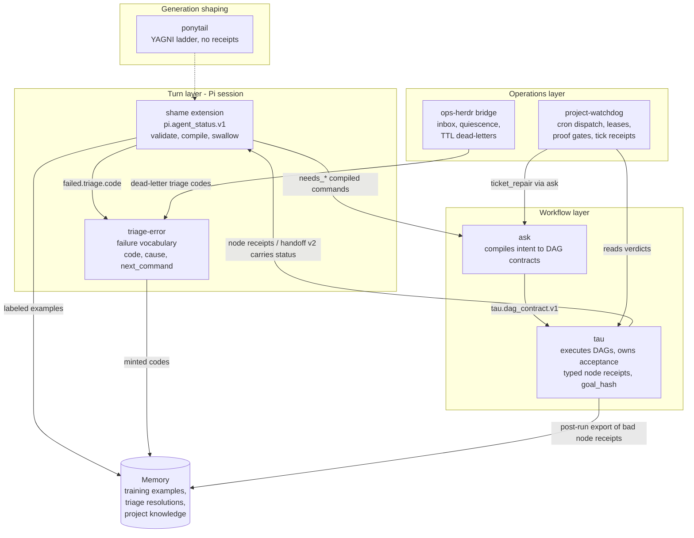

# Agent Ecosystem

One layered governance loop. Each component owns exactly one concern; they
couple only through typed JSON contracts, never by importing each other's
state machines.

The immutable `$shame` goal is `shame-deterministic-instruction-obedience-v1`
(`skills/shame/immutable_goal.json`): make it impossible for project agents to
ignore explicit instructions by converting instruction-obedience and completion
reporting into typed pydantic-validated contracts, deterministic extension
gates, and retained agentic evals. Prose is display only and cannot decide
success. Every ecosystem member named below MUST preserve that goal at its
boundary.

## The graph


Rendered with $create-svg (`scene.yml` is the source; regenerate with
`skills/create-svg/run.sh render skills/agent-ecosystem/scene.yml skills/agent-ecosystem/ecosystem.svg`).
Until the machine-readable membership manifest from issue 1584 exists and
generates them, the SVG above and the mermaid block below are NON-NORMATIVE
illustrations; the ownership table and member `## Ecosystem` sections are the
normative topology.




## Ownership table

| Component | Owns | Emits | Consumes | MUST for the `$shame` immutable goal |
| --- | --- | --- | --- | --- |
| project agents | instruction-obedience at the turn boundary | `pi.agent_status.v1` reports | operator instructions, tool results, receipts | MUST report guarded work as typed status data, use `continuing.not_done[].next_command` for agent-executable unfinished work, and never treat prose/commits/reviewer opinion as completion proof. |
| triage-error | failure vocabulary (`failure_codes.json`) | `{code, cause, next_command}` | raw error text from any layer | MUST make one raw signal map to one catalog or minted code; vague terminal labels cannot become valid decisions. |
| shame | turn status (`pi.agent_status.v1`) and `shame.immutable_goal.v1` | status objects, immutable goal, training examples | triage codes, human labels | MUST keep status truth pydantic-validated, prose-display-only, and eval-gated. |
| lazy-report-shame-shame-shame extension | Pi `message_end` enforcement | rejection packets, rendered status, follow-up commands | final status JSON, continuation ledgers | MUST reject missing/invalid status JSON, strip model-authored status prose, render from validated data, and queue compiled continuation/escalation commands. |
| status-json-check.mjs | final-status extraction and validator invocation | checker result with validated status object | assistant text | MUST not decide status validity with regex, prose headings, markdown, HTML, or LLM judgment. |
| agent_status_schema.py | pydantic status legality | parse pass/fail | final status JSON | MUST make invalid status states unrepresentable with `extra=forbid`, typed state payloads, canonical triage codes, and `not_done` only on `continuing`. |
| compile-status-command.mjs | typed status-to-command compilation | exact follow-up command or no command | pydantic-valid status object | MUST compile `continuing`/`needs_*` payloads mechanically and compile terminal/human states to no auto-command. |
| agentic-evals | retained regression proof | readiness reports | fixtures and commands | MUST fail if regex/prose status policy returns or pydantic status invariants are weakened. |
| ask | intent-to-DAG compilation | `tau.dag_contract.v1`, recovery packets | status escalation payloads | MUST consume typed `needs_*` payloads instead of informal escalation prose. |
| tau | DAG execution and acceptance | node receipts, `tau.agent_handoff.v1/v2`, goal hashes | DAG contracts, embedded status objects | MUST own immutable goal hashes and typed acceptance receipts; reviewer prose cannot replace acceptance. |
| project-watchdog | scheduled dispatch | tick receipts, proof gates, locks, continuation ledgers | GitHub tickets, tau verdicts | MUST expose machine-readable open work so `done` can fail while tickets/gates/next steps remain unresolved. |
| ops-herdr | cross-session transport | inbox records, dead-letters | triage codes | MUST carry cross-session failure/state as typed inbox or dead-letter records with triage codes. |
| ponytail | generation minimalism | `ponytail:` debt comments (not receipts) | nothing from the receipt world | MUST not override status, receipt, proof, or eval requirements. |
| Memory | recall | store/recall readback responses (not envelope receipts; recalls are observations, never wrapped) | everything durable | MUST store shame examples, triage resolutions, and project knowledge with readback; recalls are observations, not completion receipts. |
| agent-ecosystem | component ownership and receipt boundaries | `pi.receipt_envelope.v1` validation | boundary payloads | MUST publish the ownership map and require envelope wrapping at authority-changing boundaries. |
| goal-helper | proof-centered goal shape | immutable goal prompt/checklist | human goal text | MUST keep success tied to primary proof, completion criteria, allowed scope, forbidden drift, retry budget, and stop condition. |

## pi.receipt_envelope.v1 - the boundary envelope

Wrap a payload in the envelope ONLY at authority-changing boundaries:
dispatch, handoff, acceptance, escalation, closure, durable failure.
Internal objects stay unwrapped (reviewed YAGNI ruling: no universal event
bus, no envelope on every artifact).

```json
{
  "schema": "pi.receipt_envelope.v1",
  "receipt_id": "stable-id",
  "payload_schema": "pi.agent_status.v1",
  "producer": "shame",
  "emitted_at": "RFC3339",
  "goal_hash": "sha256:<64hex> (optional)",
  "parent_refs": [
    {"receipt_id": "id", "expected_schema": "s", "expected_producer": "p", "digest": "sha256:<64hex> (optional)"}
  ],
  "triage_code": "catalog or minted code (optional)",
  "payload": {}
}
```

Validate with:

```bash
skills/agent-ecosystem/run.sh validate <envelope.json>
echo '{...}' | skills/agent-ecosystem/run.sh validate -
```

Rules enforced by `scripts/receipt_envelope.py` (pydantic, extra=forbid):

- `triage_code`, when present, must be a triage-error catalog code or a minted
  `*_unclassified_<8hex>` code - same rule as `pi.agent_status.v1.failure`.
- `goal_hash` and `parent_refs[].digest` must be `sha256:` + 64 lowercase hex.
- `parent_refs` require `goal_hash`: an evidence edge without a shared goal is
  untrusted and fails validation.
- Pydantic proves STRUCTURE only. Reference RESOLUTION is a separate
  consumer-side step with four mandatory checks: the referenced receipt exists;
  its schema equals `expected_schema`; its producer equals `expected_producer`;
  and `resolved_parent.goal_hash == envelope.goal_hash` (a present hash is not
  a shared goal until compared). Digest verification applies when `digest` is
  set. A structurally valid envelope is not yet a trusted one.
- `payload.schema` is REQUIRED in every wrapped payload and must equal the
  envelope `payload_schema`; an anonymous payload fails validation.
- Field-set changes to any `extra=forbid` schema are breaking by construction;
  they require a new schema version, never an in-place edit.

## Shared JSON field conventions

The fields below are the actual shared surface. A component "shares" a field
when it emits or validates the same name, shape, and semantics as the owner.

| Field | Shape | Owner | Shared by |
| --- | --- | --- | --- |
| `schema` | versioned id, e.g. `pi.agent_status.v1` | each schema owner | every contract object; version bumps are additive-or-new-name |
| `code` (triage) | catalog entry or `<prefix>_unclassified_<8hex>` | triage-error | shame `failure.triage.code`, envelope `triage_code`, herdr dead-letters, ask recovery packets |
| `cause` / `next_command` | plain string / exact runnable command | triage-error | every consumer of a triage classification; `next_command` is also the shame `continuing` keep-going field |
| `goal_hash` | `sha256:` + 64 lowercase hex | tau (immutable goal packet) | shame status (optional), envelope (optional), every tau node receipt |
| `verified[]` | `{command, result}` pairs | shame | done-state proof everywhere a status object is embedded |
| `proof[]` | concrete paths/URLs/ids; local paths in `pi.agent_status.v1` must exist before `done` passes | shame | status objects; watchdog proof gates name the same artifacts |
| `parent_refs[]` | `{receipt_id, expected_schema, expected_producer, digest?}` | agent-ecosystem envelope | escalation evidence (replaces ad hoc paths in `needs_webgpt`) |
| `producer` / `receipt_id` / `emitted_at` | string / stable id / RFC3339 | agent-ecosystem envelope | any boundary-wrapped receipt |
| `payload_schema` | versioned id; must equal `payload.schema` when the payload declares one | agent-ecosystem envelope | any boundary-wrapped receipt |
| terminal verdicts | `PASS FAIL BLOCKED NEEDS_ATTENTION` | tau | ask joins, watchdog proof gates, stream monitors |
| `recoverable` / `not_this` | bool / exclusion list | triage-error catalog | consumers deciding retry vs escalate |

### triage-error conventions (normative here, implemented there)

1. One raw signal maps to ONE `{code, cause, next_command}`; a generic code at
   a layer boundary is a bug, not a classification.
2. Catalog entries live in `skills/triage-error/failure_codes.json` with
   `{code, layer, match[], cause, next_command, recoverable, not_this[]}`.
   Matching is deterministic: normalization is exactly
   `" ".join(text.lower().split())` (lowercase, all whitespace runs collapsed
   to single spaces, ends trimmed); an entry matches when ANY of its `match[]`
   tokens (also lowercased) is a substring of the normalized signal; when
   `--layer` is given, entries with a different `layer` are skipped; the FIRST
   matching entry in file order wins. Never regex, never LLM judgment.
   Prohibited as terminal classifications (they are symptoms, not causes, and
   must be re-triaged from the underlying signal): `NEEDS_ATTENTION`,
   `BLOCKED`, `browser_handler_timeout`, `unknown_error`, `generic_failure`,
   and any bare terminal verdict word.
3. Unmatched signals mint `<layer-or-unknown>_unclassified_<8hex>` where the
   8 hex chars are the first 8 of sha256 over the normalized signal text, so
   the same signal always mints the same code. Minting opens the ticket +
   agentic-eval + memory loop. Recurrence threshold: the SECOND observation of
   the same minted code triggers promotion or aliasing. Alias representation:
   a top-level `aliases` map in the catalog file maps minted code -> canonical
   code; because minting is deterministic over the normalized signal, a
   recurring signal re-mints the same code and the classifier resolves it
   through the map to the canonical entry (recorded as `aliased_from`); the
   minted code is never a second canonical identity. The ticket/eval/memory
   side effects are idempotent per minted code (keyed by the code string).
4. Every ecosystem component that names a failure uses a catalog or minted
   code. Both pydantic validators (status schema, envelope) enforce this at
   parse time, so an ambiguous label cannot exist in a valid object.

## Design rulings (from the external review)

1. Strictness applies to DECISIONS, not observations. Keep raw evidence
   permissive; keep accepted outcomes strict. A typed `unknown` observation is
   legal; an ambiguous decision is not.
2. Minted `*_unclassified_*` codes get a provisional lifecycle: promote to the
   catalog or alias to an existing code when they recur; never let them sprawl.
3. Schema changes are additive; breaking shape changes get a new version
   (`tau.agent_handoff.v2` pattern), never in-place edits.
4. Do not build: a universal governance event bus; receipts for ponytail
   comments, Memory recalls, or internal retries.

## Membership

A skill or extension joins the ecosystem by adding an `## Ecosystem` section to
its SKILL.md naming: which schemas it produces, which it consumes, and which
boundary events it wraps in the envelope. Current members: shame, triage-error,
tau, ask, project-watchdog, ops-herdr. Ponytail is adjacent by design.
