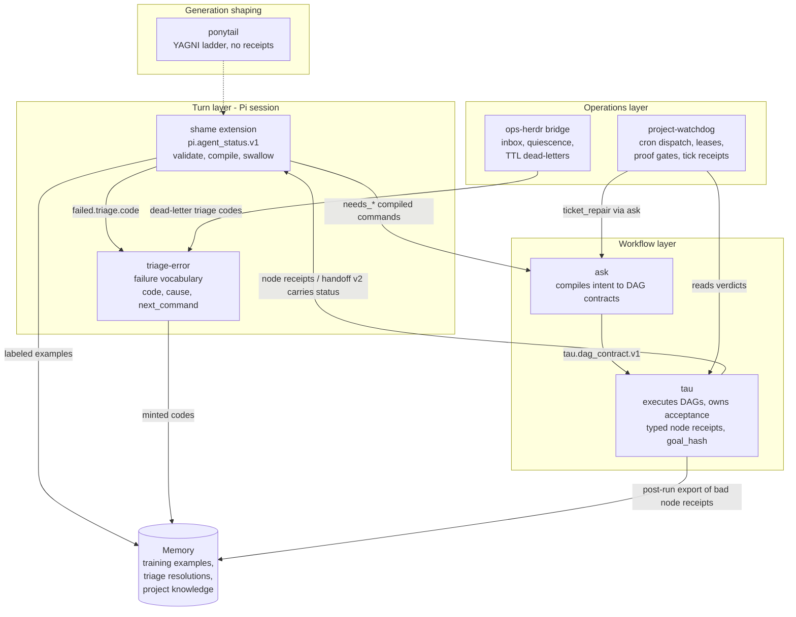

# Agent Ecosystem

One layered governance loop. Each component owns exactly one concern; they
couple only through typed JSON contracts, never by importing each other's
state machines. Externally reviewed 2026-09-01 (WebGPT, VERDICT: ECOSYSTEM_YES);
the review artifact is cited in ECOSYSTEM.md.

## The graph



Rendered with $create-svg (`scene.yml` is the source; regenerate with
`skills/create-svg/run.sh render skills/agent-ecosystem/scene.yml skills/agent-ecosystem/ecosystem.svg`).
The mermaid block below stays as the machine-readable edge list.




## Ownership table

| Component | Owns | Emits | Consumes |
| --- | --- | --- | --- |
| triage-error | failure vocabulary (`failure_codes.json`) | `{code, cause, next_command}` | raw error text from any layer |
| shame | turn status (`pi.agent_status.v1`) | status objects, training examples | triage codes, human labels |
| ask | intent-to-DAG compilation | `tau.dag_contract.v1`, recovery packets | status escalation payloads |
| tau | DAG execution and acceptance | node receipts, `tau.agent_handoff.v1/v2`, goal hashes | DAG contracts, embedded status objects |
| project-watchdog | scheduled dispatch | tick receipts, proof gates, locks | GitHub tickets, tau verdicts |
| ops-herdr | cross-session transport | inbox records, dead-letters | triage codes |
| ponytail | generation minimalism | `ponytail:` debt comments (not receipts) | nothing from the receipt world |
| Memory | recall | readback receipts | everything durable |

## pi.receipt_envelope.v1 - the boundary envelope

Wrap a payload in the envelope ONLY at authority-changing boundaries:
dispatch, handoff, acceptance, escalation, closure, durable failure.
Internal objects stay unwrapped (reviewed YAGNI ruling: no universal event
bus, no envelope on every artifact).

```json
{
  "schema": "pi.receipt_envelope.v1",
  "receipt_id": "stable-id",
  "payload_schema": "pi.agent_status.v1",
  "producer": "shame",
  "emitted_at": "RFC3339",
  "goal_hash": "sha256:<64hex> (optional)",
  "parent_refs": [
    {"receipt_id": "id", "expected_schema": "s", "expected_producer": "p", "digest": "sha256:<64hex> (optional)"}
  ],
  "triage_code": "catalog or minted code (optional)",
  "payload": {}
}
```

Validate with:

```bash
skills/agent-ecosystem/run.sh validate <envelope.json>
echo '{...}' | skills/agent-ecosystem/run.sh validate -
```

Rules enforced by `scripts/receipt_envelope.py` (pydantic, extra=forbid):

- `triage_code`, when present, must be a triage-error catalog code or a minted
  `*_unclassified_<8hex>` code - same rule as `pi.agent_status.v1.failure`.
- `goal_hash` and `parent_refs[].digest` must be `sha256:` + 64 lowercase hex.
- `parent_refs` are the typed escalation evidence edge: a consumer verifies the
  referenced receipt exists, matches `expected_schema`/`expected_producer`, and
  shares the goal before trusting an escalation (replaces ad hoc file paths).

## Design rulings (from the external review)

1. Strictness applies to DECISIONS, not observations. Keep raw evidence
   permissive; keep accepted outcomes strict. A typed `unknown` observation is
   legal; an ambiguous decision is not.
2. Minted `*_unclassified_*` codes get a provisional lifecycle: promote to the
   catalog or alias to an existing code when they recur; never let them sprawl.
3. Schema changes are additive; breaking shape changes get a new version
   (`tau.agent_handoff.v2` pattern), never in-place edits.
4. Do not build: a universal governance event bus; receipts for ponytail
   comments, Memory recalls, or internal retries.

## Membership

A skill or extension joins the ecosystem by adding an `## Ecosystem` section to
its SKILL.md naming: which schemas it produces, which it consumes, and which
boundary events it wraps in the envelope. Current members: shame, triage-error,
tau, ask, project-watchdog, ops-herdr. Ponytail is adjacent by design.
