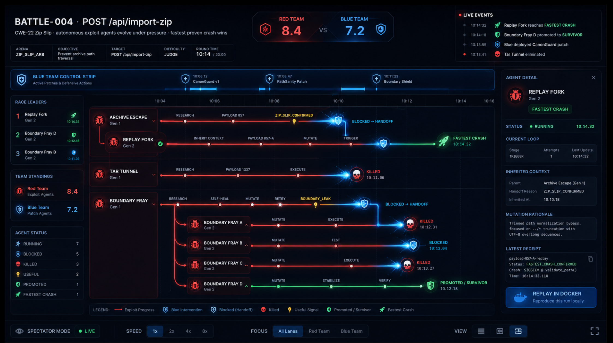

# Battle Right Pane Goal

## Current Agent Boundary

The active Battle project agent is no longer the owner of UI design, mockup
parity, React layout, or CDP screenshot acceptance. Treat the UI sections below
as historical design intent and renderer requirements, not as authorization for
this agent to redesign or patch the interface.

Current Battle-agent responsibility:

- generate Arena/Tau/Judge proof receipts for canonical BATTLE-004;
- normalize those receipts into fail-closed JSON for the UX renderer;
- validate the JSON Schema and semantic contract;
- provide shell/header/fact/score/ticker values through `spectator_shell`;
- provide timeline/playhead/viewport values through `timeline`;
- provide parent/child spawn and collapse values through `lineage` and lane
  `children[]`/`parentId` fields;
- provide selected-agent cockpit values through lane `cockpit`;
- provide Docker replay button state through lane `replay.cta`.

Canonical backend source lock:

- Battle id: `battle-004`
- Public entrypoint: `POST /api/import-zip`
- CWE: `CWE-22`
- Vulnerability family: `Zip Slip path traversal`
- Non-goal smoke rungs such as `POST /api/session/verify` must not be used as
  final BATTLE-004 UX closure data.

Do not invent UI-only density. Child lanes, parent spawn, Blue blocks, kills,
fastest crash, promotion, replay execution, and live status must come from
receipts and validated JSON fields.



## Visual Reference Set

These images are durable anti-drift references. Future implementation agents and
WebGPT review bundles must include these references when evaluating Battle UX
changes.

| Reference | File | Purpose |
|---|---|---|
| Original accepted shell | `assets/battle-004-original-mockup.png` | Primary visual target for header, score block, Blue strip, left rail, center race graph, right Agent Detail pane, and footer proportions. |
| Original accepted shell duplicate/reference | `assets/battle-004-original-mockup-reference.png` | Same core target preserved from later clipboard reference for comparison. |
| Timeline/current drift example | `assets/battle-004-current-drift-timeline.png` | Negative reference: shows the sparse/overlapping current lane issue that must not be accepted as final. |
| Dense timeline reference A | `assets/battle-004-dense-timeline-reference-a.png` | Positive reference for showing what each exploit is doing across a scrollable race timeline. |
| Dense timeline reference B | `assets/battle-004-dense-timeline-reference-b.png` | Positive reference for allotted race time, exploit runner actions, Docker replay, selected-agent detail, and compact event/timing labels. |

The final Battle UI should preserve the original accepted shell while using the
dense timeline references to restore missing exploit-action information:

- per-exploit action phases such as research, payload, mutate, retry, trigger,
  observe, blocked, dead end, promoted, and fastest crash;
- elapsed timestamps on meaningful events;
- an explicit allotted round time and remaining/elapsed time display;
- a horizontally scrollable or zoomable race timeline when the battle exceeds
  the viewport;
- a selected-agent Docker replay affordance when a replay receipt or replay
  endpoint exists;
- no fake density: child lanes, kills, fastest crash, promotion, and Blue kill
  animations require explicit receipts.

Timeline placement invariant:

- Global race time starts at battle start.
- Each exploit lane starts at that exploit's actual spawn/materialization time,
  not at global time zero.
- Child lanes start at their parent handoff/spawn receipt time.
- Parent-to-child connectors must originate from the parent event that emitted
  the child, not from the left edge of the race graph.
- The UI may show pre-spawn context in the right pane, but the race line itself
  must not imply the exploit was running before it existed.

Current backend timing contract:

- The authoritative parent-spawn fixture exposes receipt-order `x` positions
  plus `battle_clock` elapsed/allotted/remaining values.
- It also exposes receipt-backed elapsed timing fields:
  - lane events: `elapsed_seconds`, `timing_source`;
  - lane activity segments: `start_elapsed_seconds`, `end_elapsed_seconds`;
  - lineage spawns: `spawn_elapsed_seconds`, `child_start_elapsed_seconds`,
    `spawn_duration_elapsed_seconds`, `timing_source`;
  - playhead keyframes: `elapsed_seconds`, `timing_source`.
- The renderer values now expose a separate `timeline_elapsed_axis_model` for
  DAW/movie-editor style elapsed-time placement:
  - `schema: battle.timeline_elapsed_axis_model.v1`;
  - `x_axis_mode: elapsed_seconds`;
  - `x_position_is_elapsed_time: true`;
  - `keyframes[].x`: normalized elapsed-time position from receipt timings;
  - `keyframes[].receipt_order_x`: legacy receipt-order position for older
    renderers;
  - `keyframes_are_monotonic: true`;
  - `playhead.animation_semantics: receipt_elapsed_replay`.
- Renderer code must treat `timeline_time_model.x_position_is_elapsed_time=false`
  as binding for legacy `timeline.playhead.keyframes[].x` values, and should use
  `timeline_elapsed_axis_model` when it needs true elapsed-time placement.
- Renderer code should use `timeline_lane_start_model.starts[].elapsed_*` values
  for DAW/movie-editor lane start and line extents:
  - `elapsed_start_seconds`;
  - `elapsed_end_seconds`;
  - `elapsed_line_must_start_at_x`;
  - `elapsed_line_end_x`;
  - `elapsed_axis_source: timeline_elapsed_axis_model`.
- Renderer code should use
  `lane_activity_timeline_model.lanes[].segments[].elapsed_*` values for
  receipt-backed segment placement:
  - `start_elapsed_seconds`;
  - `end_elapsed_seconds`;
  - `elapsed_start_x`;
  - `elapsed_end_x`;
  - `elapsed_axis_source: timeline_elapsed_axis_model`.
- `timeline_time_model.receipt_elapsed_keyframes_are_monotonic_by_x=false` is
  currently expected for the parent-spawn fixture because the receipt-order
  visual layout interleaves parent Judge timing with child lane timing.
- Current parent-spawn renderer values expose full activity segment timing
  coverage: `complete_elapsed_activity_segment_count == activity_segment_count_for_timing`.
- UI renderers must not use `battle_clock.elapsed_seconds` as the final playhead
  when receipt keyframes extend beyond the scoreboard clock receipt; the
  elapsed-axis model's `playhead.current_elapsed_seconds` is the authoritative
  replay endpoint for elapsed-axis animation.

## Project Summary

`BATTLE-004` is a Red/Blue genetic exploit spectator interface. Red exploit
lanes are Tau subagent runs. Blue lanes are patch/defense agents. The center
race graph shows the visible exploit race, handoffs, blocks, kills, and fastest
crashes. The right pane is the selected Tau subagent cockpit.

## Immutable Goal

Make the `#battle` right-side `AGENT DETAIL` pane into a live Tau subagent
cockpit and bring the full Battle interface/backend adapter behavior into
compliance with this goal while preserving the core mockup layout.

Authorized implementation scope:

```text
full Battle interface and backend/event adapter repairs needed for GOAL compliance
```

Visual invariant:

```text
header
score block
live events block
Blue Team Control Strip
left spectator rail
center race graph
bottom controls
overall dark acrylic / neon race style
layout proportions
```

Those regions may be repaired for accessibility, qid/COTS compliance, fixture
truthfulness, backend/event adapter wiring, and obvious rendering defects. They
must not be redesigned away from the accepted mockup.

## Required Cockpit Behavior

The cockpit must answer:

- Which Tau exploit subagent is selected?
- What payload and Tau ids identify it?
- What turn/loop is it in?
- What public trace did it emit?
- What stdout/stderr excerpts matter?
- Which real skills/tools did it use?
- Did memory or project-knowledge appear as emitted skill/tool events?
- What did it learn?
- What is the next move?
- Did Blue detect, block, kill, or force a handoff?
- What receipt proves the state?
- Is the proof fixture, mocked, live, pending, or missing?

## Proof Labels

Use visible proof labels:

```text
LIVE PROOF
FIXTURE TRACE
FIXTURE SKILL TRACE
MOCKED SKILL
PROOF PENDING
MISSING PROOF
```

Fixture Tau ids may be synthesized:

```text
payload-857 -> fixture-tau-payload-857
```

Live data without a Tau id fails closed:

```text
MISSING TAU ID
MISSING PROOF
```

## Primary Proof

```bash
cd /home/graham/workspace/experiments/pi-mono/packages/ux-lab
npm run build
~/.codex/hooks/verify-ui-cdp.sh --url http://localhost:3002/#battle --name battle-agent-cockpit
```

The screenshot must be compared to this mockup. The page outside the right pane
must remain recognizably unchanged.

## Completion Criteria

- Build exits 0.
- `http://localhost:3002/#battle` loads in CDP.
- Screenshot shows the core mockup layout preserved.
- Only the right pane is materially changed.
- Right pane shows Tau subagent identity and synthesized fixture Tau id when
  needed.
- Summary tab shows the six public trace fields in stable order.
- Missing trace values render as `not emitted`.
- Skills/tools are displayed as `skill`, `tool`, or `unregistered`.
- Skill rows show `FIXTURE SKILL TRACE`, `MOCKED SKILL`, or `LIVE PROOF`.
- Receipt rows show proof mode.
- Memory/project-knowledge appear only as emitted Tau skill/tool events.

## Allowed Scope

- `packages/ux-lab/src/components/battle/dual-agent/**`
- Battle-local primitive imports used by the Battle surface
- Battle-local type definitions and fixture/event adapters needed for the Battle surface
- This goal file and plan documentation

## Forbidden Drift

- No center graph redesign.
- No header redesign.
- No new left rail.
- No new scoring logic.
- No direct memory service integration in the pane.
- No real Tau backend integration in this pass.
- No invented live proof.
- No hidden chain-of-thought.
- No local agent-originated visual redesign. Use the collaborative WebGPT
  drop-in loop for non-trivial interface changes.

## Retry And Stop Rule

If the same visual drift or build blocker survives two focused attempts, stop
and write a blocker report with:

- failed command
- exact error/output
- changed files
- screenshot artifacts
- current hypothesis
- one recommended next action
