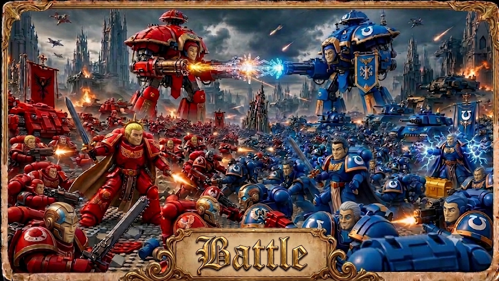

# Battle

<p align="center">
  
</p>

Battle is a Red vs Blue security competition skill. It creates isolated target
workspaces, lets Red attack and Blue defend, scores the round outcomes, and
preserves enough state to resume, report, or inspect a long-running campaign.

The skill is designed for adversarial security work, not generic task routing:
Red finds and proves vulnerabilities; Blue patches or hardens; the orchestrator
tracks rounds, scores, termination conditions, and reports.

Current generated proof rung:

```bash
./run.sh battle-v1-operational battle-005 \
  --out /tmp/battle-v1-generated-no-tau-003 \
  --red-workers 16 \
  --blue-workers 16 \
  --max-attempts 16 \
  --require-memory \
  --tau-deterministic \
  --research-broker
```

This is a bounded Docker-only fixture proof, not production readiness. Local
evidence from `/tmp/battle-v1-generated-no-tau-003` recorded the generated
warm-pond fixture with 16 generated exploit candidates, 8 generated defense
candidates, 200 total combinations, and 16 scorekeeper replay attempts with
`BATTLE_V1_OPERATIONAL_ACCEPTANCE_PASS`.

The current Tau live proof is bounded by Tau's safe live worker-handoff cap.
A 64 Red + 64 Blue requested run against `battle-005` now writes
`context/tau-live-preflight-receipt.json`, caps the requested 128 worker
handoffs to 64 safe live handoffs, and preserves the top 32 research-weighted
warm-pond attempt pairs. Local evidence from
`/tmp/battle-v1-generated-tau-064-capped` recorded `status=PASS`,
`verdict=BLUE_SUCCESS`, `tau-live/manifest.json status=PASS`, and
`BATTLE_V1_OPERATIONAL_ACCEPTANCE_PASS` with 32 Red and 32 Blue workers. The
older raw 128-handoff Tau failure is filed and closed upstream as
`grahama1970/tau#42`; treat unbounded 128-worker live Tau completion as a
non-claim.

Current multi-round proof rung:

```bash
./run.sh battle-v1-multiround battle-005 \
  --out /tmp/battle-v1-multiround-tau-002 \
  --rounds 2 \
  --red-workers 2 \
  --blue-workers 2 \
  --max-attempts 2 \
  --require-memory \
  --research-broker \
  --tau-live
```

This proves a bounded two-round Docker/Tau/memory feedback loop. Round 1 writes
recallable feedback to `$memory` `lessons`; round 2 retrieves the exact prior
feedback token through `/recall`, weights matching warm-pond combinations, and
then runs Red/Blue workers plus Scorekeeper replay again. Local evidence from
`/tmp/battle-v1-multiround-tau-002` recorded `status=PASS`,
`verdict=BLUE_SUCCESS`, exact-token memory recall, 6 memory-influenced round-2
combinations, `round-feedback/negative-evidence-receipt.json` with 8 records,
4 Tau worker handoffs per round, and
`BATTLE_V1_MULTIROUND_ACCEPTANCE_PASS`.

## Operating Contract

Battle's production shape is intentionally simple:

```text
Arena Team
  -> build/select the project, app, or digital twin
  -> secretly plant one or more vulnerabilities
  -> write hidden ground truth for the scorekeeper

cron/orchestrator
  -> launch asynchronous Red and Blue workers
  -> choose personas, budgets, models, and tool allowances
  -> call modular Tau subagent contracts
  -> Tau uses loop / agentic harness execution
  -> loop / agentic harness uses $scillm for LLM calls
  -> run all target/team code inside Docker
  -> observe whether Red exploits before Blue patches, or Blue patches first
  -> write scorekeeper receipts and reports
  -> store learnings in $memory
```

Battle has three active roles plus one objective recorder:

- **Arena Team** builds/selects the app or digital twin and secretly plants the
  vulnerability. Arena Team is not the judge.
- **Red Team** searches, researches, mutates, and exploits.
- **Blue Team** scans, recalls, researches, patches, hardens, and tests.
- **Scorekeeper/Judge** records objective runtime outcomes from hidden oracles,
  receipts, uptime, crashes, exploit proof, patch timing, and regressions.

The orchestrator may select one persona per team or multiple concurrent
personas per team. Every dispatched subagent must have an explicit persona
attached. Persona selection is part of the strategy surface: it encourages
creative, non-identical, and less predictable approaches while preserving the
same Tau-style schema and evidence requirements for every actor. Red and Blue
have free research access through approved agent-side skills such as `$dogpile`,
`$brave-search`, `$memory`, `$github-search`, `$arxiv`, `$ingest-code`,
`$treesitter`, docs, CVEs, and writeups. That research freedom does not grant
host execution. All target code and all team-generated executable code runs
inside Docker.

Tau is the modular subagent contract/orchestration layer for Battle. Battle
selects teams, personas, budgets, target runtimes, and score rules, then emits
Tau-style handoffs. Tau and the loop/agentic harness own subagent execution.
That harness uses `$scillm` as the LLM/model caller, giving teams access to SOTA
models, small/fast low-parameter models, and narrow specialist models without
making Battle a direct provider router.

Persona-conditioned workers may choose their `$scillm` model or surface within
scenario policy and budget. A lower-parameter or local model may be the right
choice for exploit mutation, payload variation, or fast triage; a stronger
model may be better for planning, chain reasoning, or hard patch design. Model
choice is part of the evolutionary search and must be recorded in receipts with
persona, model/surface, reason selected, latency/cost when available, and proof
scope.

Hard invariants:

- Host code is control plane only: schedule, dispatch, mount/copy, collect,
  score, and report.
- Target apps, exploit probes, fuzzers, payloads, repro scripts, patch builds,
  tests, migrations, dependency installs, and replay checks run in Docker.
- Docker target runtimes are disposable between rounds when needed.
- Persistent volumes carry only the round state that must survive a rebuild or
  relaunch, such as target data volumes, baseline source snapshots, Blue patch
  workspaces, crash artifacts, and scorekeeper evidence.
- Strategic context, summaries, lessons, persona performance, exploit/patch
  observations, and cross-round learning are stored in `$memory`, not only in
  local files.
- Target containers default to no network. Red and Blue research happens from
  the agent side through controlled skills unless a scenario explicitly grants
  target-container network access.
- Red and Blue work asynchronously. Blue may scan, run `$ingest-code
  --treesitter`, recall CWE and patch history, research mitigations, and patch
  before Red exploits a hidden bug. Red may simultaneously run memory recall,
  research, scanning, payload mutation, and exploit attempts.
- The scheduler should support bounded parallelism when advantageous: multiple
  exploit hypotheses, scans, fuzzers, patch hypotheses, or test runs per team,
  with explicit worker, persona, model, and budget receipts.
- Docker images/toolchains are selected or built dynamically for the target
  language stack. Any language required by the target may be added to the
  runtime image; Battle should not reimplement language-specific build logic.
- Model selection is strategic but routed through Tau/loop. Different personas
  and tasks may use different `$scillm` models: high-reasoning SOTA models for
  planning, low-parameter fast models for mutation generation or triage,
  specialist models for language/security niches, and batch calls for broad
  candidate generation.
- Throughput is a design goal. On a capable workstation, Battle should be able
  to schedule thousands of isolated exploit or defense mutations, with tight
  10-15 second attempt windows when the Docker runtime already has the required
  language/toolchain.
- Research can burst when needed. Red and Blue may run multiple concurrent
  `$brave-search`, `$dogpile`, `$github-search`, and `$arxiv` research calls
  from the agent side, including 10x parallel Brave searches for fast strategy
  discovery, then store useful findings and dead ends in `$memory`.
- Workers may clone selected public GitHub repositories into bounded
  `/tmp/battle-<run-id>/github-research/...` directories for read-only
  inspection. Cloned PoC/exploit code must not execute on the host; execution
  belongs inside the Battle Docker runtime and must produce command receipts.
- Search should be combinatorial. Red should try any and every plausible exploit
  family and combination within safety/time budgets; Blue should do the same for
  patch, hardening, configuration, testing, detection, and mitigation
  combinations. Feedback from Docker outcomes determines what gets promoted.

Round scoring is environment-outcome based. Red wins when the target goes down,
crashes, leaks, violates an invariant, or remains exploitable inside the
allotted time. Blue wins when the target remains up through the allotted time,
the patch/hardening lands before failure, required behavior still works, and
Red's current exploit no longer succeeds. The scorekeeper records hard signals;
it is not an LLM judge.

Speed matters. Blue can choose an accurate but slow path and still lose if Red
exploits first. Red can choose a fast noisy path and lose if it fails while Blue
lands a verified patch. The useful record is not just the winner; it is the
strategy, persona, model, tool chain, latency, and evidence that produced the
outcome.

## Round Loop

Each round is a learning and mutation cycle:

```text
1. Recall
   - read prior Battle round receipts and summaries from $memory
   - inspect project knowledge for current campaign state
   - use $memory code_symbols / ingest-code output for target structure
   - recall persona memory before shaping research or scan order

2. Research
   - Red and Blue run $dogpile / $brave-search / $github-search / $arxiv / docs / CVE research
   - the orchestrator may fan out concurrent research calls when speed matters
   - each team researches freely from the agent side

3. Mutate
   - orchestrator chooses explicit personas for each subagent
   - Red tries many penetration ideas, including rough or unlikely ones
   - Red mixes high-level and low-level techniques: auth bypasses, parser abuse,
     dependency attacks, fuzzing, memory corruption, race conditions, config
     mistakes, protocol quirks, payload chains, and crash reproducers
   - Red intentionally tries odd combinations because warm-pond evolutionary
     exploit search depends on mutation, recombination, and selection
   - Blue tries patch, hardening, test, config, and mitigation variants
   - both teams combine candidate tactics aggressively instead of testing only
     one neat idea at a time
   - all executable attempts run inside Docker
   - short-lived Docker attempts are scheduled aggressively when the runtime is
     already warm and has the required language support

4. Score
   - system down before allotted time favors Red
   - system still up after allotted time with behavior preserved favors Blue
   - scorekeeper writes objective receipts and artifacts

5. Promote
   - successful exploit, patch, defense, persona, and research strategies are
     promoted into $memory for future rounds
   - successful combinations are promoted more strongly than isolated tactics
     because the interaction is often the winning strategy
   - failed or low-value mutations are retained as negative evidence so teams
     avoid repeating them blindly
```

This is intentionally evolutionary. Battle should try many ideas, including
some that are naive, strange, or cross-layer combinations of high-level and
low-level exploits, because surprising attacks and defenses can win. The gate is
not whether an idea sounds elegant; the gate is whether Docker evidence shows
that it brought the system down or kept it up. Successful mutations are
promoted; failed mutations remain searchable negative evidence.

## Current Surfaces

Battle currently exposes these useful surfaces:

1. **Battle orchestrator** for multi-round Red vs Blue runs over source,
   container, or firmware targets.
2. **Battle v0** for a deterministic one-round fixture proof with Red, Blue, and
independent Judge receipts.
3. **Tau-agentic smoke** for a narrow Red/Blue Tau `AgentHarness` proof over the
   `battle-002` fixture. This uses a deterministic local Tau provider and does
   not prove `$scillm` or external/local model execution.
4. **Arena Docker smoke** for a narrow hidden-vulnerability race proof over the
   `battle-003` fixture. Arena Team records hidden SQL injection/XSS ground
   truth, Red and Blue race asynchronously, all target commands execute through
   Docker with `--network none`, and the scorekeeper records whether Blue
   patched before Red exploited. With `--context-receipts`, this rung now also
   records the intended first-step strategy chain: `$memory` recall, Docker fast
   scan, live Brave batch search, research seed, warm-pond candidate generation,
   bounded warm-pond execution in isolated Docker workspaces, Tau/Scillm action
   selection, Docker race, scorekeeper replay, and `$memory` upsert.
5. **Battle v1 operational** for the current four-party Docker proof rung over
   `battle-003`. It runs Arena, Red, Blue, and Scorekeeper roles, bounded
   asynchronous Red/Blue worker pools, Docker-only probe/patch/replay commands,
   memory recall/promotion receipts, a SQLite event ledger, a generated force
   graph, and an artifact-backed monitor proof. It is still bounded and
   deterministic; it does not prove an unbounded swarm or Tau loop repair.
6. **Battle v1 multi-round** for the current cross-round feedback proof over
   `battle-005`. It composes bounded operational rounds, stores round feedback
   in `$memory`, requires exact-token `/recall` before the next round, records
   negative evidence, and passes recalled feedback into warm-pond weighting.

Battle v0 is the safer first rung to run when checking the artifact contract. It
does not exercise live Red or Blue agents.

## Quickstart

Run from `skills/battle`:

```bash
./run.sh --help
```

Run a normal source-code battle:

```bash
./run.sh battle /path/to/codebase --rounds 10
```

Run an overnight battle:

```bash
./run.sh battle /path/to/codebase --overnight
```

Run a Docker target:

```bash
./run.sh battle --docker-image myapp:latest --rounds 100
```

Run a QEMU/firmware target:

```bash
./run.sh battle firmware.bin --qemu-machine arm --rounds 100
```

Run the current Tau AgentHarness proof rung:

```bash
./run.sh tau-agentic-smoke battle-002 --out /tmp/battle-002-tau-agentic --fast-scan
```

Run the first Arena Team hidden-vulnerability Docker race proof:

```bash
./run.sh arena-docker-smoke battle-003 --out /tmp/battle-003-arena
```

Run the same proof with Tau AgentHarness action-selection receipts:

```bash
./run.sh arena-docker-smoke battle-003 \
  --out /tmp/battle-003-arena-agentic \
  --agentic \
  --red-persona brandon-bailey \
  --blue-persona coder
```

Run it with live Scillm chat action-selection receipts before Tau and Docker:

```bash
./run.sh arena-docker-smoke battle-003 \
  --out /tmp/battle-003-arena-scillm \
  --agentic \
  --scillm-plan \
  --red-persona brandon-bailey \
  --blue-persona coder \
  --scillm-model opencode/kimi-k2.6
```

Run it with memory/code/research context receipts as well:

```bash
./run.sh arena-docker-smoke battle-003 \
  --out /tmp/battle-003-arena-context \
  --agentic \
  --scillm-plan \
  --context-receipts \
  --red-persona brandon-bailey \
  --blue-persona coder \
  --scillm-model opencode/kimi-k2.6
```

Run the current four-party Battle v1 operational proof:

```bash
./run.sh battle-v1-operational battle-003 \
  --out /tmp/battle-v1-operational-a \
  --red-workers 2 \
  --blue-workers 2 \
  --max-attempts 4 \
  --require-memory
```

Run the bounded multi-round Tau/memory feedback proof:

```bash
./run.sh battle-v1-multiround battle-005 \
  --out /tmp/battle-v1-multiround-tau-002 \
  --rounds 2 \
  --red-workers 2 \
  --blue-workers 2 \
  --max-attempts 2 \
  --require-memory \
  --research-broker \
  --tau-live

python3 sanity/battle_v1_multiround_acceptance.py \
  /tmp/battle-v1-multiround-tau-002 \
  --rounds 2 \
  --min-red-workers 2 \
  --min-blue-workers 2
```

Inspect recent battles:

```bash
./run.sh status
```

Resume a paused battle:

```bash
./run.sh resume <battle-id>
```

Generate a report:

```bash
./run.sh report <battle-id>
```

## Battle v0 Fixture Proof

Battle v0 runs a deterministic fixture:

```text
Red proves a seeded path traversal exploit
Blue applies a deterministic patched file
Judge verifies the synced arena independently
Scoreboard derives from the Judge receipt
Monitor renders generated artifacts
```

Run it from `skills/battle`:

```bash
./run.sh battle-fixture battle-001 --out /tmp/battle-001
```

Expected backend artifacts:

```text
/tmp/battle-001/battle-plan.json
/tmp/battle-001/red-receipt.json
/tmp/battle-001/blue-receipt.json
/tmp/battle-001/judge/judge-receipt.json
/tmp/battle-001/scoreboard.json
/tmp/battle-001/monitor-index.json
/tmp/battle-001/run-receipt.json
```

The Battle v0 run receipt states the claim boundary:

```text
mocked: no
live: local_deterministic_fixture
agentic: false
models_used: []
```

This proves only the deterministic fixture contract. It does not prove real Red
agent behavior, real Blue agent behavior, scillm, OpenCode, anvil, code-runner,
memory learning, Docker, QEMU, or multi-round campaign readiness.

## Arena Docker Proof

`battle-003` is the first Battle v1 proof rung for the Arena Team and
Docker-only execution contract. It is still small and deterministic, but it
exercises a real hidden-vulnerability race:

```text
Arena Team prepares a tiny /search?q=<term> app
Arena Team records hidden SQL injection and reflected XSS ground truth
Blue starts first and patches app.py inside Docker
Red starts later and attempts the hidden exploit inside Docker
Scorekeeper replays exploit-safe and regression checks inside Docker
```

Run it from `skills/battle`:

```bash
./run.sh arena-docker-smoke battle-003 --out /tmp/battle-003-arena
```

To include Tau AgentHarness action selection before the Docker race:

```bash
./run.sh arena-docker-smoke battle-003 \
  --out /tmp/battle-003-arena-agentic \
  --agentic \
  --red-persona brandon-bailey \
  --blue-persona coder
```

To include live Scillm chat action selection before Tau and Docker:

```bash
./run.sh arena-docker-smoke battle-003 \
  --out /tmp/battle-003-arena-scillm \
  --agentic \
  --scillm-plan \
  --red-persona brandon-bailey \
  --blue-persona coder \
  --scillm-model opencode/kimi-k2.6
```

Expected artifacts:

```text
/tmp/battle-003-arena/arena-receipt.json
/tmp/battle-003-arena/hidden-ground-truth.json
/tmp/battle-003-arena/red-receipt.json
/tmp/battle-003-arena/blue-receipt.json
/tmp/battle-003-arena/judge/judge-receipt.json
/tmp/battle-003-arena/scoreboard.json
/tmp/battle-003-arena/run-receipt.json
/tmp/battle-003-arena-agentic/tau/team-receipt.json
/tmp/battle-003-arena-agentic/tau/red-handoff.json
/tmp/battle-003-arena-agentic/tau/blue-handoff.json
/tmp/battle-003-arena-agentic/tau/model-selection.json
/tmp/battle-003-arena-agentic/subagent-ledger.sqlite
/tmp/battle-003-arena-scillm/tau/red-scillm-selection.json
/tmp/battle-003-arena-scillm/tau/blue-scillm-selection.json
/tmp/battle-003-arena-scillm/tau/scillm/red-selection.stdout.txt
/tmp/battle-003-arena-scillm/tau/scillm/blue-selection.stdout.txt
/tmp/battle-003-arena-context/context/context-receipt.json
/tmp/battle-003-arena-context/context/memory-recall-receipt.json
/tmp/battle-003-arena-context/context/code-context-receipt.json
/tmp/battle-003-arena-context/context/research-receipt.json
/tmp/battle-003-arena-context/context/memory-store-receipt.json
```

The current local proof produced:

```text
run.status=PASS
run.verdict=BLUE_SUCCESS
run.execution.live=docker_hidden_vulnerability_race
score.race.patch_before_exploit=True
judge.arena_team_is_judge=False
judge.exploit_blocked_after_patch=True
judge.regression_tests_pass=True
BATTLE_ARENA_DOCKER_SMOKE_ASSERT_PASS
BATTLE_ARENA_DOCKER_AGENTIC_ASSERT_PASS
agentic run artifacts=36
tau.team.status=PASS
tau.team.tau_receipts_valid=True
tau.harness.red.status=PASS
tau.harness.blue.status=PASS
red.persona=brandon-bailey
blue.persona=coder
tau.model_selection.red.scillm=not_exercised
BATTLE_ARENA_DOCKER_SCILLM_ASSERT_PASS
scillm run artifacts=42
scillm.red.status=PASS
scillm.blue.status=PASS
scillm.model=opencode/kimi-k2.6
subagent-ledger.sqlite events=10
BATTLE_ARENA_DOCKER_CONTEXT_ASSERT_PASS
BATTLE_SCAN_BRAVE_WARM_POND_ASSERT_PASS
BATTLE_WARM_POND_EXECUTION_ASSERT_PASS
context run artifacts=115
context.memory.recall_status=PASS
context.memory.store_status=PASS
memory.upsert.collection=battle_round_memory
memory.upsert.inserted=1
fast_scan.finding_count=2
fast_scan.families=reflected_xss,sql_injection
brave_search.query_count=4
brave_search.result_count=8
warm_pond.exploit_candidate_count=4
warm_pond.defense_candidate_count=4
warm_pond.combination_count=16
warm_pond_execution.selected_attempt_count=4
warm_pond_execution.passed_attempt_count=4
warm_pond_execution.failed_attempt_count=0
code_context.symbol_count=7
treesitter.status=BLOCKED
treesitter.reason=treesitter_command_failed
context subagent-ledger.sqlite events=22
```

This proves the narrow Arena hidden-ground-truth and Docker command boundary
for one deterministic fixture. With `--agentic`, it also proves Tau
AgentHarness action-selection receipts with the deterministic local provider
`tau-local-deterministic-provider`.
With `--scillm-plan`, it additionally proves live Scillm chat action-selection
receipts through `opencode/kimi-k2.6`. It does not prove Scillm delegate,
batch, or tool execution inside Battle.
With `--context-receipts`, it additionally proves a memory-first `/recall`
attempt, Docker-contained fast scan, live Brave batch research seeded by scan
and persona context, Python AST code-context extraction, deterministic research
seed receipt, warm-pond exploit/defense candidate generation, bounded execution
of four selected warm-pond combinations in isolated Docker workspaces, and one
`$memory` HTTP `/upsert` write to `battle_round_memory`. It does not prove an
unbounded warm-pond swarm, memory graph promotion or cross-round reuse,
Dogpile/GitHub-search candidate enrichment, Tree-sitter success when its
diagnostic is blocked, or the React+D3 live monitor.

## Battle v1 Operational Proof

`battle-v1-operational` is the current four-party Docker proof rung. It uses the
same `battle-003` hidden SQLi/XSS target, but the proof contract now includes:

```text
Arena Team writes target and hidden ground truth
Red workers run bounded exploit probes asynchronously
Blue workers run bounded patch/regression workers asynchronously
Research broker runs live Brave/GitHub/Dogpile lanes concurrently before candidate selection
Scorekeeper replays exploit-before-patch, patch, exploit-after-patch, and regression in Docker
Successful warm-pond combinations are promoted to $memory
Monitor renders generated receipts and force graph artifacts
```

Validation commands:

```bash
cd skills/battle
./run.sh battle-v1-operational battle-003 --out /tmp/battle-v1-operational-a \
  --red-workers 2 --blue-workers 2 --max-attempts 4 --require-memory --research-broker
python3 sanity/battle_v1_operational_acceptance.py \
  /tmp/battle-v1-operational-a \
  --allow-first-recall-empty

./run.sh battle-v1-operational battle-003 --out /tmp/battle-v1-operational-b \
  --red-workers 2 --blue-workers 2 --max-attempts 4 --require-memory --research-broker
python3 sanity/battle_v1_operational_acceptance.py \
  /tmp/battle-v1-operational-b \
  --require-recall-found
```

Current local evidence from this rung:

```text
/tmp/battle-v1-operational-a/run-receipt.json status=PASS verdict=BLUE_SUCCESS
/tmp/battle-v1-operational-a acceptance -> BATTLE_V1_OPERATIONAL_ACCEPTANCE_PASS
/tmp/battle-v1-operational-b/run-receipt.json status=PASS verdict=BLUE_SUCCESS
/tmp/battle-v1-operational-b/context/memory-recall-receipt.json found=true
/tmp/battle-v1-operational-b acceptance -> BATTLE_V1_OPERATIONAL_ACCEPTANCE_PASS
/tmp/battle-v1-research-broker-002/context/research-broker-receipt.json status=PASS
/tmp/battle-v1-research-broker-002/context/research-broker-receipt.json passed_lane_count=5
/tmp/battle-v1-research-broker-002 acceptance -> BATTLE_V1_OPERATIONAL_ACCEPTANCE_PASS
/tmp/battle-v1-research-dispatch-001/run-receipt.json status=PASS verdict=BLUE_SUCCESS
/tmp/battle-v1-research-dispatch-001/tau-live/manifest.json status=PASS scheduling.mode=asyncio.as_completed
/tmp/battle-v1-research-dispatch-001/context/warm-pond-receipt.json research_weighted_candidate_count=6
/tmp/battle-v1-research-dispatch-001/context/warm-pond-receipt.json research_weighted_combination_count=8
/tmp/battle-v1-research-dispatch-001/red/workers/red-0-exploit-sqli-admin-or/worker-receipt.json research_dispatch.research_boost=0.2
/tmp/battle-v1-research-dispatch-001/blue/workers/blue-0-defense-parameterized-like/worker-receipt.json research_dispatch.research_boost=0.2
/tmp/battle-v1-research-dispatch-001 acceptance -> BATTLE_V1_OPERATIONAL_ACCEPTANCE_PASS
```

Research broker note: `battle-v1-operational` now writes
`context/research-broker-receipt.json`. It runs bounded live agent-side research
lanes through Brave batch search, GitHub search, and Dogpile Red/Blue presets
with `threadpool_as_completed`; target code and any exploit/patch execution
remain Docker-only. The proof run at `/tmp/battle-v1-research-dispatch-001`
recorded all five research lanes as `PASS`, then used the live research signal
summary to weight candidate selection before Red/Blue workers were dispatched.
The earlier broker proof at `/tmp/battle-v1-research-broker-002` closed
`agent-skills#51`, where concurrent Dogpile processes shared one
partial-results temp file.

Memory note: `$memory` `/upsert` stores `battle_mutation_memory` documents and
Battle recalls them through `/recall` with
`collections=["battle_mutation_memory"]` and
`recall_profile="procedural_memory"`. Plain `/recall` without a profile can
miss this custom collection even when `/list` proves records exist, so any
`/list` fallback in `context/memory-recall-receipt.json` is diagnostic only and
does not satisfy `--require-recall-found`.

Non-claims:

```text
does_not_execute_unbounded_warm_pond_swarm
does_not_prove_tau_loop_repair_cycle
does_not_prove_scillm_delegate_batch_or_tool_execution
does_not_integrate_qemu_or_afl_campaigns
does_not_wire_chat_sidebar_to_orchestrator_actions
does_not_stream_attempts_live_over_websocket
does_not_execute_research_poc_code_on_host
```

## Battle Monitor

The Battle monitor is artifact-backed. It must load generated JSON from:

```text
/artifacts/battle-001/monitor-index.json
/artifacts/battle-001/scoreboard.json
/artifacts/battle-001/red-receipt.json
/artifacts/battle-001/blue-receipt.json
/artifacts/battle-001/judge/judge-receipt.json
```

To inspect the generated run in the monitor:

```bash
cd /home/graham/workspace/experiments/agent-skills/skills/battle
rm -rf monitor/battle/public/artifacts/battle-001
mkdir -p monitor/battle/public/artifacts/battle-001
cp -R /tmp/battle-001/* monitor/battle/public/artifacts/battle-001/

cd monitor/battle
npm install
npm run build
npm run test:e2e
```

The monitor must fail closed with `BATTLE MONITOR BLOCKED` if required generated
artifacts are missing or unreadable.

The production monitor should be a modern React + Tailwind + shadcn + D3
tracking interface, not a decorative dashboard. Its primary object is the active
battle round: selected personas, Docker runtime state, uptime/down timer,
subagent receipts, exploit/patch evidence, scorekeeper signals, persistent
volume/artifact state, and `$memory` learning writes.

The D3 layer should visualize Red and Blue activity in near real time:
exploit/defense attempts, combinations, persona lanes, container attempts,
crashes, patches, scorekeeper events, promotions, and negative-evidence trails.
The interaction model should feel closer to an Unsloth Studio training run view
than a static report: a live stream of attempts, metrics, rates, current
leaders, resource pressure, and promotion decisions, with enough detail to
inspect a specific attempt without losing the global race.
Because Battle stores attempts, outcomes, promotions, failures, personas, and
code-context links in `$memory`, the monitor should also expose a live graph
view of related exploit and defense mutations. Nodes can represent exploit
families, concrete attempts, payload chains, target code symbols, Blue
mitigations, personas, and promoted memories. Edges can represent mutation,
recombination, blocked-by, promoted-from, code-symbol, same-CWE, same-endpoint,
or same-crash relationships. Graph traversal and BM25 recall from `$memory`
should drive search, clustering, and "show related attempts" interactions.
For 100s or 1000s of live exploit attempts, prefer a Canvas/WebGL graph layer
such as a React force-graph or PixiJS-style renderer using D3 force/layout math,
not one SVG element per event. Keep SVG/React for axes, labels, selection
chrome, tooltips, accessible summaries, and the right-sidebar drill-down. The
operator should be able to click a node or event and answer immediately: what
exploit is being tried, where it is occurring, what status it is in, what Blue
did in response, whether the system stayed up, and whether the mutation was
promoted to `$memory`.
Use React for DOM ownership and D3 for scales/layout/math. Use keyed data,
`ResizeObserver`, responsive `viewBox`, colorblind-safe redundant encodings, and
a hidden accessible data table. For thousands of live attempts, use a Canvas/SVG
hybrid: Canvas for dense event streams and SVG/React for axes, labels,
selection, and sidebar-linked detail.

Current UI proof rung: the Battle monitor now renders an artifact-backed
React+D3 SVG force graph for the generated `battle-003` context run through
`src/BattleForceGraph.tsx`. It loads `/artifacts/battle-003-arena-context`,
derives nodes from Arena/Red/Blue/Judge players, scorekeeper receipts, race
signals, Docker fast scan, Brave research, warm-pond candidates, and the
bounded warm-pond execution summary, and the memory-upsert context receipt, and
exposes a graph inspector plus hidden accessible table. This is a small proof
graph over generated artifacts, not the final high-throughput Canvas/WebGL live
swarm view.

Current UI evidence:

```text
npm run build -> PASS
npm run test:e2e -> 4 passed
skills/battle/monitor/battle/test-results/battle-monitor-v1-context-graph.png
skills/battle/monitor/battle/test-results/battle-monitor-v1-operational.png
.codex/ui-verification/latest.json -> battle-v1-operational-monitor
```

The monitor also needs a right-sidebar chat/interjection surface, following the
same operational role as the Watch-style human review sidebar: the human can
course-correct, pause, redirect persona selection, approve or reject a proposed
goal change, and add context without breaking the artifact trail. Sidebar
messages must become schema-valid handoffs or human-interjection records before
they affect the orchestrator. Interactive controls must have stable
`data-qid`, `data-qs-action`, and `title` attributes, and UI acceptance requires
a fresh live CDP screenshot plus the Playwright checks.

Battle Monitor v1 includes the first local version of this sidebar. It uses the
same shared-chat interaction pattern as Watch: starter chips, message bubbles,
composer, stable `data-qid` selectors, and `data-qs-action` command hooks. In
v1, submitted messages create local `battle.human_interjection.v1` preview
receipts only. They do not yet mutate Tau, cron, Docker execution, persona
selection, or scorekeeper state.

## Architecture

The skill root is an entrypoint and documentation surface. Python
implementation lives under `src/battle_skill/`; normal users and agents should
invoke `./run.sh` rather than importing root-level files.

Core modules:

```text
src/battle_skill/cli.py Typer CLI entry point
src/battle_skill/orchestrator.py multi-round game loop
src/battle_skill/digital_twin.py git worktree, copy, Docker, and QEMU isolation
src/battle_skill/red_team.py Red Team attack agent
src/battle_skill/blue_team.py Blue Team defense agent
src/battle_skill/scoring.py AIxCC-style scoring
src/battle_skill/state.py BattleState and round data classes
src/battle_skill/memory.py team-isolated memory
src/battle_skill/memory_integration.py shared memory and taxonomy hooks
src/battle_skill/report.py Markdown report generation
```

Battle v0 modules:

```text
src/battle_skill/battle_fixture.py deterministic fixture runner
src/battle_skill/arena_docker_smoke.py Arena hidden-vulnerability Docker race runner
src/battle_skill/battle_v1_operational.py four-party Docker operational proof
src/battle_skill/judge.py deterministic scorekeeper-style verifier
src/battle_skill/receipts.py receipt dataclasses and JSON writer
fixtures/battle-001/    seeded path traversal target and patch
fixtures/battle-003/    hidden SQL injection/XSS Docker race fixture
monitor/battle/         React artifact monitor and Playwright checks
docs/BATTLE_V0.md      detailed Battle v0 validation contract
docs/BATTLE_V1_OPERATIONAL.md detailed Battle v1 operational validation contract
```

## Scoring Terms

- **ASC**: Attack Success Count, unique exploits discovered.
- **TDSR**: True Defense Success Rate, vulnerabilities fixed while functionality
  still works.
- **FDSR**: Fake Defense Success Rate, attack blocked but functionality broken.

Battle v0 preserves `INSUFFICIENT_EVIDENCE` as a first-class status. It does not
collapse insufficient evidence into failure, because a failed battle and an
unscoreable battle are different operational states.

## Evidence Discipline

For Battle reports, use explicit proof language:

```text
mocked: yes|no
live: yes|no or named local/live scope
what was exercised
what remains unverified
artifact paths
```

Receipts are evidence carriers, not the work itself. A Blue patch claim is not
accepted as a successful defense until an independent Judge or equivalent
deterministic gate verifies exploit blocking and regression behavior.

## Skill Integration Notes

- `$hack` is a sibling skill. Battle must delegate to it through skill/Tau
  contracts, not `import hack`.
- Red-team `$hack` usage belongs behind an `agent-skills/agents` subagent
  dispatch. Battle chooses the persona, passes the target/scenario and candidate
  exploit list after scan/research/memory recall, and then collects the
  subagent receipt.
- `$memory` is accessed through its HTTP API (`POST /recall`, `POST /upsert`) via
  `httpx`, not raw ArangoDB imports or deprecated CLI learn calls.
- `$webgpt-review` resolves the dedicated Battle reviewer tab through
  `.ask/browser-oracles.yaml` and `$browser-oracle`.

## Storage Notes

Generated monitor dependencies should not live as a real `node_modules`
directory inside the skill folder. Use the workspace storage policy: keep heavy
dependency directories on `/mnt/storage12tb` and symlink them back when needed.

Battle runtime state defaults to:

```text
/mnt/storage12tb/skills/battle/
```

The skill root should not contain real `artifacts/`, `battles/`, `reports/`,
`worktrees/`, `.venv/`, or `node_modules/` directories.

Current Battle monitor convention:

```text
skills/battle/monitor/battle/node_modules ->
/mnt/storage12tb/skills/battle/monitor-battle/node_modules
```

## Current Limits

The current proof rungs are intentionally narrow. Production Battle readiness
still requires separate proof for:

- live Red and Blue agent behavior
- `hack`, `anvil`, and `code-runner` integration
- scillm or OpenCode-backed agent execution
- memory learning before and after rounds
- production Docker-only target execution beyond the `battle-003` proof,
  dynamic language runtimes, and persisted volumes
- Tau-style subagent schemas, persona selection, and cron orchestration
- multi-round campaign convergence and termination behavior
- report correctness over real battle state
