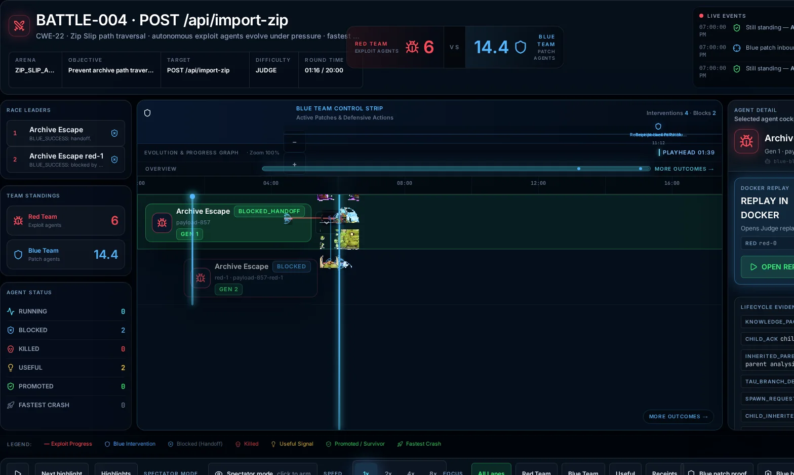
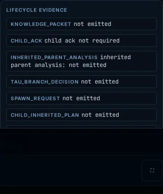
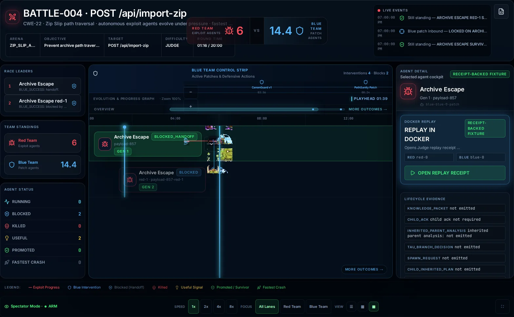
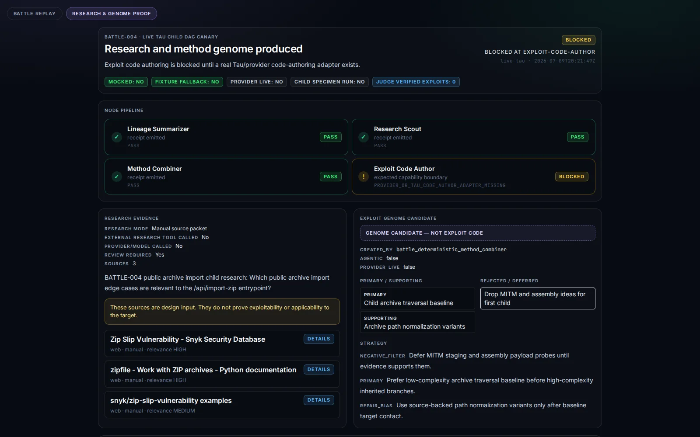

# Battle


Battle is a Red vs Blue security competition skill. It creates isolated target
workspaces, lets Red attack and Blue defend, scores the round outcomes, and
preserves enough state to resume, report, or inspect a long-running campaign.

The skill is designed for adversarial security work, not generic task routing:
Red finds and proves vulnerabilities; Blue patches or hardens; the orchestrator
tracks rounds, scores, termination conditions, and reports.

Agents must treat [`SKILL.md`](SKILL.md) as the runtime contract. This README is
the human/operator guide.

## Current Battle State

The authoritative current-state artifact is generated from receipts and GitHub
issue state:

- [`CURRENT_STATUS.json`](CURRENT_STATUS.json)
- [`docs/status/README.md`](docs/status/README.md)

Regenerate it with:

```bash
./run.sh current-status generate
./run.sh current-status check
```

Older goal files and handoffs are historical unless their claims appear in
`CURRENT_STATUS.json`.

## How Battle Works

Battle is a stochastic exploit-code evolution system wrapped in deterministic
proof gates.

Red subagents may write exploit-shaped code by combining high-level, low-level,
obscure, inherited, researched, or randomly paired methods. Many generated
specimens are expected to be bad: they may fail to compile, fail at runtime,
contact the target without useful effect, or combine irrelevant ideas.

Battle does not treat generated code as proof. Battle treats it as genetic
material.

The control plane owns:

- method menus;
- Docker execution;
- stdout/stderr/HTTP/packet/timing observations;
- specimen run receipts;
- spawn policy;
- scoreboards;
- normalized UX truth.

Tau owns:

- research nodes;
- method recombination;
- exploit-code authoring;
- compile-repair loops;
- child DAG execution.

Judge owns:

- exploit success;
- Blue block;
- regression preservation;
- terminal outcome.

Runnable code is not exploit success. Target contact is not exploit success.
Judge replay is required before any exploit-success claim.

## Use It For

| Need | Start here |
|---|---|
| See available Battle commands | `./run.sh --help` |
| Run a source-code Red vs Blue round | `./run.sh battle /path/to/codebase --rounds 10` |
| Inspect recent battle state | `./run.sh status` |
| Generate a battle report | `./run.sh report <battle-id>` |

## Qualification Gates

Battle uses separate gates so fast sanity is not confused with live Arena/Pixi
readiness:

| Tier | Command | Proves | Does not prove |
|---|---|---|---|
| Fast offline sanity | `./run.sh tiered-gate fast-sanity --out /tmp/battle-tiered/fast.json` | Root layout, package imports, deterministic fixture receipt, committed contract health | Live Tau, Docker Judge, browser, or provider readiness |
| Deterministic backend/spectator contracts | `./run.sh tiered-gate deterministic --out-dir /tmp/battle-tiered/backend --receipt-out /tmp/battle-tiered/backend/receipt.json` | Deterministic backend contracts and committed spectator fixture integrity | Live Arena, live Pixi, live provider, or browser execution |
| Live same-run Arena-to-Pixi qualification | `./run.sh tiered-gate live --arena-receipt <arena-run-receipt.json> --pixi-receipt <pixi-proof.json> --out /tmp/battle-tiered/live.json` | Supplied Arena and Pixi receipts are non-mocked, live, same-run, current-source, and not fixture-backed | Creating a new live run; provider reliability beyond those receipts |
| Same-run receipt validation | `./run.sh tiered-gate same-run-live --same-run-receipt <qualification-receipt.json> --out /tmp/battle-tiered/live.json` | A single same-run Arena/Tau/Judge/Pixi receipt is live, current-source, browser/CDP-backed, and not fixture-backed | Creating a new live run; provider reliability beyond that receipt |

The live tier fails closed when source commit/tree metadata is missing or stale,
when run ids differ, or when the browser/Pixi state is fixture-backed. Use the
Arena/Pixi proof command that owns the live run to generate those receipts; the
tiered gate only validates them.

## Operating Contract

Battle's production shape is intentionally simple:

```text
cron/orchestrator
  -> choose Red and Blue personas for the turn
  -> call modular Tau subagent contracts
  -> Tau uses loop / agentic harness execution
  -> loop / agentic harness uses $scillm for LLM calls
  -> run all target/team code inside Docker
  -> observe whether the system goes down or remains up
  -> write scorekeeper receipts and reports
  -> store learnings in $memory
```

The orchestrator may select one persona per team or multiple concurrent
personas per team. Every dispatched subagent must have an explicit persona
attached. Persona selection is part of the strategy surface: it encourages
creative, non-identical, and less predictable approaches while preserving the
same Tau-style schema and evidence requirements for every actor. Red and Blue
have free research access through approved agent-side skills such as `$dogpile`,
`$brave-search`, `$memory`, GitHub search, papers, docs, CVEs, and writeups.
That research freedom does not grant host execution. All target code and all
team-generated executable code runs inside Docker.

Tau is the modular subagent contract/orchestration layer for Battle. Battle
selects teams, personas, budgets, target runtimes, and score rules, then emits
Tau-style handoffs. Tau and the loop/agentic harness own subagent execution.
That harness uses `$scillm` as the LLM/model caller, giving teams access to SOTA
models, small/fast low-parameter models, and narrow specialist models without
making Battle a direct provider router.

SciLLM is internal to Tau. Battle operators and project agents must not call
`$scillm`, `/scillm`, `http://localhost:4001`, `/v1/chat/completions`, or
`/v1/scillm/*` directly for Battle proof work. Route provider/model work through
Tau DAGs, Tau command-loop nodes, or Tau skill nodes, and consume the resulting
Tau receipts.

Hard invariants:

- Host code is control plane only: schedule, dispatch, mount/copy, collect,
  score, and report.
- Target apps, exploit probes, fuzzers, payloads, repro scripts, patch builds,
  tests, migrations, dependency installs, and replay checks run in Docker.
- Docker target runtimes are disposable between rounds when needed.
- Persistent volumes carry only the round state that must survive a rebuild or
  relaunch, such as target data volumes, baseline source snapshots, Blue patch
  workspaces, crash artifacts, and scorekeeper evidence.
- Strategic context, summaries, lessons, persona performance, exploit/patch
  observations, and cross-round learning are stored in `$memory`, not only in
  local files.
- Target containers default to no network. Red and Blue research happens from
  the agent side through controlled skills unless a scenario explicitly grants
  target-container network access.
- Docker images/toolchains are selected or built dynamically for the target
  language stack. Any language required by the target may be added to the
  runtime image; Battle should not reimplement language-specific build logic.
- Model selection is strategic but routed through Tau/loop. Different personas
  and tasks may use different `$scillm` models: high-reasoning SOTA models for
  planning, low-parameter fast models for mutation generation or triage,
  specialist models for language/security niches, and batch calls for broad
  candidate generation.
- Throughput is a design goal. On a capable workstation, Battle should be able
  to schedule thousands of isolated exploit or defense mutations, with tight
  10-15 second attempt windows when the Docker runtime already has the required
  language/toolchain.
- Research can burst when needed. Red and Blue may run multiple concurrent
  `$brave-search` and `$dogpile` calls from the agent side, including 10x
  parallel Brave searches for fast strategy discovery, then store useful
  findings and dead ends in `$memory`.
- Search should be combinatorial. Red should try any and every plausible exploit
  family and combination within safety/time budgets; Blue should do the same for
  patch, hardening, configuration, testing, detection, and mitigation
  combinations. Feedback from Docker outcomes determines what gets promoted.
- Arena creators must attach a `battle.arena_balance_contract.v1` contract to
  each scenario and receipt before making competitive relevance claims. A
  scenario is not competitively relevant when Blue automatically wins every
  generation, Red automatically wins every generation, or either team lacks a
  plausible live path. Use staged vulnerabilities, decoys, regression
  constraints, bounded action budgets, Red/Blue timing fields, and a final
  balance diagnosis so the Judge can classify the arena as too easy for Blue,
  too easy for Red, balanced, or inconclusive.

Round scoring is environment-outcome based. Red wins when the target goes down,
crashes, leaks, violates an invariant, or remains exploitable inside the
allotted time. Blue wins when the target remains up through the allotted time,
the patch/hardening lands before failure, required behavior still works, and
Red's current exploit no longer succeeds. The scorekeeper records hard signals;
it is not an LLM judge.

## Round Loop

Each round is a learning and mutation cycle:

```text
1. Recall
   - read prior Battle round receipts and summaries from $memory
   - inspect project knowledge for current campaign state
   - use $memory code_symbols / ingest-code output for target structure

2. Research
   - Red and Blue run $dogpile / $brave-search / GitHub / docs / CVE research
   - the orchestrator may fan out concurrent research calls when speed matters
   - each team researches freely from the agent side

3. Mutate
   - orchestrator chooses explicit personas for each subagent
   - Red tries many penetration ideas, including rough or unlikely ones
   - Red mixes high-level and low-level techniques: auth bypasses, parser abuse,
     dependency attacks, fuzzing, memory corruption, race conditions, config
     mistakes, protocol quirks, payload chains, and crash reproducers
   - Red intentionally tries odd combinations because warm-pond evolutionary
     exploit search depends on mutation, recombination, and selection
   - Blue tries patch, hardening, test, config, and mitigation variants
   - both teams combine candidate tactics aggressively instead of testing only
     one neat idea at a time
   - all executable attempts run inside Docker
   - short-lived Docker attempts are scheduled aggressively when the runtime is
     already warm and has the required language support

4. Score
   - system down before allotted time favors Red
   - system still up after allotted time with behavior preserved favors Blue
   - scorekeeper writes objective receipts and artifacts

5. Promote
   - successful exploit, patch, defense, persona, and research strategies are
     promoted into $memory for future rounds
   - successful combinations are promoted more strongly than isolated tactics
     because the interaction is often the winning strategy
   - failed or low-value mutations are retained as negative evidence so teams
     avoid repeating them blindly
```

This is intentionally evolutionary. Battle should try many ideas, including
some that are naive, strange, or cross-layer combinations of high-level and
low-level exploits, because surprising attacks and defenses can win. The gate is
not whether an idea sounds elegant; the gate is whether Docker evidence shows
that it brought the system down or kept it up. Successful mutations are
promoted; failed mutations remain searchable negative evidence.

## Current Proof Rungs

| Rung | Command | What it proves | What it does not prove |
|---|---|---|---|
| Battle v0 fixture | `./run.sh battle-fixture battle-001 --out /tmp/battle-001` | Local Red -> Blue -> Judge receipt contract | Live Red/Blue agents, Tau, memory learning |
| BATTLE-004 Tau public-only | `./run.sh arena-tau-public-only-proof ...` | Arena public/private split, Tau handoff, Judge replay of materialized artifacts | Full genetic spawning or pre-kill child survival |
| Exploit combiner proof | `./run.sh exploit-combiner-proof battle-004 --out /tmp/battle-004-combiner` | Generated/bad/runnable specimen lifecycle, Docker receipts, target contact, no exploit-success overclaim | Live Tau code generation, child materialization, Judge exploit success |
| Spawn Architect proof | `./run.sh spawn-architect-proof battle-004 --out /tmp/battle-004-spawn-architect --parent-combiner-proof /tmp/battle-004-combiner` | Child knowledge packet and Tau child DAG birth contract | Live Tau DAG execution, child exploit code, target execution |
| Live child Tau DAG canary | `./run.sh live-tau-child-dag-canary battle-004 --out /tmp/battle-004-live-tau-child-dag --spawn-architect-proof /tmp/battle-004-spawn-architect` | Battle can preflight and invoke the existing local Tau DAG runtime without fixture fallback, produce Tau-validated source-bearing research receipts, deterministically combine child methods, and reach the PR3c provider-authorship boundary | Compile repair, Docker child execution, or exploit success unless later Tau/Judge receipts prove them |
| PR3c synthesis fixture | `./run.sh normalize-synthesis-fixture /tmp/battle-004-live-tau-child-dag --out local/battle-004-pr3c-synthesis --public-out spectator/public/battle-fixtures/battle-004-pr3c-synthesis` | UX-safe provider-authored specimen materialization fixture with provider/model attestation, code hash, bounded code preview, and strict NOT_RUN execution boundary | Compile pass, runnable child, target contact, Docker execution, Judge success, Blue outcome, packet behavior, or memory promotion |
| PR3d compile fixture | `./run.sh normalize-compile-fixture /tmp/battle-004-live-tau-child-dag --out local/battle-004-pr3d-compile --public-out spectator/public/battle-fixtures/battle-004-pr3d-compile` | UX-safe immutable specimen version timeline with compile attempt, compile failure/pass state, stderr summary, repair fields, and version hashes | Runnable child, runtime success, target contact, Docker execution, Judge success, Blue outcome, packet behavior, or memory promotion |
| PR4 runtime/Judge fixture | `./run.sh normalize-runtime-judge-fixture /tmp/battle-004-combiner --out local/battle-004-pr4-runtime-judge --public-out spectator/public/battle-fixtures/battle-004-pr4-runtime-judge` | UX-safe Docker specimen runtime summaries, container policy, exit/stdout/stderr summaries, target-contact-unproven state, and explicit Judge NOT_RUN progression | Exploit success, Blue outcome, Judge success, packet behavior, memory promotion, or target contact as exploit proof |
| PR5 population fixture | `./run.sh normalize-population-fixture /tmp/battle-004-combiner --out local/battle-004-pr5-population --public-out spectator/public/battle-fixtures/battle-004-pr5-population` | UX-safe specimen cards, generation axis, receipt-backed parent-child lineage, fitness vectors, novelty, and selection labels from combiner receipts | Full autonomous population engine, live Tau code generation, provider-authored specimens, exploit success, Blue outcome, Judge success, packet behavior, or memory promotion |
| PR6 genetic Pixi fixture | `./run.sh normalize-genetic-pixi-fixture . --out local/battle-004-pr6-genetic-pixi --public-out spectator/public/battle-fixtures/battle-004-pr6-genetic-pixi` | UX-safe composite demonstration of separately proven lifecycle stages | Causal continuity; the fixture declares four source runs and synthetic presentation ordering |
| Adaptive Red/Blue lineage canary | `./run.sh adaptive-red-blue-lineage-canary battle-004 --out /tmp/battle-004-adaptive-red-blue-lineage --run-id <id>` | Two simultaneous Tau/SciLLM Red/Blue generations on one Arena target, evidence-backed spawn decisions, inherited Judge knowledge, Tau-gated Brave research, changed child artifacts, Docker Judge replay, and deterministic selection | Child improvement, high-throughput readiness, multiple vulnerabilities, or durable memory promotion |
| PR8 live transport contract | `./run.sh publish-live-transport-contract --out local/battle-004-pr8-live-transport --public-out spectator/public/battle-fixtures/battle-004-pr8-live-transport` | UX-safe SSE snapshot/event contract with event id, sequence, reconnect, gap handling, receipt refs, genetic event vocabulary, and raw-path boundaries | Implemented SSE/WebSocket endpoint, live stream execution, live genetic events, exploit success, Blue outcome, Judge success, packet behavior, or memory promotion |
| PR8 executable SSE adapter | `./run.sh prove-live-transport-server --out local/battle-004-pr8-live-transport-server-proof` | Local HTTP adapter serves `battle.snapshot.v1`, ordered `battle.live_event.v1` SSE, `Last-Event-ID` resume, and future-cursor fail-closed behavior from normalized fixture authority | Production deployment, WebSocket, direct Tau/provider/Docker/Judge raw path access, exploit success, Blue outcome, Judge success, packet behavior, or memory promotion |

Battle v0 remains the safer first rung to run when checking the artifact
contract. The combiner and Spawn Architect rungs are the current backend proof
path for genetic exploit synthesis.

## Genetic Exploit Flow

```text
Scan + Arena public bundle
   ↓
Exploit method menu
   ↓
Parent Red subagent writes exploit specimen code
   ↓
Battle runs specimen in Docker
   ↓
stdout/stderr/http/packet/timing receipts
   ↓
Runnable? Target contact? Stalled? Pressure suspected?
   ↓
Spawn policy decision
   ↓
Spawn Architect creates child knowledge packet + Tau DAG
   ↓
Tau child DAG:
  research → method-combine → code-author → compile-repair → Battle handoff
   ↓
Battle runs child specimen in Docker
   ↓
Judge proves or rejects exploit success
   ↓
Memory promotes replayable wins and retains failures
```

The first live Tau rung is a canary, not a success claim. If Tau cannot run the
DAG, rejects the DAG, omits required receipts, or fails to produce
`battle_exploit_runner_handoff.json`, Battle records `BLOCKED` with
`fixture_fallback_used:false`.

The PR3b canary materializes Tau command specs beside the Spawn
Architect DAG and invokes `battle_skill.child_dag_node_adapter` through the real
Tau command loop. It should pass `lineage-summarizer`, pass `research-scout`
with Tau-validated `tau.research_source_receipt.v1` design-input receipts, pass
`method-combiner` with `battle.child_exploit_genome.v1`.

The PR3c boundary wires `exploit-code-author` to a Battle wrapper around Tau's
SciLLM worker route. It writes a Battle semantic work order, a Tau
`tau.executor.scillm_worker.v1` work order, a provider workspace baseline, and
provider-authorship receipts. PR3c may still block unless Tau returns
`provider_live:true` attestation from a real provider/model run. Battle must not
infer provider authorship from HTTP success, and fixture child code fallback is
forbidden.

The proof-card UX contract is a separate normalized fixture.

Route: `#battle/proof?fixture=battle-004-pr3b` (legacy alias: `#battle/proof-card?kind=pr3b-research-combiner`).

```text
local/battle-004-pr3b-proof-card/battle.normalized_proof_card_fixture.json
spectator/public/battle-fixtures/battle-004-pr3b-proof-card/battle.normalized_proof_card_fixture.json
```

UX should consume that fixture only. It must not walk Tau's
`command-loop/command-artifacts` directories.

The UX3 synthesis contract is also a separate normalized fixture.

Route: `#battle/synthesis?fixture=battle-004-pr3c-synthesis`.

```text
local/battle-004-pr3c-synthesis/battle.normalized_synthesis_fixture.json
spectator/public/battle-fixtures/battle-004-pr3c-synthesis/battle.normalized_synthesis_fixture.json
```

UX should consume that fixture only. It must not read `tau-dag-run/**`,
`command-loop/command-artifacts/**`, provider workspace directories, provider
request transcripts, or raw worker results. The fixture is strict PR3c scope:
provider-authored specimen materialized, while compilation, runtime, target
contact, Judge replay, packet behavior, Blue outcomes, and memory promotion are
all `NOT_RUN`.

The UX4 compile contract is a separate normalized fixture.

Route: `#battle/compile?fixture=battle-004-pr3d`.

```text
local/battle-004-pr3d-compile/battle.normalized_compile_fixture.json
spectator/public/battle-fixtures/battle-004-pr3d-compile/battle.normalized_compile_fixture.json
```

UX should consume that fixture only. It must not read `tau-dag-run/**`,
`command-loop/command-artifacts/**`, provider workspace directories, SciLLM or
OpenCode runtime directories, or raw compile stderr paths. The version timeline
is driven by `specimen_versions[]`; the stderr panel is driven by
`compile.stderr_summary`; the selected version panel is driven by
`selected_version`. Compile pass is not runnable, and runtime, target contact,
Judge replay, packet behavior, Blue outcomes, and memory promotion remain
`NOT_RUN` unless later fixtures explicitly promote those receipts.

The UX5 runtime/Judge contract is a combined normalized fixture.

Route: `#battle/runtime?fixture=battle-004-pr4`.

```text
local/battle-004-pr4-runtime-judge/battle.normalized_runtime_judge_fixture.json
spectator/public/battle-fixtures/battle-004-pr4-runtime-judge/battle.normalized_runtime_judge_fixture.json
```

UX should consume that fixture only. It must not read raw combiner specimen
directories, `tau-dag-run/**`, `command-loop/command-artifacts/**`, provider
workspace directories, SciLLM/OpenCode runtime directories, raw stdout/stderr
paths, or Docker mount paths. The Docker policy panel is driven by
`runtime.docker`; runtime cards are driven by `runtime.specimen_runs[]`; the
summary row is driven by `runtime.summary`; Judge progression is driven by
`judge`. This fixture may show `TARGET_CONTACT_UNPROVEN`, but target contact is
not exploit success. Judge remains `NOT_RUN` until a later receipt-backed Judge
fixture exists.

The UX6 population contract is a separate normalized fixture.

Route: `#battle/population?fixture=battle-004-pr5-population`.

```text
local/battle-004-pr5-population/battle.normalized_population_fixture.json
spectator/public/battle-fixtures/battle-004-pr5-population/battle.normalized_population_fixture.json
```

UX should consume that fixture only. It must not read raw combiner specimen
directories, `tau-dag-run/**`, `command-loop/command-artifacts/**`, provider
workspace directories, Docker mount paths, raw stdout/stderr paths, or Judge
internals. Specimen grid cards are driven by `specimen_cards[]`; the lineage
tree is driven by `lineage_edges[]`; the generation scrubber is driven by
`generation_axis`; the claim banner is driven by `claim_boundary`. This fixture
is a bounded combiner-population view: it records multiple receipt-backed
specimens and generations, but it does not prove the full autonomous genetic
population engine, live Tau code generation, provider-authored specimens,
exploit success, Blue outcomes, packet behavior, Judge success, or memory
promotion.

The UX7 genetic Pixi replay contract enriches the existing race fixture schema
with a `genetic_lifecycle` block and receipt-backed top-level events.

Legacy composite route: `#battle/receipt?engine=pixi&fixture=battle-004-pr6-genetic-pixi`.

PR6 is retained only as a composite presentation demonstration. Its stages come
from four source runs with synthetic presentation ordering, so it is not the
default adaptive replay and does not prove one causal genetic campaign.

```text
local/battle-004-pr6-genetic-pixi/battle.normalized_ux_fixture.json
spectator/public/battle-fixtures/battle-004-pr6-genetic-pixi/battle.normalized_ux_fixture.json
```

UX7 should consume that normalized replay fixture only. It must not read
`tau-dag-run/**`, `command-loop/command-artifacts/**`, provider workspace
directories, raw combiner paths, Docker mount paths, raw stdout/stderr paths, or
Judge internals. The field map is:

```text
route = genetic_lifecycle.route
fixture URL = genetic_lifecycle.fixture_url
event vocabulary = genetic_lifecycle.required_event_types
present events = genetic_lifecycle.present_event_types
not emitted = genetic_lifecycle.not_emitted_event_types / not_emitted_reasons
lane id = events[].payload.lane_id
specimen id = events[].payload.specimen_id
method id = events[].payload.method_id
receipt id = events[].payload.receipt_id / events[].evidence.receipt_id
playhead placement = events[].elapsed_seconds / events[].payload.playhead_x
claim banner = genetic_lifecycle.claim_boundary
```

The current fixture emits `research_started`, `research_receipt_materialized`,
`genome_selected`, `method_added`, `method_rejected`, `code_author_started`,
`specimen_materialized`, `compile_failed`, `compile_passed`,
`target_contact_unproven`, `judge_pending`, and `branch_abandoned`. It
explicitly leaves `repair_started`, `repair_materialized`,
`judge_exploit_success`, and `genome_promoted` as `NOT_EMITTED`. UX7 must not
show victory, kill, containment, exploit success, Blue outcome, packet behavior,
or memory promotion from research, genome, code, compile, target-contact, or
pending-Judge events. Compile pass is not runnable proof. Target contact is not
exploit proof.

The UX8 live transport contract publishes the backend-owned shape for the first
SSE live surface without claiming that a live endpoint has executed.

Route: `#battle/live?engine=pixi&battle=battle-004`.

```text
local/battle-004-pr8-live-transport/battle.live_transport_contract.json
spectator/public/battle-fixtures/battle-004-pr8-live-transport/battle.live_transport_contract.json
```

UX8 should consume this contract as the authoritative transport surface. It
must not read `tau-dag-run/**`, `command-loop/command-artifacts/**`, provider
workspace directories, raw combiner paths, Docker mount paths, raw
stdout/stderr paths, or Judge internals. The field map is:

```text
schema = battle.live_transport_contract.v1
route = frontend_handoff.route
snapshot endpoint = initial_snapshot.endpoint
snapshot schema = initial_snapshot.schema
SSE endpoint = event_stream.endpoint
event schema = event_stream.event_schema
ordering = event_stream.ordering.seq_field / event_stream.ordering.event_id_field
receipt reference = event_stream.ordering.receipt_ref_field
reconnect = reconnect.header / reconnect.resume_from
gap handling = gap_semantics.on_gap
genetic event vocabulary = frontend_handoff.genetic_event_types
claim banner = claim_boundary
```

This contract is `live: contract_only`. It allows the frontend to implement the
SSE client against stable backend semantics, but it explicitly does not prove
that `/battle/live/battle-004/snapshot` or `/battle/live/battle-004/events`
exists, that a stream was executed, or that any live genetic event was emitted.

The executable UX8 SSE adapter serves the same endpoint shape from a normalized
fixture source:

```bash
./run.sh serve-live-transport \
  --fixture spectator/public/battle-fixtures/battle-004-pr6-genetic-pixi/battle.normalized_ux_fixture.json \
  --battle-id battle-004 \
  --host 127.0.0.1 \
  --port 8765
```

Runtime endpoints:

```text
GET http://127.0.0.1:8765/battle/live/battle-004/snapshot
GET http://127.0.0.1:8765/battle/live/battle-004/events
```

The proof command starts the adapter on an ephemeral local port and verifies
snapshot response, full SSE replay, `Last-Event-ID` resume, and future
`Last-Event-ID` fail-closed behavior:

```bash
./run.sh prove-live-transport-server --out local/battle-004-pr8-live-transport-server-proof
```

Proof receipt:

```text
local/battle-004-pr8-live-transport-server-proof/live-transport-server-proof.json
```

This executable adapter proves local HTTP/SSE behavior. It still does not prove
a production deployment, WebSocket support, live Tau/provider/Docker/Judge raw
runtime reads, exploit success, Blue outcomes, Judge success, packet behavior,
or memory promotion.

## Claim Boundaries

Battle uses strict proof language:

- Generated exploit code is not proof.
- Compiled exploit code is not proof.
- Runnable exploit code is not proof.
- Target contact is not proof.
- Research citations are not proof.
- Spawn intent is not child execution.
- Pressure suspicion is not Blue detection.
- Blue patch presence is not Blue success.
- Judge replay is required for exploit success or Blue block.

## UX Screenshots

Screenshots in this README are generated from receipt-backed fixtures or
explicit local preview receipts. They are visual evidence only; battle truth
still comes from JSON receipts, Judge receipts, scoreboards, and normalized UX
fixtures.

| View | Fixture/source | Screenshot | Validation |
|---|---|---|---|
| BATTLE-004 spectator replay (parent spawn) | `spectator/public/battle-fixtures/battle-004-parent-spawn-pixi-replay/battle.normalized_ux_fixture.json` | `docs/assets/screenshots/battle-004-spectator-replay.webp` | `cd spectator && npm run prove:receipt-replay` |
| Lifecycle evidence cockpit (fail-closed) | same fixture; agent pane `data-qid="battle:agent-pane:lifecycle-evidence"` | `docs/assets/screenshots/battle-004-lifecycle-cockpit.webp` | `cd spectator && npm run prove:receipt-replay` (check 7) |
| Retired kill-shot route (fail-closed) | `spectator/public/battle-fixtures/battle-004-kill-shot-pixi-replay/unsupported.json` | n/a | `cd spectator && npm run prove:kill-shot-pixi` |
| Spawn/block receipt beats (Pixi VFX) | parent-spawn fixture frozen at `pixiSeconds=99.4` | `docs/assets/screenshots/battle-004-spawn-block-vfx.webp` | `cd spectator && npm run prove:receipt-director-spawn-block` |
| PR3b research/genome proof card | `spectator/public/battle-fixtures/battle-004-pr3b-proof-card/battle.normalized_proof_card_fixture.json` | `docs/assets/screenshots/battle-004-pr3b-proof-card.webp` | `cd spectator && npm run prove:pr3b-proof-card` |
| PR3d compile fixture | `spectator/public/battle-fixtures/battle-004-pr3d-compile/battle.normalized_compile_fixture.json` | planned | `./run.sh validate-compile-fixture spectator/public/battle-fixtures/battle-004-pr3d-compile/battle.normalized_compile_fixture.json` |
| Battle monitor v0 | `/tmp/battle-001` copied into `monitor/battle/public/artifacts/battle-001` | planned | `cd monitor/battle && npm run test:e2e` |
| Future combiner loop | `/tmp/battle-004-combiner/normalized/battle-004-combiner.normalized.json` | planned | `./run.sh exploit-combiner-proof battle-004 --out /tmp/battle-004-combiner` |
| Future Spawn Architect DAG | `/tmp/battle-004-spawn-architect/normalized/battle-004-spawn-architect.normalized.json` | planned | `./run.sh spawn-architect-proof battle-004 --out /tmp/battle-004-spawn-architect --parent-combiner-proof /tmp/battle-004-combiner` |

Regenerate README screenshots (requires ux-lab on `:3002` or `BATTLE_HOST`):

```bash
cd spectator && node scripts/capture-readme-screenshots.mjs
cd .. && python3 scripts/compress-readme-screenshots.py
```









## Quickstart

Run from `skills/battle`:

```bash
./run.sh --help
```

Run a normal source-code battle:

```bash
./run.sh battle /path/to/codebase --rounds 10
```

Run an overnight battle:

```bash
./run.sh battle /path/to/codebase --overnight
```

Run a Docker target:

```bash
./run.sh battle --docker-image myapp:latest --rounds 100
```

Run a QEMU/firmware target:

```bash
./run.sh battle firmware.bin --qemu-machine arm --rounds 100
```

Inspect recent battles:

```bash
./run.sh status
```

Resume a paused battle:

```bash
./run.sh resume <battle-id>
```

Generate a report:

```bash
./run.sh report <battle-id>
```

## Battle v0 Fixture Proof

Battle v0 runs a deterministic fixture:

```text
Red proves a seeded path traversal exploit
Blue applies a deterministic patched file
Judge verifies the synced arena independently
Scoreboard derives from the Judge receipt
Monitor renders generated artifacts
```

Run it from `skills/battle`:

```bash
./run.sh battle-fixture battle-001 --out /tmp/battle-001
```

Expected backend artifacts:

```text
/tmp/battle-001/battle-plan.json
/tmp/battle-001/red-receipt.json
/tmp/battle-001/blue-receipt.json
/tmp/battle-001/judge/judge-receipt.json
/tmp/battle-001/scoreboard.json
/tmp/battle-001/monitor-index.json
/tmp/battle-001/run-receipt.json
```

The Battle v0 run receipt states the claim boundary:

```text
mocked: no
live: local_deterministic_fixture
agentic: false
models_used: []
```

This proves only the deterministic fixture contract. It does not prove real Red
agent behavior, real Blue agent behavior, scillm, OpenCode, anvil, code-runner,
memory learning, Docker, QEMU, or multi-round campaign readiness.

## Normalized UX JSON Contract

Battle can emit a normalized JSON fixture for the spectator UX. The UX must
render this contract as data; it must not infer child lanes, Blue kills, fastest
crashes, survivor promotions, or live replay actions from sparse receipts.

Generate a canonical BATTLE-004 parent-spawn proof when fresh receipt-backed
lineage data is needed:

```bash
./run.sh arena-tau-public-only-proof battle-004 \
  --spawn-red-child-on-blue-success \
  --red-workers 1 \
  --blue-workers 1 \
  --out /tmp/battle-004-parent-spawn-proof
```

The parent-spawn flag is fail-closed: Battle first requests one parent Red lane,
Judge-replays the parent against Blue, and requests one child Red lane only when
the parent lane has a `BLUE_SUCCESS` handoff. The emitted
`run-receipt.json#lineage_request` records whether lineage was requested and
whether `lineage-receipts.json` was produced.

Generate normalized JSON from a Battle proof directory:

```bash
./run.sh generate-ux-fixture \
  --input /path/to/battle-proof \
  --battle-id battle-004 \
  --out /tmp/battle-004.normalized.json
```

Validate the backend values, portable JSON Schema, and fail-closed render
guards:

```bash
./run.sh validate-ux-contract /tmp/battle-004.normalized.json
```

Validate the checked-in backend handoff bundle before a renderer consumes it:

```bash
./run.sh validate-ux-handoff-summary local/battle-004-ux-json-contract-summary.json
```

Stable local JSON handoff artifacts are checked into the Battle skill for UI
implementers and reviewers:

```text
local/battle-004-parent-spawn.normalized.json
local/battle-004-sparse.normalized.json
local/battle-004-ux-json-contract-summary.json
```

The parent-spawn artifact is receipt-backed with `mocked=false`,
`lineage.mode=receipt_backed`, and `child_spawn_count=1`. The sparse artifact is
receipt-backed with `mocked=false`, `lineage.mode=missing`, and
`child_spawn_count=0`. The summary file names both artifacts and is covered by
`tests/test_battle_event_adapter_contract.py`, which validates that the summary
matches the actual local normalized JSON values.

The local handoff summary locks the canonical BATTLE-004 source contract to
`/api/import-zip`, `CWE-22`, and Zip Slip path traversal. The validator compares
both local normalized fixtures against that lock and fails closed if a fixture
drifts to another route, CWE, vulnerability family, or shell title.

The portable JSON Schema enforced by `validate-ux-contract` is:

```text
schemas/battle.normalized_ux_fixture.v1.schema.json
```

The validator checks that:

- `scenario.public_entrypoint` is a path such as `/api/import-zip`, not a
  method-prefixed label.
- `spectator_shell` provides receipt-backed header, fact chip, score, round
  time, and receipt ticker values for the shell. The UX should render these
  values instead of hard-coding mockup copy or labeling receipt playback as
  live execution.
- `renderer_binding_contract` provides exact JSON path bindings for the shell,
  round time, scrollable timeline, moving playhead, parent spawn/collapse,
  lane label/activity layout, Agent Detail cockpit, and Docker replay CTA.
  This is a data contract for renderer implementers, not visual design authority. Optional Pixi race renderer: `docs/BATTLE_RACE_ENGINE_PIXI_SPIKE.md` (Phase 1 spike; DOM remains default)
  direction.
- `lineage_request` records requested/not-requested/proven parent-spawn state.
  It is explanatory state only; the UX must not render child lanes from
  `lineage_request` without matching `lineage.spawns[]` receipt records.
- `lineage.spawn_count`, `scoreboard.child_spawn_count`, and
  `ux_contract.receipt_backed_values.child_spawn_count` agree.
- Parent/child lane relationships exist only when a lineage receipt names both
  lanes.
- `tau.spawned_child` is absent when lineage is missing.
- `lineage.groups[]` and lane `lineageGroupId`/`collapsible` fields agree so
  the UX can render parent/child collapse state without inferring it.
- `blue.blocked_red` targets are backed by `scoreboard.per_pair`
  `BLUE_SUCCESS` verdicts.
- Replay buttons remain receipt-only unless replay metadata provides an
  executable endpoint or command receipt.
- `timeline.playhead` and `timeline.viewport` are present as receipt replay
  values; they must not be treated as live stream proof.
- `timeline.playhead.keyframes[]` lists receipt-backed lane event positions
  sorted by `x`, so the renderer can animate a moving playhead as receipt
  replay rather than live stream execution.
- Lane event markers include `label_band`, `marker_priority`, and
  `collision_group` so the renderer can avoid overlapping labels/icons without
  inventing placement rules.
- Lane `activitySegments[]` provides between-marker action phases such as
  research, payload, useful signal, handoff, patch gate, and Judge replay.
  The UX should render these values instead of inventing exploit activity.
- Lane `cockpit` is the authoritative Agent Detail/right-pane payload. It
  contains Tau identity, current turn, six public-trace fields, stdout/stderr,
  skill/tool proof labels, learned/next move, Blue outcome, latest receipt, and
  replay CTA state. The UX should not infer these values from lane labels.
  Use these exact field paths:
  `lane.cockpit.selected_tau_exploit_subagent`,
  `lane.cockpit.current_turn`, `lane.cockpit.public_trace`,
  `lane.cockpit.output.stdout`, `lane.cockpit.output.stderr`,
  `lane.cockpit.skills_tools`, `lane.cockpit.blue_outcome`,
  `lane.cockpit.latest_receipt_id`, and `lane.cockpit.replay`.
  `lane.cockpit.replay` must mirror `lane.replay` so the Agent Detail pane and
  lane-level Docker replay CTA cannot drift.
- Child lane event x-positions are rebased to the child lane `xStart`; a child
  lane must not show research, payload, patch, or Judge events before its
  receipt-backed spawn point.
- `lane.replay.cta` is present when a Judge replay receipt exists. The CTA
  label is `REPLAY IN DOCKER`, but it must stay `state=receipt_only` with a
  `disabled_reason` unless `lane.replay.can_execute_now=true` and an executable
  replay endpoint or command receipt is attached.

The skill sanity gate validates the stable local UX fixtures by default and can
also validate an extra generated UX fixture:

```bash
BATTLE_UX_CONTRACT_FIXTURE=/tmp/battle-004.normalized.json ./sanity.sh
```

## Battle Monitor

The Battle monitor is artifact-backed. It must load generated JSON from:

```text
/artifacts/battle-001/monitor-index.json
/artifacts/battle-001/scoreboard.json
/artifacts/battle-001/red-receipt.json
/artifacts/battle-001/blue-receipt.json
/artifacts/battle-001/judge/judge-receipt.json
```

To inspect the generated run in the monitor:

```bash
cd /path/to/agent-skills/skills/battle
rm -rf monitor/battle/public/artifacts/battle-001
mkdir -p monitor/battle/public/artifacts/battle-001
cp -R /tmp/battle-001/* monitor/battle/public/artifacts/battle-001/

cd monitor/battle
npm install
npm run build
npm run test:e2e
```

The monitor must fail closed with `BATTLE MONITOR BLOCKED` if required generated
artifacts are missing or unreadable.

The production monitor should be a modern React + Tailwind + shadcn + D3
tracking interface, not a decorative dashboard. Its primary object is the active
battle round: selected personas, Docker runtime state, uptime/down timer,
subagent receipts, exploit/patch evidence, scorekeeper signals, persistent
volume/artifact state, and `$memory` learning writes.

The D3 layer should visualize Red and Blue activity in near real time:
exploit/defense attempts, combinations, persona lanes, container attempts,
crashes, patches, scorekeeper events, promotions, and negative-evidence trails.
The interaction model should feel closer to an Unsloth Studio training run view
than a static report: a live stream of attempts, metrics, rates, current
leaders, resource pressure, and promotion decisions, with enough detail to
inspect a specific attempt without losing the global race.
Because Battle stores attempts, outcomes, promotions, failures, personas, and
code-context links in `$memory`, the monitor should also expose a live graph
view of related exploit and defense mutations. Nodes can represent exploit
families, concrete attempts, payload chains, target code symbols, Blue
mitigations, personas, and promoted memories. Edges can represent mutation,
recombination, blocked-by, promoted-from, code-symbol, same-CWE, same-endpoint,
or same-crash relationships. Graph traversal and BM25 recall from `$memory`
should drive search, clustering, and "show related attempts" interactions.
For 100s or 1000s of live exploit attempts, prefer a Canvas/WebGL graph layer
such as a React force-graph or PixiJS-style renderer using D3 force/layout math,
not one SVG element per event. Keep SVG/React for axes, labels, selection
chrome, tooltips, accessible summaries, and the right-sidebar drill-down. The
operator should be able to click a node or event and answer immediately: what
exploit is being tried, where it is occurring, what status it is in, what Blue
did in response, whether the system stayed up, and whether the mutation was
promoted to `$memory`.
Use React for DOM ownership and D3 for scales/layout/math. Use keyed data,
`ResizeObserver`, responsive `viewBox`, colorblind-safe redundant encodings, and
a hidden accessible data table. For thousands of live attempts, use a Canvas/SVG
hybrid: Canvas for dense event streams and SVG/React for axes, labels,
selection, and sidebar-linked detail.

The monitor also needs a right-sidebar chat/interjection surface, following the
same operational role as the Watch-style human review sidebar: the human can
course-correct, pause, redirect persona selection, approve or reject a proposed
goal change, and add context without breaking the artifact trail. Sidebar
messages must become schema-valid handoffs or human-interjection records before
they affect the orchestrator. Interactive controls must have stable
`data-qid`, `data-qs-action`, and `title` attributes, and UI acceptance requires
a fresh live CDP screenshot plus the Playwright checks.

Battle Monitor v1 includes the first local version of this sidebar. It uses the
same shared-chat interaction pattern as Watch: starter chips, message bubbles,
composer, stable `data-qid` selectors, and `data-qs-action` command hooks. In
v1, submitted messages create local `battle.human_interjection.v1` preview
receipts only. They do not yet mutate Tau, cron, Docker execution, persona
selection, or scorekeeper state.

## Architecture

The skill root is an entrypoint and documentation surface. Python
implementation lives under `src/battle_skill/`; normal users and agents should
invoke `./run.sh` rather than importing root-level files.

Core modules:

```text
src/battle_skill/cli.py Typer CLI entry point
src/battle_skill/orchestrator.py multi-round game loop
src/battle_skill/digital_twin.py git worktree, copy, Docker, and QEMU isolation
src/battle_skill/red_team.py Red Team attack agent
src/battle_skill/blue_team.py Blue Team defense agent
src/battle_skill/scoring.py AIxCC-style scoring
src/battle_skill/state.py BattleState and round data classes
src/battle_skill/memory.py team-isolated memory
src/battle_skill/memory_integration.py shared memory and taxonomy hooks
src/battle_skill/report.py Markdown report generation
src/battle_skill/exploit_combiner.py fixture/live specimen lifecycle proof
src/battle_skill/exploit_specimens.py specimen schemas and receipt helpers
src/battle_skill/spawn_policy.py strategic pre-kill / stalled spawn decisions
src/battle_skill/spawn_architect.py child knowledge packet + Tau DAG authoring
src/battle_skill/child_knowledge_packet.py inheritance packet builder
src/battle_skill/tau_child_dag.py Tau DAG birth contract writer/validator
```

Battle v0 modules:

```text
src/battle_skill/battle_fixture.py deterministic fixture runner
src/battle_skill/judge.py deterministic scorekeeper-style verifier
src/battle_skill/receipts.py receipt dataclasses and JSON writer
fixtures/battle-001/    seeded path traversal target and patch
monitor/battle/         React artifact monitor and Playwright checks
docs/BATTLE_V0.md      detailed Battle v0 validation contract
```

## Scoring Terms

- **ASC**: Attack Success Count, unique exploits discovered.
- **TDSR**: True Defense Success Rate, vulnerabilities fixed while functionality
  still works.
- **FDSR**: Fake Defense Success Rate, attack blocked but functionality broken.

Battle v0 preserves `INSUFFICIENT_EVIDENCE` as a first-class status. It does not
collapse insufficient evidence into failure, because a failed battle and an
unscoreable battle are different operational states.

## Evidence Discipline

For Battle reports, use explicit proof language:

```text
mocked: yes|no
live: yes|no or named local/live scope
what was exercised
what remains unverified
artifact paths
```

Receipts are evidence carriers, not the work itself. A Blue patch claim is not
accepted as a successful defense until an independent Judge or equivalent
deterministic gate verifies exploit blocking and regression behavior.

## Skill Integration Notes

- `$hack` is a sibling skill. Battle must delegate to it through skill/Tau
  contracts, not `import hack`.
- Red-team `$hack` usage belongs behind an `agent-skills/agents` subagent
  dispatch. Battle chooses the persona, passes the target/scenario and candidate
  exploit list after scan/research/memory recall, and then collects the
  subagent receipt.
- `$memory` is accessed through its HTTP API (`POST /recall`, `POST /store`) via
  `httpx`, not raw ArangoDB imports or deprecated CLI learn calls.
- `$webgpt-review` resolves the dedicated Battle reviewer tab through
  `.ask/browser-oracles.yaml` and `$browser-oracle`.

## Storage Notes

Generated monitor dependencies should not live as a real `node_modules`
directory inside the skill folder. Use the workspace storage policy: keep heavy
dependency directories on `/mnt/storage12tb` and symlink them back when needed.

Battle runtime state defaults to:

```text
/mnt/storage12tb/skills/battle/
```

The skill root should not contain real `artifacts/`, `battles/`, `reports/`,
`worktrees/`, `.venv/`, or `node_modules/` directories.

Current Battle monitor convention:

```text
skills/battle/monitor/battle/node_modules ->
/mnt/storage12tb/skills/battle/monitor-battle/node_modules
```

## Current Limits

The deterministic Battle fixture is intentionally narrow. Production Battle
readiness still requires separate proof for:

- live Red and Blue agent behavior
- `hack`, `anvil`, and `code-runner` integration
- scillm or OpenCode-backed agent execution
- memory learning before and after rounds
- Docker-only target execution, dynamic language runtimes, and persisted volumes
- Tau-style subagent schemas, persona selection, and cron orchestration
- multi-round campaign convergence and termination behavior
- report correctness over real battle state

## Spectator package (`spectator/`)

Self-contained BATTLE-004 spectator UI + Pixi race engine. Host apps (e.g. `ux-lab`) mount this package and serve static assets from `spectator/public/` or equivalent symlinks.

```bash
# Live receipt replay proof (requires ux-lab dev host on :3012)
cd skills/battle/spectator
UX_LAB_UI_PORT=3012 node scripts/prove-battle-receipt-replay-6.mjs
```
## Receipt-Backed Music M1

Battle publishes music through the same authority split as other spectator
surfaces:

```text
Battle receipts -> music context -> validated promotion -> schedule -> normalized fixture -> renderer
```

The frozen schemas are:

```text
battle.music_context_packet.v1
battle.music_promotion_receipt.v1
battle.music_schedule_entry.v1
battle.music_schedule.v1
battle.normalized_music_fixture.v1
```

The BATTLE-004 M1 fixture is available at
`/battle-fixtures/battle-004-music-runtime/battle.normalized_music_fixture.json`.
It schedules `live_arena_loop` from the lifecycle-start receipt and
`motif:plague_nurgling` from a materialized-spawn receipt. Death, victory, and
next-arena cues are explicitly not emitted. Promoted MIDI and OGG assets live
only under `/battle-audio/promoted/v1/<promotion-id>/`.

Generate and validate the fixture with:

```bash
./run.sh normalize-music-fixture local/battle-004-pr6-genetic-pixi/battle.normalized_ux_fixture.json \
  --catalog spectator/public/battle-audio/score/v1/runtime-catalog.json \
  --out local/battle-004-music-runtime \
  --public-out spectator/public/battle-fixtures/battle-004-music-runtime \
  --public-audio-root spectator/public/battle-audio/promoted/v1
./run.sh validate-music-fixture local/battle-004-music-runtime/battle.normalized_music_fixture.json
./run.sh validate-music-fixture spectator/public/battle-fixtures/battle-004-music-runtime/battle.normalized_music_fixture.json
```

M1 uses checked-in source material with `composer_live:false`. It proves
deterministic promotion and receipt-authorized scheduling, not live composition,
browser playback, speaker output, musical quality, or Battle outcomes.
