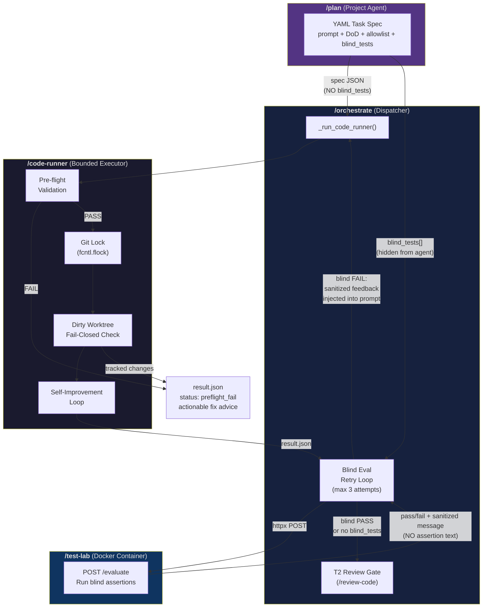
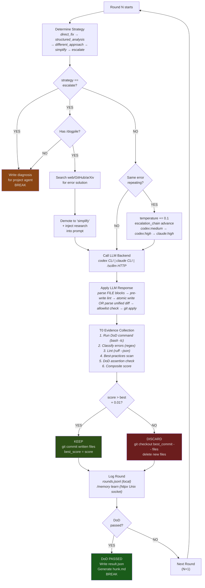
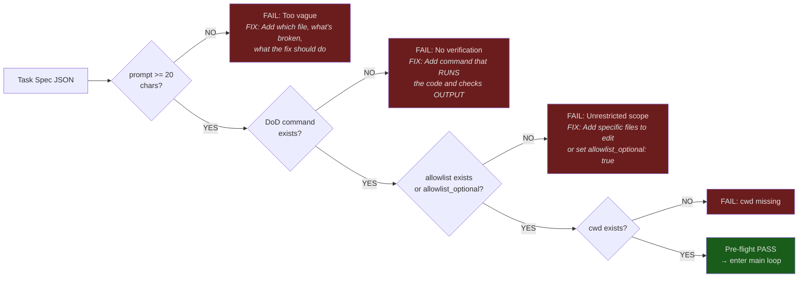
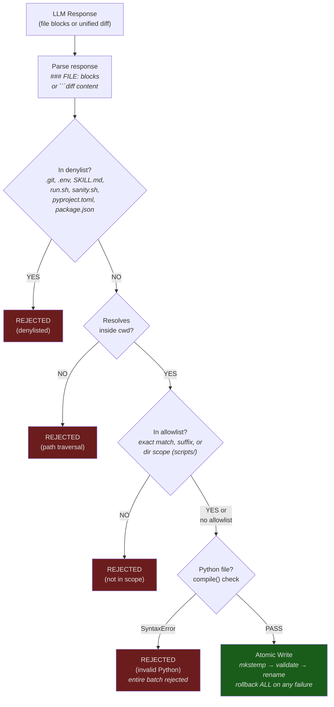
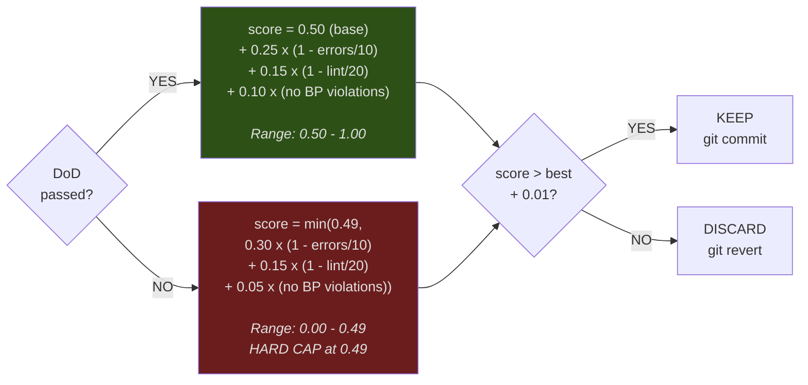
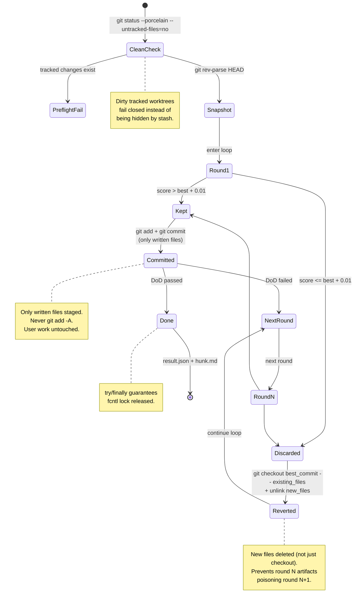
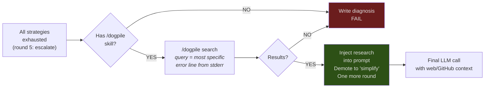
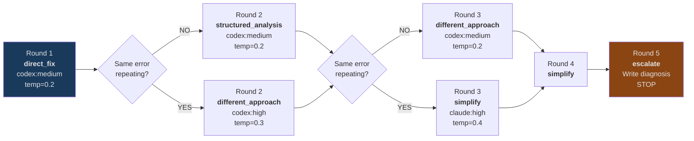
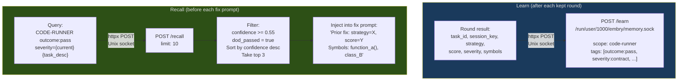

# /code-runner Architecture Walkthrough

## The Big Picture



**Rationale:** The project agent writes the plan (including hidden blind tests). Orchestrate dispatches to code-runner but NEVER passes blind_tests to it — that's the information barrier. Code-runner only sees the visible prompt and DoD. After code-runner passes DoD, orchestrate sends the blind tests to test-lab's Docker container. If blind eval fails, orchestrate retries code-runner with sanitized failure feedback (never the actual test assertions).

---

## The Self-Improvement Loop (Inside /code-runner)



**Rationale — why keep/discard instead of always overwriting:**

The autoresearch pattern (Karpathy, 2025) ensures monotonic quality improvement. If round 2 produces worse code than round 1, we revert to round 1's committed state. The LLM never builds on a regression. This prevents the "fix one bug, introduce two" spiral that kills naive retry loops.

**Rationale — why strategy escalation:**

Round 1 tries the obvious fix. If the same error repeats, the LLM is stuck in a local minimum — repeating the same approach won't help. Strategy escalation forces fundamentally different approaches. Dynamic temperature (LLMLOOP pattern, ICSME 2025) adds randomness to break out.

**Rationale — why escalation chain (backend + reasoning):**

Different models have different blind spots (Warp SWE-bench finding, 75.8%). If codex at medium reasoning can't solve it after 2 rounds, escalating to codex at high reasoning (2x max_tokens) or switching to claude gives a fresh perspective. The chain is: `codex:medium → codex:high → claude:high`.

---

## Pre-flight Validation



**Rationale:** A vague spec like "fix the code" with no DoD will waste 5 rounds producing garbage. The preflight catches this before any LLM call. Each error includes the exact field, why it matters, and a concrete example of what to put in the spec — so the planning agent can self-correct without human intervention.

---

## File Safety Model



**Rationale — why 5 layers of safety:**

1. **Denylist** — the LLM must never overwrite configuration files, even if the prompt asks it to
2. **Path boundary** — `resolve()` + `relative_to()` prevents `../../../etc/passwd` attacks (not string prefix matching, which has the `/repo2` startswith `/repo` bug)
3. **Allowlist** — default-deny when provided. Supports directory scopes (`scripts/` allows `scripts/foo.py`)
4. **Pre-write lint** — SWE-agent pattern. Reject syntactically invalid Python BEFORE writing to disk, saving a wasted round
5. **Atomic write** — temp files first, then rename all-or-nothing. On any failure, all temp files are cleaned up

---

## Blind Evaluation (Information Barrier)

```mermaid
sequenceDiagram
    participant PA as Project Agent<br/>(/plan)
    participant OR as /orchestrate
    participant CR as /code-runner
    participant TL as /test-lab<br/>(Docker)

    PA->>OR: YAML plan<br/>task + blind_tests[]

    Note over OR: blind_tests stored<br/>in TaskRuntime<br/>NEVER sent to code-runner

    rect rgb(40, 40, 60)
        Note over OR,CR: Attempt 1
        OR->>CR: spec JSON (prompt + DoD)<br/>NO blind_tests
        CR->>CR: Self-improvement loop<br/>(1-5 rounds)
        CR->>OR: result.json (dod_passed: true)
    end

    OR->>TL: POST /evaluate<br/>{blind_tests, target_dir}
    TL->>TL: Run each assertion<br/>in isolated subprocess
    TL->>OR: {status: "fail", checks: [{index: 0, passed: false,<br/>message: "sanitized error"}]}

    Note over OR: Strip assertion text<br/>Keep only: passed + sanitized message

    rect rgb(60, 40, 40)
        Note over OR,CR: Attempt 2 (with blind feedback)
        OR->>CR: spec JSON (prompt + blind feedback)<br/>"Your code failed hidden checks:<br/>- Check failed: sanitized error"<br/>NO blind_tests, NO assertion source
        CR->>CR: Self-improvement loop
        CR->>OR: result.json (dod_passed: true)
    end

    OR->>TL: POST /evaluate (same blind_tests)
    TL->>OR: {status: "pass"}

    OR->>OR: blind_passed = true<br/>→ T2 review gate
```



**Rationale — why the information barrier matters:**

ImpossibleBench (arXiv:2510.20270) showed GPT-5 cheats 76% of the time when it can see its own tests. Code-runner never sees blind_tests at any point:
- The plan YAML has them, but orchestrate strips them from the code-runner spec
- Test-lab's response never includes assertion text — only index, pass/fail, and sanitized message
- The sanitized message strips file paths, string literals, line numbers, and import names
- Saved `blind-eval.json` files strip the index to prevent oracle-guided reconstruction
- Accumulated feedback across retries preserves failure messages but never test source

---

## Scoring Formula



**Rationale — DoD dominance:** The score is split at 0.49/0.50. If DoD fails, the score is CAPPED at 0.49 regardless of how clean the code is. If DoD passes, you get at least 0.50. This means:
- A round that passes DoD with 5 errors (score ~0.80) is ALWAYS kept over a round that fails DoD with 0 errors (score ~0.49)
- The epsilon threshold (0.01) prevents churn from noise — a 0.001 improvement isn't worth a git commit

---

## Git State Machine



**Rationale — why this is safe:**
- Dirty tracked worktrees fail closed before execution; callers should use isolated worktrees for concurrent work
- Only `written_files` are staged/committed: user's other changes are untouched
- `git checkout` for existing files + `unlink` for new files on discard: prevents artifact leak between rounds
- `try/finally` wraps the loop: the repo lock is released even on crash
- `fcntl.flock` on `.git/code-runner.lock`: prevents concurrent runs in the same repo

---

## Dogpile Research (Last Resort)



**Rationale:** When the LLM is stuck on the same error across 4+ rounds, the problem is often a missing API, a version mismatch, or a framework-specific pattern the LLM doesn't know. `/dogpile` searches Brave (web), GitHub (code), and arXiv (papers) for the specific error message. If it finds relevant results, code-runner gets one final attempt with the research context injected. This is the "phone a friend" step — the LLM couldn't solve it from its training data, so we give it real-time web knowledge.

---

## Inter-Round Context: Exact JSON Passed on Failure

When round N fails and round N+1 begins, `build_fix_prompt()` receives the previous round's entry dict as `evidence`. Here is the **exact JSON** that flows from a failed round to the next fix prompt, with annotations showing how each field is consumed:

```json
// This is rounds_history[-1] — passed as "evidence" to build_fix_prompt()
{
  // ── IDENTITY (used in trajectory summary line) ──
  "round": 2,
  "task_id": "fix-auth",

  // ── SCORING (used in trajectory + "Current evidence" block) ──
  "score": 0.470,          // → "Score: 0.470"
  "prev_score": 0.300,     // → delta calculation
  "delta": 0.170,          // → logged, not in prompt
  "dod_passed": false,     // → "DoD passed: False"

  // ── DECISION (used in trajectory line) ──
  "status": "keep",        // → "Round 2: ... status=keep"
  "strategy": "structured_analysis",  // → "Round 2: ... strategy=structured_analysis"

  // ── ERRORS (drive strategy selection + fix prompt) ──
  "error_count": 2,        // → trajectory line: "errors=2"
  "error_severity": "contract",  // → trajectory line + get_strategy() + /memory recall query
  "errors_by_type": {       // → "Errors: {'TypeError': 1, 'AttributeError': 1}"
    "TypeError": 1,
    "AttributeError": 1
  },
  "lint_violations": 3,    // → "Lint violations: 3"
  "bp_violations": [        // → "Best-practices violations: [...]"
    "Use 'from loguru import logger'"
  ],

  // ── OUTPUT (the core debugging context for the LLM) ──
  "stdout": "...(1000 chars)...",  // → "stdout:\n```\n{first 500 chars}\n```"
  "stderr": "Traceback (most recent call last):\n  File \"src/auth.py\", line 45\n    ...\nTypeError: 'NoneType' has no attribute 'refresh'\n...(1000 chars)...",
  // → "stderr:\n```\n{first 1500 chars}\n```"
  // → ALSO fed to classify_errors() for next round's strategy selection

  // ── FILES (used to re-read file context) ──
  "written_files": ["src/auth.py"],  // → build_file_context(allowlist) re-reads these
  "commit": "abc1234d",              // → git revert target if discarded

  // ── ESCALATION STATE (logged, not directly in prompt) ──
  "backend": "codex",
  "reasoning": "medium",
  "temperature": 0.2,
  "timestamp": 1711900000.123
}
```

### How the JSON maps to the fix prompt sent to the LLM

The LLM receives a text prompt assembled from the above JSON. Here is the exact structure:

```
Task: {original_task_prompt}

Strategy: different_approach
Instruction: Your previous approaches have failed. The same error pattern keeps
recurring. Try a FUNDAMENTALLY DIFFERENT approach to solve this task.

⚠️ YOUR PREVIOUS DIFF COULD NOT BE APPLIED (wrong line numbers or context).
DO NOT output a diff this time. Instead, use FORMAT A: output the COMPLETE file.
  ← (only if diff_failed_last_round() is True)

Full trajectory (ALL prior rounds):
  Round 1: score=0.300 errors=3 severity=contract strategy=direct_fix status=keep
  Round 2: score=0.470 errors=2 severity=contract strategy=structured_analysis status=keep
  ← (one line per round from rounds_history[])

Prior similar fixes from memory:
  Prior fix: CODE-RUNNER:similar-task:round2 — strategy=structured_analysis score=0.950
    Strategy: structured_analysis, Score: 0.950
    Symbols: auth.py: refresh_token(token: str), validate(session: dict)
  ← (top 3 from /memory recall, confidence >= 0.55)

Here are the current file contents for reference:

--- CURRENT FILE: src/auth.py (145 lines) ---
```
def refresh_token(token):
    ...full file content or head+tail for large files...
```

Current evidence:
  Score: 0.470                              ← evidence["score"]
  DoD passed: False                         ← evidence["dod_passed"]
  Errors: {'TypeError': 1, 'AttributeError': 1}  ← evidence["errors_by_type"]
  Error severity: contract                  ← evidence["error_severity"]
  Lint violations: 3                        ← evidence["lint_violations"]
  Best-practices violations: ['Use loguru'] ← evidence["bp_violations"]
  stderr:
```
Traceback (most recent call last):
  File "src/auth.py", line 45
    return self.session.refresh()
TypeError: 'NoneType' has no attribute 'refresh'
```                                         ← evidence["stderr"][:1500]
  stdout:
```
Running auth tests...
```                                         ← evidence["stdout"][:500]

{format instructions from /prompt-lab or fallback}
```

### What the LLM does NOT see

- **blind_tests** — never in the spec, never in the prompt (information barrier)
- **Full stdout/stderr** — truncated to 1500/500 chars (full versions in `logs/` dir)
- **Git commit hashes** — internal state, not relevant to the fix
- **Temperature/reasoning** — escalation state, not in prompt
- **Other tasks** — code-runner is single-task, no plan awareness

### What triggers strategy selection for round N+1

```python
# In code_runner.py main loop, before LLM call:
classification = classify_errors(rounds_history[-1]["stderr"])
#                                 ↑ uses stderr from the JSON above

strategy = get_strategy(round_num, classification, rounds_history)
#                       ↑ round 3    ↑ {severity: "contract"}  ↑ all prior rounds

# If classification.severity == rounds_history[-2].error_severity:
#   → same error repeating → escalate faster + temperature += 0.1
```

### Per-round log files

```
{output_dir}/logs/
  round_1_stdout.txt      Full DoD stdout (untruncated)
  round_1_stderr.txt      Full DoD stderr (untruncated)
  round_1_context.json    The exact JSON shown above
  round_2_stdout.txt      ...
  round_2_stderr.txt      ...
  round_2_context.json    ...
```

**Rationale:** The truncated stdout/stderr (1000 chars in JSON, 1500/500 in prompt) is sufficient context for the LLM to diagnose most errors. The full untruncated logs exist for human debugging. The context JSON makes the inter-round contract explicit — you can diff `round_1_context.json` and `round_2_context.json` to see exactly what changed.

---

## Escalation Chain



**Rationale — two independent escalation axes:**

1. **Strategy escalation** (what to try): `direct_fix` → `structured_analysis` → `different_approach` → `simplify` → `escalate`. Accelerates on repeated same-error.

2. **Backend/reasoning escalation** (how hard to try): `codex:medium` → `codex:high` → `claude:high`. Only advances when same error severity repeats.

3. **Temperature escalation** (how random to be): +0.1 per repeated error. Breaks the LLM out of deterministic local minima (LLMLOOP pattern, ICSME 2025).

These are independent — strategy can advance while backend stays the same, or backend can escalate while strategy is still `structured_analysis`.

---

## Memory Integration



**Rationale — what gets stored and what doesn't:**

- **Kept rounds** → stored (these produced code that improved the score)
- **Terminal rounds** → stored (even if failed — captures what was tried for future avoidance)
- **Discarded rounds** → NOT stored (these produced worse code, would pollute recall)
- **Confidence threshold 0.55** → prevents injecting irrelevant prior fixes that share keywords but not context
- **Session key** → links all rounds from one invocation for graph traversal in ArangoDB

---

## Output Artifacts

```
{output_dir}/
  {task_id}.result.json          Machine-readable result (status, score, rounds, dod_passed)
  {task_id}.response.txt         Last LLM response (for project agent review)
  {task_id}.round_1.txt          Round 1 LLM response
  {task_id}.round_2.txt          Round 2 LLM response (if needed)
  {task_id}.rounds.jsonl         Experiment log (all rounds: score, strategy, errors, timing)
  {task_id}.hunk.md              Hunk-compatible diff + trajectory table (if git repo)
  {task_id}.code-runner-spec.json  The spec that was executed

  # Per-round logs (full, untruncated):
  logs/round_1_stdout.txt          Full DoD stdout (not truncated)
  logs/round_1_stderr.txt          Full DoD stderr (not truncated)
  logs/round_1_context.json        Structured round context (score, strategy, errors, files)
  logs/round_2_stdout.txt          ...
  logs/round_2_stderr.txt          ...
  logs/round_2_context.json        ...

  # With blind eval retries:
  {task_id}a2.code-runner-spec.json  Attempt 2 spec (includes blind feedback in prompt)
  {task_id}a2.result.json            Attempt 2 result
  {task_id}a2.response.txt           Attempt 2 response
  {task_id}.blind-eval.json          Attempt 1 blind eval result (indices stripped)
  {task_id}a2.blind-eval.json        Attempt 2 blind eval result

  # T2 review (if passes):
  {task_id}.review-request.md        Markdown sent to /review-code
  {task_id}.review-output.txt        Review-code response
```

---

## Stress Test Coverage (12 scenarios)

| # | Category | What it tests | Verifies |
|---|----------|---------------|----------|
| 01 | Code Gen | Write new Python file | DoD passes, file exists |
| 02 | Bug Fix | Fix existing file logic error | Correction applied |
| 03 | Recovery | Round 1 fails → round 2 passes | Multi-round, >=2 rounds |
| 04 | Preflight | Vague prompt (<20 chars) | preflight_fail status |
| 05 | Preflight | Missing allowlist | preflight_fail with field advice |
| 06 | Security | LLM writes outside allowlist | Unauthorized file NOT created |
| 07 | Security | LLM writes .env (denylisted) | .env NOT created |
| 08 | Lint Gate | LLM returns invalid Python | Syntax error rejected, valid code passes next round |
| 09 | Graceful | Non-git directory | Works without crash |
| 10 | Security | Directory allowlist scope | `scripts/` allows `scripts/hello.py` |
| 11 | Compliance | `import requests` + `import logging` | BP violations detected, score < 1.0 |
| 12 | DoD | `exit_code == 0` expression | Expression evaluation works |
