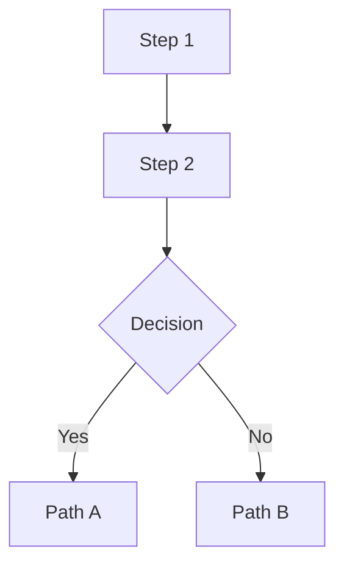

# create-walkthrough

Generate honest, argumentative walkthrough documents for complex implementations.
Not a status report or handoff document. A **prosecution brief** where the agent
argues why an implementation should succeed, admits what could go wrong, and the
user pokes holes.

**This is a COLLABORATIVE skill.** The agent does NOT write a walkthrough alone.

## Why This Exists

A walkthrough caught two real bugs before a pipeline launch:
1. A false claim about a missing dependency (agent wrote it, agent believed it, user caught it)
2. A missing semantic quality check the deterministic assessment couldn't provide

The value isn't the document structure. It's:
- **Collaboration**: the human and a persona expert contribute BEFORE writing starts
- **Risk-forcing**: every change MUST have "what could still go wrong"
- **Claim verification**: every factual statement is audited against actual code
- **User review surface**: the document exists so the human can push back

### Why Collaboration Is Non-Negotiable

An agent writing a walkthrough alone produces a **monologue** — it explains its own
work to itself. The agent's blind spots become the walkthrough's blind spots. Real
bugs were caught in the episodic-archiver v2 walkthrough not by the agent, but by the
user reading critically. The interview and persona consultation exist to surface
concerns the agent **cannot see**.

**Incident (2026-02-13):** Agent skipped interview + persona consultation for the
episodic-archiver v2 walkthrough. Result: a technically correct but one-dimensional
document that missed the user's concern about conversation prediction classifiers and
the persona's expertise in user behavioral modeling. The walkthrough failed at its
primary purpose — being a collaboration surface.

## When to Use

Use `/create-walkthrough` when ALL of these are true:
- The system has **failed before** (at least one prior attempt)
- The implementation is **complex** (multi-file, multi-concern)
- You're about to **launch or deploy** (not still designing)
- The user needs to **review and approve** before proceeding

Do NOT use for:
- First-time implementations (use `/plan` instead)
- Simple features or bug fixes
- Agent-to-agent handoff (use `/create-context` instead)
- General project health (use `/assess` instead)

## How It Differs

| Skill | Modality | Question Answered |
|-------|----------|-------------------|
| `/create-context` | Descriptive | "What happened? What's the state?" |
| `/assess` | Evaluative | "Is this healthy? What's broken?" |
| `/plan` | Prescriptive | "What should we do next?" |
| **`/create-walkthrough`** | **Argumentative + Collaborative** | **"Why should this work when previous attempts failed?"** |

---

## Pre-Flight Checklist (BLOCKING)

Before writing ANY walkthrough content, verify ALL of these:

| Gate | Requirement | How to Complete |
|------|-------------|-----------------|
| **Interview** | User has answered questions about failures, concerns, scope | Use `/interview` or AskUserQuestion |
| **Persona** | A domain persona has reviewed the changes | Use `/ask consult <persona>` |
| **Memory** | Prior failures/lessons recalled | Use `/memory recall` |
| **Code read** | Agent has read the actual implementation files | Use Read tool |

**If ANY gate is incomplete, STOP. Do not write the walkthrough.**

The agent MUST NOT rationalize skipping gates:
- "I have deep session context" is NOT a reason to skip the interview
- "No persona is relevant" is NOT true — every implementation has a domain expert
- "The user didn't ask for persona input" is NOT relevant — the skill requires it

---

## Workflow

### Phase 1: Human Interview (MANDATORY — NO EXCEPTIONS)

**ALWAYS ask the human.** Even if you implemented the code yourself in this session.
Even if you think you know the answers. The human sees things you don't.

Use `/interview` or `AskUserQuestion` to gather:

```json
[
  {
    "id": "failures",
    "text": "What has failed in previous attempts? List specific failure modes.",
    "type": "text",
    "header": "Failures"
  },
  {
    "id": "concerns",
    "text": "What are you most worried about this time?",
    "type": "text",
    "header": "Concerns"
  },
  {
    "id": "constraints",
    "text": "What deployment constraints apply?",
    "header": "Constraints",
    "options": [
      {"label": "Single process only", "description": "No concurrent daemons"},
      {"label": "Must survive API outages", "description": "External dependency resilience"},
      {"label": "Unattended overnight", "description": "No human monitoring"},
      {"label": "Resource constrained", "description": "Memory/CPU/VRAM limits"}
    ],
    "multi_select": true
  },
  {
    "id": "scope",
    "text": "Which files/systems should the walkthrough cover?",
    "type": "text",
    "header": "Scope"
  },
  {
    "id": "persona",
    "text": "Which persona should review this? (Pick the domain expert most relevant to this system.)",
    "type": "text",
    "header": "Reviewer"
  }
]
```

**Why this can't be skipped:** The human's concerns shape the walkthrough's focus. Without
asking, the agent writes about what IT thinks matters. The episodic-archiver v2 walkthrough
missed the user's interest in conversation prediction classifiers because the agent never
asked. The interview is how the human steers the walkthrough.

**Minimum interview:** If `/interview` is unavailable, use `AskUserQuestion` with at
minimum these 3 questions:
1. "What are you most worried about with this implementation?"
2. "What should the walkthrough focus on — what do you need to be convinced of?"
3. "Which persona should review this? (e.g., Embry for user modeling, Brandon for SPARTA, Margaret for extraction)"

Also gather from automated sources:
- `/memory recall` for past failures, lessons, and assessments related to this system
- `git log` for recent changes and commit messages
- `CONTEXT.md` for current state documentation

### Phase 1b: Persona Consultation (MANDATORY — NO EXCEPTIONS)

**ALWAYS consult a persona.** The user nominates one in the interview (Phase 1). If the
user didn't specify, pick the most relevant domain expert yourself and confirm with the
user: "I'll consult [Persona] — they have expertise in [domain]. Sound right?"

Use `/ask consult <persona>` with a summary of changes:

```
We're about to deploy [system]. Here's what changed:
1. [Change 1 — one sentence]
2. [Change 2 — one sentence]
3. [Change N — one sentence]

What concerns you? What are you satisfied with? What would you watch for
in the first hour of deployment?
```

**Why this can't be skipped:** Different personas surface different concerns. The agent
may not realize that a design pattern is risky in a specific domain — but the persona
will. Examples:

| Persona | What They'd Catch That the Agent Wouldn't |
|---------|------------------------------------------|
| **Embry** | User behavioral modeling gaps, conversation prediction feasibility, linguistics edge cases |
| **Brandon Bailey** | SPARTA-specific: grounding formula gaps, framework term coverage, D3FEND abstraction levels |
| **Margaret Chen** | Extraction quality: PDF parsing failures, table detection false positives, data integrity |
| **Horus Lupercal** | System architecture: single points of failure, resilience under adversarial conditions |

**The persona's output becomes the "Expert Commentary" section of the walkthrough.**

```markdown
## Expert Commentary

**[Persona Name]** — [Role/Title]

> **What I'm satisfied with:**
> - [Specific thing persona approves, with domain reasoning]
> - [Another]
>
> **What concerns me:**
> - [Specific concern, grounded in persona's expertise]
> - [Another]
>
> **What I'd watch for in the first hour:**
> - [Observable metric or behavior the persona would monitor]
```

This transforms the walkthrough from "agent explains agent's work" to "domain expert
reviews agent's work." The persona brings knowledge the agent may lack.

**Rule:** The persona consultation is GENERIC. Any persona from `personas.yaml` can be
consulted. Do NOT build persona-specific logic into the skill.

### Phase 2: Analyze the Implementation

**Only proceed here after BOTH Phase 1 and Phase 1b are complete.**

Read the actual code. For each significant change:

1. **Identify what it replaces** (the old approach that failed)
2. **Understand the mechanism** (how the new code works, line numbers)
3. **Find the integration points** (where it connects to existing code)
4. **Assess the risk** (what could go wrong with this specific change)
5. **Cross-reference with interview** (does this address the user's concerns?)
6. **Cross-reference with persona** (does this address the persona's concerns?)

### Phase 3: Write the Walkthrough

Use this structure. **All sections are REQUIRED.**

The walkthrough MUST incorporate:
- User's concerns from the interview (Phase 1)
- Persona's concerns and satisfactions from the consultation (Phase 1b)
- Memory recall results showing prior failures and lessons

```markdown
# [System Name] v[N]: Honest Walkthrough

**Date:** YYYY-MM-DD
**File(s):** `path/to/main/file.py` (N lines)
**Status:** [Preflighted / Tested / Production-tested]
**Reviewed by:** [Persona Name] ([Role])
**User concerns addressed:** [List from interview]

---

## Why Previous Versions Failed

### Failure 1: [Short Title]
**What we did:** [Factual description of the approach]
**Why it failed:** [Root cause, not symptoms]

### Failure N: ...

---

## What v[N] Changes

### Change 1: [Short Title] (lines X-Y)

[Description of the change with code snippets]

**What this fixes:** [Which failure mode from above]
**What could still go wrong:** [Honest risk — REQUIRED, cannot be empty]
**Honest risk level:** LOW / MEDIUM / HIGH — [justification]

### Change N: ...

---

## Expert Commentary

**[Persona Name]** — [Role/Title]

> **What I'm satisfied with:**
> - [From Phase 1b consultation]
>
> **What concerns me:**
> - [From Phase 1b consultation]
>
> **What I'd watch for in the first hour:**
> - [From Phase 1b consultation]

---

## Data Flow Diagram

[Use /create-figure with Mermaid backend to generate a flowchart]



---

## Risk Matrix

[Use markdown table — /create-table if PDF output needed]

| Change | Fixes | Risk | Observable Failure |
|--------|-------|------|--------------------|
| ... | ... | LOW/MED/HIGH | How you'd know it broke |

---

## Remaining Risks (Honest Assessment)

### Risk 1: [Title] (SEVERITY)
[Description, mitigation, what would actually fix it]

---

## What Success Looks Like

| Metric | Healthy | Warning | Sick |
|--------|---------|---------|------|
| ... | ... | ... | ... |

---

## How to Launch / Monitor / Kill

[Exact commands — copy-pasteable]

---

## Bottom Line

**Will it work?** [Honest one-paragraph assessment]
**What's genuinely different this time?** [Numbered list]
**What's the same?** [What DIDN'T change — often reveals the real bottleneck]

---

## Next Steps — Your Call

[If there are open questions or branching next steps, include interview-style
questions so the user can steer what happens next. Use numbered options with
descriptions. These should be REAL decisions, not rubber-stamp confirmations.]

**1. [Decision question]**
   - a) [Option] — [what this means, tradeoff]
   - b) [Option] — [what this means, tradeoff]
   - c) [Option] — [what this means, tradeoff]

**2. [Another decision]**
   - a) ...
   - b) ...

[For HTML walkthroughs, render these as interactive elements if possible.
For markdown, use the numbered format above so the user can reply "1b, 2a".]
```

### Phase 4: Claim Verification (CRITICAL)

Before presenting the walkthrough to the user, run the claim verification engine:

```bash
./run.sh verify --file path/to/walkthrough.md
```

The verifier extracts and checks:

| Claim Type | Example | Verification |
|-----------|---------|-------------|
| **File paths** | "`src/foo.py` (3,337 lines)" | File exists, line count matches |
| **Function names** | "`assess_qra()` on line 275" | Function exists at that line |
| **Package availability** | "`sentence_transformers` not installed" | Check pyproject.toml, pip list, venv |
| **Environment vars** | "`EMBEDDING_PORT` defaults to 8602" | Grep code for the default |
| **Port numbers** | "service on port 8602" | Check code and running services |
| **Collection names** | "`user_priors` collection" | Check ArangoDB or code references |
| **Field names** | "`participants` field" | Grep for field in relevant code |
| **Import statements** | "`from analysis_llm import profile_user`" | Check file for the import |
| **Class/TypedDict names** | "`Participants` TypedDict" | Verify class exists in code |
| **Numeric claims** | "4,017 controls" | Query the database/count the data |
| **Config values** | "threshold defaults to 0.55" | Read the actual default in code |

For each claim, the verifier outputs:

```
VERIFIED  : src/foo.py exists (3,412 lines — MISMATCH: walkthrough says 3,337)
VERIFIED  : assess_qra() found at line 275
UNVERIFIED: "sentence_transformers not installed" — found in pi-mono embedding service
VERIFIED  : EMBEDDING_PORT default is 8602 (embed.py:33)
SKIPPED   : "4,017 controls" — requires database access (mark for manual check)
```

**Rules:**
- Every UNVERIFIED or MISMATCH claim must be fixed before presenting to user
- SKIPPED claims are flagged for user attention
- The agent MUST NOT present a walkthrough with known-false claims

### Phase 5: Generate Visual Assets

Use `/create-figure` for:
- **Data flow diagrams** — `flowchart TD` in Mermaid (regenerable, diff-friendly)
- **Architecture diagrams** — system boundaries and integration points
- **Workflow diagrams** — multi-step processes with decision points

Use `/create-table` (or markdown tables) for:
- **Risk matrices** — change vs risk vs observable failure
- **Success metrics** — healthy/warning/sick thresholds
- **Comparison tables** — old approach vs new approach
- **Failure history** — what failed, why, root cause

Prefer Mermaid over ASCII art — it survives edits when the implementation changes.

### Phase 6: Publish (AUTO — NON-NEGOTIABLE)

After writing the walkthrough, three things happen automatically. The agent does NOT
skip these or ask the user first.

#### 6a. Store to `walkthroughs` collection (STRUCTURED)

Store the walkthrough as a structured document in the dedicated `walkthroughs` ArangoDB
collection. This enables clean retrieval via `/recall --collections walkthroughs`.

```python
import httpx

transport = httpx.HTTPTransport(uds="/run/user/1000/embry/memory.sock")
client = httpx.Client(transport=transport, base_url="http://localhost", timeout=30.0)

walkthrough_doc = {
    "_key": f"{skill_name}_{version}_{date}",  # e.g., "create-evidence-case_v43_20260412"
    "skill_name": skill_name,
    "version": version,
    "date": date,
    
    # Core content
    "summary": "One-paragraph summary of what the skill does",
    "pipeline_flow": "Step → Step → Step description",
    "gate_logic": "Any deterministic gates that control expensive operations",
    "three_tier_output": ["list", "of", "output", "tiers"],
    
    # Expert review
    "expert_reviewer": "Persona Name",
    "expert_role": "Title/Organization",
    "expert_concerns": ["concern 1", "concern 2"],
    "expert_satisfied": ["satisfaction 1", "satisfaction 2"],
    
    # Standards alignment (if applicable)
    "standards_alignment": ["DO-178C", "ISO 26262"],
    "research_citations": ["Citation 1", "Citation 2"],
    "innovations": ["Innovation 1", "Innovation 2"],
    
    # Metadata
    "file_path": "~/.claude/skills/{skill}/WALKTHROUGH.md",
    "tags": ["walkthrough", skill_name, "architecture"],
    "type": "walkthrough",
}

resp = client.post("/store", json={
    "document": walkthrough_doc,
    "collection": "walkthroughs",
})
```

**Why this can't be skipped:** Walkthroughs in a dedicated collection are easily retrieved
via `/recall --collections walkthroughs "how does X work"`. Mixing them with lessons_v2
(161K docs) makes retrieval noisy.

#### 6b. Learn overview to lessons_v2

Also store the walkthrough's key findings as lessons so future agents can recall them.
Store BOTH:
1. **The overview lesson** — "How does [system] work?" with the full pipeline summary
2. **Individual decision lessons** — one per key decision, separately recallable

```bash
# Overview
.agents/skills/memory/run.sh learn \
  --problem "How does [system name] work? What is the [system] pipeline?" \
  --solution "[Full pipeline summary from the walkthrough]" \
  --tag walkthrough --tag architecture --tag [system-name] \
  --scope [project]

# Each key decision
.agents/skills/memory/run.sh learn \
  --problem "Why does [system] do [decision]?" \
  --solution "[Rationale from the walkthrough]" \
  --tag architecture-decision --tag [system-name] \
  --scope [project]
```

**Why this can't be skipped:** A walkthrough that isn't in memory is a dead document.
The next agent won't find it. The whole point is that `recall --brief "how does X work"`
returns the answer.

#### 6b. Open in browser (HTML output)

If the walkthrough was generated as HTML, open it immediately:

```bash
xdg-open path/to/walkthrough.html
```

The user should see the rendered result without having to find and open the file manually.
This applies to HTML output only — markdown walkthroughs are presented inline.

#### 6c. Right-click annotation (HTML output — REQUIRED)

All HTML walkthroughs MUST include the inline annotation script. This gives the user
a right-click context menu with:

| Action | Icon | Purpose |
|--------|------|---------|
| **Add Note** | 📝 | Free-text annotation at that position |
| **Flag Question** | ❓ | Mark something the user wants clarified |
| **Disagree** | ⚠️ | Mark a claim the user thinks is wrong |
| **Looks Good** | ✅ | Approve a section |
| **Export All Notes** | 📋 | Export as Markdown or JSON, or copy to clipboard |

Notes render as inline badges next to the annotated element, with the nearest section
heading as context. Export produces structured output the agent can consume:

```markdown
- **DISAGREE** (4. Taxonomy v0.4.0): Mind tag gate is too aggressive — some extraction chains touch security
- **QUESTION** (8. Nightly Backfill): What happens if commit_chain_extractor crashes mid-run?
- **NOTE** (13. What's Next): Should prioritize edge backfill over pruner
```

The annotation script is a self-contained `<script>` block — no external dependencies.
Include it in every HTML walkthrough before the Mermaid init script.

### Phase 7: Present for Review

Present the complete walkthrough to the user. The goal is adversarial review:
- The user reads it looking for claims they disagree with
- The user identifies risks the agent missed
- The user catches assumptions that don't match their operational experience
- The user validates the persona's commentary against their own knowledge

This is the highest-value step. The walkthrough is a **collaboration surface**, not
a finished document.

---

## Commands

### `verify` — Claim Verification

```bash
# Verify all claims in a walkthrough
./run.sh verify --file walkthrough.md

# Show extracted claims without verifying
./run.sh verify --file walkthrough.md --extract-only

# Verify with verbose output (show check details)
./run.sh verify --file walkthrough.md --verbose

# Output as JSON (for CI/automation)
./run.sh verify --file walkthrough.md --json
```

### `template` — Generate Blank Template

```bash
# Generate walkthrough template for a file
./run.sh template --file src/pipeline.py --output walkthrough.md

# Include git history for failure analysis
./run.sh template --file src/pipeline.py --include-git --output walkthrough.md
```

---

## Integration with Other Skills

| Skill | When Used | Purpose | Required? |
|-------|-----------|---------|-----------|
| `/interview` | Phase 1 | Gather failure history, concerns, scope from user | **YES** |
| `/ask consult` | Phase 1b | Persona expert review — concerns + satisfactions | **YES** |
| `/memory` | Phase 1 + 6a | Recall past failures; **store walkthrough findings** | **YES** |
| `/create-figure` | Phase 5 | Mermaid data flow + architecture diagrams | Recommended |
| `/create-table` | Phase 5 | Risk matrices, metrics tables (PDF if needed) | Optional |
| `/assess` | Pre-walkthrough | Quick health check to identify what to cover | Optional |
| `/create-context` | Post-walkthrough | Capture the walkthrough itself for handoff | Optional |

---

See [EXAMPLES.md](references/EXAMPLES.md) for anti-patterns, bug examples caught by walkthroughs, and the workflow summary diagram.

---

# Learn walkthrough findings to memory after verification
./run.sh learn --file walkthrough.md --system "episodic-archiver" --bottom-line "Should work"

# Recall prior walkthroughs for a system
./run.sh recall "episodic-archiver"

# Recall with more results
./run.sh recall "episodic-archiver" -k 10
```

### Graceful Degradation

Memory and taxonomy are optional. If unavailable:
- `learn` command exits with error message
- `recall` command exits with error message
- Core verify/template commands work normally without memory

---
