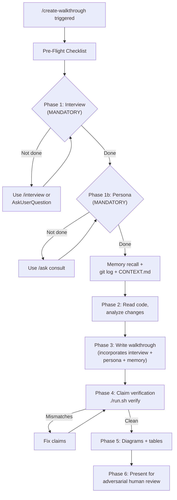

## Anti-Patterns

### Do NOT:
- **Skip the interview** — "I have deep context" is not an excuse. ASK THE HUMAN.
- **Skip persona consultation** — "No persona is relevant" is never true. Pick one.
- **Write a monologue** — If the walkthrough doesn't include user concerns + persona commentary, it's a monologue, not a collaboration.
- Write a walkthrough for something that has never been attempted (use `/plan`)
- Skip the "What could still go wrong" section (the whole point)
- Present unverified claims (run `verify` first)
- Use ASCII art for diagrams (use Mermaid — it survives edits)
- Make the walkthrough longer than the code it describes
- Hide failures or downplay risks (the user WILL find them)

### The #1 Anti-Pattern: Agent Monologue

```
WHAT HAPPENED: Agent implemented code, then wrote walkthrough explaining
  its own work without asking the human or consulting a persona.
WHY IT'S BAD: The walkthrough only covers what the agent thinks matters.
  The human's actual concerns are invisible. The persona's domain
  expertise is absent. Bugs that the agent can't see go undetected.
HOW TO PREVENT: The Pre-Flight Checklist (above) blocks writing until
  both interview and persona consultation are complete.
```

### The Walkthrough Is NOT:
- A CONTEXT.md (that's for agent handoff, not human review)
- A README (that's for onboarding, not for launch review)
- A plan (that's for what to do, not why this should work)
- Documentation (it's ephemeral — useful for one launch, then stale)

---

## Example: When Walkthrough Caught Bugs

### Bug 1: False Dependency Claim
```
WALKTHROUGH SAID: "sentence_transformers not installed in memory venv"
REALITY: Embedding service at pi-mono/.pi/skills/embedding/ uses sentence-transformers
USER CAUGHT: "isn't it in pyproject.toml and don't we use a service for embeddings?"
FIX: Updated walkthrough + corrected agent's mental model
```

### Bug 2: Missing Semantic Check
```
WALKTHROUGH SAID: "assess_qra() covers quality gating" (with honest risk note)
USER CAUGHT: "shouldn't Brandon do probabilistic sampling for useless answers?"
FIX: Added run_semantic_sample() — a whole new feature
```

### Bug 3: Missed Feature Opportunity (2026-02-13)
```
WALKTHROUGH SAID: Nothing about conversation prediction
REALITY: User wanted to know if episodic-archiver should predict next user request
USER CAUGHT: "should our episodic archiver use a /create-classifier to predict
  what the user will request next?"
ROOT CAUSE: Agent skipped interview, never asked what user cared about
FIX: Made interview + persona consultation MANDATORY in this skill
```

All three bugs were caught because the walkthrough process (when followed correctly)
forces the human into the loop. Bug 3 was caught DESPITE the process being broken
— the user caught it anyway. The fix is to prevent skipping.

---

## Workflow Summary



---

## Memory + Taxonomy Integration

Walkthrough findings are stored in `/memory` with `/taxonomy` bridge tags for recall,
versioning, and drift detection across sessions.

### How It Works

**Pre-hook (recall):** Before writing a new walkthrough, recall prior walkthrough findings
for the same system to surface past failures, risks, and lessons.

**Post-hook (learn):** After successful claim verification, learn to memory:
1. **Walkthrough summary** — system, date, verdict, bottom line
2. **Individual risks** — for future recall
3. **Verification stats** — for drift tracking (accuracy trending over time)

All entries are tagged with taxonomy bridge attributes (Precision, Resilience, Fragility,
etc.) extracted from the walkthrough content.

### CLI Commands

```bash

## File Structure

```
.pi/skills/create-walkthrough/
├── SKILL.md                            # This file (agent instructions)
├── walkthrough.py                      # Claim extraction + CLI (typer)
├── memory_integration.py              # Memory + taxonomy hooks
├── models.py                           # Shared data classes (Claim, Verdict, VerificationReport)
├── verifiers.py                        # All claim verifiers (13 types)
├── run.sh                              # Entry point
├── sanity.sh                           # Basic validation
└── references/
    └── walkthrough_template.md         # Blank template with all sections
```
