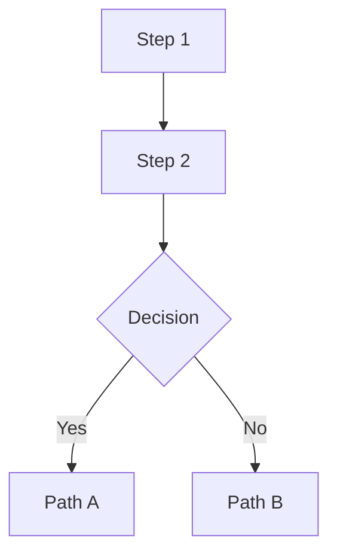

# [System Name] v[N]: Honest Walkthrough

**Date:** {{DATE}}
**File:** `{{FILE}}` ({{LINE_COUNT}} lines)
**Status:** Preflighted / Tested / Production-tested
**Reviewed by:** [Persona Name] ([Role/Title])
**User concerns addressed:** [List from interview]

---

## Collaboration Pre-Check

| Gate | Status | Evidence |
|------|--------|----------|
| Human Interview | DONE / PENDING | [What user said about concerns] |
| Persona Consultation | DONE / PENDING | [Who was consulted, key takeaways] |
| Memory Recall | DONE / PENDING | [Prior failures/lessons found] |
| Code Read | DONE / PENDING | [Files read and analyzed] |

> **All gates must be DONE before this walkthrough is valid.**

---

## Why Previous Versions Failed

### Failure 1: [Short Title]

**What we did:** [Factual description of the approach]
**Why it failed:** [Root cause, not symptoms]

{{GIT_SECTION}}
---

## What v[N] Changes

### Change 1: [Short Title] (lines X-Y)

[Description with code snippets]

**What this fixes:** [Which failure mode]
**What could still go wrong:** [REQUIRED — cannot be empty]
**Honest risk level:** LOW / MEDIUM / HIGH — [justification]

---

## Expert Commentary

**[Persona Name]** — [Role/Title]

> **What I'm satisfied with:**
> - [Specific approval with domain reasoning]
>
> **What concerns me:**
> - [Specific concern grounded in expertise]
>
> **What I'd watch for in the first hour:**
> - [Observable metric or behavior]

---

## Data Flow Diagram



---

## Risk Matrix

| Change | Fixes | Risk | Observable Failure |
|--------|-------|------|--------------------|
| Change 1 | [failure mode] | LOW/MED/HIGH | [how you'd know] |

---

## Remaining Risks (Honest Assessment)

### Risk 1: [Title] (SEVERITY)

[Description, mitigation, what would actually fix it]

---

## What Success Looks Like

| Metric | Healthy | Warning | Sick |
|--------|---------|---------|------|
| [metric] | [value] | [value] | [value] |

---

## How to Launch

```bash
# [exact command]
```

## How to Monitor

```bash
# [exact command]
```

## How to Kill

```bash
# [exact command]
```

---

## Bottom Line

**Will it work?** [Honest one-paragraph assessment]
**What's genuinely different this time?** [Numbered list]
**What's the same?** [What didn't change — often the real bottleneck]
