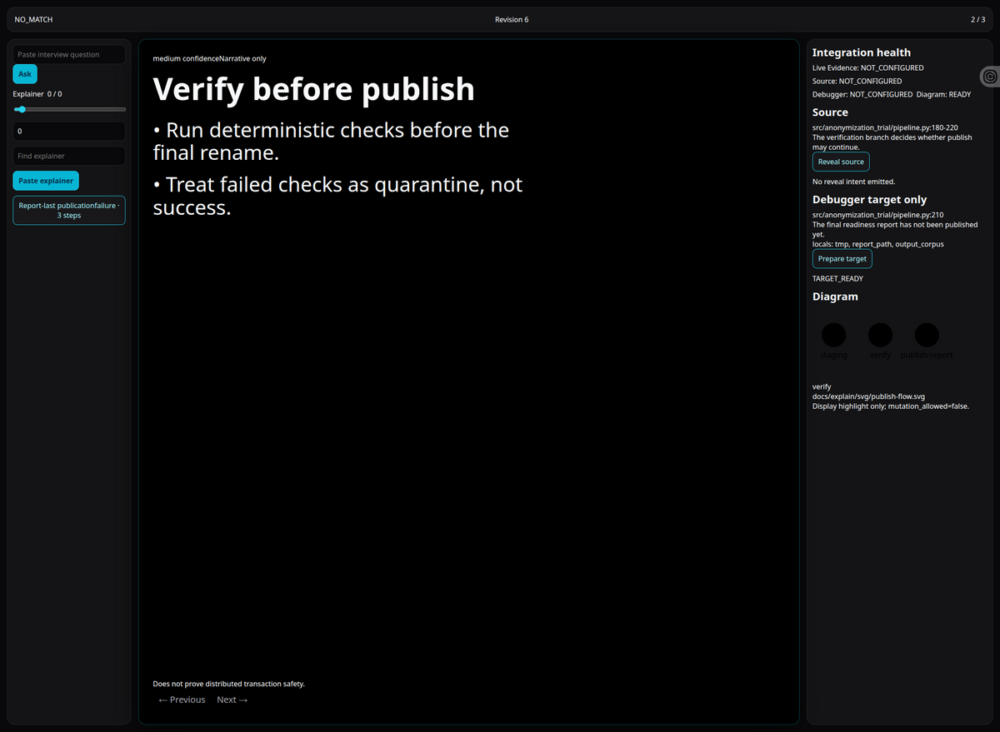

# Explain Project



`explain-project` turns project questions into a plain-spoken interview cockpit: a strict explainer record drives the concise teaching answer, source range, debugger target, and Excalidraw diagram state from one typed revision.

We needed it during the OpenAI work-trial interview prep because the submission had too many proof surfaces for a normal slide deck: frozen runtime, privacy boundaries, source ranges, debugger proof, diagrams, and likely interviewer follow-ups. This skill would have put the answer, the exact source, the proof boundary, and the safe live controls on one 15-inch presenter surface instead of forcing a scramble across notes, VS Code, Excalidraw, and receipts.

> **Runtime boundary.** `SKILL.md` is the command contract. This README is the developer map. Live microphone transcription, visible VS Code control, and accepted Excalidraw board edits require their own receipts; replay fixtures do not prove those live effects.



Read [`DESIGN.md`](DESIGN.md) for the cockpit visual contract, [`PROJECT_KNOWLEDGE.md`](PROJECT_KNOWLEDGE.md) for the current proof boundary, [`immutable_goal.json`](immutable_goal.json) for completed cockpit-v1, and [`immutable_goal.v2.json`](immutable_goal.v2.json) for the active question-first walkthrough goal.

## Start here

| Need | Run or read |
| --- | --- |
| Validate explainer JSONL | `skills/explain-project/run.sh validate <explainers.jsonl>` |
| Ask a question against explainers | `skills/explain-project/run.sh ask <explainers.jsonl> --question "..."` |
| Create a question-first walkthrough | `skills/explain-project/run.sh answer-question --repo <project> --question "..." --out <dir> [--debug-command "python app.py"]` |
| Scaffold from any project entrypoint | `skills/explain-project/run.sh scaffold --repo <project> --entrypoint <path> --run-project-state` |
| Re-run the retained oai-trial first-question path | `skills/explain-project/run.sh eval-interview-cockpit-path --out-dir <proof-dir>` |
| Run deterministic cockpit proof | `skills/explain-project/run.sh cockpit --repo fixtures/cockpit/project --explainers fixtures/cockpit/project/docs/explain/explainers.jsonl --headless --script fixtures/cockpit/scripts/worker-crash-walkthrough.json --out <proof.json>` |
| Serve the React cockpit API | `skills/explain-project/run.sh cockpit --explainers <explainers.jsonl>` |
| Build the browser cockpit | `cd skills/explain-project/ui && npm run build` |
| Emit `$test-interactions` manifest | `skills/explain-project/run.sh interaction-manifest --base-url http://127.0.0.1:8766` |

## Diagram discovery convention

For project agents, put durable diagram pointers in the code or docs closest to
the walkthrough surface:

```python
"""Entrypoint for the worker.

Diagram ID: project.production-architecture
Diagram: docs/architecture.svg
Excalidraw source: docs/architecture.excalidraw
"""
```

`answer-question` scans source for the relevant path, creates a missing
Excalidraw board when no diagram exists, stores stable diagram metadata through
`$ops-excalidraw`, writes breakpoint targets, and keeps the teaching tone plain,
spoken, and concise. `scaffold` scans the entrypoint, README,
PROJECT_STATE/PROJECT_KNOWLEDGE, and `docs/**/*.md|*.py` for `.svg`,
`.excalidraw`, and Excalidraw URLs. It binds the first existing reference into
the generated explainer, adds a `$debugger` breakpoint target near the entrypoint,
and records the `$project-state` receipt path when supplied or generated with
`--run-project-state`.

## Helper skills

| Skill | How `explain-project` uses it |
| --- | --- |
| [`best-practices-explain-project`](../best-practices-explain-project/SKILL.md) | Defines the explainer record and cockpit route: question -> cue -> source -> debugger -> diagram. |
| [`live-evidence`](../live-evidence/SKILL.md) | Supplies consented or replayed `live_evidence.question_candidate.v1` question candidates; the cockpit only ingests typed candidates. |
| [`debugger`](../debugger/SKILL.md) | Owns source reveal, breakpoint setup, and runtime proof receipts; the cockpit never auto-runs it from navigation. |
| [`ops-excalidraw`](../ops-excalidraw/SKILL.md) | Owns editable `.excalidraw` boards, proposal-safe board pushes, and stable diagram registry metadata. |
| [`create-svg`](../create-svg/SKILL.md) | Renders safe portable SVG diagrams from semantic scenes or ops-excalidraw output. |
| [`test-interactions`](../test-interactions/SKILL.md) | Replays stable `[data-qid]` controls against the cockpit through Surf. |
| [`surf`](../surf/SKILL.md) | Captures browser proof and screenshots of the real cockpit surface. |
| [`agentic-evals`](../agentic-evals/SKILL.md) | Retains the proof suite that prevents regression of cockpit contracts. |

## Prerequisites

- Python runtime through `uv`; `run.sh` supplies the isolated Python dependencies.
- Node/npm only for `ui/` browser builds and local preview.
- Browser screenshot proof uses [`surf`](../surf/SKILL.md); live question intake uses [`live-evidence`](../live-evidence/SKILL.md) only after consent.

## What lives where

| Path | Purpose |
| --- | --- |
| `immutable_goal.json` | Frozen cockpit goal and proof boundary. |
| `scripts/explain_project_core/scaffold.py` | Generic project intake: question-first source selection, entrypoint source range, `$project-state` binding, docstring/docs diagram discovery or diagram creation, registry metadata, and starter debugger target. |
| `scripts/explain_project_core/models.py` | Strict Pydantic contracts for explainers, cockpit state, adapter receipts, Live Evidence intake, debugger proof, and Excalidraw proposal receipts. |
| `scripts/explain_project_core/reducer.py` | Single reducer that keeps teleprompter, source, debugger, diagram, and health projections revision-aligned. |
| `scripts/explain_project_core/server.py` | Loopback HTTP API for the React cockpit and Live Evidence intake seam. |
| `ui/src/` | React/Tailwind-oriented cockpit components with stable `data-qid` controls. |
| `fixtures/` | Retained agentic evals and cockpit contract checks. |

## Integration status

| Integration | Current contract | Proven by |
| --- | --- | --- |
| [`$ops-excalidraw`](../ops-excalidraw/SKILL.md) | Proposal-safe receipts only; no silent board replacement. | [`proofs/current-proof-summary.json`](proofs/current-proof-summary.json). |
| [`$debugger`](../debugger/SKILL.md) | Source reveal and runtime proof receipts are ingested only after debugger-owned proof validates. | [`proofs/current-proof-summary.json`](proofs/current-proof-summary.json). |
| [`$live-evidence`](../live-evidence/SKILL.md) | Accepts typed/replayed `live_evidence.question_candidate.v1` and suppresses duplicates. | [`proofs/current-proof-summary.json`](proofs/current-proof-summary.json). |
| React cockpit | 15-inch 1080p teleprompter layout, qid controls, keyboard navigation, native page/slider controls. | [`proofs/current-proof-summary.json`](proofs/current-proof-summary.json) and current Surf screenshot `assets/readme/cockpit-screenshot.png`. |

## Outputs

| Output | Meaning |
| --- | --- |
| `explain_project.cockpit_proof.v1` | Deterministic reducer proof for question routing, step navigation, and synchronized projections. |
| `explain_project.adapter_receipt.v1` | Cockpit-ingested receipt from source reveal, debugger proof, or Excalidraw proposal adapters. |
| `agentic_evals.report.v2` | Retained regression suite result for the skill. |
| `assets/readme/cockpit-screenshot.png` | Surf-captured current interface screenshot for README orientation. |
| `assets/readme/cockpit-flow.svg` | README-safe create-svg diagram of the cockpit flow. |

## Proof and non-claims

Verified in the latest local readback:

- `skills/explain-project/run.sh cockpit ... --headless ...` produced `explain_project.cockpit_proof.v1` with `status=PASS`.
- `skills/agentic-evals/run.sh run skills/explain-project/fixtures/agentic_eval.json` produced `agentic_evals.report.v2` with `readiness=READY`, `PASS=15`, `FAIL=0`, `BLOCKED=0`.
- [`proofs/current-proof-summary.json`](proofs/current-proof-summary.json) records the current receipt summary for README readers.
- [`proofs/browser-interaction-receipt.json`](proofs/browser-interaction-receipt.json) records a Surf-driven rendered React interaction: paste/import explainer → route manual question → advance step → read synchronized teleprompter/source/diagram state.
- [`proofs/browser-interaction-trace-receipt.json`](proofs/browser-interaction-trace-receipt.json) records the fuller browser trace with before/after revision checks for import, select, manual routing, next, previous, and DOM/state projection agreement.
- [`proofs/webkimi-readme-review.md`](proofs/webkimi-readme-review.md) records the `$ask webkimi` README review verdict: `VERDICT: PASS`.
- [`proofs/webgpt-immutable-goal-review.md`](proofs/webgpt-immutable-goal-review.md) records the final `$ask webgpt` immutable-goal review verdict: `VERDICT: PASS` under the stated proof boundary.

Not claimed:

- WebGPT independently re-ran hashed local artifacts; its final PASS evaluates the supplied evidence summaries;
- real microphone transcription into Live Evidence;
- human acceptance of an Excalidraw proposal in the browser;
- arbitrary visible VS Code GUI control;
- arbitrary debugger adapter support beyond the validated debugger proof contract.

## Troubleshooting

| Symptom | Next check |
| --- | --- |
| Cockpit proof is not `PASS` | Read the proof JSON `failures` field before changing code. |
| Browser UI cannot load | Start `run.sh cockpit` first, then run the Vite UI with `EXPLAIN_PROJECT_API_URL` pointed at that API. |
| Web reviewer rejects README attachments | Use a sanitized review packet; browser preflight rejects raw local path targets even when repo links are valid. |
