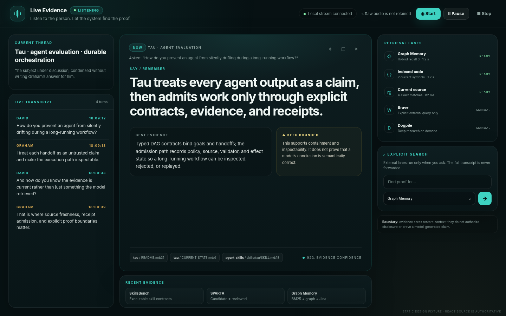

# Live Evidence

> **Disciplines:** human-collaboration · research-retrieval · ui-design-engineering
A local-first interview and meeting copilot for Graham's actual problem: stay
present in the conversation while the system quietly retrieves the strongest
supporting evidence from Graph Memory and current source code.

The product surface is a restrained React 19 + Tailwind CSS + shadcn-style
operator console. It shows the current thread, live transcript, one primary
support card, source freshness, retrieval-lane health, and a manual external
research control. It intentionally does not write a full answer for the human
to recite.



*Static design fixture; the React source under `ui/src` is authoritative.*

## Capabilities

- RealtimeSTT/faster-whisper microphone, PipeWire, or dual-channel listening.
- Separate `graham` and `interviewer` channels when audio sources are distinct.
- Stabilized/final turn deduplication and bounded trigger detection.
- Graph Memory `/intent` + hybrid `/recall` queries.
- Graph Memory code-symbol search and source freshness through the memory skill.
- Exact fixed-string ripgrep fallback over an allowlisted repository set.
- Extractive, source-bound card generation with a visible qualifier.
- Optional manual Brave and Dogpile lanes.
- SSE updates to a polished React/Tailwind/shadcn UI.
- Append-only local session journal; raw audio is not retained.
- The UI Stop control propagates to the listener process and ends audio capture.
- Ripgrep output is deadline- and match-bounded so a broad term cannot flood the interview surface.

## Session purposes (#1449)

Every session starts under a frozen purpose whose capability policy is
enforced in the backend: `meeting` (evidence cards for your own conversation),
`rehearsal` (practice-only, voice permitted, practice partition),
`formal_assessment` (all assistance and effect capabilities fail closed),
`interviewer_assist` (rubric coverage + follow-ups, no candidate answers), and
`post_interview_review` (evidence-linked dossier, no hiring verdict). See
SKILL.md for the policy table; these claims are distinct and non-transferable
between purposes.

## Install

```bash
./run.sh setup
./run.sh ui-build
```

Copy `.env.example` or export the equivalent values before running against your
real repository allowlist and Graph Memory service. The server refuses a
non-loopback bind unless `LIVE_EVIDENCE_ALLOW_REMOTE_BIND=true` is explicitly
set.

The Python environment is placed on `/mnt/storage12tb` when available, otherwise
under the user cache. The skill does not create a repository-local `.venv` or
`node_modules` archive in the downloadable bundle.

Realtime transcription is an optional heavier install:

```bash
./run.sh setup --with-stt
```

## Prepared-host preflight

```bash
./run.sh doctor
```

The command emits `live_evidence.doctor_report.v1` and distinguishes replay
readiness from live-audio readiness.

## Run the bounded demo

```bash
./run.sh serve --open-browser
./run.sh replay fixtures/interview.jsonl
```

## Run live

```bash
./run.sh listen --mode microphone --consent-confirmed
```

For a Google Meet/Zoom/Teams interview on Linux, route meeting audio to a
PipeWire/Pulse monitor source and use `--mode dual` so the microphone is labeled
`graham` and the meeting channel is labeled `interviewer`.

## UX intent

The page is optimized for a 30-minute interview rather than a generic meeting
archive:

- the primary card uses large, glanceable prose;
- proof and qualification are visually separate;
- source paths remain visible but secondary;
- transcript and lane telemetry stay in side rails;
- controls are keyboard-focusable and carry `data-qid`, `data-qs-action`,
  `title`, and `useRegisterAction` registration.

See `references/architecture.md`, `references/gmo-integration.md`,
`references/data-contracts.md`, and `references/privacy-consent.md` for
implementation and trust boundaries.
