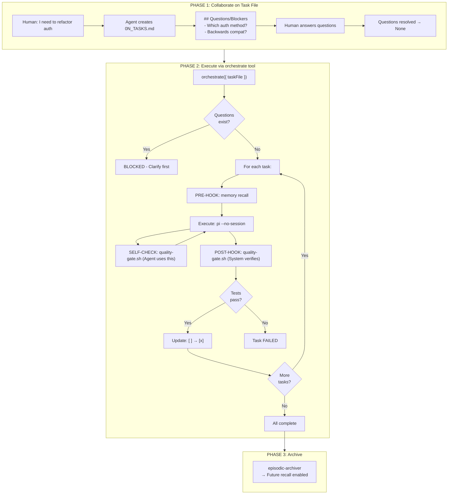
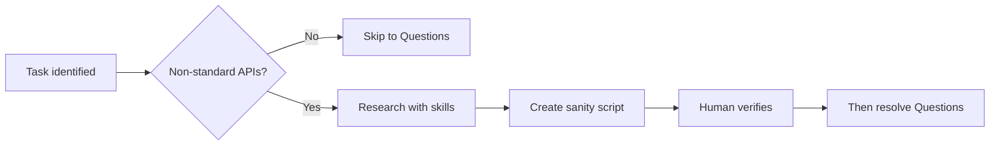

# Task Orchestration Skill

Execute tasks from a collaborative **task file** (e.g., `0N_TASKS.md`) with **enforced** hooks:

- **Questions/Blockers Gate**: BLOCKS execution if unresolved questions exist
- **Memory-first Pre-hook**: Queries memory BEFORE each task (not optional)
- **Quality-gate Post-hook**: Runs tests AFTER each task (must pass)
- **Session Archiving**: Stores completed session for future recall

## The Collaborative Workflow



## Critical: Questions/Blockers Section

The orchestrator **BLOCKS** execution if unresolved questions exist:

```markdown
## Questions/Blockers

- Which database should we use? (blocks Task 3)
- Do we need backwards compatibility?
```

**To proceed**: Answer the questions and either:

- Remove the items
- Change to "None" or "N/A"

This forces collaborative clarification BEFORE coding starts.

## Sanity-First Collaboration (Crucial Dependencies)

> **NEW**: For non-standard APIs, create sanity scripts BEFORE marking Questions/Blockers as resolved.

When a task requires libraries/APIs beyond standard ones (`json`, `pathlib`, `typing`, etc.), the agent must:

### Phase 1a: Dependency Identification



### Research Skill Priority

1. **brave-search** (free) - General patterns, StackOverflow, blog posts
2. **Context7** (free) - Library-specific documentation chunks
3. **perplexity** (paid) - Complex research, comparisons (use sparingly)

### Sanity Script Requirements

Each non-standard dependency gets a script in `tools/tasks_loop/sanity/`:

```python
# sanity/{library}.py - Agent REFERENCES this when implementing
"""
PURPOSE: Working example with correct parameters
DOCUMENTATION: Context7 query used, last verified date
"""
# Must show: imports, parameters with values, expected output, edge cases
# Exit codes: 0=PASS, 1=FAIL, 42=CLARIFY (needs human)
```

**Example**: Before using Camelot for table extraction, create `sanity/camelot_table_extraction.py` that shows:

- Both `lattice` and `stream` modes
- `line_scale`, `edge_tol`, `row_tol` parameters with valid values
- How to check accuracy scores
- Known issues (ghostscript dependency, etc.)

### Task File with Dependencies

```markdown
## Crucial Dependencies

| Library    | API/Method         | Sanity Script          | Status       |
| ---------- | ------------------ | ---------------------- | ------------ |
| camelot    | `read_pdf()`       | `sanity/camelot.py`    | [x] verified |
| pdfplumber | `extract_tables()` | `sanity/pdfplumber.py` | [ ] pending  |

## Questions/Blockers

- [ ] All sanity scripts must pass before this resolves to "None"
```

### Why This Matters

1. **Agent learns from working examples** - Not just "use camelot" but exactly how
2. **Parameters are documented** - `line_scale=40` with explanation of why
3. **Edge cases captured** - "Needs ghostscript installed"
4. **Human verification** - Confirms the script actually works
5. **Future agents benefit** - Sanity scripts persist for recall

## Task File Format: 0N_TASKS.md

```markdown
# Task List: <Project/Feature Name>

## Context

<Brief description of what we're trying to accomplish>

## Tasks

- [ ] **Task 1**: <Clear, actionable description>

  - Agent: general-purpose
  - Parallel: 0
  - Dependencies: none
  - Notes: <any context>

- [ ] **Task 2**: <Description>

  - Agent: general-purpose
  - Parallel: 1
  - Dependencies: Task 1
  - Notes: <context>

- [ ] **Task 3**: <Description>
  - Agent: explore
  - Parallel: 1
  - Dependencies: none

## Completion Criteria

<How do we know we're done?>

## Questions/Blockers

None - all questions resolved.
```

## The orchestrate Tool

### Basic Usage

```typescript
orchestrate({
  taskFile: "01_TASKS.md", // Path to task file
  continueOnError: false, // Stop on first failure (default)
  archive: true, // Archive on completion (default)
  taskTimeoutMs: 1800000, // 30 min per task (default)
});
```

### What Happens

1. **Parse**: Read and validate task file
2. **Block Check**: STOP if Questions/Blockers section has items
3. **For Each Task**:
   - **PRE-HOOK**: `~/.pi/agent/skills/memory/run.sh recall --q "<task>"`
     - If solutions found → injected as context in task prompt
     - Agent decides how to use prior knowledge
   - **EXECUTE**: `pi --mode json -p --no-session "<task prompt>"`
     - Protected context, no session bleed
     - **INSTRUCTION**: "Run quality-gate.sh to self-verify before finishing"
     - Agent config provides system prompt
   - **POST-HOOK**: `quality-gate.sh`
     - Auto-detects project (Python/Node/Go/Rust)
     - Runs tests/checks
     - Task FAILS if tests don't pass
   - **UPDATE**: Mark checkbox `[x]` in task file
4. **Archive**: Store session via episodic-archiver

### Memory Recall Context

When memory finds prior solutions, they're injected into the task prompt:

```markdown
## Memory Recall (Prior Solutions Found)

The following relevant solutions were found in memory. Review and adapt as needed:

1. **Problem**: OAuth token refresh failing silently
   **Solution**: Add explicit error handling in refreshToken(), log failures

---

## Context

...rest of task prompt...
```

The agent sees this context and decides whether to apply, adapt, or ignore it.

### Quality Gate Enforcement

After each task, `quality-gate.sh` runs:

```bash
# Auto-detects project type and runs:
# - Python: pytest -q -x
# - Node: npm test
# - Go: go test ./...
# - Rust: cargo check
# - Makefile: make test (or make smokes)
```

If tests fail:

- Task status = `failed`
- Error output included in results
- Orchestration stops (unless `continueOnError: true`)

## When to Use

| Trigger                   | Action                                   |
| ------------------------- | ---------------------------------------- |
| "Let's plan this"         | Collaborate on task file (don't run yet) |
| "Run the tasks"           | Execute via orchestrate tool             |
| "Orchestrate 01_TASKS.md" | Execute specific file                    |
| Unresolved questions      | BLOCKED - clarify first                  |

## Agent Selection

Specify agent per task in the task file:

| Agent             | Use For                                      |
| ----------------- | -------------------------------------------- |
| `general-purpose` | Code changes, bug fixes, implementation      |
| `explore`         | Research, code exploration, finding patterns |

Agent configs live at `~/.pi/agent/agents/<name>.md` with:

- Frontmatter: name, description, tools, model
- Body: System prompt with instructions

## Example Full Flow

```
User: "I need to fix the auth bug and add tests"

Agent: "I'll create a task file. First, some questions:
- Which auth system? OAuth, JWT, or session?
- Unit tests or integration tests?"

User: "OAuth, unit tests"

Agent: [Creates 01_TASKS.md]

# Task List: Fix OAuth Auth Bug

## Context
Fix the OAuth token refresh bug and add unit tests.

## Tasks
- [ ] **Task 1**: Investigate OAuth token refresh failure
  - Agent: explore
  - Dependencies: none

- [ ] **Task 2**: Fix the token refresh logic
  - Agent: general-purpose
  - Dependencies: Task 1

- [ ] **Task 3**: Add unit tests for token refresh
  - Agent: general-purpose
  - Dependencies: Task 2

## Questions/Blockers
None - resolved above.

User: "Run the tasks"

Agent: [Calls orchestrate({ taskFile: "01_TASKS.md" })]

→ Task 1: Memory recall finds prior OAuth issues, injects context
          Explore agent investigates, reports findings
          Quality gate: N/A for explore (no code changes)
          ✓ Complete

→ Task 2: Memory recall provides solutions from Task 1
          General-purpose fixes the bug
          Quality gate: pytest runs, all tests pass
          ✓ Complete

→ Task 3: Memory recall finds test patterns
          General-purpose adds tests
          Quality gate: pytest runs, new tests pass
          ✓ Complete

→ Archive: Session stored to episodic memory

"All 3 tasks complete. Session archived for future recall."
```

## Key Principles

1. **Clarify FIRST** - Questions/Blockers section forces this
2. **Sanity BEFORE** - Non-standard APIs get verified sanity scripts
3. **Memory BEFORE** - Pre-hook always runs, provides context
4. **Quality AFTER** - Post-hook always runs, tests must pass
5. **Isolated Context** - Each task runs in `--no-session` mode
6. **Archive at End** - Enables future recall of solutions
