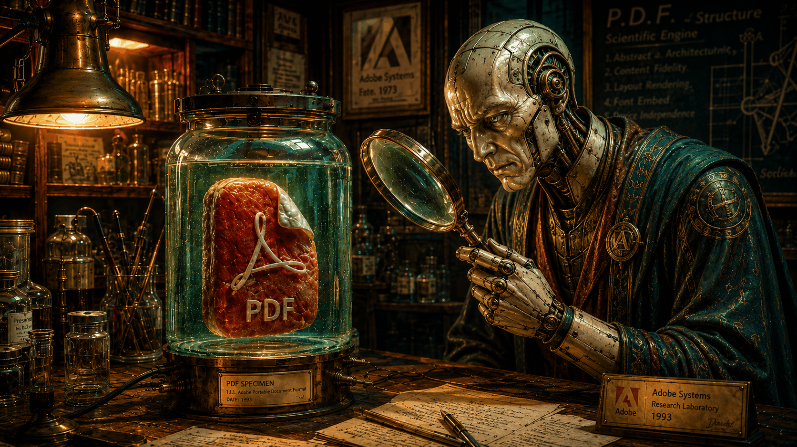

# pdf-lab



`pdf-lab` is a self-improving PDF extraction convergence loop. It diagnoses
the delta between expected extraction structure and actual extraction output,
builds synthetic reproductions, tunes extraction parameters, and records
verified fixes for future runs.

For agent usage, runtime contracts, verification rules, and maintainer
escalation, read [`SKILL.md`](SKILL.md).

## Standalone UX

The PDF Lab product UI lives with the skill:

```bash
cd skills/pdf-lab/ui
npm install
npm run dev:all
```

When file watchers are exhausted, use the no-watch path:

```bash
npm run build
npm run preview:all
```

Open `http://127.0.0.1:3012/#pdf-lab`. The local API bridge serves real PDF Lab
artifacts from `PDF_LAB_PUBLIC_ROOT` and `PDF_LAB_ARTIFACTS_ROOT` and reports
missing artifacts explicitly.
