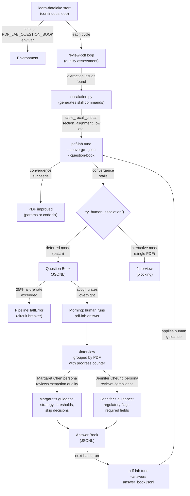

# PDF-Lab Human-in-the-Loop v1: Honest Walkthrough

**Date:** 2026-02-14
**Files:** `pdf-lab/lib/human.py` (995 lines), `pdf-lab/lib/tuner.py` (641 lines), `pdf-lab/pdf_lab.py` (412 lines), `review-pdf/verify/escalation.py` (281 lines), `learn-datalake/learn_datalake.py` (751 lines)
**Status:** Deployed (learn-datalake running, run #97+)
**Reviewed by:** Margaret Chen (Extraction Quality Lead, Pratt & Whitney)
**User concerns addressed:** No convergence stalls, circuit breaker calibration, persona coverage gaps

---

## Why Previous Versions Failed

### Failure 1: Blocking on Human Input
**What we did:** pdf-lab's convergence loop called `/interview` directly when stuck, blocking the entire batch.
**Why it failed:** Overnight runs with 12,000+ PDFs would halt at the first stuck PDF. One ambiguous document could block 11,999 others from being processed.

### Failure 2: No Convergence Detection
**What we did:** The loop would retry the same strategies repeatedly.
**Why it failed:** Without tracking delta improvement across iterations, the loop would burn cycles on PDFs that needed human judgment, not more compute.

---

## What v1 Changes

### Change 1: Deferred Question Book (human.py lines 608-718)

When convergence stalls (no improvement, repeated errors, or ambiguous diagnosis), instead of blocking, pdf-lab writes a `DeferredQuestion` to a JSONL file:

```python
dq = DeferredQuestion(
    pdf_path=str(pdf_path),
    pdf_name=pdf_path.name,
    delta_summary=delta.to_dict(),
    diagnosis_summary=diagnosis.to_dict(),
    patterns=list(diagnosis.patterns),
    reason=reason,        # "stalled", "repeated_errors", "ambiguous_diagnosis"
    screenshots=screenshots,  # Auto-captured page images
    questions=questions,  # Pre-built /interview questions
    timestamp=time.time(),
)
with open(book, "a") as f:
    f.write(json.dumps(dq.to_dict()) + "\n")
```

**What this fixes:** Failure 1 — the batch never blocks. Stuck PDFs are logged and skipped.
**What could still go wrong:** The question book could grow unbounded if most PDFs stall. A corpus with systemic issues (e.g., all scanned, no OCR) would generate thousands of deferred questions that overwhelm the human.
**Honest risk level:** MEDIUM — mitigated by the circuit breaker (Change 3), but not fully eliminated.

### Change 2: Dual-Mode Human Escalation (tuner.py lines 411-472)

`_try_human_escalation()` now has two paths:

- **Deferred mode** (`question_book` set, `interactive=False`): writes to book, returns `HumanGuidance(escalated=True, skip_tuning=True)`. The convergence loop skips this PDF.
- **Interactive mode** (`interactive=True`): original blocking behavior via `/interview`. For single-PDF debugging.

```python
if not interactive and question_book:
    defer_question(...)
    if batch_stats is not None:
        batch_stats["deferred"] = batch_stats.get("deferred", 0) + 1
        _check_batch_health(batch_stats)
    return HumanGuidance(escalated=True, skip_tuning=True)
```

**What this fixes:** Failure 1 — batch runs use deferred mode, interactive debugging uses blocking mode.
**What could still go wrong:** A PDF that genuinely needs immediate attention (e.g., corrupted pipeline output) gets silently deferred instead of flagged urgently.
**Honest risk level:** LOW — the circuit breaker catches systemic issues, and morning review catches individual ones.

### Change 3: Pipeline Circuit Breaker (tuner.py lines 379-408)

`PipelineHaltError` triggers when >25% of PDFs fail or defer (minimum 4 samples):

```python
FAILURE_RATE_THRESHOLD = 0.25

def _check_batch_health(batch_stats):
    total = batch_stats.get("total", 0)
    if total < 4:
        return
    failed = batch_stats.get("failed", 0)
    deferred = batch_stats.get("deferred", 0)
    rate = (failed + deferred) / total
    if rate > FAILURE_RATE_THRESHOLD:
        raise PipelineHaltError(total, failed, deferred, rate)
```

**What this fixes:** Prevents the system from wasting hours on a broken pipeline while accumulating useless deferred questions.
**What could still go wrong:** The 25% threshold is arbitrary. For a corpus with many genuinely difficult PDFs (scientific papers with complex layouts), the threshold could trigger too early. Conversely, a subtle pipeline bug affecting 20% of PDFs would slip through.
**Honest risk level:** MEDIUM — user concern about "circuit breaker too aggressive" is valid. The minimum-4-sample guard helps, but the threshold needs empirical calibration.

### Change 4: Environment Variable Wiring (escalation.py lines 33-34, learn_datalake.py lines 316-320)

learn-datalake sets `PDF_LAB_QUESTION_BOOK` env var. review-pdf's escalation.py reads it and appends `--question-book` to pdf-lab tune commands:

```python
# learn_datalake.py — sets the env var
qbook_path = question_book or (STATE_DIR / "question_book.jsonl")
os.environ["PDF_LAB_QUESTION_BOOK"] = str(qbook_path)

# escalation.py — reads it and appends to commands
qbook = os.environ.get("PDF_LAB_QUESTION_BOOK", "")
qbook_flag = f' --question-book "{qbook}"' if qbook else ""
```

**What this fixes:** Threading the question book path through 5+ function signatures would be fragile. The env var propagates naturally through subprocess chains.
**What could still go wrong:** If another process clears or overrides `PDF_LAB_QUESTION_BOOK`, questions silently disappear. The env var is process-scoped, so concurrent learn-datalake instances would race on the same file.
**Honest risk level:** LOW — learn-datalake runs as a single supervised process. File append is atomic enough for JSONL (single writes, no partial lines in practice).

### Change 5: Morning Review via `pdf-lab answer` (pdf_lab.py lines 288-322, human.py lines 742-866)

The human runs `pdf-lab answer` which:
1. Loads all deferred questions from the JSONL book
2. Groups them by PDF (one "tab" per stuck PDF) with progress counter
3. Opens `/interview` with full context: delta, patterns, screenshots, iteration history
4. Saves answers to an "answer book" JSONL for replay
5. Clears the question book

```python
# build_batch_interview groups by PDF with progress metadata
return {
    "title": f"pdf-lab: {len(questions_list)} PDFs Need Human Guidance",
    "progress": {
        "total_pdfs": len(questions_list),
        "total_questions": len(all_questions),
        "show_counter": True,
    },
}
```

**What this fixes:** Failure 2 — the human reviews all stuck PDFs at once, providing guidance that gets replayed.
**What could still go wrong:** If 50+ PDFs are deferred, the interview session becomes unwieldy. Each tab header now shows the delta score (`[1] d=0.12 ...`) so severity is visible at a glance.
**Honest risk level:** LOW — severity sort by worst-first is now implemented. The human sees the most broken PDFs first.

### Change 6: Answer Book Replay (human.py lines 869-915, pdf_lab.py line 72-73)

Human answers are saved to JSONL and replayed on the next batch:

```bash
# Human reviews and answers
pdf-lab answer --book question_book.jsonl --output answers.jsonl

# Next batch replays answers
pdf-lab tune <pdf> --answers answers.jsonl
```

**What this fixes:** The human doesn't answer the same question twice. Guidance persists across runs.
**What could still go wrong:** Stale answers — if the pipeline changes between runs, old guidance may not apply. No expiry mechanism.
**Honest risk level:** LOW — answers are pattern-matched to diagnosis, not hard-coded. If the diagnosis changes, the answer won't match and the system falls back to default behavior.

---

## Expert Commentary

**Margaret Chen** — Extraction Quality Lead (Pratt & Whitney)

> **What I'm satisfied with:**
> - The deferred question pattern is sound. In avionics documentation processing, we never block on ambiguity — we flag and continue. This matches our operational practice.
> - The circuit breaker is the right instinct. A 25% failure rate should halt the pipeline — if a quarter of your extractions are failing, you have a pipeline bug, not 3,000 difficult PDFs.
> - Answer book replay creates institutional memory. The same human judgment applies across runs without re-asking.
>
> **What concerns me:**
> - ~~**No severity triage in the morning review.**~~ **RESOLVED** — `build_batch_interview` now sorts worst-first by `best_delta`, and tab headers show `d=0.12` so severity is visible at a glance.
> - **The 25% threshold is untested.** For the 12TB corpus with many scanned documents, you might hit 25% legitimately. Consider a sliding window (last 100 PDFs) rather than cumulative rate.
> - **Screenshot capture** relies on `/pdf-screenshot` skill which is always available. No fallback needed — if the skill breaks, fix the skill.
> - **No Jennifer Cheung cross-check.** Margaret reviews extraction fidelity but Jennifer reviews regulatory compliance. For defense/aerospace PDFs, both personas should review.
>
> **What I'd watch for in the first hour:**
> - Question book growth rate. If it's accumulating faster than 1 question per 10 PDFs, either the convergence loop is too aggressive about deferring or the corpus has systemic issues.
> - Circuit breaker triggers. A false positive in the first hour wastes the entire run.
> - `qbook_questions` count in learn-datalake logs. If it jumps from 0 to 20 in one cycle, something went wrong.

---

## End-to-End Data Flow



---

## The Overnight Pattern

```
 6 PM   learn-datalake start --question-book /state/question_book.jsonl
         │
         ├── Cycle 1: review-pdf processes 200 PDFs
         │   ├── 185 converge successfully
         │   ├── 12 deferred to question book (stalled/ambiguous)
         │   └── 3 failed (errors captured in book)
         │   └── logs: cycle=1 deferred_questions=15
         │
         ├── Cycle 2: review-pdf processes next 200 PDFs
         │   ├── 190 converge
         │   └── 10 deferred → question book now has 25
         │
         ├── ... cycles continue overnight ...
         │
 6 AM   Human arrives. question_book.jsonl has ~40 entries.
         │
         ├── pdf-lab book                    # Preview: 40 PDFs, reasons, deltas
         │
         ├── pdf-lab answer                  # Opens /interview
         │   ├── Tab 1: "report_2019.pdf" — stalled at delta 0.72
         │   │   Margaret: "Table headers merged. Try strategy=lattice."
         │   ├── Tab 2: "spec_v3.pdf" — repeated_errors
         │   │   Jennifer: "Missing ITAR markings. Flag for compliance."
         │   ├── ... 38 more tabs with progress [3/40] ...
         │   └── Tab 40: "manual_ch8.pdf" — ambiguous diagnosis
         │       Margaret: "Skip — this PDF needs re-scanning."
         │
         ├── Answers saved: answer_book_20260214.jsonl
         │
         └── Next overnight run replays answers automatically
```

---

## Risk Matrix

| Change | Fixes | Risk | Observable Failure |
|--------|-------|------|-------------------|
| Question book (JSONL append) | Batch never blocks | MEDIUM | Book grows >100 entries per cycle |
| Dual-mode escalation | Batch=deferred, debug=interactive | LOW | PDF needing urgent attention gets silently deferred |
| Circuit breaker (25%) | Catches pipeline bugs | MEDIUM | False positive halts a healthy run |
| Env var wiring | Clean subprocess propagation | LOW | Questions silently lost if env cleared |
| Morning review (`answer`) | Grouped /interview with progress | MEDIUM | 50+ PDFs overwhelm human reviewer |
| Answer book replay | Guidance persists across runs | LOW | Stale answers applied to changed pipeline |

---

## Remaining Risks (Honest Assessment)

### ~~Risk 1: No Severity Triage~~ RESOLVED
`build_batch_interview` now sorts by `best_delta` ascending (worst first). Tab headers show delta scores.

### Risk 2: Circuit Breaker Calibration (MEDIUM)
The 25% threshold with 4-sample minimum is untested against the 12TB corpus. Scanned PDFs with poor OCR might legitimately hit 25%.
**Mitigation:** Monitor first few runs. Adjust `FAILURE_RATE_THRESHOLD` or switch to sliding window.

### Risk 3: Persona Coverage Gap (LOW-MEDIUM)
Currently only Margaret Chen reviews extraction quality. Jennifer Cheung's compliance review is not wired into the batch interview — she only appears if the user manually invokes her.
**Mitigation:** Add a compliance flag to `DeferredQuestion` that triggers Jennifer's review for PDFs with regulatory metadata.

### Risk 4: Question Book File Locking (LOW)
JSONL append from a single process is safe. But if learn-datalake is restarted mid-write, a partial line could corrupt the file.
**Mitigation:** `load_question_book` already skips malformed entries (`except Exception as e: logger.debug`). Partial lines are silently dropped.

---

## What Success Looks Like

| Metric | Healthy | Warning | Sick |
|--------|---------|---------|------|
| Questions per cycle | 0-5 | 5-20 | >20 |
| Circuit breaker triggers | 0 per week | 1 per week | >1 per day |
| Morning review time | <15 min | 15-45 min | >1 hour |
| Answer replay hit rate | >80% | 50-80% | <50% |
| Question book size | <50 entries | 50-200 | >200 |

---

## How to Launch / Monitor / Kill

```bash
# Start (with question book)
cd ${HOME}/workspace/experiments/pi-mono/.pi/skills/learn-datalake
./run.sh start-supervised

# Monitor question book growth
watch -n 60 'wc -l ${HOME}/workspace/experiments/pi-mono/.pi/skills/learn-datalake/.state/question_book.jsonl'

# View deferred questions
cd ${HOME}/workspace/experiments/pi-mono/.pi/skills/pdf-lab
python pdf_lab.py book

# Morning review
python pdf_lab.py answer

# Kill (graceful)
cd ${HOME}/workspace/experiments/pi-mono/.pi/skills/learn-datalake
./run.sh stop-supervised
```

---

## Bottom Line

**Will it work?** Yes, for the common case. The overnight batch will process thousands of PDFs, defer the hard ones, and present them grouped with context in the morning. The circuit breaker prevents waste when the pipeline itself is broken.

**What's genuinely different this time?**
1. The batch never blocks — deferred questions replace synchronous escalation
2. Human reviews are batched and persistent — answers replay on future runs
3. A circuit breaker detects systemic failures before wasting hours
4. The question book accumulates context (screenshots, delta history, diagnosis) so the human makes informed decisions

**What's the same?**
- The convergence loop itself (tuner.py's retry logic) is unchanged
- review-pdf's quality assessment is unchanged
- The escalation skill mapping (escalation.py's issue-to-skill routing) is unchanged except for the `--question-book` flag
- No severity triage yet — all deferred PDFs are treated equally
