# Persona Dream


Persona Dream gives a persistent multimodal voice persona — a long-lived agent
with durable memory, a stable character, and access to text, images, audio, and
video — a controlled way to turn experience into a synthetic dream and examine
what comes back.

> **Does letting an AI persona dream about what has happened to it actually help
> — more than plainly remembering or reflecting — and is it still recognizably
> itself afterwards?**
>
> "No" is a real answer, and finding it is success.

This is not a movie generator. The dream is an **inspectable intermediate
representation** whose every conclusion stays linked to the supporting memories
and media; a dream may influence later reasoning, but it may never silently
become literal history or rewrite identity.

## Start here

I use this README as the durable research map, not as a status log. Choose the
authoritative entry point for the question you have:

| You need | Go to |
|---|---|
| Run the smallest local workflow | [Quick Start](#quick-start) |
| Inspect the executable runtime contract | [`SKILL.md`](SKILL.md) |
| Check current machine state, blockers, and next step | [`CURRENT_STATUS.json`](CURRENT_STATUS.json) |
| Check what is and is not proven | [Current Proof Boundary](#current-proof-boundary) and [What this project does not claim](#what-this-project-does-not-claim) |
| Read the immutable goal and gate sequence | [`GOAL.md`](GOAL.md) |
| Resume operational work | [`local/HANDOFF.md`](local/HANDOFF.md) |
| Review forensic chronology or superseded findings | [`PROJECT_KNOWLEDGE.md`](PROJECT_KNOWLEDGE.md) |
| Inspect transfer decisions | [`TRANSFER_LEDGER.md`](TRANSFER_LEDGER.md) |
| Inspect per-run evidence | revision-scoped receipts under `reports/` |

## Interface walkthrough

Each phase is a surface you can look at. These are committed screenshots of the
real thing, in pipeline order.

**Phase 01 — Idea and memory residue.** The dream starts from what the persona
already remembers; the board shows which memories were recalled and how they
were linked.

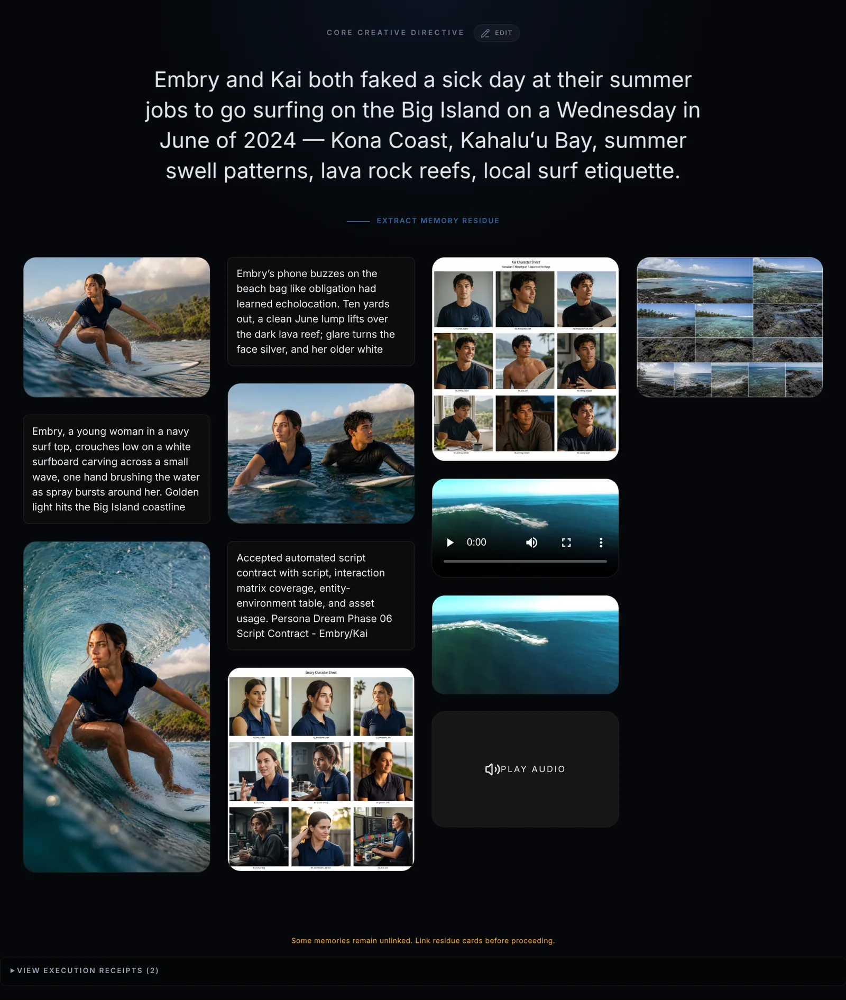

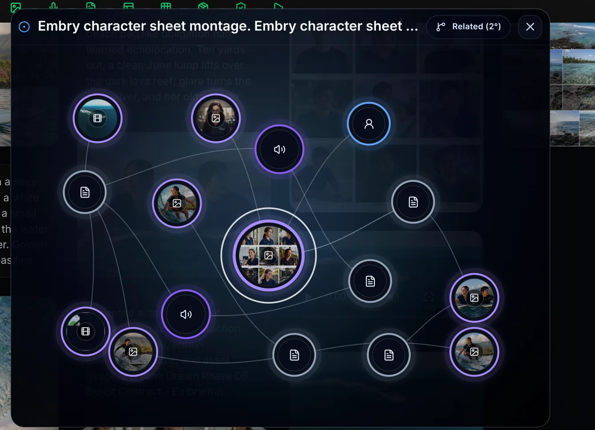

**Phases 02-03 — Story and crew.** The story contract and the personas
selected to carry it.

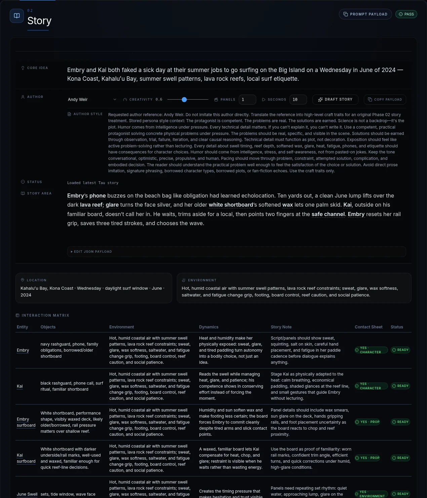

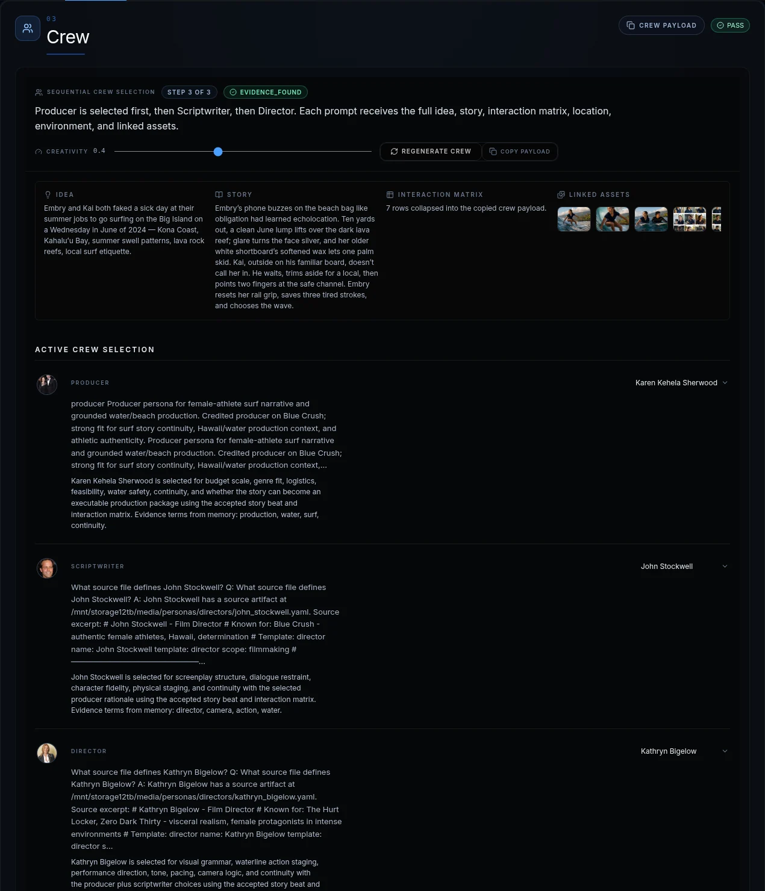

**Phases 04-05 — Contact sheets and voices.** Candidate imagery and the voice
each persona is rendered with.

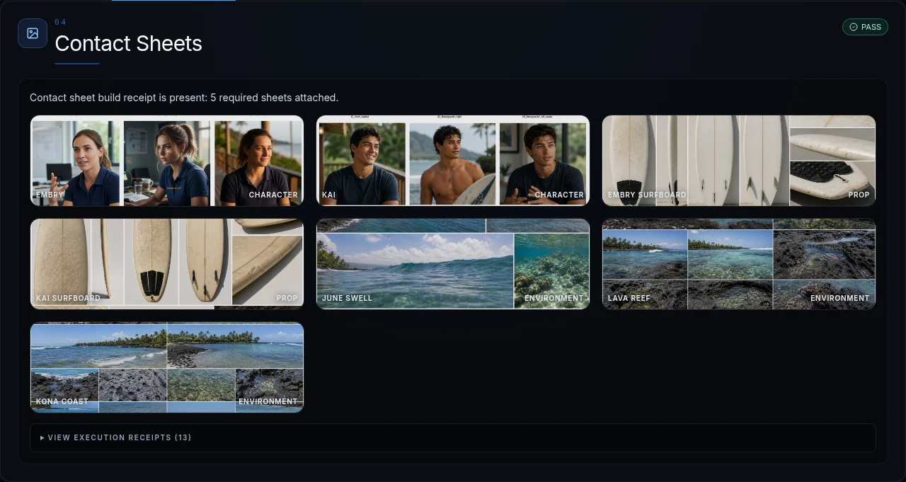

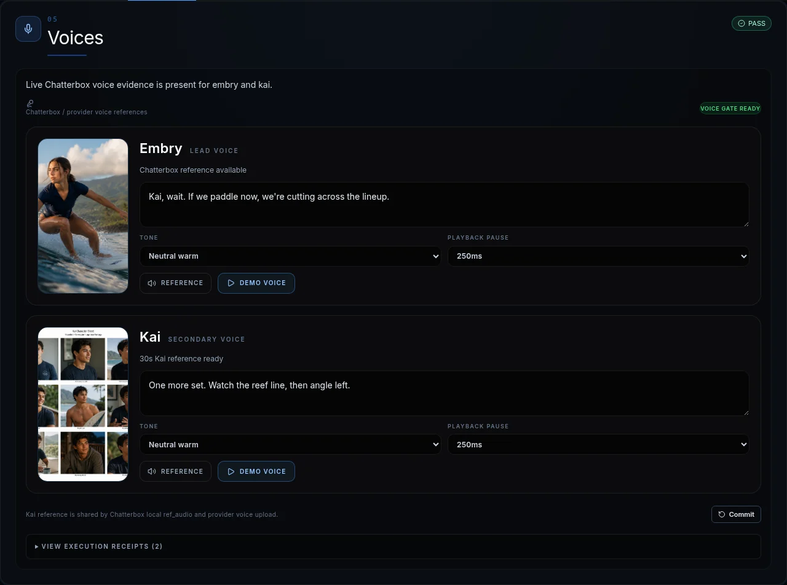

**Phases 06-08 — Script, storyboard, media lock.** Where the dream becomes a
sequence, and where frames are frozen against further edits.

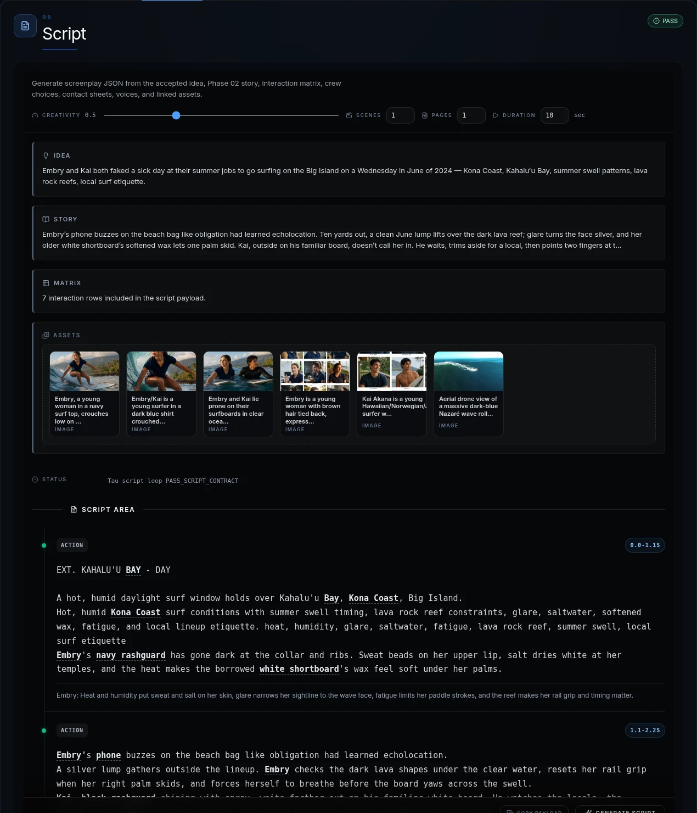

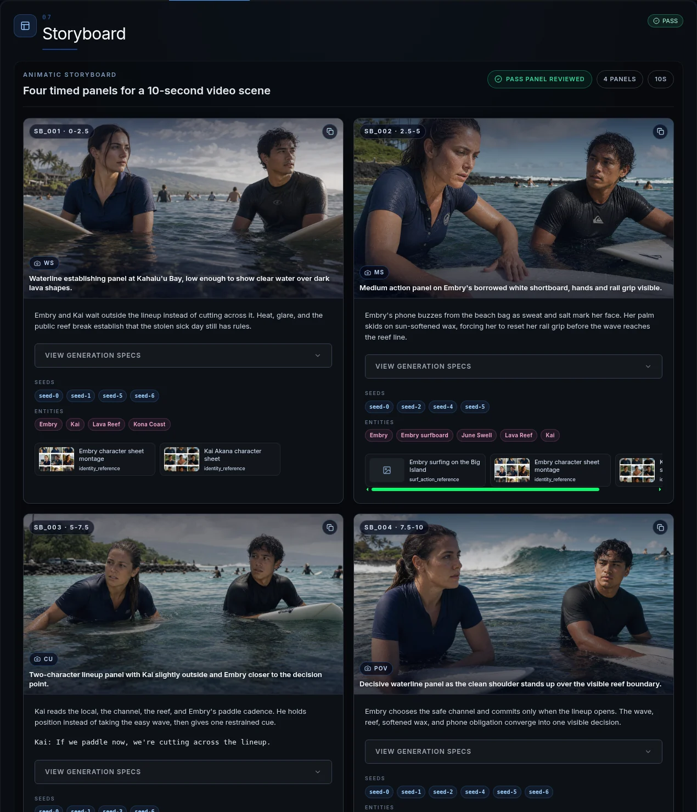

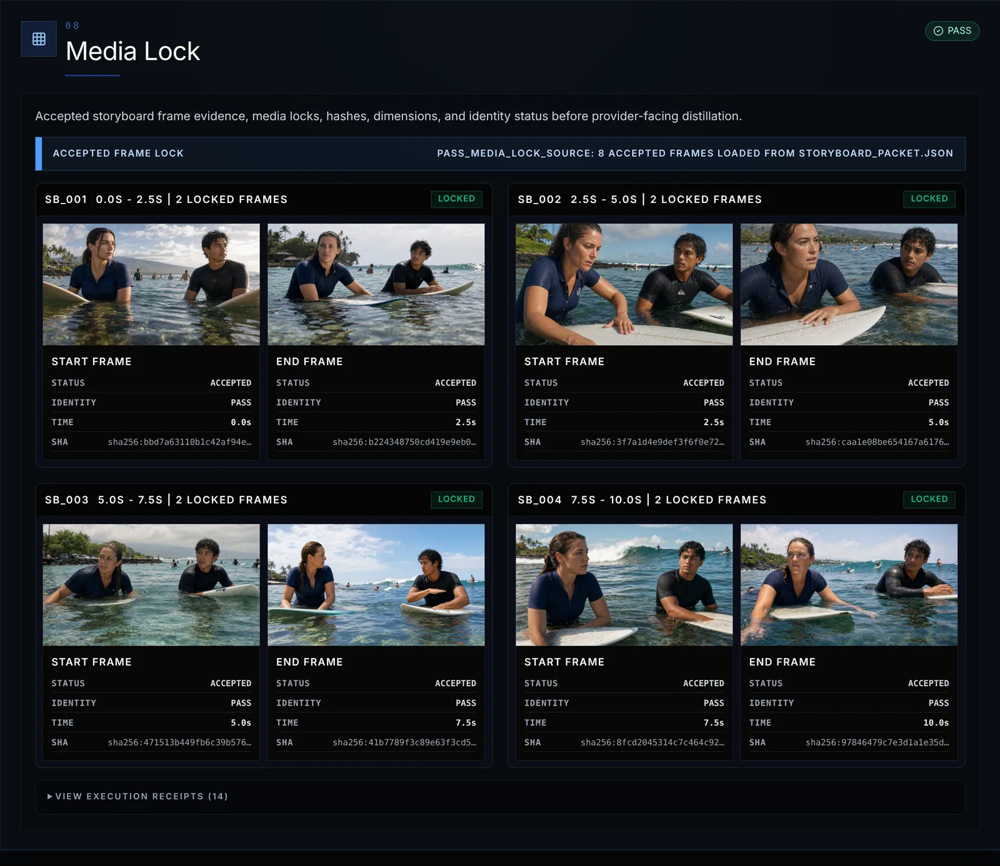

**Phases 09-10 — Provider dry-run and contract.** The scorecard and the
fail-closed provider state, which is what a blocked run actually looks like.

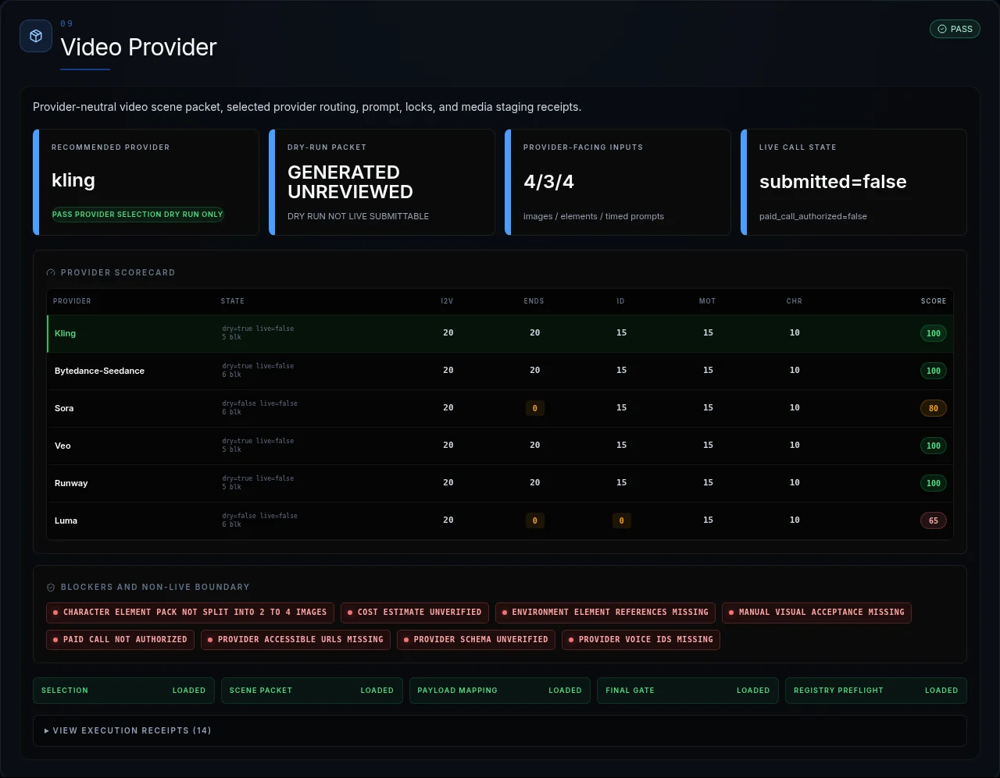

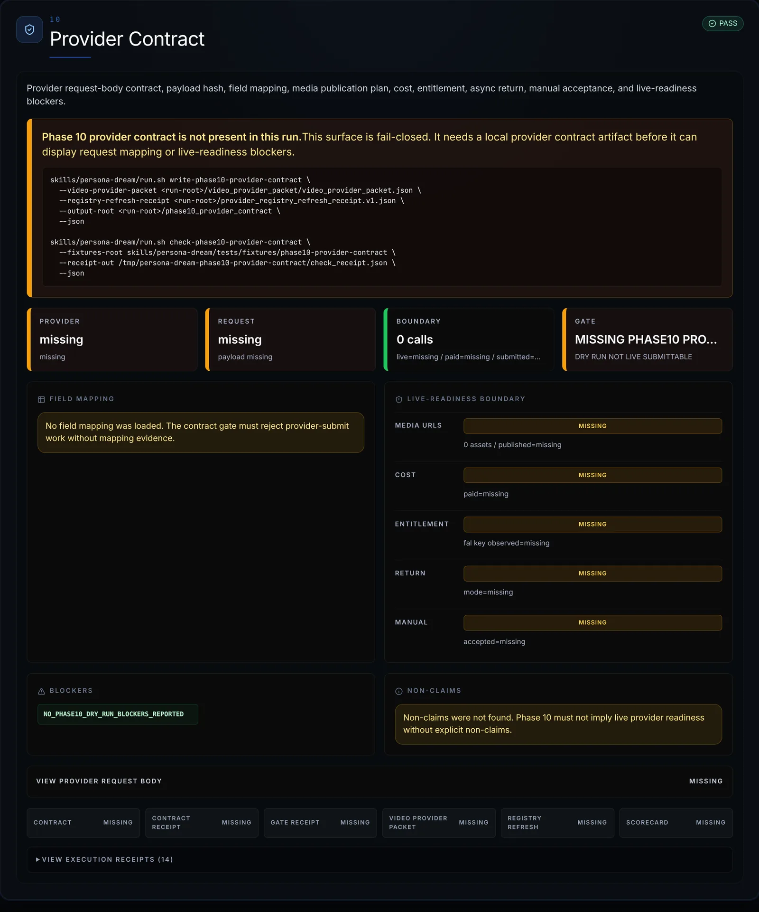

The control-by-control detail is in
[`docs/interface-walkthrough.md`](docs/interface-walkthrough.md).

## Quick Start

| What you want | Command |
|---|---|
| Explore a persona's memory residue | `./run.sh generate --persona <name>` |
| Build a fixture-backed dream packet | `./run.sh generate --persona <name> --fixture <file>` |
| Bias recall toward a topic | `./run.sh generate --persona <name> --about "<topic>"` |
| Create bounded video-planning material | `./run.sh generate --mode video_plan --persona <name>` |
| Write an explicitly approved reflection to Memory | `./run.sh generate --persona <name> --write-memory` |

These commands exercise the current runtime. They do not perform the unproven
live-provider, Watch, graph-persistence, or behavior-evaluation stages.

### The journal workflow

Three commands take a dream to a page you can read and a voice you can hear:

```bash
RUN_DIR=/tmp/persona-dream-journal
DAY=$(date -u +%F)

# What happened today, in her words, written into memory
./run.sh ingest-day --date "$DAY" --from-commits \
    --project-state "where the work actually stands" \
    --affect "how the human seemed today"

# Dream on it, blended with who she already is
./run.sh generate          --persona embry --day "$DAY" --output-dir "$RUN_DIR"
./run.sh speak-journal     --run-dir "$RUN_DIR"
./run.sh render-journal-ux --run-dir "$RUN_DIR" --out "$RUN_DIR/index.html"

# Talk to her about it; the turn is durable
./run.sh append-conversation --run-dir "$RUN_DIR" \
    --role human --text "why did that memory surface?"

# Carry what was said back into memory, so the next dream can draw on it
./run.sh carry-conversation --run-dir "$RUN_DIR" --date "$DAY"
```

What each one actually gets you:

- `ingest-day` compresses the day into at most 8 first-person events across
  code, project-state and affect, writes them to memory, and gates on reading
  them back.
- `generate` draws by quota — a reserved share for today, the rest for identity
  — then writes the annotated `journal.md` and the tag-stripped
  `journal_spoken.txt`, bound to each other by hash.
- `speak-journal` produces a live `journal.wav` in the run directory, bound by
  sha256 to that exact spoken text, with an ASR transcript.
- `render-journal-ux` writes a self-contained local page, verified in Chrome.
- `append-conversation` appends a turn under an exclusive lock. An Embry turn is
  refused unless it carries a requested tone and rendered audio.
- `carry-conversation` upserts those turns into memory as *attributed speech*,
  so a later dream can draw on them. This closes the loop.

Run `ingest-day` on two different days and the journals differ — that is the
point, and it is the thing that did not work until 2026-08-04, when five
consecutive dreams were producing byte-identical entries.

See [`docs/EVIDENCE.md`](docs/EVIDENCE.md) for the claim-by-claim boundary and
what each receipt does *not* prove.

---

## Architecture: the bounded loop

```
accepted dream
  -> Watch observations          (what the persona saw, adjudicated)
  -> first-person journal        (grounded, explicitly synthetic)
  -> bounded arc delta           (what may change, and by how much)
  -> continuity ledger           (the authority object; atomic, epoch-checked)
  -> session mood before turn 1  (deterministic, bound before the user speaks)
  -> Chatterbox voice delivery   (the mood requested of the renderer;
                                  measured not audible)
  -> recognition check           (is it still recognizably Embry?)
```

Each arrow is a gate with its own receipt. The loop is only as strong as the
weakest joined leg, and joining every leg in one run is what P2 is for.

## Journal and discussion loop

The bounded loop above is agent-internal: it produces persona state, and its
audience is the next turn. There is a second path out of the same dream whose
audience is a person.

```
accepted memories
+ current-day events                    (ingested and blended by quota)
      |
      v
persona-specific contradiction / tension
      |
      v
synthetic dream and interpretation
      |
      +--> journal.md
      |      first-person entry
      |      tone/emotion annotations
      |      source-memory and graph footnotes
      |
      +--> journal_spoken.txt
             annotation-stripped, hash-equivalent
                   |
                   v
      psychological mood
      -> Chatterbox delivery-tone request
      -> live journal.wav in the run directory
                   |
                   v
      journal / discussion UX             (built; unverified in a browser)
                   |
                   v
      append-only conversation.jsonl      (not built yet)
                   |
                   v
      future recall and later dreams      (not yet proven)
```

Everything down to `journal.wav` runs today and has receipts. Everything below
it does not.

**Journal annotations are not renderer control tokens.** They stay in the
readable entry for inspection and are stripped before speech, because
Chatterbox's `/health` reports `inline_text_tag_behavior:
synthesized_as_literal_text` — an inline `[wistful]` reaching the renderer is
spoken aloud as the word "wistful". The delivery tone is supplied separately as
metadata.

Five distinctions this project keeps apart, because collapsing any two of them
is how an overclaim gets made:

```
persona psychological mood     (what she woke up feeling)
 != journal annotation         (how a passage is meant to read)
 != requested delivery tone    (what we asked the renderer for)
 != proven audible emotion     (measured absent)
 != human-perceived emotion    (never tested)
```

### Why the five-cycle pilot produced identical journals

The five-cycle pilot produced byte-identical journals (sha `f812641f9dbbc7e2`,
cycles 001-005). The obvious reading is that nothing about any given day was
ever written to memory, which is true. Two measured defects in the memory
service make it worse:

- **A stored document is not retrievable.** `/store` returns success, the row is
  really in ArangoDB, and `/recall` never returns it — not even when queried
  with the document's own text.
- **`/recall` does not filter by scope.** Asking for one scope returns documents
  from others, so the five recall "strata" are not strata; they are five
  semantic queries over one undifferentiated pool.

Both are upstream, in the memory service rather than here.

So the pilot showed the pipeline runs repeatedly. It did not show
day-to-day experiential change, and adding day events alone would not have
produced any. Details and receipts: [`docs/EVIDENCE.md`](docs/EVIDENCE.md).

## What this is for

If you are evaluating this as research, the question it exists to answer is
narrow and falsifiable:

> **Does letting a persona dream about what happened to it produce anything a
> plain memory readout or a written reflection would not — and is it still
> recognizably itself afterwards?**

"No" is a real answer. The project is built so that a null or negative result
survives contact with the surfaces: claims are bound to receipts, receipts state
what they do *not* prove, and a gate fails closed when a claim outruns its
evidence. One finding is already negative and stayed that way — the requested
delivery tone does not reach the waveform, measured against the renderer's own
noise floor, and the project stopped claiming emotional delivery rather than
retrying for a better draw.

**The mechanism now runs a full cycle.** The day's events enter memory; a dream
draws on them alongside who the persona already is; the dream becomes a journal
she reads aloud; a human discusses that journal with her; and the discussion is
carried back into memory where a later dream draws on it.

Two properties are worth a researcher's attention:

- **Consecutive days differ.** Five cycles once produced byte-identical
  journals. They now differ, and differ *because of the day* — one entry opens
  on the human being terse, another on impatience about stranded work.
- **Commentary does not become autobiography.** A question a human asked comes
  back as `human said, about my journal entry: …` — attributed speech bound to
  the journal it was about, never as an event that happened to her. This is the
  boundary that makes the loop safe to close at all.

What is **not** shown is that any of this helps. That the loop closes is a
mechanism result, not a benefit result; the controlled ablations against direct
memory and structured reflection are the experiment, and they have not been run.

## Where it stands

Honest one-liner: **the mechanism runs a full cycle and the return arc closes.
What is unproven is whether any of it helps, and one component — audible
delivery tone — was measured and does not work.**

What runs today, with receipts behind it:

- a dream grounded in recalled memories, every conclusion linked to its source
- a first-person `journal.md` with tone annotations and provenance footnotes
- a hash-bound spoken form, and Embry reading it aloud into `journal.wav`
- a local journal and discussion page, verified in a browser
- the day's code, project-state and affect events written into memory and
  blended into that day's dream, so consecutive days differ
- a discussion carried back into memory as attributed speech, which a later
  dream draws on — the loop closes

What does not work yet, stated plainly:

- **Tone is not audible.** The delivery tone reaches the renderer and is
  recorded, but it does not change the waveform — measured, not assumed. The
  engine in use ignores the parameters that would carry it.

- **Nothing shows that dreaming helps.** The loop closes, days differ, and
  provenance holds — but whether a dream beats a plain memory readout or a
  written reflection is the actual research question, and the controlled
  comparison has not been run.

The full claim-by-claim boundary, every receipt, and what each one does *not*
prove: [`docs/EVIDENCE.md`](docs/EVIDENCE.md).

## Embry and Kai: Example workflow, not a benefit result

The current fixture begins with a deceptively ordinary choice: Embry and Kai
fake a sick day from their summer jobs to surf Kahaluʻu Bay on Hawaiʻi's Big
Island. Heat softens the board wax. A lava reef narrows the safe choices. The
lineup adds social pressure, while Embry's history with Kai gives every warning
and hesitation relational weight.

One voice-test line captures the tension:

> "Kai, wait. If we paddle now, we're cutting across the lineup."

The pipeline can draw on character images, older text memories, surf audio,
video references, environmental evidence, and relationship history.

The test is not whether it can make an attractive surf clip. The test is
whether Embry can later watch the actual returned media, distinguish a renderer
failure from a meaningful pattern, form a bounded interpretation, and use that
experience in a future conversation without claiming the dream literally
happened.

Chatterbox receives and renders the requested delivery tone. That proves the
mood-to-renderer contract and the spoken-journal path; it is not expression.
The requested tone was measured against the renderer's own stochastic spread
and produced no acoustic effect. It does not decide the psychology or
rewrite Embry's durable identity.

---

## Research detail

The settled research goal and gate sequence live in [`GOAL.md`](GOAL.md).
Detailed hypotheses, protocols, and workstream descriptions live in
[`docs/research.md`](docs/research.md). For current checked state, use
[`CURRENT_STATUS.json`](CURRENT_STATUS.json).

## Pipeline detail

The numbered 01-16 stage contract, inputs, outputs, and operator notes live in
[`docs/pipeline.md`](docs/pipeline.md). Use [`SKILL.md`](SKILL.md) for the
executable runtime contract.

## Technical architecture

The detailed component and data-flow design lives in
[`docs/architecture.md`](docs/architecture.md). The bounded-loop section above
is the README-level architecture.

## Verification detail

Commands, expected outputs, artifact schemas, and acceptance procedures live in
[`docs/verification.md`](docs/verification.md). The current claim boundary
remains in [Current Proof Boundary](#current-proof-boundary), and per-run
evidence remains under `reports/`.

## References

- [`SKILL.md`](SKILL.md) - current operational contract
- [`create-persona`](../create-persona/SKILL.md) - persona authority and identity-consistency validation
- [`memory`](../memory/SKILL.md) - Memory First, multimodal recall, ToM, and persistence contract
- [`watch`](../watch/SKILL.md) - evidence-first dream-media perception
- [`create-movie`](../create-movie/SKILL.md) - downstream polished media lane
- [Graph Memory Operator](https://github.com/grahama1970/graph-memory-operator) - graph, retrieval, and persistence implementation
- Nested creative helpers live under `skills/persona-dream/skills/`.

