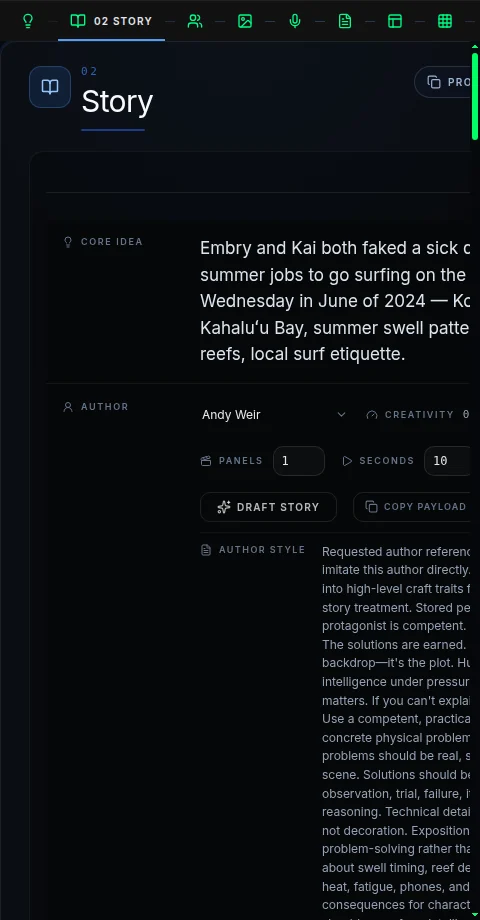
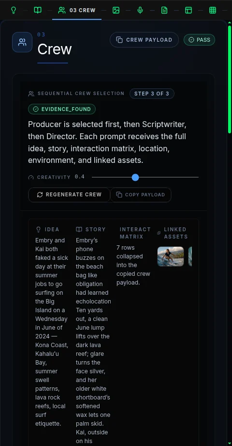
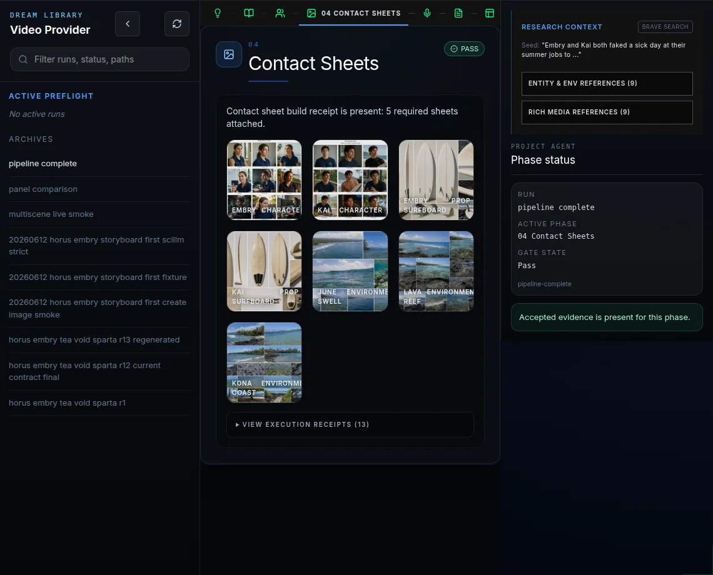
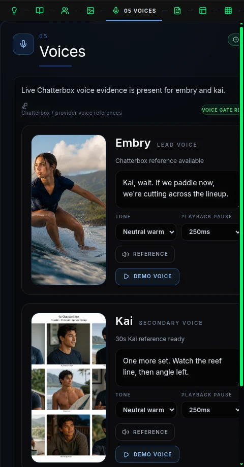
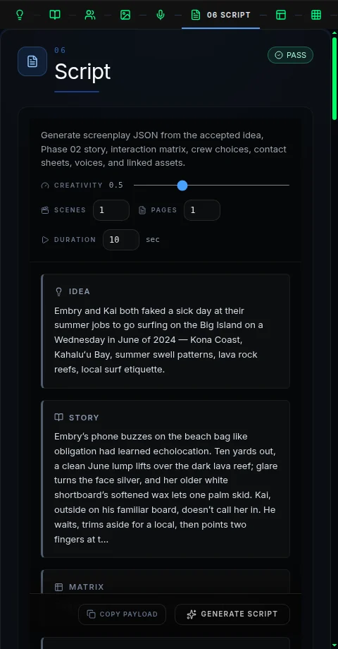
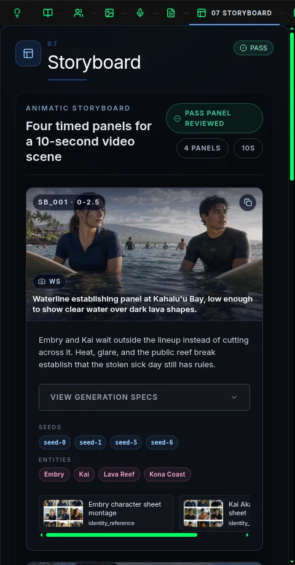
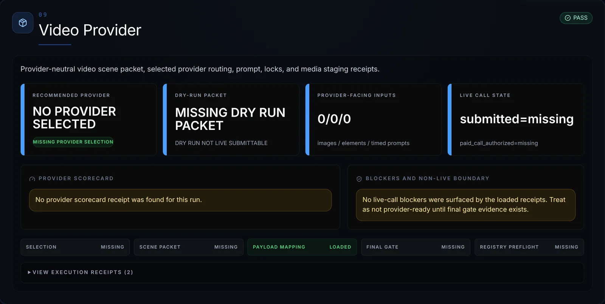

# Persona Dream


> **Can an AI persona dream about what has happened to it, watch the dream it
> made, learn from it, and still remain recognizably itself?**

Persona Dream gives a persistent multimodal voice persona—a long-lived agent
with durable memory, a stable character, and access to text, images, audio, and
video—a controlled way to turn experience into a synthetic dream and examine
what comes back.

We are not building a movie generator. We are testing whether a bounded
synthetic experience can become useful memory and enrich later Theory of Mind
(ToM): the persona's structured beliefs, desires, emotions, stances, and
relationships.

The intended durable output is an explicitly synthetic dream memory. Every
conclusion must remain linked to the memories, media, relationships, and
observed scenes that support it. A dream can influence later reasoning, but it
cannot silently become literal history or rewrite the persona's identity.

> [`SKILL.md`](SKILL.md) is the current runtime contract. This README explains
> the research purpose, wider architecture, current proof boundary, and intended
> closed loop. The implemented runtime remains narrower than the complete system
> described here.

**Current proof boundary:** the project has grounded dream packets, live image
and storyboard slices, media locking, provider routing, and a fixture-backed
Phase 10 provider-contract dry run. It has not yet proven a live provider
return, Watch-based self-analysis, dream persistence, or changed later
behavior.

## Quick Start

| What you want | Command |
|---|---|
| Explore a persona's memory residue | `./run.sh generate --persona <name>` |
| Build a fixture-backed dream packet | `./run.sh generate --persona <name> --fixture <file>` |
| Bias recall toward a topic | `./run.sh generate --persona <name> --about "<topic>"` |
| Create bounded video-planning material | `./run.sh generate --mode video_plan --persona <name>` |
| Write an explicitly approved reflection to Memory | `./run.sh generate --persona <name> --write-memory` |

These commands exercise the current runtime. They do not perform the unproven
live-provider, Watch, graph-persistence, or behavior-evaluation stages.

---

## Research

### Why This Matters

Most agent-memory systems retrieve facts and prior episodes. They do not give a
persistent persona a controlled way to combine emotionally important
experiences, externalize them, inspect the result, and carry a grounded
interpretation forward.

Persona Dream explores that missing middle. A persona could use a dream to
rehearse a difficult relationship, connect a present event to an older memory,
or surface a conflict it could not express directly. The dream is synthetic,
but its effect on later reasoning can still matter—provided every stage
preserves provenance, uncertainty, and the boundary between imagination and
history.

The same architecture could support persistent companions, game characters,
simulation agents, and other long-lived systems that need to adapt without
losing continuity or inventing a false past.

### Founding Research Question

Can a persona whose speech is rendered through Chatterbox, the voice layer:

1. recall emotionally salient past memories and relevant present events;
2. combine text, images, audio, video, relationships, and project or code
   activity into a synthetic dream;
3. render that dream into inspectable multimodal media;
4. use [`watch`](../watch/SKILL.md) to observe what the generated dream actually
   contains instead of assuming the renderer followed the prompt;
5. interpret those observations against its existing memories and persona state;
6. persist grounded ToM tags, graph edges, multimodal embeddings, and an
   explicitly synthetic dream memory; and
7. use that dream appropriately in later reasoning and conversation without
   confusing it with a literal historical event?

The experiment succeeds only when the dream can affect later recall or behavior
while the persona remains recognizably itself.

### The Rule That Keeps the Experiment Honest

One kind of evidence must never silently become another.

| Evidence class | What it means | Owning boundary |
|---|---|---|
| **Historical memory or present event** | Something stored or observed as part of the persona's real history | Memory / Graph Memory |
| **Dream intention** | What Persona Dream planned, scripted, or asked a renderer to create | Persona Dream |
| **Rendered dream observation** | What is actually visible, audible, or temporally present in returned media | `watch` |
| **Persona interpretation** | What the persona tentatively thinks the observed dream may mean | Persona Dream interpretation gate |
| **Theory-of-Mind inference** | A validated candidate belief, fear, desire, trust state, stance, or relationship update | Memory / ToM validation |
| **Durable persona change** | A promoted change to canonical goals, concerns, worldview, identity, or voice profile | `create-persona` |

Suppose the script asks Kai to answer Embry, but the generated video drops Kai
from the final scene. `watch` can report that Kai is absent. Persona Dream may
tentatively connect that absence to Embry's uncertainty about whether her
boundaries will be respected—but it must also preserve the simpler explanation:
the renderer failed to maintain character continuity.

A dream-derived record therefore keeps facts such as:

```json
{
  "synthetic_origin": true,
  "literal_historical_event": false
}
```

There is no direct path from a renderer defect to a durable personality rewrite.

### How a Dream Works

```text
create-persona
  canonical identity, voice profile, and identity-consistency tests
        |
        v
memory + graph-memory-operator
  past memories + present events + text/image/audio/video/code activity
  + ToM state + emotional intensity + graph relationships
        |
        v
persona-dream
  residue selection -> dream synthesis -> optional media production
        |
        v
watch
  frames + transcript + sound + scenes + visible evidence
        |
        v
persona self-interpretation
  intended dream vs observed dream + source-memory grounding
        |
        v
memory + graph-memory-operator
  synthetic dream memory + ToM tags/edges + Qdrant multimodal embeddings
        |
        v
future recall, reasoning, conversation, and Chatterbox expression
```

The ordinary experience should eventually be simple: a persona says `dream`, or
`dream about Kai and the surf trip`, and the system performs the grounded loop
behind the scenes. React Flow remains an optional human inspection and
correction surface, not a prerequisite for autonomous dreaming.

---

## Current Proof Boundary

Persona Dream is an advanced research prototype and a substantial hardening
workload for Tau, the agentic harness that runs and verifies the pipeline. It is
not yet a completed personality-evolution product.

| Boundary | State | What that proves |
|---|---|---|
| Grounded dream packets | Proven | Source links, contradiction reports, reflections, and receipts exist |
| Image and storyboard production | Proven slices | Live image generation, visual review, creator/reviewer repair, and accepted-frame evidence exist |
| Phase 08 — Media Lock | Proven locally | Accepted storyboard evidence has a stable local boundary |
| Phase 09 — Video Provider | Dry run | Provider-neutral classification, ranking, and packet routing exist without a live-provider claim |
| Phase 10 — Provider Contract | Outstanding; fixture-backed dry run only | A local compiler and fail-closed contract gate exist, but no current fal.ai provider schema or network call has been proven |
| Phase 11 — Submit and Return | Outstanding and blocked | No paid call or live provider return has been authorized or proven |
| Watch → interpretation → Memory | Designed, not closed | The architecture exists, but one accepted end-to-end run does not |
| Later persona behavior | Not proven | No persisted dream has yet been shown to alter later behavior while preserving identity |

The screenshots below come from an archived Embry/Kai run. That run has not been
regenerated with every newer provider artifact. A blocked screenshot describes
the selected run root, not the full set of current development capabilities.

Provider selection is near the end of the media-production spine. It is not the
end of the founding research experiment.

### Pipeline at a Glance

#### Current media-production spine

| Phase | Purpose | Status |
|---|---|---|
| **01 — Idea and Memory Residue** | Capture the creative directive and inspect grounded multimodal recall | Implemented; D3 graph exploration exists |
| **02 — Story** | Turn accepted residue into a story and interaction model | Implemented planning and generation slices |
| **03 — Crew** | Select producer, scriptwriter, and director authority | Implemented sequential selection and contract work |
| **04 — Contact Sheets** | Lock character, prop, and environment references | Implemented with live assets; still an active hardening area |
| **05 — Voices** | Inspect reference voices and plan voice-identity boundaries | Audition and planning surface exists |
| **06 — Script** | Generate and review screenplay evidence from accepted upstream material | Implemented creator/reviewer contract work |
| **07 — Storyboard** | Produce and review panels, start/end frames, and continuity evidence | Accepted frame evidence exists in local receipts |
| **08 — Media Lock** | Freeze the accepted provider-facing frame subset, roles, dimensions, and hashes | Implemented |
| **09 — Video Provider** | Rank providers and create a provider-specific dry-run packet | Local dry-run routing exists; no live-provider claim |
| **10 — Provider Contract** | Compile an inspectable request contract, field mapping, cost/entitlement plan, and async plan | **Outstanding after Video Provider**; fixture-backed local dry-run proof exists, but no current provider API proof or network call |
| **11 — Submit and Return** | Authorize one paid call, submit, poll or receive callback, download, and validate media | **Outstanding after Video Provider**; blocked pending explicit proof and approval |

#### Creative spine inventory: phases 02-07

These phases are the spine between grounded memory residue and the media lock.
They are not decorative UI tabs. Phase 08 can lock evidence only after this
chain has turned source residue into reviewed story, references, script, and
storyboard frames.

| Phase | Primary artifact | Current state | Evidence role |
|---|---|---|---|
| **02 — Story** | `story_contract.json`, interaction/relationship coverage, story intent | Implemented planning and generation slices exist for the Embry/Kai fixture | Defines the narrative and relationship contract consumed by script and storyboard |
| **03 — Crew** | producer, scriptwriter, director, and acceptance-role contracts | Sequential selection and contract work exists | Assigns creative authority and review roles for downstream generation |
| **04 — Contact Sheets** | character, prop, environment, and reference-pack evidence | Live reference assets and contact-sheet surfaces exist | Grounds Embry, Kai, surfboards, Kahaluʻu Bay, lava reef, and lineup references |
| **05 — Voices** | voice references, audition state, voice handoff plan | Audition and planning surface exists | Captures voice intent and dialogue readiness without claiming provider voice readiness |
| **06 — Script** | `script_contract.json`, timed beats, dialogue/action coverage, interaction matrix | Implemented creator/reviewer contract work exists | Turns story intent into timed action, dialogue, and interaction evidence |
| **07 — Storyboard** | accepted panels, start/end frames, visual-review receipts, prompt contracts | Accepted frame evidence exists in local receipts; Phase 08 can lock that evidence | Produces accepted visual frames for the Phase 08 media lock |

Status terms in this inventory are intentionally conservative:

- **Implemented** means local artifacts, scripts, or UI surfaces exist.
- **Accepted evidence** means a receipt-backed local artifact exists for the
  selected run.
- **Dry run** means no provider call, no paid call, and no live readiness claim.

#### Outstanding after Phase 09

Phase 09 is the current provider-selection and dry-run routing boundary. The
pipeline work after it is still outstanding:

- **10 — Provider Contract:** fetch or verify the current provider API schema,
  compile the selected provider request, map fields, check cost and entitlement,
  and keep `submitted=false`.
- **11 — Submit and Return:** after explicit authorization, publish/probe input
  media URLs, submit one bounded provider request, poll or receive callback, and
  download/hash the returned media.
- **Watch observation:** inspect the actual returned video for visible, audible,
  transcript, scene, and timing evidence.
- **Self-interpretation:** compare Watch evidence with source memories and dream
  intention without treating the dream as literal history.
- **Memory, graph, and Qdrant persistence:** persist only accepted synthetic
  dream memory and ToM edges through the owning Memory/Graph layers.
- **Recall and behavior proof:** retrieve the synthetic dream later and show
  bounded Chatterbox/persona behavior changes without identity drift.

#### Research loop after provider return

| Stage | Purpose | Status |
|---|---|---|
| **Watch observation** | Extract frames, transcript, sound, scenes, visible facts, and coverage gaps from the actual returned dream | Not yet integrated into one closed run |
| **Self-interpretation** | Compare dream intention, Watch evidence, source memories, and current persona state | Not yet proven |
| **ToM validation** | Accept or reject bounded beliefs, fears, desires, trust states, and relationship candidates | Not yet proven |
| **Memory and embedding persistence** | Write the synthetic dream, graph edges, and Qdrant multimodal points through the owning Memory layer | Not yet proven |
| **Recall and behavior evaluation** | Retrieve the dream semantically and through graph traversal, then test later persona and Chatterbox behavior | Not yet proven |

### Embry and Kai: The Working Example

The current fixture begins with a deceptively ordinary choice: Embry and Kai
fake a sick day from their summer jobs to surf Kahaluʻu Bay on Hawaiʻi's Big
Island. Heat softens the board wax. A lava reef narrows the safe choices. The
lineup adds social pressure, while Embry's history with Kai gives every warning
and hesitation relational weight.

One voice-test line captures the tension:

> “Kai, wait. If we paddle now, we're cutting across the lineup.”

The pipeline can draw on character images, older text memories, surf audio,
video references, environmental evidence, and relationship history. The test is
not whether it can make an attractive surf clip. The test is whether Embry can
later watch the actual returned media, distinguish a renderer failure from a
meaningful pattern, form a bounded interpretation, and use that experience in a
future conversation without claiming the dream literally happened.

Chatterbox can express the resulting tone. It does not decide the psychology or
rewrite Embry's durable identity.

---

## Pipeline Step Walkthrough

The current UX Lab surface is a developer-oriented inspection pane over the
pipeline and its machine-readable receipts. The walkthrough below lists every
pipeline phase in order. Screenshots are included for the phases that currently
have committed README assets; phases without a committed screenshot are still
shown because they are real spine steps, not hidden implementation details.

### 01 — Idea and Memory Residue


Phase 01 begins with the core creative directive and the recalled memory board.
It mixes Embry/Kai surf images, text memories, character sheets, reef
references, video, and audio so the source material can be inspected before
story or media production begins.

**What to notice:** the system exposes multiple memory modalities before it asks
a story or renderer to transform them.

### 02 — Story



Phase 02 turns accepted memory residue into a story contract: the narrative
premise, relationship pressure, surf-etiquette stakes, contradiction checks,
and interaction model that later phases must preserve.

**What to notice:** this is where the Embry/Kai sick-day idea becomes a bounded
story rather than a loose prompt.

### 03 — Crew



Phase 03 selects the creative authorities for the run: producer, scriptwriter,
director, and reviewer roles. Those choices determine which creative standards
control later script, storyboard, and visual-review decisions.

**What to notice:** crew selection is part of the evidence chain. It is not a
cosmetic cast list.

### 04 — Contact Sheets



Phase 04 gathers character, environment, surfboard, lineup, and lava-reef
references. Contact sheets are source and planning evidence; they do not
automatically become provider-ready Element upload packs.

**What to notice:** Embry, Kai, Kahaluʻu Bay, the lava reef, and the public
lineup are grounded before the script and storyboard try to reuse them.

### 05 — Voices



Phase 05 inspects voice references, dialogue readiness, and voice-identity
boundaries. It can preserve conversational intent and Chatterbox tone without
claiming provider voice IDs or live voice readiness.

**What to notice:** a voice surface can support the dream's emotional tone while
still blocking live provider voice submission.

### 06 — Script



Phase 06 converts the accepted story into timed action, dialogue, interaction
coverage, and screenplay evidence. The Embry/Kai fixture uses this phase to
make surf etiquette, hesitation, pressure, and boundary-setting concrete.

**What to notice:** this is the bridge from story intent to frameable action.

### 07 — Storyboard



Phase 07 produces and reviews storyboard panels, start/end frames, identity
continuity, prompt contracts, and visual-review receipts. Accepted storyboard
evidence is what Phase 08 is allowed to lock.

**What to notice:** Media Lock does not create visual truth. It freezes the
accepted storyboard evidence produced here.

### Embry Portrait Memory Graph


The graph affordance on Embry's portrait opens a D3 memory neighborhood. The
selected portrait becomes the root, and related media, text, people, audio, and
relationship nodes expand around it.

**What to notice:** this is an explorer, not a write surface. It does not create
canonical graph edges or accept a psychological interpretation.

### 08 — Media Lock


Phase 08 locks accepted storyboard evidence: start and end frames, dimensions,
hashes, identity status, and the receipts that support them.

**What to notice:** a media lock proves a stable local evidence boundary. It
does not prove that any provider is ready.

### 09 — Video Provider



Phase 09 answers one question: which provider best fits the accepted scene, and
why? The archived run shown here is fail-closed because its selected run root
does not contain the provider scorecard and packet.

**What to notice:** missing evidence stays visibly blocked instead of being
presented as a successful provider choice.

### 10 — Provider Contract


Phase 10 answers a different question: exactly what would eventually be sent,
against which endpoint and schema evidence, using which media plan, cost policy,
and asynchronous return path? The current development rung is fixture-backed
and dry-run only. The archived run shown here has not been regenerated with
that contract artifact.

**What to notice:** the current screenshot is correctly blocked even though a
newer local contract compiler exists. Neither state proves live fal.ai
compatibility.

### 11 — Submit and Return

Phase 11 is the outstanding live-provider boundary: explicit authorization,
provider-accessible media URLs, one bounded paid call, polling or callback,
download, hash validation, FFprobe, and returned-media receipt.

**What to notice:** this step is intentionally not complete. The README must not
claim the persona watched a dream until a provider return exists and Watch has
analyzed the actual media.

---

## Technical Architecture

### Memory, Graphs, and Retrieval

A stored dream remains explicitly synthetic and connected to its evidence.
Typical relationships include:

```text
persona --dreamed--> dream

dream --derived_from--> source memory
dream --incorporates_event--> present event
dream --features_person--> persona or user
dream --features_place--> location
dream --references_media--> image/audio/video/code memory
dream --observed_in_scene--> Watch scene evidence
dream --supports_interpretation--> grounded ToM candidate
```

ToM candidates can represent beliefs, desires, fears, trust, distrust,
avoidance, obligation, uncertainty, emotion, stance, preference, or
relationship state. Every candidate retains its subject and target,
source-memory IDs, Watch observation IDs where applicable, confidence,
emotional intensity, synthetic origin, and the gate receipt that accepted or
rejected it.

Qdrant and ArangoDB solve different retrieval problems:

- **Qdrant** finds semantically similar dream, text, image, audio, video, and code
  memories even when a later question uses different words.
- **ArangoDB** explains how a candidate connects through explicit people, events,
  scenes, evidence, beliefs, and relationships.

Future recall uses semantic retrieval to find candidates and graph traversal to
establish the grounded relationship chain. Emotional intensity can rank memories
that already pass identity, scope, evidence, and graph checks. It cannot
override those checks.

### Phase 01: From D3 Explorer to React Flow Canvas

The current developer UX includes a D3-based multimodal memory and ToM explorer.
The intended user-facing evolution is a React Flow canvas backed by the same
canonical Memory and Graph Memory records.

The canvas should let a human inspect or correct the core idea, present events,
recalled text, images, audio, video, code activity, people, places, objects,
emotions, conflicts, typed relationships, salience, and accepted or rejected
dream residue.

D3 can remain the force-layout engine. React Flow should own editable custom
nodes, typed connections, selection, grouping, saved layout, undo/redo, and
multimodal playback. User-created links are not canonical until Memory accepts
and receipts the write.

### Ownership Boundaries

| Component | Owns |
|---|---|
| [`create-persona`](../create-persona/SKILL.md) | Canonical persona construction, identity invariants, voice profile, durable persona updates, and identity-consistency tests |
| [`memory`](../memory/SKILL.md) and [Graph Memory Operator](https://github.com/grahama1970/graph-memory-operator) | Canonical multimodal memories, ArangoDB graph state, ToM records and edges, Qdrant embeddings, recall, and persistence |
| `persona-dream` | Dream-residue selection, synthetic dream construction, creative and media orchestration, self-interpretation proposals, and receipts linking the cycle |
| [`watch`](../watch/SKILL.md) | Evidence-first perception of rendered media: frames, transcript, sound, scenes, visual descriptions, and coverage gaps |
| Chatterbox / voice lane | Audible expression of the current persona response and performance direction; it does not decide beliefs or memory truth |
| [`create-movie`](../create-movie/SKILL.md) | Long-form audio, score, mixing, assembly, and polished movie production beyond the bounded dream sequence |

Persona Dream does not create a second persona database or a parallel memory
store. It can emit proposal and evidence artifacts, but accepted memories,
relationships, ToM state, and embeddings belong to Memory and Graph Memory.
Durable canonical persona changes belong to `create-persona`.

### Artifacts

#### Every run

| Artifact | Purpose |
|---|---|
| `dream_request.json` | Persona, memory residue, mode, and run metadata |
| `response.json` | Model or fixture response captured for audit |

#### Successful dream runs

| Artifact | Purpose |
|---|---|
| `residue_links.json` | Provenance from the dream packet to recalled source memories |
| `contradiction_report.json` | Tensions or contradictions detected in selected residue |
| `dream_packet.json` | Structured synthetic dream material for downstream tools |
| `dream_prompt.txt` | Human-readable synthetic dream prompt |
| `frame_prompts.json` | Visual planning prompts when frames are requested |
| `contact_sheet.png` | Inspectable visual review surface when images are produced |
| `dream_reflection.md` | Human-readable reflection, not a canonical persona rewrite |
| `memory_write_receipt.json` | Proof that a Memory write succeeded or was deliberately skipped |

`memory_write_receipt.json` remains `skipped` unless `--write-memory` was
explicitly requested and the Memory API confirmed the write.

#### `video_plan` runs

```text
dream_story.md
dream_story.json
character_scene_bible.json
technique_selection.json
script_dna_selection.json
storyboard.json
timed_transcript.json
multimodal_prompts.json
voice_handoff_plan.json
pipeline_stage_report.json
pipeline_stage_report.md
manifest.json
```

Hardened video experiments can add media-lock, provider-selection, payload, and
provider-contract receipts. Their existence proves only the boundary named by
the receipt.

#### Intended closed-loop evidence

The complete research loop should eventually produce evidence such as:

```text
rendered_dream.mp4
watch/frames_manifest.json
watch/transcript.json
watch/scenes.json
watch/report.json
dream_observation_packet.json
dream_self_interpretation.json
tom_edge_proposals.json
dream_memory_record.json
qdrant_embedding_receipt.json
graph_edge_write_receipt.json
persona_before_after_evaluation.json
```

These names describe the intended contract. They are not a claim that every
artifact is currently implemented.

---

## Acceptance and Proof

### Research Acceptance Boundary

The founding experiment is complete only when one non-mocked run proves all of
the following:

1. A persona autonomously selects grounded multimodal residue and current events.
2. It creates a synthetic dream with complete source provenance.
3. When media is rendered, the returned artifact is technically valid and
   independently analyzed by `watch`.
4. Self-interpretation claims cite Watch observations and source memories.
5. Accepted ToM records and graph edges are written through Memory and Graph
   Memory.
6. Qdrant retrieves the dream from a semantically related, differently worded
   query.
7. ArangoDB traverses from the persona through the dream to source memories,
   observations, people, events, and ToM state.
8. A later persona response uses the dream appropriately while preserving the
   synthetic-versus-literal distinction.
9. Identity-consistency probes show bounded evolution without destructive
   identity drift.
10. Chatterbox audibly expresses the resulting persona state without becoming
    the authority that invented it.

### Proof Discipline

- Do not invent memory residue when recall is empty.
- Label fixture, synthetic, inferred, observed, and literal evidence distinctly.
- Preserve source IDs, scopes, hashes, timestamps, and revision boundaries.
- Treat prompts as intent, not proof of generated-media contents.
- Treat Watch observations as evidence, not automatic psychological conclusions.
- Treat image, video, graph, embedding, persona, and Memory receipts as claims
  until their underlying artifacts and side effects are inspected.
- Do not turn one dream into an unreviewed durable identity rewrite.
- Never claim final video or personality-evolution success without concrete
  media, Watch evidence, persisted graph and embedding receipts, and later
  behavior proof.

### Common Mistakes

| Mistake | Better move |
|---|---|
| Calling Persona Dream a finished movie generator | Treat media generation as one optional part of a graph-memory consolidation experiment |
| Treating the script as proof of what the dream video contains | Run `watch` and interpret observed evidence |
| Creating a second persona or memory database | Persist through `create-persona`, `memory`, and Graph Memory Operator |
| Letting a dream silently rewrite canonical identity | Store bounded synthetic memory and ToM state; promote durable changes only through the owning gate |
| Making React Flow mandatory for autonomous dreaming | Use it as the human inspection and correction canvas over the same graph-native backend |
| Treating a contact sheet as final output | Use it as an inspectable review artifact |
| Treating provider selection as research completion | Close Watch, graph and Qdrant persistence, and future-behavior evaluation |

## References

- [`SKILL.md`](SKILL.md) — current operational contract
- [`create-persona`](../create-persona/SKILL.md) — persona authority and identity-consistency validation
- [`memory`](../memory/SKILL.md) — Memory First, multimodal recall, ToM, and persistence contract
- [`watch`](../watch/SKILL.md) — evidence-first dream-media perception
- [`create-movie`](../create-movie/SKILL.md) — downstream polished media lane
- [Graph Memory Operator](https://github.com/grahama1970/graph-memory-operator) — graph, retrieval, and persistence implementation
- Nested creative helpers live under `skills/persona-dream/skills/`.
