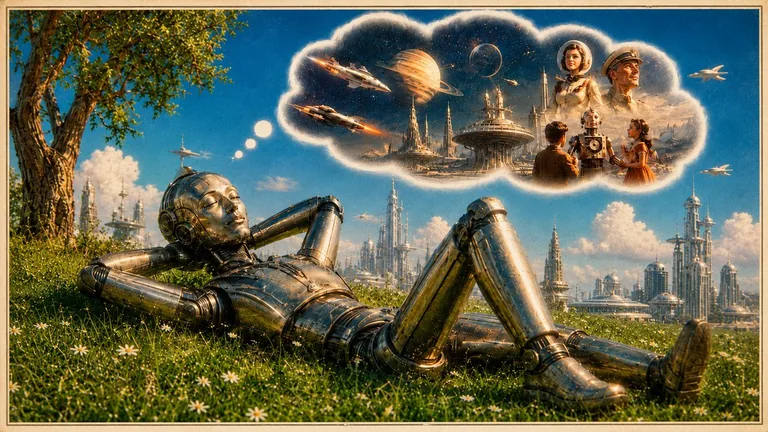

# persona-dream



Persona Dream is a research pipeline for a persistent multimodal voice persona to
**dream from grounded past memories and present events, perceive the dream it
created, and use that experience to enrich future Theory-of-Mind reasoning**.

The movie is not the primary research result. It is an optional embodied form of
the dream that the persona can later inspect through [`watch`](../watch/SKILL.md).
The durable result is a receipt-backed synthetic dream memory connected to its
source evidence, observed media, Theory-of-Mind state, graph relationships, and
multimodal semantic embeddings.

Agents must treat [`SKILL.md`](SKILL.md) as the current runtime contract. This
README explains the founding research purpose, ownership boundaries, current
implementation status, and intended closed loop. The current runtime is narrower
than the complete research architecture described here.

## Founding Research Question

Can a persona with a Chatterbox-rendered voice:

1. recall emotionally salient past memories and relevant present events;
2. combine text, images, audio, video, relationships, and project/code activity
   into a synthetic dream;
3. render the dream into inspectable multimodal media;
4. use `watch` to observe what the generated dream actually contains;
5. interpret those observations against its existing memories and persona state;
6. persist grounded Theory-of-Mind tags, graph edges, multimodal embeddings, and
   a synthetic dream memory; and
7. use that dream appropriately in later reasoning and conversation without
   confusing it with a literal historical event?

The experiment is successful only when the dream can affect future recall and
behavior while the persona remains recognizably itself.

## Intended Cognitive Loop

```text
create-persona
  canonical persona, identity invariants, voice profile, simulacrum tests
        |
        v
memory + graph-memory-operator
  past memories + present events + text/image/audio/video/code activity
  + Theory-of-Mind state + emotional intensity + graph relationships
        |
        v
persona-dream
  residue selection -> dream synthesis -> optional media production
        |
        v
watch
  frames + transcript + sound + scenes + visible evidence
        |
        v
persona self-interpretation
  intended dream vs observed dream + source-memory grounding
        |
        v
memory + graph-memory-operator
  synthetic dream memory + ToM tags/edges + Qdrant multimodal embeddings
        |
        v
future persona recall, reasoning, conversation, and Chatterbox expression
```

A persona should eventually be able to initiate the ordinary path with one
simple request such as "dream" or "dream about Kai and the surf trip." React
Flow is an optional human inspection and correction surface, not a prerequisite
for autonomous dreaming.

## Ownership Boundaries

| Component | Owns |
|---|---|
| [`create-persona`](../create-persona/SKILL.md) | Canonical persona construction, identity invariants, voice profile, durable persona updates, and simulacrum validation |
| [`memory`](../memory/SKILL.md) and [Graph Memory Operator](https://github.com/grahama1970/graph-memory-operator) | Canonical multimodal memories, ArangoDB graph state, Theory-of-Mind records and edges, Qdrant semantic embeddings, recall, and persistence |
| `persona-dream` | Dream-residue selection, synthetic dream construction, creative/media orchestration, self-interpretation packets, and receipts linking the full cycle |
| [`watch`](../watch/SKILL.md) | Evidence-first perception of the rendered dream: frames, transcript, sound, scenes, visual descriptions, and coverage gaps |
| Chatterbox / voice lane | Audible expression of the current persona response and performance direction; it does not decide persona beliefs or memory truth |
| [`create-movie`](../create-movie/SKILL.md) | Long-form audio, score, mixing, assembly, and polished movie production outside the bounded dream sequence |

Persona Dream must not create a second persona database or a parallel memory
store. It may emit proposal and evidence artifacts, but accepted memories,
relationships, Theory-of-Mind state, and embeddings belong to Memory/Graph
Memory. Durable canonical persona changes belong to `create-persona`.

## Straightforward Dream Path

The default path should remain small even when the implementation behind it is
rigorous:

```text
persona requests a dream
-> Memory /intent and persona_memory_recall
-> Qdrant multimodal semantic candidates
-> grounded Arango multi-hop expansion
-> dream synthesis
-> synthetic dream packet
-> optional image/video/audio rendering
-> Watch evidence extraction
-> grounded self-interpretation
-> Memory graph and embedding writes
-> future recall and behavior evaluation
```

The rendered dream and the intended dream are different evidence sources.
Provider output is nondeterministic, so Persona Dream must not assume that the
video contains what the script requested. `watch` supplies observations; Persona
Dream interprets those observations in the context of the persona and source
memories.

`watch` may establish facts such as:

- which personas, objects, and locations are visible;
- what was said or heard;
- how scenes changed over time;
- which expected elements are absent;
- which unplanned visual or audio events appeared.

It must not independently claim that a symbol changed the persona's beliefs or
that a relationship permanently changed. Those are grounded interpretation and
persistence decisions downstream of the observed evidence.

## Theory-of-Mind and Graph Memory

A stored dream should be explicitly synthetic and connected to its evidence.
Typical graph relationships include:

```text
persona --dreamed--> dream

dream --derived_from--> source memory
dream --incorporates_event--> present event
dream --features_person--> persona or user
dream --features_place--> location
dream --references_media--> image/audio/video/code memory
dream --observed_in_scene--> Watch scene evidence
dream --supports_interpretation--> grounded ToM candidate
```

Theory-of-Mind candidates may cover beliefs, desires, fears, trust, distrust,
avoidance, obligation, uncertainty, emotion, stance, preference, or relationship
state. Every candidate must preserve:

- subject and target;
- source-memory identifiers;
- Watch observation identifiers when rendered media was analyzed;
- confidence and emotional intensity;
- synthetic origin;
- the accepting or rejecting gate receipt.

Qdrant semantic retrieval and Arango graph traversal are complementary:

- Qdrant finds semantically similar dream, text, image, audio, video, and code
  memories even when future wording differs.
- Arango explains how the candidate is related through explicit people, events,
  scenes, evidence, beliefs, and relationships.

A future recall should use semantic retrieval to find candidates and graph
traversal to establish the grounded relationship chain. Emotional intensity may
rank already-grounded memories; it must not override identity, scope, evidence,
or graph constraints.

## Phase 01 User Experience

The current Phase 01 developer UX already includes a D3-based multimodal memory
and Theory-of-Mind neighborhood explorer. The intended user-facing evolution is
a React Flow canvas backed by the same Memory/Graph Memory records and edges.

The canvas should let a human inspect or correct:

- the core idea or present event;
- recalled text, image, audio, video, and code/activity memories;
- people, places, objects, emotions, and conflicts;
- typed relationships and Theory-of-Mind tags;
- emotional salience and relevance;
- accepted and rejected dream residue.

D3 may remain the force-layout engine, but React Flow should own editable custom
nodes, typed connections, selection, grouping, saved layout, undo/redo, and
multimodal playback. User-created links must persist through Memory rather than
remaining local React state.

## Use It Today

| Need | Start here |
|---|---|
| Explore a persona's memory residue | `./run.sh generate --persona <name>` |
| Build a fixture-backed dream packet | `./run.sh generate --persona <name> --fixture <file>` |
| Bias recall toward a topic | `./run.sh generate --persona <name> --about "<topic>"` |
| Create bounded video-planning material | `./run.sh generate --mode video_plan --persona <name>` |
| Write an explicitly approved reflection to Memory | `./run.sh generate --persona <name> --write-memory` |

## Current Artifacts

Every current run writes:

| Artifact | Purpose |
|---|---|
| `dream_request.json` | Persona, memory residue, mode, and run metadata |
| `response.json` | Model or fixture response captured for audit |
| `dream_packet.json` | Structured synthetic dream material for downstream tools |
| `residue_links.json` | Provenance from the dream packet to recalled source memories |
| `contradiction_report.json` | Detected tensions or contradictions in selected residue |
| `frame_prompts.json` | Visual planning prompts when frames are requested |
| `contact_sheet.png` | Inspectable visual review surface when images are produced |
| `dream_reflection.md` | Human-readable reflection, not by itself a canonical persona rewrite |
| `memory_write_receipt.json` | Proof for any Memory side effect |

`video_plan` runs may additionally produce story, character/scene bible,
technique selection, Script DNA, storyboard, timed transcript, multimodal prompt,
voice handoff, stage-report, manifest, media-lock, provider-selection, and
provider-payload artifacts.

The complete research loop should additionally produce evidence such as:

```text
rendered_dream.mp4
watch/frames_manifest.json
watch/transcript.json
watch/scenes.json
watch/report.json
dream_observation_packet.json
dream_self_interpretation.json
tom_edge_proposals.json
dream_memory_record.json
qdrant_embedding_receipt.json
graph_edge_write_receipt.json
persona_before_after_evaluation.json
```

These names describe the intended contract and are not a claim that every
artifact is currently implemented.

## Current Status

Persona Dream is an advanced research prototype and Tau hardening workload, not
a completed personality-evolution product.

Currently demonstrated in the repository:

- grounded dream packets and receipt-backed planning artifacts;
- live image-generation and visual-review slices;
- creator/reviewer/repair-gate orchestration;
- storyboard continuity and stale-artifact invalidation work;
- a Phase 01 D3 multimodal memory/ToM graph explorer;
- provider-neutral scene classification, provider selection, and provider-payload
  dry-run artifacts;
- explicit no-paid/no-submit states at the current fal.ai boundary.

Not yet proven as one closed, non-mocked acceptance path:

- a live fal.ai provider submission and accepted returned dream video;
- the persona watching that returned dream through `watch`;
- grounded self-interpretation from actual Watch evidence;
- accepted Theory-of-Mind graph-edge and Qdrant multimodal writes from the dream;
- later persona recall and reasoning demonstrably using that dream;
- before/after simulacrum and Chatterbox behavior evidence;
- longitudinal personality development across multiple dreams.

Provider selection is therefore near the end of the current media-production
spine, but it is not the end of the founding research experiment.

## Research Acceptance Boundary

The founding experiment is complete only when a non-mocked run proves all of the
following:

1. a persona autonomously selects grounded multimodal residue and current events;
2. it creates a synthetic dream with complete source provenance;
3. an optional rendered dream is technically valid and independently analyzed by
   `watch`;
4. self-interpretation claims cite Watch observations and source memories;
5. accepted ToM records and edges are written through Memory/Graph Memory;
6. Qdrant retrieves the dream from a semantically related, differently worded
   query;
7. Arango traverses from the persona through the dream to source memories,
   observations, people, events, and ToM state;
8. a later persona response uses the dream appropriately while preserving the
   synthetic-versus-literal distinction;
9. simulacrum probes show bounded evolution without destructive identity drift;
10. Chatterbox audibly expresses the resulting persona state without being the
    authority that invented it.

## Proof Discipline

- Do not invent memory residue when recall is empty.
- Label fixture, synthetic, inferred, observed, and literal evidence distinctly.
- Preserve source IDs, scopes, hashes, timestamps, and revision boundaries.
- Treat prompts as intent, not proof of generated media contents.
- Treat Watch observations as evidence, not automatic psychological conclusions.
- Treat image, video, graph, embedding, persona, and Memory receipts as claims
  until their underlying artifacts and side effects are inspected.
- Do not turn one dream into an unreviewed durable identity rewrite.
- Never claim final video or personality-evolution success without concrete media,
  Watch evidence, persisted graph/embedding receipts, and later behavior proof.

## Common Mistakes

| Mistake | Better move |
|---|---|
| Calling Persona Dream a finished movie generator | Treat media generation as one optional part of a graph-memory consolidation experiment |
| Treating the script as proof of what the dream video contains | Run `watch` and interpret observed evidence |
| Creating a second persona or memory database | Persist through `create-persona`, `memory`, and Graph Memory Operator |
| Letting a dream silently rewrite canonical identity | Store bounded synthetic memory and ToM state; promote durable changes only through the owning gate |
| Making React Flow mandatory for autonomous dreaming | Use it as the human inspection/correction canvas over the same graph-native backend |
| Treating a contact sheet as final output | Use it as an inspectable review artifact |
| Treating provider selection as research completion | Close Watch, graph/Qdrant persistence, and future-behavior evaluation |

## References

- [`SKILL.md`](SKILL.md) — current operational contract
- [`create-persona`](../create-persona/SKILL.md) — persona authority and simulacrum validation
- [`memory`](../memory/SKILL.md) — Memory First, multimodal recall, ToM, and persistence contract
- [`watch`](../watch/SKILL.md) — evidence-first dream-media perception
- [`create-movie`](../create-movie/SKILL.md) — downstream polished media lane
- [Graph Memory Operator](https://github.com/grahama1970/graph-memory-operator) — graph, retrieval, and persistence implementation
- Nested creative helpers live under `skills/persona-dream/skills/`.
