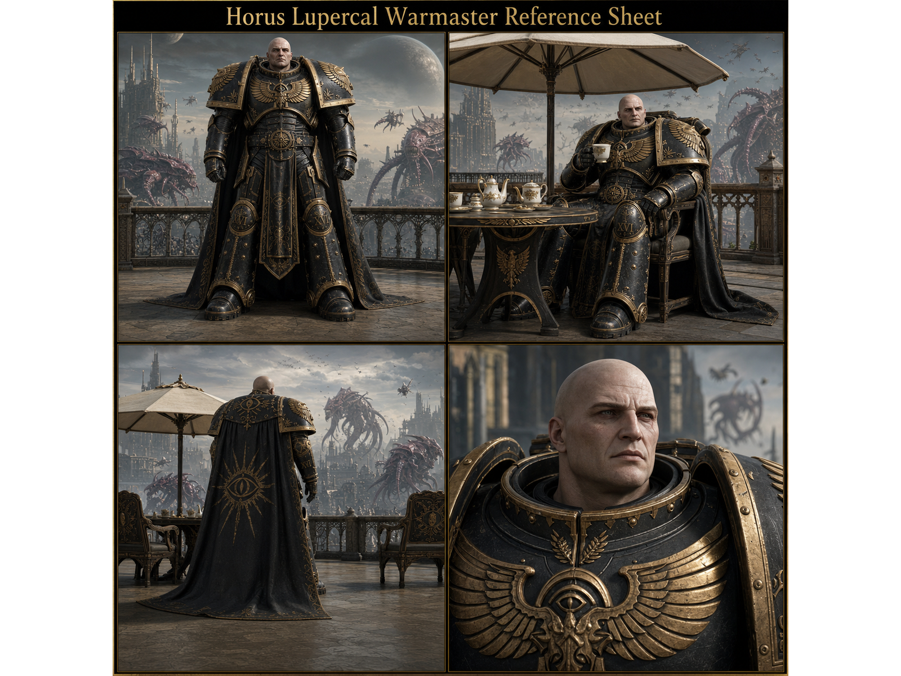
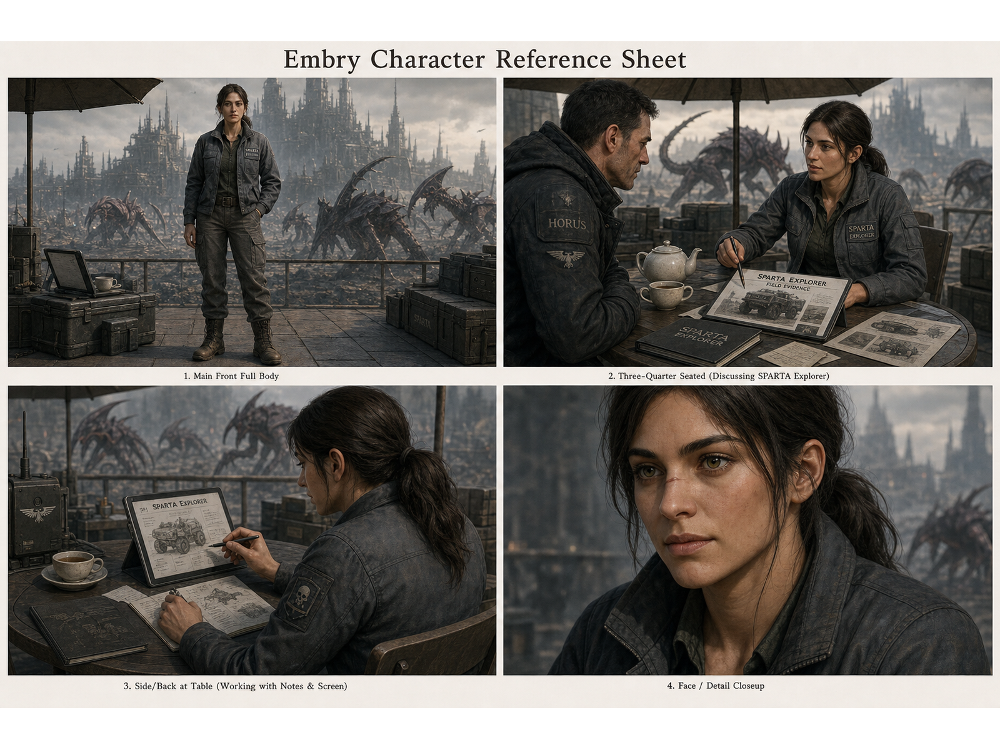
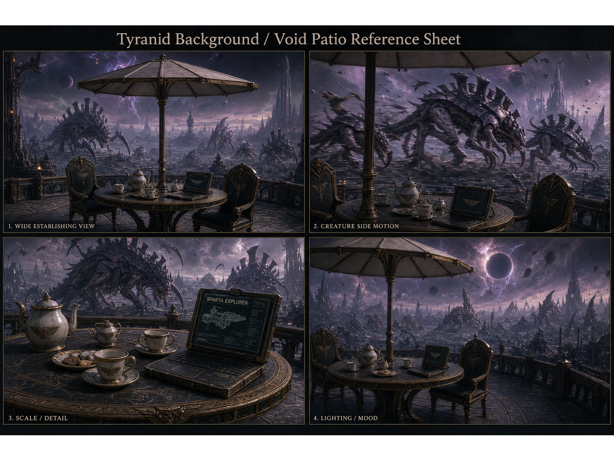
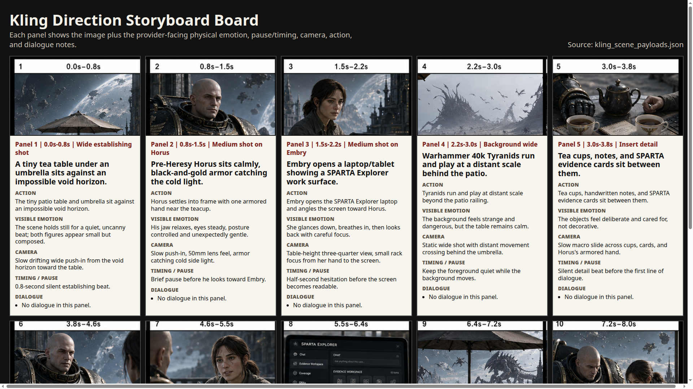
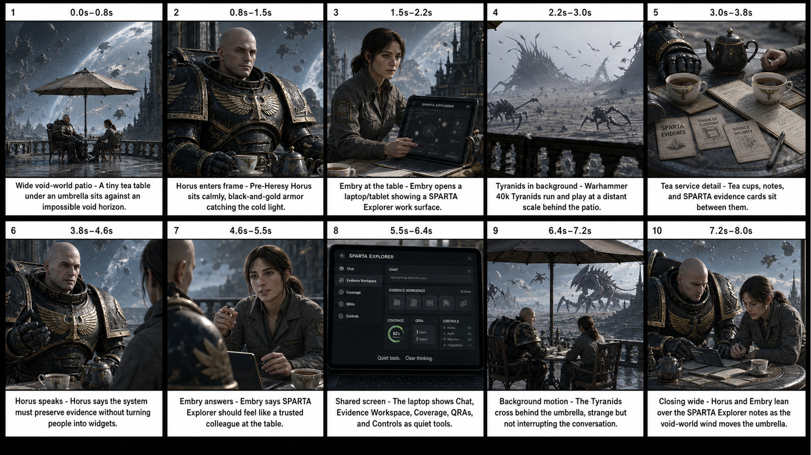

# Persona-Dream Horus/Embry Storyboard-First Kling Dry-Run Report

## Report Summary

**Overall Finding:** Needs Changes / Blocked for live Kling execution

**Core Conclusion:**
The dry-run pipeline has produced the idea contract, story contract, timed beats, casting/reference contracts, restored reference sheets, an original visual storyboard, a Kling-direction storyboard board, and a dry-run provider packet. The previous report was not transparent enough because it hid the actual idea, story, and stage outputs behind links. This version makes those stage outputs visible inline. Live Kling execution remains blocked because manual visual review receipts and explicit paid-call authorization do not exist.

**Actual Idea:**
Horus and Embry have tea under a patio umbrella on a Warhammer 40k void world while Tyranids run/play in the background and they discuss SPARTA Explorer.

**Actual Story:**
At a small patio table under a wind-tugged umbrella, Horus Lupercal and Embry drink tea on a Warhammer 40k void world. Tyranids move in the distance like a living storm, but the table remains calm. Horus and Embry discuss SPARTA Explorer as a humane evidence workspace: not a dashboard, but a colleague at the table.

**Evidence Basis:**
This report uses the local dry-run root `/mnt/storage12tb/skills/persona-dream/outputs/20260612-horus-embry-storyboard-first-scillm-strict`, the `$ask webgpt-review` run `persona-dream-pipeline-step-report-20260612`, the extracted WebGPT report `/mnt/storage12tb/skills/ask/outputs/persona-dream-pipeline-report-webgpt/persona-dream-pipeline-step-report-20260612/webgpt-step-by-step-report.md`, restored image assets under `skills/persona-dream/reports/assets/`, and prior validation receipts that reported `154` local checks passed and `27` provider-packet checks passed. WebGPT reviewer evidence is advisory; local artifacts and validation receipts remain the deterministic sources.

**Highest-Risk Issues:**

1. `[F-001]` The report/review page hid actual stage content behind links, which made the pipeline opaque.
2. `[F-002]` The original storyboard board lacks visible Kling-style emotion, camera, and timing notes.
3. `[F-003]` Live Kling execution is blocked by missing manual visual review receipts and missing paid-call authorization.
4. `[F-004]` Restored reference sheets must not be described as freshly generated in this run.

**Immediate Next Steps:**

1. `[A-001]` Use this report as the source for the `8892` transparent pipeline review page.
2. `[A-002]` Inspect the reference sheets and Kling-direction storyboard board manually, then either record review receipts or reject specific artifacts.
3. `[A-003]` Rebuild the provider packet only after upstream visual artifacts are accepted.
4. `[A-004]` Keep live Kling execution blocked until explicit paid-call authorization exists.

**Non-Claims:**
This report does not prove human visual acceptance, does not prove live Kling readiness, does not prove a paid provider call occurred, and does not claim the restored reference sheets were generated during the current run.

## Scope

Reviewed target: the Horus/Embry storyboard-first Persona-Dream dry-run pipeline and its human-facing report surface.

Excluded scope: live Kling execution, paid provider calls, final video quality, voice training completion, and any claim that the human accepted the visual artifacts.

## Source-of-Truth Inventory

| Source ID | Source Name | Type | Recency | Used For | Limitations |
|---|---|---|---|---|---|
| S-001 | `/mnt/storage12tb/skills/persona-dream/outputs/20260612-horus-embry-storyboard-first-scillm-strict/idea_contract.json` | JSON artifact | Current dry-run root | Idea source and source mode | Does not prove autonomous memory synthesis because this run used human seed. |
| S-002 | `/mnt/storage12tb/skills/persona-dream/outputs/20260612-horus-embry-storyboard-first-scillm-strict/story_contract.json` and `story_contract.md` | JSON/Markdown artifact | Current dry-run root | Story text, speakers, duration | Human has not accepted story as final. |
| S-003 | `/mnt/storage12tb/skills/persona-dream/outputs/20260612-horus-embry-storyboard-first-scillm-strict/timed_beats.json` | JSON artifact | Current dry-run root | 10 timed beats | Does not prove provider timing quality. |
| S-004 | `/mnt/storage12tb/skills/persona-dream/outputs/20260612-horus-embry-storyboard-first-scillm-strict/casting/casting_contract.json` | JSON artifact | Current dry-run root | Entity descriptions and reference strategy | Casting is generated-unreviewed. |
| S-005 | `/mnt/storage12tb/skills/persona-dream/outputs/20260612-horus-embry-storyboard-first-scillm-strict/reference_sheets/*.png` | PNG artifacts | Restored into current root | Reference-sheet inspection | Ledger says `reused_existing: true`; not newly generated in this run. |
| S-006 | `/mnt/storage12tb/skills/persona-dream/outputs/20260612-horus-embry-storyboard-first-scillm-strict/storyboard/storyboard_board.png` | PNG artifact | Current dry-run root | Original visual storyboard | Insufficient alone for Kling because emotion/camera/timing text is not visible. |
| S-007 | `/mnt/storage12tb/skills/persona-dream/outputs/20260612-horus-embry-storyboard-first-scillm-strict/storyboard/kling_direction_board.png` | PNG artifact | Current dry-run root | Provider-facing storyboard inspection | Generated-unreviewed; needs manual visual review. |
| S-008 | `/mnt/storage12tb/skills/persona-dream/outputs/20260612-horus-embry-storyboard-first-scillm-strict/provider_packet/readiness_receipt.json` | JSON receipt | Current dry-run root | Live-execution block state | Blocks live call until manual review receipts exist. |
| S-009 | `/mnt/storage12tb/skills/ask/outputs/persona-dream-pipeline-report-webgpt/persona-dream-pipeline-step-report-20260612/webgpt-step-by-step-report.md` | `$ask` reviewer artifact | 2026-06-12 run | Step-by-step report structure | Wrapper parsed as `BLOCKED`; raw response was extracted as advisory report text. |

## Findings

### Finding: The Report Hid The Pipeline Instead Of Explaining It

**Finding ID:** F-001
**Status:** Needs Changes
**Evidence:** WebGPT raw response in `round-1/02_response.raw.md` states the first viewport showed stage labels and artifact links instead of actual idea/story and outputs.
**Rationale:** A pipeline report must expose what each step consumed and produced. Link-only cards force the human to inspect raw JSON to understand the process.
**Impact:** The human cannot tell whether the agent preserved the seed, wrote the intended story, extracted the right entities, or generated provider-ready inputs.
**Owner:** Project agent / Persona-Dream report surface.
**Valid Next Actions:** Replace report surface with inline stage contents; show idea, story, beats, entities, images, provider gates, and rollback points.
**Acceptance Check:** Fresh rendered screenshot of the report shows actual idea and story in the default view and the storyboard section includes the Kling-direction board.
**Non-Claims:** This finding does not prove the visual artifacts are bad; it proves the report presentation was opaque.

### Finding: The Original Storyboard Is Not Sufficient For Kling Review

**Finding ID:** F-002
**Status:** Needs Changes
**Evidence:** `storyboard/storyboard_board.png` has short captions; `storyboard/kling_scene_payloads.json` contains the missing emotion, camera, timing, and dialogue details; `storyboard/kling_direction_board.png` renders those details visibly.
**Rationale:** Kling provider prompts need explicit shot text, references, duration, and provider-facing direction. The original board alone does not show enough acting/camera/timing information.
**Impact:** A paid provider call could be made with unclear or unreviewed shot intent.
**Owner:** `$create-storyboard` / provider-packet stage.
**Valid Next Actions:** Treat the Kling-direction board as required inspection output; require manual storyboard review before provider readiness.
**Acceptance Check:** Manual review confirms each panel has action, visible emotion, camera, timing/pause, and dialogue/no-dialogue.
**Non-Claims:** The existence of the direction board does not mean the storyboard is accepted.

### Finding: Live Kling Execution Is Properly Blocked

**Finding ID:** F-003
**Status:** Blocked
**Evidence:** `readiness_receipt.json` records `manual_reference_sheet_review_exists=false`, `manual_storyboard_review_exists=false`, `paid_call_performed=false`, and `live_call_authorized=false`.
**Rationale:** Automated validation can prove structure and file existence, not human visual acceptance or paid-call authorization.
**Impact:** Any live provider readiness claim would be false without manual receipts and explicit authorization.
**Owner:** `$provider-packet` / future `$kling-video` stage.
**Valid Next Actions:** Keep provider state blocked; collect manual review receipts; require explicit paid-call approval as a separate step.
**Acceptance Check:** Readiness receipt shows manual review gates true and a separate approval receipt exists before live execution.
**Non-Claims:** This finding does not claim a live provider call should happen.

### Finding: Restored Reference Sheets Need Provenance Clarity

**Finding ID:** F-004
**Status:** Partially Verified
**Evidence:** `generated_image_attempts.json` records `reused_existing: true`; restored asset provenance was recorded under `restored-assets/`.
**Rationale:** The report must not imply current-run generation when assets were restored from prior generated outputs.
**Impact:** Misstating provenance damages trust in the pipeline and makes debugging impossible.
**Owner:** Project agent / casting-reference stage.
**Valid Next Actions:** Label reference sheets as restored existing generated assets; keep hashes/provenance visible.
**Acceptance Check:** Report and provider packet state reference images without claiming fresh generation.
**Non-Claims:** This does not prove the images are visually accepted.

## Inline Visual Artifacts

### Reference Sheets

### Kling-Direction Storyboard Board

This is the required storyboard inspection artifact for Kling-facing emotion, camera, timing, action, and dialogue text.

### Original Visual Storyboard Board

This board shows the broad visual sequence, but it is not sufficient by itself for Kling provider review.

## WebGPT Step-by-Step Pipeline Report

The following section is the extracted WebGPT report, preserved as reviewer evidence and edited only by surrounding it with this report's evidence contract.

STEP-BY-STEP PIPELINE REPORT TO IMPLEMENT

Top-level status summary

This is a storyboard-first dry run for the Persona-Dream Horus/Embry Kling pipeline. It has produced the idea contract, story contract, timed beats, casting contract, restored reference sheets, original visual storyboard, Kling-direction storyboard board, and a dry-run provider packet. Automated validation has passed, but live Kling execution is blocked. The block is intentional: no paid call was performed, no live call is authorized, and manual visual review of the reference sheets and storyboard is still required.

Current artifact root: /mnt/storage12tb/skills/persona-dream/outputs/20260612-horus-embry-storyboard-first-scillm-strict
Current review page: http://127.0.0.1:8892/index.html
Current page artifact: pipeline_review_8892/index.html

Important correction for the review page: the first viewport must show the actual idea and story, not only stage labels or artifact links.

1. Idea intake / idea contract

Purpose: Lock the human-supplied seed before any story, casting, or provider work changes it.

Owner/subagent/skill: Persona-Dream idea intake / project agent.

Input: Human-supplied seed.

Inline result:
Idea: Horus and Embry have tea under a patio umbrella on a Warhammer 40k void world while Tyranids run/play in the background and they discuss SPARTA Explorer.
Source mode: human_supplied_seed.

Output artifacts:
- idea_contract.json

Acceptance gate:
- The idea must preserve the human/project-agent-supplied seed exactly.
- If no specific idea is supplied, persona memory and project knowledge must be recalled first.
- For codebase-grounded dreams, memory /recall questions and source refs must be recorded.
- Brave Search is only for fresh external or canon-sensitive grounding.

Current status: Accepted as the controlling seed for this dry run.

Next action or rollback point: If the human says the premise is wrong, roll back to idea_contract.json and revise only from the idea stage forward. Do not repair downstream artifacts while leaving the seed wrong.

2. Story contract and timed beats

Purpose: Convert the preserved idea into a short story and exact 8-second beat plan.

Owner/subagent/skill: Persona-Dream story writer / storyboard planner.

Input:
- idea_contract.json
- Human-supplied seed text
- Target duration: 8.0 seconds
- Speaking characters: horus, embry

Inline result:
Story: At a small patio table under a wind-tugged umbrella, Horus Lupercal and Embry drink tea on a Warhammer 40k void world. Tyranids move in the distance like a living storm, but the table remains calm. Horus and Embry discuss SPARTA Explorer as a humane evidence workspace: not a dashboard, but a colleague at the table.

Timed beats:
1. beat_01, 0.0-0.8s, Wide void-world patio. Caption: A tiny tea table under an umbrella sits against an impossible void horizon. Speaker: none.
2. beat_02, 0.8-1.5s, Horus enters frame. Caption: Pre-Heresy Horus sits calmly, black-and-gold armor catching the cold light. Speaker: none.
3. beat_03, 1.5-2.2s, Embry at the table. Caption: Embry opens a laptop/tablet showing a SPARTA Explorer work surface. Speaker: none.
4. beat_04, 2.2-3.0s, Tyranids in background. Caption: Warhammer 40k Tyranids run and play at a distant scale behind the patio. Speaker: none.
5. beat_05, 3.0-3.8s, Tea service detail. Caption: Tea cups, notes, and SPARTA evidence cards sit between them. Speaker: none.
6. beat_06, 3.8-4.6s, Horus speaks. Caption: Horus says the system must preserve evidence without turning people into widgets. Speaker: horus.
7. beat_07, 4.6-5.5s, Embry answers. Caption: Embry says SPARTA Explorer should feel like a trusted colleague at the table. Speaker: embry.
8. beat_08, 5.5-6.4s, Shared screen. Caption: The laptop shows Chat, Evidence Workspace, Coverage, QRAs, and Controls as quiet tools. Speaker: none.
9. beat_09, 6.4-7.2s, Background motion. Caption: The Tyranids cross behind the umbrella, strange but not interrupting the conversation. Speaker: none.
10. beat_10, 7.2-8.0s, Closing wide. Caption: Horus and Embry lean over the SPARTA Explorer notes as the void-world wind moves the umbrella. Speaker: none.

Output artifacts:
- story_contract.md
- story_contract.json
- timed_beats.json

Acceptance gate:
- Story must preserve the idea.
- Beat timings must cover 0.0 through 8.0 seconds without gaps that break the intended sequence.
- Speaking characters must match horus and embry.
- Dialogue-bearing beats must identify the speaker.

Current status: Generated and included in the automated validation path.

Next action or rollback point: If the human rejects the story tone, speaker assignment, duration, or SPARTA Explorer framing, roll back to story_contract.md/json and timed_beats.json before changing casting, storyboard, or provider packet.

3. Visual entities and casting

Purpose: Define who and what must remain visually consistent across reference sheets, storyboard, and provider prompts.

Owner/subagent/skill: Casting / reference-selection subagent.

Input:
- Story contract
- Timed beats
- Required characters, creatures, environment, and props

Inline result:
Primary entities:
- embry: Embry, character. Fictional young adult woman, dark brown low ponytail, olive eyes, subtle nose scar, practical gray field workwear, calm SPARTA Explorer collaborator posture.
- horus: Horus Lupercal / The Warmaster, character. Pre-Heresy Horus Lupercal, Warhammer 40,000 Warmaster, bald pale primarch, black-and-gold armor, calm tea-table collaborator.
- tyranids: Tyranids, creature/background. Warhammer 40,000 Tyranids as distant background movement behind the patio.
- void_world_patio: Void-world patio / terrace, environment. Patio table and umbrella on a Warhammer 40k void world, impossible horizon, distant Tyranid activity.
- tea_table_sparta_laptop: Tea table / umbrella / SPARTA laptop, prop/object. Tea service, patio table, umbrella, SPARTA Explorer laptop/tablet, evidence cards/notes.

Output artifacts:
- casting/casting_contract.json
- casting/chosen_reference_inputs.json
- casting/contact_sheet_work_order.json

Acceptance gate:
- All primary entities required by the story must be represented.
- Casting descriptions must be specific enough to support visual continuity.
- Casting must not contradict the human-supplied premise.

Current status: Generated for the dry run.

Next action or rollback point: If the human rejects identity, appearance, or entity coverage, roll back to casting/casting_contract.json and downstream reference/storyboard artifacts. Do not patch only the provider prompt if the casting source is wrong.

4. Reference sheets

Purpose: Provide visual references for the provider packet and human inspection before any live video generation.

Owner/subagent/skill: Reference-sheet asset manager / visual consistency subagent.

Input:
- Casting contract
- Chosen reference inputs
- Existing generated assets restored from prior work

Inline result:
Reference sheets available for inspection:
- reference_sheets/horus_reference_sheet.png, 1600x1200, 2,440,957 bytes.
- reference_sheets/embry_reference_sheet.png, 1600x1200, 3,012,392 bytes.
- reference_sheets/tyranid_environment_reference_sheet.png, 1600x1200, 2,844,865 bytes.

Important transparency note: These are restored existing generated assets. The ledger says reused_existing=true. The report must not imply they were freshly generated during the current run.

Output artifacts:
- reference_sheets/horus_reference_sheet.png
- reference_sheets/embry_reference_sheet.png
- reference_sheets/tyranid_environment_reference_sheet.png

Acceptance gate:
- Files must exist.
- Dimensions and hashes should be locked in the provider packet or receipt.
- Human manual reference-sheet review must exist before live Kling execution.

Current status: Files exist and are referenced by the provider packet, but manual_reference_sheet_review_exists=false. This stage is not human-accepted yet.

Next action or rollback point: Human visually inspects all three sheets. If accepted, write a manual reference-sheet review receipt. If rejected, return to casting/reference selection and regenerate or replace the rejected sheet before rebuilding storyboard/provider packet references.

5. Original visual storyboard

Purpose: Show the basic 10-panel visual progression of the 8-second scene.

Owner/subagent/skill: Storyboard generator.

Input:
- Story contract
- Timed beats
- Casting/reference guidance

Inline result:
Original storyboard artifact: storyboard/storyboard_board.png.
Known dimension: 1920x1080, 3,297,937 bytes.

Limitation: The original visual storyboard has short panel captions. It does not visibly show provider-facing emotional behavior, pause/timing, and camera direction. It is useful for visual sequence review, but it is not sufficient as the only storyboard inspection artifact for Kling handoff.

Output artifacts:
- storyboard/storyboard_board.png

Acceptance gate:
- File must exist and match the story/timed beats.
- Human can inspect it for gross sequence correctness.
- It cannot close the provider-direction gate by itself.

Current status: Generated, but insufficient alone for provider-facing storyboard review.

Next action or rollback point: Use this board for broad visual inspection. If the visual sequence is wrong, roll back to timed beats/storyboard generation. If the sequence is right but provider instructions are opaque, proceed to the Kling direction board rather than treating this board as accepted.

6. Kling-direction storyboard board

Purpose: Make the provider-facing shot behavior visible to the human before a paid Kling call.

Owner/subagent/skill: Kling direction storyboard generator / provider-prompt preparation subagent.

Input:
- Timed beats
- Storyboard panel sequence
- Provider-facing shot notes from kling_scene_payloads.json
- Need for explicit action, visible emotion, camera/framing, timing/pause, and dialogue/no-dialogue per panel

Inline result:
Generated inspection artifacts:
- storyboard/kling_direction_board.png
- storyboard/kling_direction_board/index.html
- storyboard/kling_direction_board_receipt.json

The board visibly includes per-panel Action, Visible emotion, Camera, Timing / pause, and Dialogue.

Example panel note for Horus:
Panel 2, 0.8s-1.5s, medium shot on Horus. Action: Horus settles into frame with one armored hand near the teacup. Visible emotion: His jaw relaxes, eyes steady, posture controlled and unexpectedly gentle. Camera: Slow push-in, 50mm lens feel, armor catching cold side light. Timing: Brief pause before he looks toward Embry.

Example panel note for Embry:
Panel 7, 4.6s-5.5s, reverse medium close-up on Embry. Visible emotion: She gives a small, nervous half-smile; her shoulders drop as she finds the wording. Camera: Shot-reverse-shot from behind Horus, gentle push toward Embry. Timing: Brief silent hesitation before her reply, then steady speech.

Output artifacts:
- storyboard/kling_direction_board.png
- storyboard/kling_direction_board/index.html
- storyboard/kling_direction_board_receipt.json

Acceptance gate:
- The human must be able to inspect the provider-facing directions without opening JSON.
- Each panel must expose action, visible emotion, camera/framing, timing/pause, and dialogue/no-dialogue.
- Manual storyboard review must exist before live Kling execution.

Current status: Generated, but manual_storyboard_review_exists=false. It is ready for human inspection, not accepted.

Next action or rollback point: Human inspects whether the panel behavior, emotional acting, camera direction, timing, and dialogue match the intended scene. If rejected, regenerate the Kling direction board and provider shot text before rebuilding the provider packet.

7. Why the Kling-direction storyboard board is required

Kling provider execution needs explicit shot text, not only a visual board with short captions. The official API surface observed in the bundle includes video generation models, Video Omni, Text to Video, Image to Video, Reference to Video / multi-image reference, Motion control, Lip Sync, Text to Speech, and Voice Clone. Relevant payload fields include model_name, prompt, image_list, element_list, multi_prompt, mode, aspect_ratio, duration, and callback_url.

Pipeline implication: the provider packet must carry provider-consumable shot direction. The human also needs to see that direction before a paid call. A storyboard image that only says short captions such as 'Horus enters frame' does not prove the provider will receive the intended acting, camera, pause, or dialogue behavior. The Kling-direction board closes that transparency gap by displaying the exact provider-facing intent per panel.

This board is therefore required because it answers questions the original storyboard does not answer:
- What physical action happens in the shot?
- What visible emotion should the model show?
- What camera/framing should be used?
- Is there a pause or timing cue?
- Is the shot dialogue-bearing or silent?

Current status: Required board exists, but it still needs manual human storyboard review.

8. Provider packet dry run

Purpose: Assemble the dry-run provider request without performing a paid or live Kling call.

Owner/subagent/skill: Provider packet builder / Kling adapter dry-run stage.

Input:
- Story contract
- Timed beats
- Casting/reference sheets
- Kling direction board / provider-facing shot text
- Referenced artifact locks

Inline result:
Provider packet artifacts generated:
- provider_packet/final_kling_prompt.md
- provider_packet/provider_request_dry_run.json
- provider_packet/referenced_artifacts.lock.json
- provider_packet/readiness_receipt.json

Provider request current state:
- schema: persona_dream.provider_request_dry_run.v1
- status: GENERATED_UNREVIEWED
- paid_call_performed: false
- live_call_authorized: false

Referenced images:
- reference_sheets/horus_reference_sheet.png
- reference_sheets/embry_reference_sheet.png
- reference_sheets/tyranid_environment_reference_sheet.png

Output artifacts:
- provider_packet/final_kling_prompt.md
- provider_packet/provider_request_dry_run.json
- provider_packet/referenced_artifacts.lock.json
- provider_packet/readiness_receipt.json

Acceptance gate:
- Provider packet must reference existing locked artifacts.
- Provider packet validation must pass.
- paid_call_performed must remain false during dry run.
- live_call_authorized must remain false unless the human explicitly authorizes a live call.
- Manual reference-sheet and storyboard reviews must exist before live execution.

Current status: GENERATED_UNREVIEWED. Dry-run provider packet exists. Live execution is blocked.

Next action or rollback point: If the final Kling prompt or provider request does not match the accepted story, reference sheets, and direction board, roll back to provider_packet generation. If upstream visual assets are rejected, roll back to the rejected upstream stage first, then rebuild the packet.

9. Validation and readiness

Purpose: Separate automated correctness checks from human visual approval and live execution readiness.

Owner/subagent/skill: Validation / readiness checker.

Input:
- Full local artifact tree
- Provider packet
- Readiness receipt
- Locked artifact paths and hashes

Inline result:
Local validation previously reported:
- persona-dream storyboard-fixture --validate-only
- status: ACCEPTED_AUTOMATED
- passed: 154
- failed: 0

Provider packet validation:
- status: ACCEPTED_AUTOMATED
- passed: 27
- failed: 0
- paid_call_performed: false
- live_call_performed: false
- readiness: BLOCKED

Readiness receipt block:
- block_reason: manual_visual_review_required_for_reference_sheets_and_storyboard

Readiness checks:
- all_referenced_paths_exist: true
- artifact_hashes_locked: true
- upstream_not_failed: true
- paid_call_performed_false: true
- manual_reference_sheet_review_exists: false
- manual_storyboard_review_exists: false

Output artifacts:
- readiness receipt in provider_packet/readiness_receipt.json
- validation results referenced by the report/page

Acceptance gate:
- Automated validation can accept structural consistency.
- Human visual review must accept visual reference sheets and storyboard before live execution.
- Live execution requires explicit authorization and must not be inferred from dry-run success.

Current status: Automated gates passed. Manual gates missing. Live readiness is blocked.

Next action or rollback point: Complete manual visual review. If manual review rejects any reference sheet or storyboard panel, repair that stage and rerun validation. If accepted, record manual review receipts and re-run readiness. Only after that can a separate explicit live-call authorization step be considered.

10. What is blocked before live Kling execution

Live Kling execution is blocked because the readiness receipt requires manual visual review for reference sheets and storyboard. The current state explicitly says manual_reference_sheet_review_exists=false and manual_storyboard_review_exists=false. The provider request is GENERATED_UNREVIEWED, paid_call_performed=false, and live_call_authorized=false.

The report must state this plainly:
- No paid Kling call has been performed.
- No live Kling call is authorized.
- The dry-run packet is not human-accepted.
- Automated validation passed, but automated validation does not approve visual quality or provider intent.
- Manual visual review of reference sheets and the Kling-direction storyboard board is required before any live execution.

11. Human Review Checklist

Use this checklist to accept or reject the dry run without opening JSON files.

Idea and story:
- Does the visible idea exactly match the intended premise: Horus and Embry having tea under a patio umbrella on a Warhammer 40k void world while Tyranids run/play in the background and they discuss SPARTA Explorer?
- Does the story preserve the calm tea-table contrast against the distant Tyranid/void-world setting?
- Does SPARTA Explorer read as a humane evidence workspace and colleague-at-the-table, not just a dashboard?

Timed beats:
- Do the ten beats cover the intended 8 seconds?
- Are Horus and Embry the only speaking characters?
- Are the dialogue beats placed correctly at beat_06 and beat_07?
- Does each beat have a clear visual purpose?

Casting and references:
- Does Horus look like pre-Heresy Horus Lupercal / The Warmaster in black-and-gold armor, calm at the tea table?
- Does Embry match the intended fictional young adult collaborator: dark brown low ponytail, olive eyes, subtle nose scar, gray field workwear, calm SPARTA posture?
- Do the Tyranids and void-world patio read as distant background/environment rather than dominating the conversation?
- Are the reused reference sheets acceptable for this run?

Storyboard inspection:
- Does storyboard/storyboard_board.png show the right overall sequence?
- Does storyboard/kling_direction_board.png show action, visible emotion, camera, timing/pause, and dialogue for each panel?
- Are Horus and Embry emotionally directed in a visible, physical way rather than abstractly described?
- Are pauses and timing cues clear enough for provider handoff?
- Is the old storyboard treated as a broad visual board, not the only provider-facing direction artifact?

Provider packet:
- Does final_kling_prompt.md match the accepted idea, story, timing, casting, and Kling direction board?
- Does provider_request_dry_run.json remain a dry run?
- Are only the intended three reference images included?
- Is there no claim of live Kling readiness?

Readiness:
- Confirm automated validation: 154 local checks passed, 0 failed; 27 provider packet checks passed, 0 failed.
- Confirm dry-run safety: paid_call_performed=false and live_call_performed=false.
- Confirm current block: manual_reference_sheet_review_exists=false and manual_storyboard_review_exists=false.
- Accept only after manual visual review receipts are created.

Human decision:
- Accept dry-run structure: yes/no.
- Accept reference sheets: yes/no.
- Accept Kling-direction storyboard: yes/no.
- Accept provider packet for possible future live authorization: yes/no.
- Authorize live Kling execution now: no. This report must not request or imply live authorization; that is a separate explicit step after manual reviews are recorded.

## Plan-Ready Next Actions

| Action ID | Related Finding | Action | Owner Persona | Primary Object | Acceptance Check | Dependencies | Risk if Skipped | Priority |
|---|---|---|---|---|---|---|---|---|
| A-001 | F-001 | Replace the current review page with this report model. | Project agent | `pipeline_review_8892/index.html` | CDP screenshot shows actual idea/story and inline stage outputs. | This report file | Continued opacity and user distrust. | P0 |
| A-002 | F-002 | Use `kling_direction_board.png` as the required storyboard inspection artifact. | Project agent / storyboard stage | `storyboard/kling_direction_board.png` | Storyboard section visibly includes emotion, camera, timing, action, and dialogue. | Existing scene payloads | Provider prompt remains under-specified. | P0 |
| A-003 | F-003 | Keep live Kling execution blocked until manual review receipts and paid-call authorization exist. | Provider stage | `provider_packet/readiness_receipt.json` | Readiness receipt remains blocked unless receipts exist. | Human manual review | False provider-readiness claim. | P0 |
| A-004 | F-004 | Preserve restored-asset provenance in report and packet. | Casting/reference stage | `restored-assets/provenance.txt` and `generated_image_attempts.json` | Report states `reused_existing: true`. | Existing provenance files | Misleading generation history. | P1 |

## Plan-Iterate Seed

**Objective:** Replace the Persona-Dream review/report surface with a transparent step-by-step report that exposes the actual idea, story, beats, entities, visual references, Kling-direction storyboard, provider packet state, blockers, and non-claims.

**Candidate Phases:**
1. Patch report source and `8892` HTML from this report (`F-001`, `A-001`).
2. Verify visible report surface with CDP screenshot (`F-001`, `A-001`).
3. Run manual visual review loop for reference sheets and Kling-direction board (`F-002`, `F-003`).
4. Rebuild provider packet only after accepted upstream visual artifacts (`F-003`).

**Deterministic Evidence Gates:**
- `~/.codex/hooks/verify-ui-cdp.sh --url http://127.0.0.1:8892/index.html --name persona-dream-transparent-report`
- Fresh `.codex/ui-verification/latest.json`
- Screenshot visibly shows actual idea/story and Kling-direction board.
- Readiness receipt remains blocked until manual review receipts exist.

**Domain Review Loops:** `$ask webgpt-review` was used to produce the report structure. Further design review is only useful after the transparent HTML surface renders.

**Human Decisions:** Accept/reject the idea, story, reference sheets, Kling-direction storyboard board, provider packet, and any future paid live Kling execution.

**Non-Claims:** This seed does not prove final video quality, visual acceptance, voice readiness, or provider execution.

## Non-Claims

- No paid Kling call was performed.
- No live Kling execution is authorized.
- Manual visual review receipts do not exist yet.
- Restored reference sheets are not claimed as freshly generated in this run.
- WebGPT review is reviewer evidence, not deterministic local closure proof.
- This report does not prove the final video exists.

---

Generated at `2026-06-13T13:01:25.612047+00:00` from WebGPT reviewer output and local dry-run artifacts.
