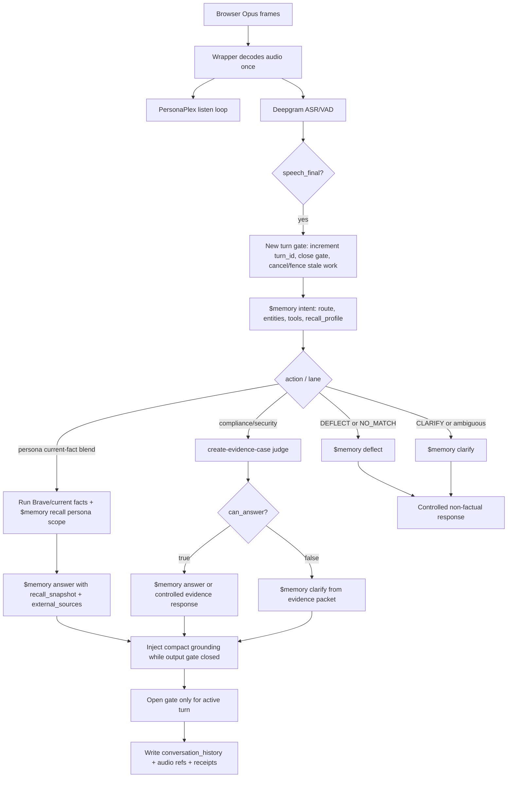
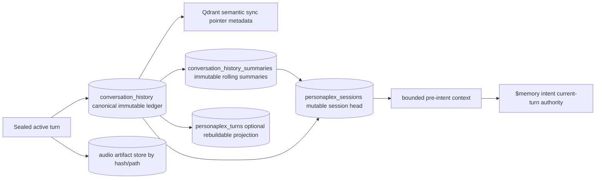

# PersonaPlex Goal

Source documents:

- [SKILL.md](./SKILL.md)
- [PROJECT_KNOWLEDGE.md](./PROJECT_KNOWLEDGE.md)
- [HTML rendering](./docs/PERSONAPLEX_GOAL.html)

## Goal

`personaplex` is the bridge from approved persona voice/reference artifacts into
PersonaPlex-native live conversation artifacts. The working end state is not
just a generated voice prompt. It is a research-gated, memory-backed, live
conversation wrapper that can:

1. load a native PersonaPlex prompt-cache `.pt` generated from Orpheus reference
   audio;
2. accept live user audio through a browser-style WebSocket stream;
3. use independent ASR/VAD, currently Deepgram, to define reliable user turns;
4. route each final transcript through `$memory intent`;
5. run required recall, current-fact research, clarify, deflect, answer, and
   evidence-case branches before factual speech is released;
6. inject compact grounding into PersonaPlex while the output gate is closed;
7. release only bounded, current-turn audio/text; and
8. write receipts proving what was heard, routed, recalled, gated, spoken, and
   stored.

The primary product question is:

> Can Embry sound live and conversational while still obeying current-turn
> memory, evidence, and compliance routing constraints?

## Non-Goals

- Do not treat native cache replay as live full-duplex readiness.
- Do not treat a provisional Orpheus reference as a publication-ready identity
  anchor.
- Do not let PersonaPlex improvise high-stakes factual claims while memory,
  search, or evidence-case work is pending.
- Do not make `personaplex_turns` or any voice projection a second source of
  truth for conversation history.
- Do not allow historical tool calls, allowed tools, or route endpoints to
  authorize the current turn.
- Do not let the project agent bespoke greenfield architecture locally when a
  `$create-architecture` WebGPT creation loop is required.

## System Boundaries

| Owner | Owns | Does Not Own |
| --- | --- | --- |
| `orpheus-tts-voice-trainer` | Orpheus training, emotion tags, reference WAV generation, Orpheus inference receipts | PersonaPlex cache publication or live conversation proof |
| `personaplex` | PersonaPlex-native `.pt` cache generation, replay proof, live wrapper, research-gated conversation receipts | Orpheus model training or persona memory authoring |
| `create-persona` | Persona profile, memory, BDI, mannerism/profile data | PersonaPlex runtime proof |
| `$memory` | Intent routing, recall, answer, clarify, deflect, upsert, conversation storage | Live audio stepping |
| `$brave-search` | Current external facts when intent requires them | Internal memory authority |
| `create-evidence-case` | Compliance/security evidence packet and uncertainty gate | Persona vibe or voice continuity |

## Reassessment Against `$memory`

The PersonaPlex goal must obey the memory project contract, not just the local
voice-wrapper notes.

Memory-first evidence used for this reassessment:

- `skills/memory/run.sh recall --q "PersonaPlex memory intent recall clarify deflect answer conversation history compaction project knowledge contract" --brief`
  returned `found=true`, `should_scan=false`, `confidence=0.983`.
- `skills/memory/SKILL.md` defines `/intent`, `/answer`, `/clarify`, and
  `/deflect` as structured products, not prose helpers.
- `/home/graham/workspace/experiments/memory/PROJECT_KNOWLEDGE.md` says the
  active persona blend contract and the SPARTA evidence-case contract are
  separate lanes with different gates.

Required corrections to the PersonaPlex target:

1. PersonaPlex must call `$memory intent` before recall for turn routing.
2. `$memory recall` is not a replacement for intent; profile-aware callers pass
   the current `recall_profile` from intent into recall when applicable.
3. Recall proof must read `items`, `confidence`, and per-item
   `scores.bm25`, `scores.dense`, `scores.graph`, and `scores.freshness`.
4. Persona-memory recall must be question-shaped and scoped with persona tags
   such as `persona:embry`.
5. `$memory answer`, `$memory clarify`, and `$memory deflect` are first-class
   route products. The wrapper must not invent local thresholds.
6. Compliance/security evidence-case work is a separate lane. Known memory
   project gaps still matter: SPARTA `/answer` does not yet accept an
   `evidence_case` packet end-to-end, multi-turn judge state is partial, QRA
   conflict gate is not built, and disjoint-technique live E2E remains missing.
7. `/upsert` writes canonical documents; Arango must not receive inline vector
   arrays. Qdrant owns semantic vectors and Arango stores pointer metadata such
   as `qdrant_collection`, `qdrant_point_id`, `embedding_model`,
   `embedding_version`, `text_hash`, and `semantic_sync_state`.
8. Project knowledge is a readable projection and also syncs chunks into
   memory. PersonaPlex must use both the local `PROJECT_KNOWLEDGE.md` and memory
   recall when preparing a `$create-architecture` bundle.

## Memory-Routed Target Flow

## Persistence Ownership Flow

## Current Implemented State

- PersonaPlex `.pt` cache generation and fresh-process replay have a technical
  `CACHE_REPLAY_PASS` path.
- The wrapper spike `scripts/personaplex_golden_state_server.py` boots a custom
  golden-state PersonaPlex server and uses the repo-native `LMGen.step(...)`
  API rather than generic Moshi stream snippets.
- The wrapper performs `$memory intent` first, then stages recall, Brave search,
  and route products.
- Deepgram live ASR/VAD is wired into the custom WebSocket wrapper through
  `scripts/personaplex_deepgram_live.py`.
- The live probe streamed synthesized Opus frames, received a Deepgram
  `speech_final=true` transcript, and observed grounding events.
- The active Embry persona-current-fact contract is proven for the Hawaii/Kai
  example through `/tmp/personaplex-memory-intent-flow-proof.json`.

## Current Missing or Incomplete State

- Multi-turn conversation proof is missing. The existing Deepgram proof is
  effectively one final transcript turn.
- The output gate and injection queue are not yet turn-aware enough for
  production. The known proof reported `queue_depth=268` at release.
- Stale grounding tasks are not proven to be network-aborted or prevented from
  mutating current turn state.
- `/clarify` and `/deflect` are route paths in code but still need explicit
  live smoke receipts.
- Compliance/evidence-case routing is fail-closed in concept, but the current
  `evidence_case_gate_product` path is still a gate product/stub rather than a
  complete evidence-case integration proof.
- Conversation-history upsert, session-head updates, compaction, and audio
  artifact persistence are not yet implemented as a deterministic live wrapper
  contract.
- `$scillm` is not yet in the wrapper; the forced speech endpoint currently
  uses deterministic script assembly.

## Required Runtime Invariants

1. Every user turn has a monotonic `turn_id`.
2. A new `speech_final=true` event cancels or fences all stale work from older
   turns.
3. Every callback that enqueues text, opens the gate, writes a receipt, writes
   memory, or updates session state must verify the active `turn_id`.
4. The output gate must be a data stop, not just a volume preference.
5. Required facts must arrive before factual answer audio is released.
6. Compliance and security questions fail closed to clarify or evidence-case
   uncertainty when evidence is missing, inconclusive, or weakly grounded.
7. Current `$memory intent` output is the only current-turn routing authority.
8. Historical route/tool fields are non-authoritative context only.
9. `conversation_history` is the canonical immutable turn ledger.
10. Summaries and `personaplex_turns` are rebuildable projections, not sources
    of truth.

## Target Live Conversation Flow

1. Browser sends Opus audio frames to the wrapper.
2. The wrapper decodes once and feeds PCM/audio to both PersonaPlex and Deepgram.
3. Deepgram emits a final transcript and VAD end-of-turn signal.
4. The wrapper increments `turn_id`, closes the output gate, clears current
   injection state, and cancels/fences stale tasks.
5. The wrapper builds bounded pre-intent context from the session head.
6. `$memory intent` classifies the current transcript, extracts entities,
   recommends tools, and returns the current routing plan.
7. The wrapper validates current tool calls against policy.
8. Required `$memory recall`, current-fact search, clarify, deflect, answer, or
   evidence-case branches run according to the current intent plan.
9. Persona memory recall uses question-shaped text, persona tags, and relevant
   collections so BM25, dense, and graph traversal have useful anchors.
10. Compliance/security routes create or require an evidence packet before
    substantive claims are released.
11. Compact grounding is injected into PersonaPlex while output remains gated.
12. The gate opens only for the active turn after required artifacts arrive and
    queue depth is bounded.
13. The wrapper writes the sealed `conversation_history` turn, optional
    `personaplex_turns` projection, audio artifact references, source hashes,
    and runtime gate receipts.
14. Post-turn compaction may update immutable summaries and the mutable session
    head through compare-and-swap semantics.

## Acceptance Gates

### Native Cache Gate

- `skills/personaplex/run.sh verify-e2e` creates a native `.pt`, replays it in a
  fresh PersonaPlex process, writes valid output WAV/text receipts, and records
  runtime identity.

### Single-Turn Research Gate

- A non-mocked wrapper call shows `$memory intent`, required recall/search, and
  route product timing.
- PersonaPlex emits grounded speech only after route product completion.

### Multi-Turn Live Gate

- A probe sends at least two final user turns through live ASR/VAD.
- Turn 2 interrupts or supersedes Turn 1.
- Turn 1 cannot enqueue tokens, open the gate, write a current receipt, or
  update session state after Turn 2 becomes active.
- Release receipt shows `queue_depth_at_release=0` or a documented bounded
  value with deterministic drain semantics.

### Compliance Memory Gate

- A compliance/security question routes through current `$memory intent`.
- Required recall and evidence-case work run before factual answer release.
- Missing, weak, or inconclusive evidence produces clarify/evidence-case
  uncertainty rather than unsupported answer audio.
- `/answer`, `/clarify`, `/deflect`, and evidence-case paths each have explicit
  receipts.

### Persistence Gate

- Each sealed turn writes a deterministic `conversation_history` key.
- Current intent result includes extracted entities and recommended tools.
- Memory upsert records contain retrieval-friendly `retrieval_text`.
- Audio artifacts are stored by hash/path and linked from the turn record.
- Recall filters enforce tenant/project/persona/session scope where applicable.

## Project-Agent Operating Rule

The project agent is the reviewer, implementer, and bug fixer for WebGPT-created
architecture bundles. For greenfield architecture, the project agent must use a
`$create-architecture` WebGPT creation loop until ambiguity is resolved and a
finished-file bundle exists. The project agent then downloads the zip, inspects
it in an isolated sanity directory, runs or repairs the supplied checks, reports
where it falls short, and only then ports the working slice into the larger
codebase.

## Next Smallest Useful Artifact

The next artifact is a source-backed `$create-architecture` request for a
working multi-turn PersonaPlex/Deepgram/memory compliance MVP harness. It should
ask WebGPT to return finished files, tests, and a zip bundle for:

- turn-aware state machine;
- stale task cancellation/fencing;
- bounded output gate and injection queue;
- multi-turn Deepgram probe;
- compliance/evidence-case fail-closed behavior;
- conversation-history upsert contract;
- audio artifact storage contract; and
- prompt improvements for the project agent's next WebGPT turn.
