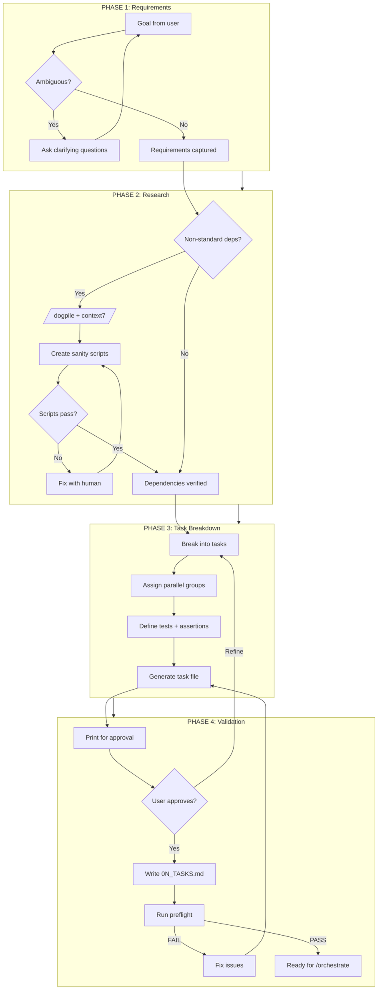

# Plan Skill

Create comprehensive, orchestration-ready task files that `/orchestrate` can reliably execute.

## The Problem This Solves

Without proper planning, agent orchestration fails:

```
Agent "completes" Task 1 with subtle bug
  → Task 2 builds on broken Task 1
    → Task 3 compounds errors
      → By Task 5, codebase is corrupted
```

**The solution**: Rigorous upfront planning with:
- **Sanity scripts** that prove dependencies work IN ISOLATION
- **Definition of Done** with concrete, testable assertions
- **Questions/Blockers** resolved BEFORE implementation
- **Parallel grouping** for efficient execution

## Quick Start

```bash
# Interactive planning session
.pi/skills/plan/run.sh "Add PDF table extraction to the extractor skill"

# From existing requirements
.pi/skills/plan/run.sh --from requirements.md

# Validate existing task file
.pi/skills/plan/run.sh --validate 01_TASKS.md
```

## The Planning Workflow



## Phase 1: Requirements Gathering

### Ambiguity Detection

Before planning, the skill checks if the goal is clear:

```
User: "Add caching"

Agent: "I need clarification before planning:
1. What should be cached? (API responses, database queries, computed results)
2. Cache backend? (Redis, in-memory, file-based)
3. Cache invalidation strategy? (TTL, manual, event-driven)
4. Performance requirements? (latency targets, hit rate goals)"
```

### Structured Interview

For complex goals, use `/interview` to gather requirements:

```json
{
  "title": "Planning: PDF Table Extraction",
  "questions": [
    {
      "id": "scope",
      "text": "What types of tables should be extracted?",
      "type": "multi",
      "options": ["Simple grid tables", "Complex merged cells", "Borderless tables", "Nested tables"]
    },
    {
      "id": "output",
      "text": "Output format?",
      "type": "select",
      "options": ["JSON", "CSV", "Markdown", "Pandas DataFrame"]
    }
  ]
}
```

## Phase 2: Dependency Research

### Identifying Non-Standard APIs

The skill scans proposed tasks for dependencies that need sanity scripts:

| Needs Sanity Script | Examples | Why |
|---------------------|----------|-----|
| Little-known packages | `camelot`, `pdfplumber`, `surya` | Agent may hallucinate API |
| Complex APIs | `transformers`, `opencv`, `paddleocr` | Many parameters, easy to get wrong |
| Project-specific code | `myproject.utils` | Not in training data |
| **Skip** standard library | `json`, `os`, `pathlib` | Well-documented |
| **Skip** well-known packages | `requests`, `numpy`, `pandas` | Widely used, reliable |

### Research Integration

For unfamiliar dependencies, the skill integrates:

| Skill | Use Case | Cost |
|-------|----------|------|
| `/dogpile` | Deep multi-source research | Free (uses free tiers) |
| `/context7` | Library-specific documentation | Free |
| `/brave-search` | General patterns, StackOverflow | Free |
| `/perplexity` | Complex research questions | Paid (ask first) |

### Sanity Script Generation

For each non-standard dependency, generate an isolation test:

```python
#!/usr/bin/env python3
"""
Sanity script: camelot table extraction
Purpose: Verify camelot API works in isolation
Documentation: Context7 query "camelot-py read_pdf", verified 2026-01-28

Exit codes:
  0 = PASS (dependency works)
  1 = FAIL (dependency broken)
  42 = CLARIFY (needs human input)
"""
import sys
from pathlib import Path

try:
    import camelot
except ImportError:
    print("FAIL: camelot not installed. Run: pip install camelot-py[cv]")
    sys.exit(1)

# Test with minimal fixture
FIXTURE = Path(__file__).parent / "fixtures" / "simple_table.pdf"
if not FIXTURE.exists():
    print(f"FAIL: Test fixture missing: {FIXTURE}")
    sys.exit(1)

try:
    tables = camelot.read_pdf(str(FIXTURE), flavor="lattice")
    assert len(tables) > 0, "No tables extracted"
    assert tables[0].parsing_report["accuracy"] > 80, "Low accuracy"
    print(f"PASS: Extracted {len(tables)} tables, accuracy={tables[0].parsing_report['accuracy']:.1f}%")
    sys.exit(0)
except Exception as e:
    print(f"FAIL: {e}")
    sys.exit(1)
```

## Phase 3: Task Breakdown

### Task Decomposition Principles

1. **Single Responsibility**: Each task does ONE thing
2. **Testable**: Every task has a verifiable outcome
3. **Independent**: Minimize dependencies between tasks
4. **Appropriately Sized**: Not too big (hard to verify), not too small (overhead)

### Parallel Group Assignment

Tasks are assigned to parallel groups for efficient execution:

| Group | Execution | Use For |
|-------|-----------|---------|
| 0 | Sequential first | Setup, scaffolding |
| 1 | Parallel after 0 | Independent implementation tasks |
| 2 | Parallel after 1 | Dependent implementation tasks |
| 3+ | Parallel after N-1 | Integration, testing, validation |

Example:
```markdown
- [ ] **Task 1**: Create database schema
  - Parallel: 0  # Must run first

- [ ] **Task 2**: Implement user API
  - Parallel: 1  # Can run with Task 3
  - Dependencies: Task 1

- [ ] **Task 3**: Implement admin API
  - Parallel: 1  # Runs concurrently with Task 2
  - Dependencies: Task 1

- [ ] **Task 4**: Integration tests
  - Parallel: 2  # Runs after Tasks 2 & 3
  - Dependencies: Task 2, Task 3
```

### Definition of Done

Every implementation task MUST have:

```markdown
- **Definition of Done**:
  - Test: `tests/test_feature.py::test_specific_behavior`
  - Assertion: <concrete, verifiable statement>
```

**Good assertions**:
- "Returns exactly 5 tables from fixtures/sample.pdf"
- "API responds with 401 for expired tokens"
- "Processing time < 2 seconds for 10MB file"

**Bad assertions**:
- "It works" (not verifiable)
- "Tables are extracted" (not specific)
- "Feature is implemented" (tautology)

## Phase 4: Task File Generation

### Print-First Pattern

The skill NEVER writes files without explicit approval:

```
Agent: "Here's the proposed task file:

---
# Task List: PDF Table Extraction

## Context
Add table extraction capability to the extractor skill...

## Crucial Dependencies (Sanity Scripts)
| Library | API/Method | Sanity Script | Status |
|---------|------------|---------------|--------|
| camelot | `read_pdf()` | `sanity/camelot.py` | [ ] PENDING |

## Tasks
- [ ] **Task 1**: Add camelot dependency...
...
---

Should I:
1. Write this to `01_TASKS.md`?
2. Modify the task breakdown?
3. Add more detail to specific tasks?"
```

### Preflight Validation

Before handoff to `/orchestrate`, validate:

```bash
.pi/skills/plan/run.sh --validate 01_TASKS.md
```

Checks:
- [ ] Questions/Blockers section resolved (None or empty)
- [ ] All sanity scripts exist and pass
- [ ] All tasks have Definition of Done
- [ ] All referenced test files exist
- [ ] Parallel groups are valid (no circular dependencies)

## Output Format

```markdown
# Task List: <Feature Name>

**Created**: <date>
**Goal**: <one-line summary>

## Context

<2-3 sentences describing what we're building and why>

## Crucial Dependencies (Sanity Scripts)

| Library | API/Method | Sanity Script | Status |
|---------|------------|---------------|--------|
| <lib> | `<method>` | `sanity/<lib>.py` | [ ] PENDING |

> All sanity scripts must PASS before proceeding to implementation.

## Questions/Blockers

None - all requirements clear.

## Tasks

### P0: Setup (Sequential)

- [ ] **Task 1**: <description>
  - Agent: general-purpose
  - Parallel: 0
  - Dependencies: none
  - **Sanity**: `sanity/<lib>.py` (must pass first)
  - **Definition of Done**:
    - Test: `tests/test_<feature>.py::test_<behavior>`
    - Assertion: <concrete statement>

### P1: Implementation (Parallel)

- [ ] **Task 2**: <description>
  - Agent: general-purpose
  - Parallel: 1
  - Dependencies: Task 1
  - **Sanity**: None (standard library only)
  - **Definition of Done**:
    - Test: `tests/test_<feature>.py::test_<behavior>`
    - Assertion: <concrete statement>

### P2: Validation (After Implementation)

- [ ] **Task N**: Run final validation
  - Agent: general-purpose
  - Parallel: 2
  - Dependencies: all previous tasks
  - **Definition of Done**:
    - Test: Full test suite passes
    - Assertion: All tests green, no regressions

## Completion Criteria

- [ ] All sanity scripts pass
- [ ] All tasks marked [x]
- [ ] All Definition of Done tests pass
- [ ] No regressions in existing tests

## Notes

<Any additional context, edge cases, or considerations>
```

## Integration with Other Skills

| Skill | Integration Point |
|-------|-------------------|
| `/orchestrate` | Executes the task file this skill creates |
| `/dogpile` | Researches unfamiliar dependencies |
| `/context7` | Fetches library documentation |
| `/interview` | Structured requirement gathering |
| `/assess` | Pre-planning codebase analysis |
| `/memory` | Recalls prior solutions to similar problems |

## When to Use

| Trigger | Action |
|---------|--------|
| "Plan this feature" | Full planning workflow |
| "Break this down into tasks" | Task decomposition |
| "Create task file for X" | Generate 0N_TASKS.md |
| "Prepare for orchestration" | Full workflow + validation |
| "What needs sanity scripts?" | Dependency analysis only |

## Key Principles

1. **Plan BEFORE coding** - No implementation without approved plan
2. **Test BEFORE implementation** - Define what "done" means first
3. **Sanity scripts for unknowns** - Verify dependencies work in isolation
4. **Print BEFORE write** - Always show content for approval
5. **Collaborate, don't dictate** - Agent proposes, human refines
6. **Fail fast** - Better to catch issues in planning than execution

## Example Session

```
User: "Plan adding Redis caching to the API"

Agent: "I'll help plan Redis caching. A few questions first:

1. What should be cached? (API responses, database queries, session data)
2. Cache invalidation strategy? (TTL, manual, event-driven)
3. Do you have Redis running locally, or should we use Docker?"

User: "API responses, TTL-based, use Docker"

Agent: "Got it. Redis is a well-known library, so no sanity script needed.
Let me research the current API structure..."

[Reads codebase]

Agent: "I found 12 API endpoints. Here's my proposed plan:

---
# Task List: Redis API Caching

## Context
Add TTL-based Redis caching to API responses to reduce database load.

## Crucial Dependencies
| Library | API/Method | Sanity Script | Status |
|---------|------------|---------------|--------|
| redis | `Redis.get/set` | N/A (well-known) | - |
| docker | Redis container | `sanity/redis_docker.sh` | [ ] PENDING |

## Tasks

### P0: Setup
- [ ] **Task 1**: Add Redis Docker container to docker-compose
  - **Definition of Done**:
    - Test: `docker compose up redis && redis-cli ping`
    - Assertion: Returns PONG

### P1: Implementation (Parallel)
- [ ] **Task 2**: Create cache utility module
  - **Definition of Done**:
    - Test: `tests/test_cache.py::test_set_get_ttl`
    - Assertion: Value expires after TTL

- [ ] **Task 3**: Add caching to /api/users endpoint
  - **Definition of Done**:
    - Test: `tests/test_api.py::test_users_cached`
    - Assertion: Second request returns cached data (no DB query)

[...more tasks...]
---

Should I write this to `01_TASKS.md`, or would you like to modify it?"
```
