# Project Watchdog architecture



`$project-watchdog` is a narrow cron control plane. It does not fix projects by itself. It finds one eligible GitHub ticket, leases one target, sends the repair through `$ask` and Tau, requires proof, closes through `$ticket`, then audits the closure later.

## One tick, plain English

1. **Cron or a human starts one tick.** `scripts/project_watchdog.py` is only the Typer entrypoint; `tick` delegates to `watchdog.commands.tick`.
2. **Global guards run first.** The tick checks quiet hours, the singleton lock, `registry/state.json`, and `registry/projects.json` before it scans or mutates anything.
3. **Pydantic validates the authority inputs.** `watchdog.models` validates state, registry entries, and GitHub issue shapes. A bad project entry is quarantined; bad global state or registry envelope blocks the tick.
4. **The queue scan finds routable tickets.** A ticket needs `agent-work`, no hold label, a matching project target scope, and no overlapping live target lease.
5. **Lane 0 clears dependency holds only.** If every `blocked-by` / `depends_on` upstream is completed, the tick removes only `blocked:upstream` and exits. The next tick handles the newly unblocked ticket.
6. **Lane 1 repairs one ticket.** `$ask tau-dag` compiles the creator/reviewer DAG; Tau executes it. `$project-watchdog` monitors Tau stream artifacts and requires a reviewer `VERDICT: PASS`, a valid `VERIFY_PLAN`, fresh proof artifacts, and reviewed bytes before closing.
7. **Pydantic validates agent outputs before close.** The repair finisher validates the project, issue, target snapshots, owned-target records, native closure records, and the reviewer `VERIFY_PLAN` before `$ticket verify` and `$ticket close` run.
8. **Lane 2 audits completed closures.** Two distinct auditor seats inspect closed tickets. `FAIL` reopens for repair; `NEEDS_ATTENTION` reopens with `needs-human`; only unanimous `PASS` applies `closure-verified`.
9. **Lane 3 attests an empty queue.** If nothing is open and no closure is waiting, a separate completion attestor checks whether the project is really done. Empty queue is not proof.
10. **The finish boundary validates the receipt.** `watchdog.core.finish()` runs `watchdog.receipt_schema.validate_receipt()` before persistence and alerting, then validates again after alert mutation.

## Failure classification

`$project-watchdog` owns its receipt schemas, not the failure vocabulary. Receipt failure codes must come from `$triage-error/failure_codes.json` or match the minted `*_unclassified_<8hex>` shape. If receipt validation fails, `receipt_schema.py` downgrades the tick to `NEEDS_ATTENTION` and calls `$triage-error classify --layer project-watchdog` on the validation error. That makes ambiguous classification failures visible instead of letting invented labels flow to Discord, `$shame`, or downstream ticket logic.

## Source-backed chart files

- Scene input: [`docs/project-watchdog-architecture.scene.yml`](docs/project-watchdog-architecture.scene.yml)
- SVG chart: [`docs/project-watchdog-architecture.svg`](docs/project-watchdog-architecture.svg)
- `$create-architecture` receipt: [`docs/project-watchdog-architecture.create-architecture.receipt.json`](docs/project-watchdog-architecture.create-architecture.receipt.json)

The `$create-architecture` receipt is a draft evidence bundle: it proves current source hashes were bound to a real `$create-svg` render/validate/preview run. It does not prove human visual approval.

## Verify this documentation chart

Run the retained eval from the repo root:

```bash
skills/agentic-evals/run.sh run \
  skills/project-watchdog/fixtures/agentic_eval.architecture.json \
  --output /mnt/storage12tb/skills/project-watchdog/outputs/architecture-agentic-eval.json
```

The eval rerenders the SVG from the scene, validates it through `$create-svg`, compares the deterministic output to the checked-in SVG, and checks that this document names the important control-plane seams: `$ask`, Tau, `$ticket`, Pydantic, `$triage-error`, closure audit, and `$agentic-evals`.

## Source citations

- CLI entrypoint: `scripts/project_watchdog.py:59-74`
- Tick state, registry, rotation, lanes, and finish handoff: `scripts/watchdog/commands.py:444-921`
- Issue validation, dependency gate, route selection, target-scope collision checks: `scripts/watchdog/registry.py:153-210`, `scripts/watchdog/registry.py:349-395`, `scripts/watchdog/registry.py:760-930`
- Repair, closure audit, completion attestation, proof gate, and native close: `scripts/watchdog/handlers.py:1027-2160`
- Receipt finish boundary: `scripts/watchdog/core.py:427-470`
- Pydantic lifecycle models: `scripts/watchdog/models.py:1-151`
- Receipt schema validation and `$triage-error` classification fallback: `scripts/watchdog/receipt_schema.py:1-229`
