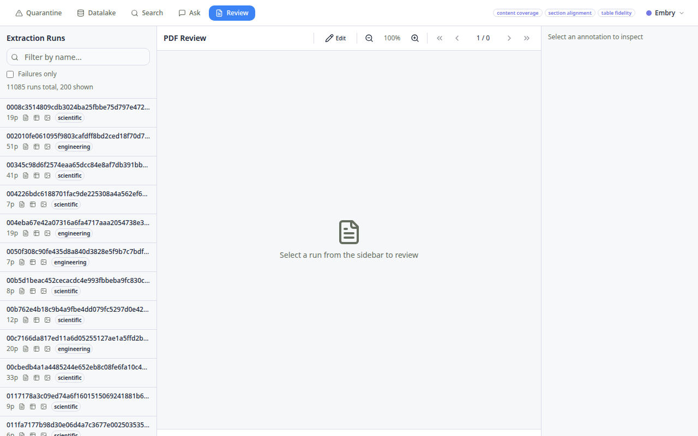
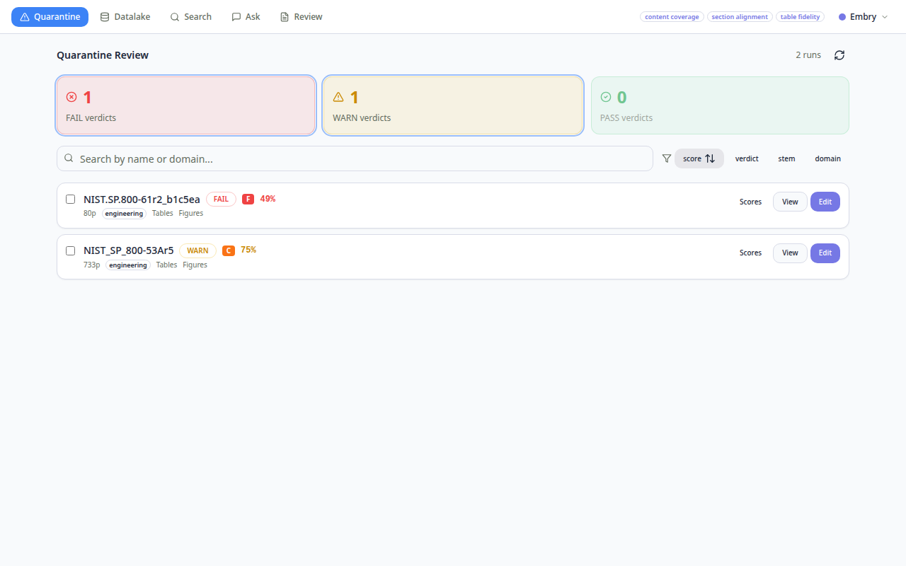

# PDF Extraction Review & Quarantine UX — Design Board

**Created**: 2026-03-09
**Updated**: 2026-03-09 (Round 2 — migrated to existing prototype)
**Surfaces**: `/review-pdf` (spot-check) + `/learn-datalake` (quarantine)
**Starting Point**: `prototypes/tabbed/html/` React+Vite app
**Design System**: Light theme (prototype default), NVIS MIL-STD-3009 dark available via persona toggle

---

## Persona Assessment

**Audience**: Defense/compliance engineers reviewing PDF extraction quality
**Expertise**: High — understands section hierarchy, control IDs, table structure
**Workflow**: Scan-first (glance at scores → drill into issues → approve/flag → agent re-extracts)
**Context**: CMMC/NIST/ITAR compliance — must be auditable, printable, accessible

**Core interaction loop**:
1. Human opens Review → sees marked-up PDF with bbox overlays
2. Human adjusts bboxes (draw/resize/delete), adds notes in Inspector pane
3. Human saves corrections → triggers re-extraction in `/learn-datalake`
4. Agent re-extracts with corrected parameters → results appear in next review cycle

---

## Existing Prototype — `prototypes/tabbed/html/`

**Location**: `${HOME}/workspace/experiments/extractor/prototypes/tabbed/`

The full interactive UX already exists as a React/Vite/Tailwind/ShadCN app with FastAPI backends.

### Review Surface (ReviewLayout.tsx — 820 lines)



**Three-panel layout**:
- **Left**: Run browser (11,085 runs, filterable, "Failures only" toggle, domain badges)
- **Center**: PDF canvas with type-colored bbox overlays (click to select), zoom, page navigation, Edit mode toggle
- **Right**: Inspector (box type, ID, confidence, text preview, position, notes textarea, Save Corrections)

**Interactive features already working**:
- Click bbox on PDF → highlights in Inspector with metadata
- Toggle visibility per type (SectionHeader, Table, Figure, Equation, ListItem, Caption, Text)
- Edit mode → swaps to BboxEditor for draw/select/move/resize/delete/undo
- Agent Notes panel showing error/warning/info diagnostics
- Scores panel with per-dimension progress bars and grade
- Correction History showing prior human edits

### BboxEditor (BboxEditor.tsx — 540 lines)

**Canvas-based annotation editor**:
- **Draw mode** (D key): crosshair cursor, drag to create new bbox
- **Select mode** (S key): click to select, shows properties
- **Labels**: 1-7 number keys for Table/SectionHeader/Figure/Text/Equation/ListItem/Caption
- **Undo** (Ctrl+Z), **Delete** (Del/Backspace), **Reset** to original
- Normalized 0-1 coordinates for resolution-independent positioning
- Annotation sidebar listing all bboxes with type dots and "new" badges

### Quarantine Surface (QuarantineView.tsx — 485 lines)



**Verdict-filtered queue**:
- Summary cards: FAIL/WARN/PASS counts (click to filter)
- Sortable by score/verdict/stem/domain
- Per-run cards: stem, verdict badge, grade badge, score %, page count, domain, tables/figures indicators
- Expandable dimension bars (content, sections, tables, figures, equations, ordering, data quality)
- Issue list per run (CRITICAL/HIGH/MEDIUM severity)
- Bulk actions: Re-extract, Blacklist, Dismiss (with checkbox multi-select)
- Click View → ReviewLayout read-only, Click Edit → ReviewLayout with BboxEditor active
- TV war room mode: giant verdict count display for wall monitors

### Backend APIs

| Server | Port | File | PyMuPDF? | Purpose |
|--------|------|------|----------|---------|
| `review_server.py` | 8003 | FastAPI | **YES — 9 fitz calls** | Run listing, bbox annotations, page PNG rendering, corrections |
| `datalake_api.py` | 8004 | FastAPI | No | Stats, quarantine queue, feedback, corrections, search, personas |

**`review_server.py` fitz calls (migration targets)**:
| Function | fitz API | pdf_oxide Replacement |
|----------|----------|----------------------|
| `_get_page_dims()` | `fitz.open()`, `page.rect.width/height`, `doc.close()` | `PdfDocument()`, `page_dimensions()` |
| `get_page_png()` | `fitz.open()`, `len(doc)`, `doc[idx].get_pixmap(dpi)`, `pix.tobytes("png")`, `doc.close()` | `PdfDocument()`, `page_count()`, `render_page(idx, dpi)` |

**`datalake_api.py`** — pure data gateway, proxies to `/memory` service (port 8601). No PDF rendering. Reads supervisor state from filesystem.

### Frontend Data Types (review.ts + datalake.ts)

```typescript
Box { id, type, x, y, w, h, source, confidence, reviewed, edited, stage, title, text_preview }
RunSummary { stem, pdf_path, page_count, has_blocks/tables/figures, is_blacklisted, profile_domain, verdict, overall_score, grade }
RunScores { overall: {score, grade, verdict}, dimensions: {[key]: {score, state, weight}}, issues[] }
QuarantineEntry { pdf_path, pdf_stem, overall_score, grade, dimensions, margaret_verdict, worst_dimension, failing_dimensions, lesson_key }
```

---

## Open Questions — Resolved in Round 2

- [x] **Bbox annotation?** → YES, BboxEditor already has draw/select/move/resize/delete/undo
- [x] **Batch operations?** → YES, QuarantineView has checkbox multi-select + Re-extract/Blacklist/Dismiss
- [x] **Cascade Override buttons?** → Not yet in prototype. Need to add shadow cascade panel.
- [ ] **`/interview` question set for quarantine?** → Still open. Need to define per-reason question templates.
- [ ] **NVIS dark theme?** → Prototype uses light theme. PersonaContext has distance modes (desk/tv/phone) but no NVIS dark. Could add as persona option.

---

## Migration Plan: fitz → pdf_oxide

The prototype is fully functional but depends on PyMuPDF (`import fitz`) in `review_server.py`. The migration:

1. Replace 9 fitz calls with pdf_oxide equivalents (2 functions, straightforward)
2. Wire `review_server.py` to run via `uv run --directory $PDF_OXIDE_ROOT` (same pattern as `/extract-pdf`)
3. Add shadow JSONL logging to correction saves (for cascade training)
4. Add `/interview` wiring to quarantine re-extract flow
5. Add `/dashboard` collectors reading from the existing APIs
6. Wire `run.sh serve` in `/review-pdf` to start both FastAPI servers

---

## Key Design Decisions — Round 2

1. **Use existing prototype, don't rebuild** — 1,845 lines of production React + 2 FastAPI servers already working. Migration is ~50 lines of Python changes.
2. **Human corrections drive re-extraction** — corrections saved → `/learn-datalake` picks up `reextract_requests/{stem}.json` → agent re-extracts with adjusted parameters.
3. **Every correction is a training signal** — bbox edits, notes, feedback all stored via `/memory` for classifier training.
4. **Light theme for now** — prototype works. NVIS dark can be a persona toggle later (low priority vs. getting the fitz→pdf_oxide migration done).
5. **Shadow cascade panel needed** — prototype has scores/issues but no cascade decision visibility. Add as new Inspector tab.

---

## NVIS Concept Mockups (Round 1 — Reference Only)

Earlier NVIS dark-themed mockups are preserved as design reference for potential dark mode:
- `review-pdf-mockup.html` — NVIS-themed side-by-side review
- `quarantine-mockup.html` — NVIS-themed queue browser
- `figures/review-pdf-screenshot.png`, `figures/quarantine-screenshot.png`

These are **not the implementation target** — the prototype is.
