# Service privacy

**An agentic, owner-controlled privacy cage for privileged device-trust and endpoint agents.**

The Ubuntu implementation uses AppArmor plus systemd to let a service such as Kolide perform approved device-security checks without automatically giving it unrestricted access to unrelated personal, consulting, or client data.

- **Ubuntu:** implemented and under live qualification.
- **macOS:** implementation coming soon.

This is transparent confinement, not evasion. Denied reads fail normally. The skill does not forge inventory, fake successful security checks, spoof telemetry, or claim that an unavailable check passed.

**README explains the system; `SKILL.md` governs runtime.**

**Current assurance status:** the Ubuntu policy model, rendering, planning, probing, apply/verify/rollback flow, runtime readback, and drift handling are implemented. Full production privacy, complete real-Kolide lifecycle/update qualification, and ITAR compliance are **not established**. See `GOAL.md` and `docs/PROJECT_KNOWLEDGE.md` for the exact evidence boundary.

## What this does, in plain English

Imagine your computer is a house and Kolide is a contractor invited in to check whether the smoke detectors, locks, and electrical panel meet company rules.

Without another boundary, that contractor may technically have keys to rooms that have nothing to do with the inspection.

`service-privacy` builds a fence around the contractor.

It lets you say, in effect:

- you may inspect approved operating-system and device-security information;
- you may use the files and state your own service needs to operate;
- you may use approved network paths;
- you may **not** read protected personal or client data merely because you run as a privileged service;
- you may **not** quietly gain more access because your software was updated.

On Ubuntu, Linux enforces those rules. Kolide does not get to decide whether to honor them.

If Kolide asks to open a protected client file, the operating system can answer **permission denied**.

The goal is simple:

> **Let the device-trust agent do its legitimate security job without handing it the keys to the rest of the workstation.**

<p align="center">
  
</p>

## AppArmor is the guard; service-privacy is the assessor and cage manager

AppArmor and systemd are the operating-system enforcement engines. `service-privacy` is the agentic controller around them.

It already provides the machinery to:

1. inspect the real service, executable paths, and runtime identity;
2. turn an owner-reviewed policy into an AppArmor profile and systemd sandbox;
3. bind a plan to the host, unit, executable hashes, and rendered controls;
4. test allowed and denied behavior before deployment;
5. apply the exact reviewed plan only after explicit owner approval;
6. verify that the running service and observed descendants are still inside the expected cage;
7. detect important drift such as changed executables or service configuration;
8. stop on drift when explicitly requested;
9. roll back to a visible **OFF** state rather than silently restarting without protection.

The intended mature role is broader than configuration generation:

> **Detect a Kolide change, inspect it, exercise it, classify the evidence, decide whether the existing cage remains correct, and propose the smallest justified policy change for human approval.**

The skill may propose a change. It must not silently authorize one.

If `service-privacy` disappeared after a correct policy had already been installed, Linux would continue enforcing the installed AppArmor and systemd rules. What you would lose is the machinery for assessing changes and safely creating, testing, updating, verifying, and rolling back that boundary.

## The agentic update-assessment loop

Endpoint agents update. A new Kolide launcher or osquery version can replace binaries, move paths, launch new helpers, alter scheduled queries, change update staging, touch different operating-system metadata, or change its desktop and logging behavior.

The governing rule is:

> **An update triggers assessment and requalification, not automatic permission expansion.**

The target workflow is:

```text
Kolide changes
    |
    v
DETECT
binary • version • path • helper • behavior
    |
    v
INSPECT + EXERCISE
process tree • AppArmor denials • canaries • scheduled workload • lifecycle
    |
    v
CLASSIFY EVIDENCE
    |
    +--> existing cage still works
    |        `--> no policy change; re-prove and continue
    |
    +--> new harmless OS/posture access is genuinely required
    |        `--> propose the minimum exact policy delta
    |
    +--> protected user/client resource requested
    |        `--> BLOCK; cage remains unchanged
    |
    +--> new helper or process is not confined
    |        `--> FAIL qualification / stop as policy requires
    |
    `--> evidence is insufficient
             `--> INCONCLUSIVE; require review

PROPOSED POLICY CHANGE
    |
    v
HUMAN APPROVAL
    |
    v
PLAN -> PROBE -> APPLY -> VERIFY AGAIN
```

### What the skill should test after an update

A meaningful update assessment is not just “the service started.” It should exercise the behavior that appears later in the lifecycle, including where applicable:

- launcher and osquery binary identity and hashes;
- all observed child/helper processes and confinement inheritance;
- scheduled osquery query packs;
- package, CPU, kernel, and other posture-table reads;
- control-server reconciliation;
- update download, staging, activation, and restart;
- log and flare generation/shipping;
- desktop/session helpers;
- protected-path canaries;
- service restart;
- reboot persistence;
- relevant network positive and negative controls.

The assessment should retain evidence showing what changed, what was tested, what failed, and the exact policy delta being proposed.

### The safety rule

The skill must never implement this loop:

```text
AppArmor says DENIED
        |
        v
automatically add the denied path
        |
        v
Kolide works again
```

A denial is **evidence to investigate**, not authorization.

For example, a new read under reviewed operating-system posture metadata may justify a narrowly scoped proposed change after tests. A request for a protected client repository, SSH key, browser secret, or protected storage root does not become safe merely because a new Kolide version asks for it.

### Current implementation boundary

The repository already contains important primitives for this model: strict policy contracts, executable hashing, host-bound plans, native/synthetic probes, runtime verification, denial inspection, drift detection, stop-on-drift, rollback, and typed receipts.

The fully automated **detect -> inspect -> exercise -> classify -> propose** workflow across real Kolide updates is still active project work. Do not describe that complete loop as production-qualified until the retained live update/lifecycle gates prove it.

## Why this exists

Device-trust software needs visibility into a computer to answer legitimate questions such as:

- Is disk encryption enabled?
- Is the operating system current?
- Is the screen lock configured?
- What operating-system and package versions are installed?
- Is required security software running?

Those questions do not automatically require unrestricted access to unrelated client repositories, SSH keys, personal documents, consulting work, mounted client storage, browser data, or every other file on a personally owned workstation.

`service-privacy` separates those concerns:

```text
device posture information             allow where explicitly approved
unrelated personal/client information  protect
```

The service remains able to report honestly when information is unavailable. The skill never fabricates a successful answer.

## Platform support

### Ubuntu — implemented

The Ubuntu backend uses:

- **AppArmor** for mandatory access control around files, execution, process interactions, and IPC;
- **systemd sandboxing** for capability removal, `NoNewPrivileges`, filesystem/device/IPC restrictions, service lifecycle controls, and unit-local network policy;
- **typed plans and receipts** so the reviewed policy can be compared with what is actually running.

The implementation is a generic Ubuntu systemd-service confinement engine. Kolide is one deployment recipe, not a hard-coded special case.

### macOS — coming soon

A macOS backend is planned but does not exist yet. It will not be a mechanical port because macOS has neither AppArmor nor systemd.

The goal is to preserve the same owner-facing and agentic lifecycle:

```text
inspect -> assess -> plan -> probe -> apply -> verify -> detect drift -> reassess
```

The leading design is an owner-controlled Endpoint Security component for process-aware authorization around protected resources, combined with macOS signing identity, TCC, service, and `launchd` inspection.

The desired behavior remains:

```text
Kolide/osquery -> approved posture data -> ALLOW
Kolide/osquery -> protected client data -> DENY
Kolide child   -> protected client data -> DENY
Kolide update  -> changed identity      -> REQUALIFICATION REQUIRED
```

The first macOS milestone should prove the mechanism against a harmless synthetic managed-agent process before making any real-Kolide protection claim.

### Windows

No Windows implementation is currently claimed.

## Ubuntu policy shape

The generated policy is strict and default-deny. Baseline protected roots include:

```text
/home
/root
/mnt
/media
/srv
/run/user
```

The rest of the readable surface is bounded as well. Approved resources may include reviewed operating-system posture data, runtime libraries/certificates, agent configuration, agent-owned state, and explicitly approved executables.

Executable roots must not be writable by the confined service.

The systemd layer additionally removes capabilities, enables `NoNewPrivileges`, and constrains filesystem, devices, IPC, networking, and service lifecycle behavior.

A cage can break a device-trust check, updater, helper, or the service itself. That is an operational failure to investigate. It is not permission to silently widen the policy.

## Quick start

Work from the repository's actual skill directory:

```bash
cd /absolute/path/to/agent-skills/skills/service-privacy

mountpoint -q /mnt/storage12tb || exit 1
export UV_PROJECT_ENVIRONMENT=/mnt/storage12tb/skills/service-privacy/venv
export UV_CACHE_DIR=/mnt/storage12tb/skills/service-privacy/uv-cache

uv sync --all-groups
export SERVICE_PRIVACY_PYTHON="$UV_PROJECT_ENVIRONMENT/bin/python"

./sanity.sh
./run.sh doctor
./run.sh repo-check
```

Python 3.11+ is targeted. AppArmor, `apparmor-utils`, systemd, and a C compiler are host prerequisites for the native Ubuntu gate. The tool does not install host packages for you.

Do not run this inside a container and treat that as proof that the Ubuntu host kernel is enforcing the policy.

## 1. Inspect the real service

The unit below is an example, not a claim about the current host:

```bash
UNIT=launcher.kolide-k2.service

sudo env SERVICE_PRIVACY_PYTHON="$SERVICE_PRIVACY_PYTHON" \
  ./run.sh inspect --unit "$UNIT"
```

Use the returned canonical executable and runtime paths. Do not rely on guessed names such as `launcher`, `osquery`, or `osqueryd`.

Unknown or ambiguous execution paths are blockers, not reasons to weaken confinement.

## 2. Create and review the policy

```bash
./run.sh config init \
  --unit "$UNIT" \
  --executable /REPLACE/WITH/EXACT/CANONICAL/PATH \
  --output /private/owner-chosen/policy.json
```

Review at least:

```text
read_files
read_roots
write_roots
protected_roots
executables
network_mode
```

Useful policy helpers:

```bash
./run.sh firewall POLICY.json --action show
./run.sh firewall POLICY.json --preset PRESET
./run.sh configure POLICY.json
./run.sh configure POLICY.json --preset PRESET --non-interactive
```

| Preset | Effect |
|---|---|
| `compliance-safe` | Keep approved posture reads needed for normal operation while retaining protected data roots. |
| `minimal-identity` | Also remove `/etc/machine-id` from optional identity reads. |
| `locked-down` | Remove machine-id plus other optional identity reads represented by the policy. |

A preset does not silently rewrite the operational baseline. New operational access requires review.

## 3. Plan and check the rendered policy

```bash
./run.sh config doctor /private/owner-chosen/policy.json

sudo env SERVICE_PRIVACY_PYTHON="$SERVICE_PRIVACY_PYTHON" \
  ./run.sh plan \
  /private/owner-chosen/policy.json \
  --output /root/kolide-plan-001

sudo env SERVICE_PRIVACY_PYTHON="$SERVICE_PRIVACY_PYTHON" \
  ./run.sh check-policy /root/kolide-plan-001/plan.json
```

Planning binds the proposal to the actual host/service identity and executable hashes. It does not need the contents of protected client files.

## 4. Probe before apply

Start on a disposable Ubuntu host when possible.

```bash
sudo env SERVICE_PRIVACY_PYTHON="$SERVICE_PRIVACY_PYTHON" \
  ./run.sh probe \
  /root/kolide-plan-001/plan.json \
  --execute \
  --owner-authorized
```

The synthetic probe does not execute Kolide. It checks representative allowed reads, denied protected reads, process/IPC/network restrictions, zero capabilities, `NoNewPrivileges`, profile attachment, and child inheritance.

Positive controls matter: a missing file or unreachable network destination must not accidentally count as enforcement proof.

A passing synthetic probe is necessary evidence for apply. It is not complete privacy, lifecycle, update, or real-Kolide compatibility proof.

## 5. Apply with explicit owner approval

```bash
APPROVAL=$(sudo cat /root/kolide-plan-001/approval-sha256.txt)

sudo env SERVICE_PRIVACY_PYTHON="$SERVICE_PRIVACY_PYTHON" \
  ./run.sh apply \
  /root/kolide-plan-001/plan.json \
  --approve-sha256 "$APPROVAL" \
  --probe-receipt /var/lib/ubuntu-service-privacy/probes/REPLACE/receipt.json \
  --execute \
  --owner-authorized \
  --accept-check-failures
```

Apply uses a visible OFF hold during the transaction, installs the confinement, starts the service only after controls exist, and verifies the resulting runtime state.

If a stop cannot be established after failure, the receipt reports `FAILURE_STATE_UNKNOWN`; it does not invent successful containment.

## 6. Verify, monitor, and roll back

```bash
sudo env SERVICE_PRIVACY_PYTHON="$SERVICE_PRIVACY_PYTHON" \
  ./run.sh verify --unit "$UNIT"

sudo env SERVICE_PRIVACY_PYTHON="$SERVICE_PRIVACY_PYTHON" \
  ./run.sh verify \
  --unit "$UNIT" \
  --stop-on-drift \
  --execute \
  --owner-authorized

./run.sh logs --unit "$UNIT"
./run.sh logs --unit "$UNIT" --follow
./run.sh logs --unit "$UNIT" --denials
./run.sh health --unit "$UNIT"

sudo env SERVICE_PRIVACY_PYTHON="$SERVICE_PRIVACY_PYTHON" \
  ./run.sh rollback \
  --unit "$UNIT" \
  --execute \
  --owner-authorized
```

A one-minute successful startup proves very little about an endpoint agent. Delayed query packs, update checks, log/flare activity, helper processes, control reconciliation, restarts, and reboots all matter to qualification.

Rollback leaves the service visibly held OFF rather than automatically restarting it without protection.

## Network modes

### `OFFLINE`

Useful for initial confinement validation. The normal cloud-connected device-trust workflow cannot function in this mode.

### `PUBLIC_EGRESS_LOCAL_DENY`

Allows approved public egress while denying selected private, link-local, multicast, and host-local address classes through unit-local systemd IP controls. Public DNS resolvers are owner-selected.

This is not hostname filtering and does not inspect encrypted payloads.

### Loopback exception

Loopback is intentionally allowed for the current Kolide Device Trust browser workflow:

```text
127.0.0.1/8
::1/128
```

That is broader than a single Kolide port. A different service listening on loopback may therefore also be reachable from the confined process. Narrowing that requires a port-aware host firewall or equivalent mechanism this skill does not currently own.

Configuration readback is not, by itself, behavioral proof that the kernel filtered a packet. Strong network claims require reachable positive/negative witnesses and the focused network qualification gates.

## What the skill deliberately does not do

`service-privacy` does not:

- automatically learn permissions from AppArmor denial logs;
- grant access simply because a new version requests it;
- falsify compliance results;
- hide failed checks;
- modify vendor telemetry to make a check look successful;
- automatically disable endpoint security software;
- silently restore an unconfined running service after rollback.

The guiding rule is:

> **Evidence may justify a proposal. Only an approved policy may change the cage.**

## Confidentiality limitations

This is an access-control system, not a time machine or universal information-flow label.

The agent may already contain information collected before confinement. The tool does not erase or certify that historical state. It also does not establish anything about data already transmitted downstream, arbitrary other privileged software, every possible alias/copy, or secrets deliberately copied into an approved readable area.

AppArmor audit records may themselves contain sensitive path names. Do not upload controlled data, private receipts, denied filenames, or vendor exports to public issue trackers or external models.

## Evidence and current non-claims

The repository includes deterministic tests, strict typed policy models, AppArmor parsing, systemd rendering, synthetic/native probes, host-bound plans, executable hashing, runtime process readback, drift checks, typed receipts, and fail-safe rollback behavior.

It does **not** currently claim:

- complete production confidentiality across every representation;
- complete real-Kolide lifecycle compatibility;
- complete automatic update qualification;
- continuous proof of every network filter decision;
- ITAR compliance certification;
- a working macOS confinement backend.

Required production-assurance work is tracked in `GOAL.md`, `docs/PROJECT_KNOWLEDGE.md`, `references/threat-model.md`, and focused GitHub tickets.

## References

- `SKILL.md` — authoritative runtime workflow and non-claims
- `GOAL.md` — owner confidentiality goal and acceptance boundary
- `docs/PROJECT_KNOWLEDGE.md` — current project state and unrun gates
- `references/threat-model.md` — representation and escape analysis
- `references/sources.md` — external semantics and source references
- `kolide/README.md` — Kolide-specific deployment recipe

## Design principle

> **Compatibility may require review. Privacy boundaries must not weaken merely because software asks for more access.**

The point of the agentic skill is not to keep every check green at any cost. It is to determine, from evidence, whether the existing cage is still correct and to propose the smallest safe change when it is not.
