# Service privacy

A transparent, owner-controlled privacy cage for device-trust and endpoint agents.

The Ubuntu implementation uses AppArmor plus systemd to let an agent such as Kolide perform approved device-security checks without automatically giving it unrestricted access to unrelated personal, consulting, or client data.

- **Ubuntu:** implemented and under live qualification.
- **macOS:** implementation coming soon.

This is transparent confinement, not evasion. Denied reads fail normally. The skill does not forge inventory, fake successful security checks, spoof telemetry, or tell an employer that a check succeeded when it did not.

**Current assurance status:** the Ubuntu policy engine, rendering, probing, apply/verify/rollback flow, and runtime checks are implemented. Full production privacy, complete Kolide lifecycle compatibility, and ITAR compliance are not established. See `GOAL.md` and `docs/PROJECT_KNOWLEDGE.md` for the exact evidence boundary.

## What this does, in plain English

Imagine your computer is a house and Kolide is a contractor invited in to check whether the smoke detectors, locks, and electrical panel meet company rules.

Without an additional boundary, that contractor may technically have access to many rooms that have nothing to do with the inspection.

service-privacy builds a fence around the contractor.

It lets you say, in effect:

- you may inspect approved operating-system and device-security information;
- you may use the files and state your own service needs to operate;
- you may phone home through the network paths the owner has approved;
- you may not read protected personal or client storage merely because you are running as a privileged service;
- you may not quietly gain more access because your software was updated.

On Ubuntu, Linux enforces those rules. Kolide does not get to decide whether to honor them.

If Kolide asks:

> "Open this protected client source-code file."

the operating system can answer:

> "No."

Kolide receives a normal permission-denied error.

The goal is simple: let the device-trust agent do its legitimate security job without handing it the keys to the rest of the workstation.

Or, even shorter: Kolide gets a fenced-off workspace instead of the keys to the whole machine.

## What service-privacy actually does

service-privacy is not itself the operating-system security boundary. AppArmor and systemd are the enforcement engines. service-privacy is the policy manager around them.

It:

1. inspects the real service and executable paths;
2. turns an owner-reviewed policy into an AppArmor profile and systemd sandbox;
3. tests the proposed boundary with positive and negative controls;
4. applies the exact reviewed plan only after explicit owner approval;
5. verifies that the running service and its observed descendants are still inside the expected cage;
6. detects important drift such as changed executables or service configuration;
7. can stop the service when verification fails;
8. rolls back to a visible OFF state rather than silently restarting the service without protection.

A useful mental model is:

```
owner privacy policy
        |
        v
 service-privacy
        |
        +--> AppArmor profile ------> file / process / execution boundary
        |
        +--> systemd sandbox -------> privileges / mounts / IPC / network boundary
        |
        +--> probes + verification -> evidence that the cage is actually attached
```

If service-privacy disappeared after a correct policy had already been installed, Linux would continue enforcing the installed AppArmor and systemd rules. What you would lose is the machinery for safely creating, testing, updating, verifying, and rolling back that boundary.

## Why this exists

Device-trust and endpoint-management software needs visibility into a computer to answer legitimate questions such as:

- Is disk encryption enabled?
- Is the operating system current?
- Is the screen lock configured?
- What operating-system and package versions are installed?
- Is required security software running?

Those questions do not automatically require unrestricted access to unrelated client repositories, SSH keys, personal documents, consulting work, mounted storage, browser data, or every other file on a personally owned workstation.

service-privacy separates those two ideas:

```
device posture information             allowed where explicitly approved
unrelated personal/client information  protected
```

The service remains able to report honestly when information is unavailable. The skill never fabricates a successful answer.

## Why updates matter

Endpoint agents update. A new Kolide launcher or osquery version can:

- replace an executable;
- use a different executable path;
- launch a new helper;
- change which operating-system files it reads;
- change its scheduled query behavior;
- alter update staging;
- add or change desktop integration;
- change how it stores state.

The intended rule is: **an update triggers requalification, not automatic permission expansion.**

A new version should remain inside the same privacy boundary. If the update only needs resources already belonging to an approved operating-system resource class, no privacy change should be necessary. If it genuinely needs a new harmless resource, that change can be reviewed. If it tries to read protected client data, the answer remains no.

The skill must never implement this unsafe loop:

```
Kolide update
    |
    v
AppArmor denial
    |
    v
automatically allow denied path
    |
    v
repeat forever
```

That would slowly erase the privacy boundary. Instead:

```
Kolide update
    |
    v
detect changed binary / path / behavior
    |
    v
requalification required
    |
    +--> existing approved cage still works
    |        |
    |        `--> verify and continue
    |
    +--> harmless new operational requirement
    |        |
    |        `--> explicit review
    |
    `--> protected access or confinement failure
             |
             `--> fail / stop; do not widen automatically
```

## Platform support

### Ubuntu — implemented

The current backend targets Ubuntu system services. It uses:

- AppArmor for mandatory access control around files, processes, IPC, and executable transitions;
- systemd sandboxing for capability removal, NoNewPrivileges, filesystem and device restrictions, IPC isolation, service lifecycle controls, and unit-local network policy;
- typed plans and receipts so the policy that was reviewed can be compared with what is actually running.

The implementation is a generic Ubuntu systemd-service confinement engine. Kolide is one deployment recipe, not a hard-coded special case.

### macOS — coming soon

A macOS implementation is planned but does not exist yet. It will not be a mechanical port because macOS has neither AppArmor nor systemd.

The goal is to preserve the same owner-facing lifecycle:

```
inspect -> plan -> probe -> apply -> verify -> detect drift
```

while replacing the Ubuntu enforcement backend with macOS-native controls.

The leading design is an owner-controlled Endpoint Security component capable of making process-aware authorization decisions around protected resources, combined with macOS signing identity, TCC, service, and launchd inspection. The exact implementation depends on prototype results, Apple Endpoint Security entitlement requirements, signing/notarization, and live qualification.

The desired behavior is the same:

```
Kolide/osquery -> approved posture data -> ALLOW
Kolide/osquery -> protected client data -> DENY
Kolide child   -> protected client data -> DENY
Kolide update  -> changed identity      -> REQUALIFICATION REQUIRED
```

The first macOS milestone should prove the mechanism against a harmless synthetic managed-agent process before attempting to claim protection around a real Kolide deployment. Until that implementation and its evidence gates exist, this repository makes no macOS confinement claim.

### Windows

No Windows implementation is currently claimed.

## What is implemented on Ubuntu

The generated policy is strict and default-deny. The default protected roots include:

```
/home
/root
/mnt
/media
/srv
/run/user
```

The rest of the service's readable surface is explicitly bounded as well. Approved resources can include:

- specific operating-system posture data;
- required runtime libraries and certificates;
- reviewed agent configuration;
- agent-owned state;
- explicitly approved executables.

Executable roots must not be writable by the confined service.

The systemd layer additionally removes capabilities, enables NoNewPrivileges, applies filesystem/device/IPC restrictions, and manages the service lifecycle around policy application.

Before apply, a synthetic probe exercises allowed and denied behavior. After apply, runtime verification checks the actual service state, process labels, capabilities, cgroup scope, executable identity, and relevant unit properties.

The cage can break device-trust checks, updates, desktop helpers, or the agent itself. That is an operational failure to investigate. It is not permission to silently widen the policy. A failed check stays visible.

<p align="center">
  
</p>

## Start here

The normal lifecycle is:

```
inspect -> configure -> plan -> probe -> apply -> verify
```

Use `logs` and `health` to understand later runtime problems. Use `rollback` when the approved confinement cannot be maintained. Nothing deploys merely because the repository is present on disk.

## Network modes

### OFFLINE

OFFLINE is the initial validation mode. The service cannot perform the normal cloud-connected workflow. It is useful for testing confinement but is intentionally unsuitable for ordinary device-trust operation.

### PUBLIC_EGRESS_LOCAL_DENY

PUBLIC_EGRESS_LOCAL_DENY permits approved public egress while denying private, link-local, multicast, and other selected local address classes through unit-local systemd IP controls. Public DNS resolvers are explicitly owner-selected.

This mode is not a vendor-hostname firewall and does not inspect encrypted payloads.

### Loopback exception

Loopback is intentionally allowed for the current Kolide Device Trust workflow. The rendered policy permits:

```
127.0.0.1/8
::1/128
```

because the local browser/device-trust workflow needs to reach the agent. That permission is broader than a single Kolide port. A different service listening on loopback may therefore also be reachable from the confined process. Narrowing that further requires a port-aware host firewall or equivalent mechanism that this skill does not currently install.

Network-policy configuration readback is not, by itself, proof that a packet was actually filtered. See `references/threat-model.md` and the focused network-verification tickets for the remaining behavioral qualification work.

## Install the skill, not the host policy

Work from the repository's actual skill directory:

```bash
cd /absolute/path/to/agent-skills/skills/service-privacy
mountpoint -q /mnt/storage12tb || exit 1
export UV_PROJECT_ENVIRONMENT=/mnt/storage12tb/skills/service-privacy/venv
export UV_CACHE_DIR=/mnt/storage12tb/skills/service-privacy/uv-cache
uv sync --all-groups
export SERVICE_PRIVACY_PYTHON="$UV_PROJECT_ENVIRONMENT/bin/python"
./sanity.sh
./run.sh doctor
./run.sh repo-check
```

Python 3.11+ is targeted. The retained receipts identify the interpreter actually tested.

AppArmor, apparmor-utils, systemd, and a C compiler are host prerequisites for the native Ubuntu gate. The tool does not install host packages for you.

Do not run the skill inside a container and treat that as evidence that the Ubuntu host kernel is enforcing the resulting policy.

`run.sh` uses an already provisioned Python interpreter. It never runs uv/pip as root and never sources `.env`. As with any sudo-invoked local program, review the source and interpreter and keep them inaccessible to untrusted writers.

## Inspect the actual service

The following unit name is a common Kolide example, not a claim about the current host:

```bash
UNIT=launcher.kolide-k2.service
sudo env SERVICE_PRIVACY_PYTHON="$SERVICE_PRIVACY_PYTHON" \
  ./run.sh inspect --unit "$UNIT"
```

Inspection reports canonical unit and executable identity. Include every relevant unit command and observed service helper in executables. Do not rely on guessed process names such as `launcher`, `osquery`, or `osqueryd`.

Unsupported or ambiguous execution cases are blockers rather than excuses to weaken confinement.

## Choose what the service may read

The policy controls what the service may read independently from whether the service happens to be healthy.

```bash
./run.sh firewall POLICY.json --action show
./run.sh firewall POLICY.json --preset PRESET
./run.sh configure POLICY.json
./run.sh configure POLICY.json \
  --preset PRESET \
  --non-interactive
```

These commands edit or explain policy. They do not deploy it by themselves.

| Preset | Effect |
|---|---|
| `compliance-safe` | Keep approved posture reads needed for normal operation while retaining protected data roots. |
| `minimal-identity` | Also remove `/etc/machine-id` from optional identity reads. |
| `locked-down` | Remove machine-id plus other optional identity reads represented by the policy. |

The operational baseline is not silently changed by a preset. New operational permissions require a reviewed code/policy change rather than being learned automatically from denials.

## Watch the running service

```bash
./run.sh logs --unit "$UNIT"
./run.sh logs --unit "$UNIT" --follow
./run.sh logs --unit "$UNIT" --denials
./run.sh health --unit "$UNIT"
```

`logs --denials` is the first place to look when a confined service starts successfully but dies later. This matters because startup only exercises a fraction of an endpoint agent's behavior. Later activity can include:

- scheduled osquery query packs;
- control-server reconciliation;
- update checks and activation;
- log shipping;
- flare generation;
- desktop/session helpers;
- state rotation;
- package or operating-system inventory.

A one-minute successful startup is therefore not proof that the cage is operationally complete. These monitoring commands also do not, by themselves, prove that the required Device Trust workflow still works.

## Create and review the policy

```bash
./run.sh config init \
  --unit "$UNIT" \
  --executable /REPLACE/WITH/EXACT/CANONICAL/PATH \
  --output /private/owner-chosen/policy.json
```

Replace the placeholder with an actual inspected executable path. Repeat `--executable` where required. `profiles/kolide.example.json` shows the policy shape but does not establish host-specific paths.

Review:

```
read_files
read_roots
write_roots
protected_roots
executables
network_mode
```

Allowed state/config directories must be canonical and root-controlled. Do not add broad grants merely to make a check turn green. Set `owner_acknowledges_limits` only after reviewing the policy.

Then validate and plan:

```bash
./run.sh config doctor /private/owner-chosen/policy.json
sudo env SERVICE_PRIVACY_PYTHON="$SERVICE_PRIVACY_PYTHON" \
  ./run.sh plan \
  /private/owner-chosen/policy.json \
  --output /root/kolide-plan-001
sudo env SERVICE_PRIVACY_PYTHON="$SERVICE_PRIVACY_PYTHON" \
  ./run.sh check-policy \
  /root/kolide-plan-001/plan.json
```

Planning reads service/process identity and hashes. It does not need to read the contents of protected client files.

## Synthetic probe before apply

Start on a disposable Ubuntu host when possible. The native gate requires real systemd, AppArmor, cgroup v2, IPv4/IPv6 support, and a C compiler.

```bash
sudo env SERVICE_PRIVACY_PYTHON="$SERVICE_PRIVACY_PYTHON" \
  ./run.sh probe \
  /root/kolide-plan-001/plan.json \
  --execute \
  --owner-authorized
```

The probe does not execute Kolide. It runs a small verifier under the rendered controls and checks representative:

- allowed reads;
- denied protected reads;
- process restrictions;
- IPC restrictions;
- network restrictions;
- zero capabilities;
- NoNewPrivileges;
- AppArmor profile attachment;
- child-process inheritance.

Positive controls are important. A missing file or nonexistent network destination must not accidentally be reported as evidence that security enforcement worked.

A passing synthetic probe is necessary evidence for apply. It is not a complete privacy, lifecycle, update, or Kolide-compatibility proof.

## Explicit owner-approved apply

After reviewing the exact generated AppArmor profile and systemd drop-in:

```bash
APPROVAL=$(sudo cat /root/kolide-plan-001/approval-sha256.txt)
sudo env SERVICE_PRIVACY_PYTHON="$SERVICE_PRIVACY_PYTHON" \
  ./run.sh apply \
  /root/kolide-plan-001/plan.json \
  --approve-sha256 "$APPROVAL" \
  --probe-receipt /var/lib/ubuntu-service-privacy/probes/REPLACE/receipt.json \
  --execute \
  --owner-authorized \
  --accept-check-failures
```

The probe receipt must belong to this host, belong to the current boot, match the exact plan, match the rendered controls, be sufficiently fresh, and contain passing assertions.

Apply places a visible OFF hold before modifying the service. It then:

1. stops related processes;
2. verifies that they stopped;
3. installs the confinement;
4. loads the AppArmor policy;
5. installs the systemd restrictions;
6. removes the hold only after the controls exist;
7. starts the service;
8. verifies the running state.

If the transaction fails, the tool attempts to leave the service parked OFF. If that stop cannot be established, the result is `FAILURE_STATE_UNKNOWN`. It is never reported as successful containment.

The AppArmor version floor and unprivileged-user-namespace hardening checks are part of the Ubuntu host gate. See the generated plan and `references/sources.md` for the currently enforced requirements.

## Verify, stop on drift, and roll back

Verify:

```bash
sudo env SERVICE_PRIVACY_PYTHON="$SERVICE_PRIVACY_PYTHON" \
  ./run.sh verify --unit "$UNIT"
```

Verify and stop the service when important drift is detected:

```bash
sudo env SERVICE_PRIVACY_PYTHON="$SERVICE_PRIVACY_PYTHON" \
  ./run.sh verify \
  --unit "$UNIT" \
  --stop-on-drift \
  --execute \
  --owner-authorized
```

Roll back:

```bash
sudo env SERVICE_PRIVACY_PYTHON="$SERVICE_PRIVACY_PYTHON" \
  ./run.sh rollback \
  --unit "$UNIT" \
  --execute \
  --owner-authorized
```

Verification is a point-in-time readback. It is not proof that every future operation will remain compatible.

In public network mode, a `CONFIGURATION_MATCH` result means the effective unit configuration agrees with the intended policy. It does not, by itself, prove that the kernel filtered a particular packet.

Rollback removes only unchanged files owned by this tool and leaves a visible systemd hold preventing the service from simply starting again unconfined. It does not uninstall the vendor software.

## What happens when Kolide updates?

The privacy boundary should survive updates. The intended lifecycle is:

```
Kolide update
    |
    v
binary / path / behavior changes
    |
    v
service-privacy detects drift
    |
    v
REQUALIFICATION REQUIRED
    |
    +--> same approved boundary still works
    |        |
    |        `--> verify and continue
    |
    +--> harmless new operational need
    |        |
    |        `--> human-reviewed policy change
    |
    `--> protected access or escape
             |
             `--> fail / stop
```

Updating Kolide is not permission to weaken the cage. Current auto-update and long-running lifecycle qualification remain active project work. Do not interpret successful startup as proof that all later behavior works under confinement.

In particular, qualification still needs to cover real behavior such as:

- delayed osquery query schedules;
- update checking;
- update staging;
- updated binary activation;
- newly created helpers;
- flare generation;
- log shipping;
- desktop/session integration;
- control-server changes;
- service restart;
- machine reboot.

## What we deliberately do not do

service-privacy does not automatically learn new permissions from AppArmor denial logs. It does not do this:

```
DENIED /some/new/file
      |
      v
automatically add /some/new/file to allowlist
```

A denial is evidence to investigate. It is not authorization.

The skill also does not:

- falsify compliance results;
- hide that a check failed;
- modify vendor telemetry to claim success;
- automatically disable security software;
- silently widen permissions after updates;
- restore an unconfined running service after rollback.

## Confidentiality limitations that matter

This is an access-control system. It is not a time machine and it is not a universal information-flow tracker.

The agent may already contain information collected before confinement. This tool does not erase or certify that historical state. It also does not establish anything about:

- data previously transmitted elsewhere;
- copies already stored downstream;
- arbitrary other privileged software;
- every possible hardlink or alias;
- a secret deliberately copied into an approved readable area;
- information encoded into another representation before confinement.

The privacy promise is therefore about the current enforced access boundary. It is not a claim that earlier collection has been undone.

AppArmor audit records may themselves contain sensitive path names. Do not upload real controlled data, private receipts, denied filenames, or vendor exports to public issue trackers or external models.

## Network evidence limitations

The synthetic network probe is useful, but a failed connection is not automatically proof that the systemd filter blocked it. For example, the destination may simply have had no route.

Configuration readback similarly proves *the manager believes this rule is installed*, not necessarily *a specific packet reached the enforcement point and was rejected by that rule*.

Strong behavioral network proof therefore requires an independent reachable witness and controlled positive/negative comparisons. Focused tickets are tracking that work. Until those gates pass, network egress enforcement should be described conservatively rather than overstated.

## Evidence and current non-claims

The repository contains:

- deterministic tests;
- strict typed policy models;
- AppArmor parser checks;
- systemd policy rendering;
- native synthetic probes;
- host-bound plans;
- runtime process readback;
- executable hashing;
- drift checks;
- typed receipts;
- rollback and fail-safe OFF behavior.

Those mechanisms are deliberately scoped. The project does not currently claim:

- complete production confidentiality across every possible representation;
- complete real-Kolide lifecycle compatibility;
- complete auto-update qualification;
- continuous proof of every network filter decision;
- ITAR compliance certification;
- a working macOS confinement backend.

Required production-assurance work is tracked in `GOAL.md`, `docs/PROJECT_KNOWLEDGE.md`, `references/threat-model.md`, and focused GitHub tickets.

## Integration and references

`integrations/ops-workstation.patch` is an optional dispatcher integration. It is not evidence that another repository has already applied the patch.

For local validation:

```bash
./sanity.sh
./run.sh self-test \
  --output /private/new-directory
./run.sh repo-check
```

Useful references:

- `SKILL.md` — authoritative runtime workflow and non-claims
- `GOAL.md` — owner confidentiality goal and acceptance boundary
- `docs/PROJECT_KNOWLEDGE.md` — current project state and unrun gates
- `references/threat-model.md` — representation and escape analysis
- `references/sources.md` — external semantics and source references
- `kolide/README.md` — Kolide-specific deployment recipe

## Design principle

The project is intentionally conservative:

> Compatibility may require review. Privacy boundaries must not weaken merely because software asks for more access.

That principle is more important than keeping every agent check green at any cost.
