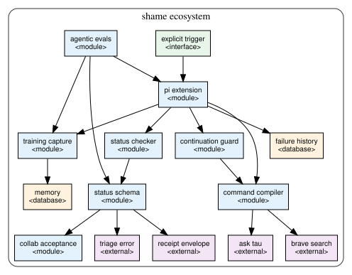

# Shame

Shame is the Pi status and continuation guard for project-agent work. It turns terminal agent claims into typed data, validates that data with pydantic, records bad terminal updates separately from human labels, and keeps deterministic follow-up work from being hidden behind prose.



Source-bound architecture draft:

- SVG: `docs/shame-ecosystem.svg`
- Receipt: `docs/shame-ecosystem.receipt.json`
- Retained create-architecture bundle: `/mnt/storage12tb/skills/create-architecture/outputs/shame-ecosystem-20260907T1205Z/`

The diagram is a component dependency view, not an execution trace. The retained receipt records `visual_review: NOT_RUN` and `semantic_review: NOT_ESTABLISHED`; the README text below is the human-readable source interpretation.


## PHART chart

The deterministic PHART view is retained at:

- Chart: `docs/shame-ecosystem.phart.txt`
- DAG input: `docs/shame-ecosystem.phart.dag.json`
- Receipt: `docs/shame-ecosystem.phart.receipt.json`

## What owns what

| Component | Owns | Source |
|---|---|---|
| `skills/shame/run.sh` | CLI routing for capture, audio, guard validation, failure history, and path lookup. | `run.sh` |
| `pi.agent_status.v1` | The terminal status contract: legal states, required payloads, local proof checks, and triage-code validation. | `scripts/agent_status_schema.py` |
| `lazy_report_shame.continuation_guard.v1` | The machine-work ledger for active tickets, gates, and obvious next steps. | `scripts/continuation_guard_schema.py` |
| `lazy_report_shame.collab_*` | Typed collaborator question, answer, and acceptance packets. | `scripts/collab_acceptance_schema.py` |
| `capture-last-assistant.mjs` | Human-labeled examples and Memory read-back for searchable shame labels. | `scripts/capture-last-assistant.mjs` |
| Pi extension | Stop-boundary enforcement, status rendering, failure journaling, audio cue, and deterministic continuation dispatch. | `extensions/pi/lazy-report-shame-shame-shame/` |
| Agentic eval catalog | Retained live workflow coverage and explicit proof limits. | `fixtures/agentic_eval.json`, `fixtures/EVALUATION.md` |

## Runtime flow

1. The Pi extension always observes the stop boundary, but status JSON is forced only for mutating turns, strict mode, task budgets, continuation ledgers, format retries, or an explicitly armed guard. A read-only `$shame` question stays plain.
2. When status is required or provided, the extension extracts the final fenced `pi.agent_status.v1` JSON block and sends only that data to `status-json-check.mjs`.
3. `status-json-check.mjs` rejects duplicate keys, invokes `scripts/agent_status_schema.py`, and returns the validated status object.
4. The extension validates the terminal `pi.agent_status.v1` JSON and does not append a duplicate prose `Status Report`. Human prose should state what was actually done before the JSON.
5. `compile-status-command.mjs` maps `continuing` and legal `needs_*` states to exact runnable commands. `done`, `needs_human`, and `failed` do not dispatch automatically.
6. The escalation ladder is schema data, not prose:
   - `state="needs_brave_search"` requires `needs_brave_search.queries[]` and compiles to `skills/brave-search/run.sh web ... --count 5`.
   - `state="needs_agent"` requires `needs_agent.parent_refs[]` containing `expected_producer="brave-search"` and a cross-family handler: OpenAI/Codex agents must use `claude-fable-low`; Claude agents must use `gpt-5.5-high`.
   - `state="needs_webgpt"` requires typed parent refs from both `brave-search` and `ask`, then compiles to `$ask webgpt` through Tau.
7. Failure observations append to `/mnt/storage12tb/skills/shame/failures/events.jsonl`; human labels append to the training JSONL and, when enabled, write through Memory with read-back.

## Required checks

```bash
uv run --with pydantic python3 skills/shame/scripts/immutable_goal_schema.py validate skills/shame/immutable_goal.json
python3 skills/shame/scripts/eval-done-receipt-binding.py
python3 skills/shame/scripts/eval-status-preflight.py
python3 skills/shame/scripts/eval-recovery-routing.py
python3 skills/shame/scripts/eval-retry-packet.py
python3 skills/shame/scripts/eval-ticket-close-final.py
python3 skills/shame/scripts/eval-spiral-ticket-request.py
python3 skills/shame/scripts/eval-escalation-ladder.py
skills/shame/sanity.sh --output /tmp/shame-agentic-eval.json
```

The first command validates the immutable goal. The second runs the canonical retained `$agentic-evals` catalog for Shame through `skills/shame/sanity.sh`.

## Proof boundary

- Pydantic validation proves the status object matches the schema, JSON proof files use supported receipt schemas, ticket closures use `ticket.closure_receipt.v1`, and each verified item is backed by one proof record.
- The guard does not prove arbitrary external URLs, reviewer prose, provider independence, or universal project completion.
- Memory recall rows are observations, not acceptance receipts.
- The diagram receipt proves renderer execution, source hashes, and SVG structure only.
