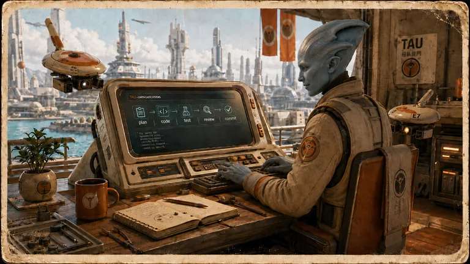

# tau

Tau is the Memory-First Zero-Trust Agent Harness behind my goal-locked agent
work. It wraps bounded loops, handoff contracts, watchdog receipts, GitHub issue
orchestration, TUI inspection, and chat-facing proof so an agent turn has a
goal, context, result, rationale, next step, evidence, and stop condition.

The full public project lives at
[github.com/grahama1970/tau](https://github.com/grahama1970/tau). This skill is
the agent-skills operator entrypoint for using Tau from the skills ecosystem.

Agents must treat [`SKILL.md`](SKILL.md) as the runtime contract. This README is
the human/operator guide.

## Use It For

| Need | Start here |
|---|---|
| Check wrapper and Tau runtime readiness | `skills/tau/run.sh doctor` |
| Inspect current Tau status | `skills/tau/run.sh status` |
| Run bounded local checks | `skills/tau/run.sh sanity` |
| Inspect recent proof/status evidence | `skills/tau/run.sh proof-status` |
| Check watchdog receipts | `skills/tau/run.sh watchdog-status` |
| Summarize latest proof artifacts | `skills/tau/run.sh latest-proofs` |

`skills/tau/run.sh e2e` remains a compatibility alias for `proof-status`; it is
not a production end-to-end proof claim.

## What Makes Tau Different

Tau is not just a loop wrapper. Its useful boundary is the contract around
agent work:

- memory-first context before action
- bounded subagent invocation instead of unbounded background agents
- goal-locked handoffs with immutable human goal changes
- watchdog and issue-repair receipts
- TUI and chat surfaces for inspecting state
- explicit mocked/live proof boundaries

The special long-running behavior is infrastructure repetition, not an immortal
subagent. Each subagent turn still needs a bounded receipt and a stop condition.

## Main Surfaces

| Surface | Role |
|---|---|
| Loop | Command-loop and provider execution |
| Harness | Goal-locked handoffs, subagent routing, and issue orchestration |
| TUI | Terminal-facing state and proof inspection |
| Chat | Memory-first chat renderer that can converge with other agent UIs |

## Proof Discipline

- State `mocked` and `live` boundaries for every Tau claim.
- Unit tests are not end-to-end proof.
- Loop and harness claims require fresh command-loop or watchdog receipts.
- Chat UI claims require browser/CDP screenshot verification.
- Subagent handoffs must use the documented Tau schema.

## References

- [`SKILL.md`](SKILL.md) is the operational contract.
- [`docs/PROJECT_KNOWLEDGE.md`](docs/PROJECT_KNOWLEDGE.md) records current
  proof boundaries and pending evidence.
- The standalone project README is in the public Tau repo.
