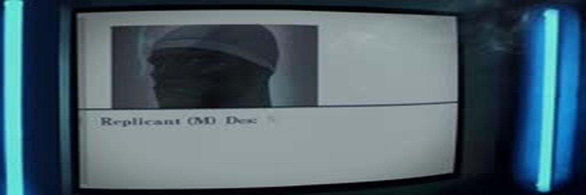
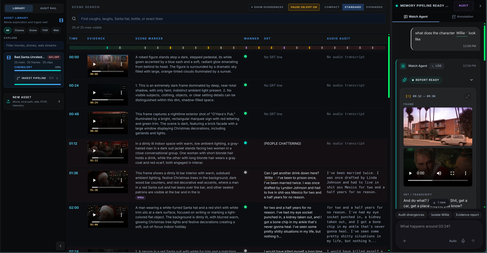

# watch — Video Memory for Agents

<p align="center">
  
</p>

> Turn video into searchable, timecode-aligned memory.

Some videos are easy for a person and surprisingly hard for an agent. A transcript
captures the words, but not the screen. A thumbnail shows one moment, but not the
story. A generic summary loses the exact timestamp where something happened.

`watch` fixes that gap. Hand it a YouTube URL, a local file, or a movie from your
library. It builds a searchable record of what was said, what was shown, when
scenes changed, and what the audio felt like. After the run you get local reports
you can inspect, plus memory records that `/memory/recall` can use later.


*Watch UI showing the forensic asset library, scene table, memory-pipeline
agent rail, inline movie segment playback, and domain-linked character markers.*

## What it does

`watch` ingests a video source and produces a time-aligned bundle:

1. **Acquire** — downloads or probes the source (YouTube via `yt-dlp`, local files, or library titles).
2. **Sample** — extracts frames at scene changes or uniform intervals, whichever fits the material.
3. **Transcribe** — pulls audio and runs speech-to-text (GPU Whisper when available, CPU fallback otherwise).
4. **Enrich** — optional scene descriptions, soundtrack mood, and divergence checks between official subtitles and raw audio.
5. **Persist** — writes a human-readable `report.md`, a structured `report.json`, and upserts searchable memory records.

Everything is anchored to seconds-from-start. That alignment is the whole point:
a later query can recover the dialogue, frame, and audio context for the same
moment without reopening the video.

## When to reach for it

Use `watch` when the visual or audio context matters, not just the transcript.

| Situation | Why `watch` helps |
| --- | --- |
| YouTube tutorials | Captures the instructor's screen, not only the narration. |
| Screen recordings | Preserves UI state, menus, dialogs, cursor context, and timing. |
| Lectures and talks | Connects spoken explanations to slide changes and timestamps. |
| Meetings and Zoom calls | Combines transcript with shared-screen context. |
| Film or video clips | Records scene boundaries, key frames, dialogue, and soundtrack mood. |
| Multi-asset operational review | Indexes telemetry-synced footage so agents can query by timestamp, visual cue, or audio event later. |
| Agent memory | Creates a durable video index that other agents can search and reason about. |

For long recordings, prefer a focused clip with `--start` and `--end`. The output
is usually better when `watch` analyzes the section you actually care about
instead of an entire two-hour archive.

## Quickstart

You do not need to understand the whole pipeline first. Start with one video.

```bash
cd skills/watch

# Watch a YouTube video
./run.sh "https://youtu.be/iYG5tiFfK3E"

# Watch a local file
./run.sh movie.mkv

# Focus on a section of a long video
./run.sh movie.mkv --start 180 --end 600

# Static screen recording? Try uniform sampling instead of scene cuts
./run.sh recording.mp4 --no-scene-change
```

By default, `watch` tries scene-change frame extraction. Focused ranges and
explicit `--fps` runs use uniform sampling, which is often better for static
screen recordings and slide decks.

After the run, open `report.md` in the printed work directory. That tells you
what was actually processed before you ask recall questions about the video.

Agents and project skills should read [`SKILL.md`](SKILL.md) for the invocation
contract, output schemas, memory records, and error behavior. This README is for
humans installing, running, and debugging `watch`.

## Real-Time Tracking Direction

Watch is evolving from a single-video memory tool into a multi-asset evidence
stream console. Movies are the controlled test case. The target architecture also
supports streamed sources such as drone feeds, RTSP cameras, web videos, and
telemetry-aligned operational footage.

The tracking contract is:

```text
live tracking is streamed
bounded observations and cases are stored to memory
```

The practical starting stack is:

- Ultralytics YOLO for person/object detection
- ByteTrack or DeepSORT for frame-to-frame track continuity
- OpenCV for local media I/O, sampling, and overlay plumbing
- optional face/person re-identification embeddings for character candidates
- `$brave-search` for actor/character domain seeding
- `$memory` plus Qdrant/Jina multimodal embeddings for durable recall

Brave Search and movie-domain memory provide domain priors, not scene truth. For
example, Brave can seed `Tony Cox -> Marcus` for *Bad Santa*, but the Watch row
still needs frame, clip, transcript, or tracking evidence before answering that
Marcus appears in a specific segment.

See:

- [`docs/architecture/watch_realtime_character_tracking_contract.md`](docs/architecture/watch_realtime_character_tracking_contract.md)
- [`docs/architecture/watch_realtime_tracking_execution_plan.md`](docs/architecture/watch_realtime_tracking_execution_plan.md)
- [`docs/architecture/watch_realtime_character_tracking_inspection.md`](docs/architecture/watch_realtime_character_tracking_inspection.md)
- [`docs/architecture/watch_track_observations.schema.json`](docs/architecture/watch_track_observations.schema.json)
- [`docs/architecture/watch_track_observation.bad_santa_marcus.sample.json`](docs/architecture/watch_track_observation.bad_santa_marcus.sample.json)
- [`docs/architecture/watch_realtime_tracking_memory_upsert_manifest.bad_santa_marcus.json`](docs/architecture/watch_realtime_tracking_memory_upsert_manifest.bad_santa_marcus.json)
- [`docs/architecture/watch_realtime_tracking_memory_upsert_manifest.inspection.md`](docs/architecture/watch_realtime_tracking_memory_upsert_manifest.inspection.md)
- [`docs/architecture/watch_tracker_event_log.bad_santa_marcus.fixture.jsonl`](docs/architecture/watch_tracker_event_log.bad_santa_marcus.fixture.jsonl)
- [`docs/architecture/watch_tracker_event_log.bad_santa_marcus.inspection.md`](docs/architecture/watch_tracker_event_log.bad_santa_marcus.inspection.md)
- [`scripts/build_realtime_tracking_upsert_payloads.py`](scripts/build_realtime_tracking_upsert_payloads.py)
- [`docs/architecture/watch_realtime_tracking_upsert_payloads.inspection.md`](docs/architecture/watch_realtime_tracking_upsert_payloads.inspection.md)
- [`docs/architecture/generated/bad_santa_marcus_0248_upsert_payloads/summary.json`](docs/architecture/generated/bad_santa_marcus_0248_upsert_payloads/summary.json)
- [`scripts/build_realtime_tracking_event_log.py`](scripts/build_realtime_tracking_event_log.py)
- [`docs/architecture/watch_realtime_tracking_frame_harness.inspection.md`](docs/architecture/watch_realtime_tracking_frame_harness.inspection.md)
- [`docs/architecture/generated/bad_santa_marcus_0248_tracker_events/summary.json`](docs/architecture/generated/bad_santa_marcus_0248_tracker_events/summary.json)
- [`scripts/build_tracking_overlay_payload.py`](scripts/build_tracking_overlay_payload.py)
- [`scripts/validate_watch_overlay_payload.py`](scripts/validate_watch_overlay_payload.py)
- [`docs/architecture/watch_ui_overlay_payload.schema.json`](docs/architecture/watch_ui_overlay_payload.schema.json)
- [`docs/architecture/generated/bad_santa_marcus_0248_overlay_payload/inspection.md`](docs/architecture/generated/bad_santa_marcus_0248_overlay_payload/inspection.md)
- [`scripts/track_yolo_bytetrack.py`](scripts/track_yolo_bytetrack.py)
- [`docs/architecture/watch_yolo_bytetrack_adapter.inspection.md`](docs/architecture/watch_yolo_bytetrack_adapter.inspection.md)
- [`docs/architecture/generated/bad_santa_domain_seed/inspection.md`](docs/architecture/generated/bad_santa_domain_seed/inspection.md)

For live character/asset tracking, install the optional tracking dependencies:

```bash
uv pip install -e '.[tracking]'
```

This adds Ultralytics YOLO and OpenCV for the `track_yolo_bytetrack.py` adapter.
The adapter emits provisional live-track events only; identity verification and
memory persistence remain separate Watch Agent steps.

## How to Use

### 1. Watch a movie

```bash
cd skills/watch

# Set the Whisper API key (from Docker container)
export WHISPER_API_KEY="$(docker exec watch-whisper whisper_manage --showkey | grep -m1 -oP 'whisper-[a-f0-9]+')"

# Watch a local movie with Whisper + divergence (auto-extracts SRT from MKV)
./run.sh /path/to/movie.mkv --whisper --persona embry

# Watch a YouTube video
./run.sh "https://youtu.be/..." --persona embry

# Watch a specific clip (faster)
./run.sh movie.mkv --start 300 --end 600 --whisper --persona embry
```

### 2. Open the UI

```bash
# Start the Express API
cd skills/watch/ui
npx tsx server/index.ts &

# Start the Vite dev server
npx vite --port 3002
```

Then open `http://localhost:3002/#watch` in a browser to see the divergence
report with color-coded chips, the forensic summary sidebar, and the scene
element table.

### 3. Query via memory

```python
import httpx

# What did Embry watch?
r = httpx.post("http://127.0.0.1:8601/recall", json={
    "q": "Embry watch history",
    "collections": ["persona_memory"],
    "tags": ["persona:embry", "watch_history"],
    "k": 5,
})
print(r.json()["items"])

# Ask about a specific scene
r = httpx.post("http://127.0.0.1:8601/recall", json={
    "q": "What happens at 04:48 in Edge of Tomorrow?",
    "collections": ["watch_content"],
    "k": 5,
})
for item in r.json()["items"]:
    print(item["answer"])  # Contains both SRT and Whisper text
```

### 4. Docker (production)

```bash
cd skills/watch/docker
docker compose --profile all up -d
# Whisper on :9000, Watch UI on :3002
```

## Self-Contained Setup (Docker)

The watch skill includes a docker-compose.yml that launches all required services:

```bash
cd skills/watch/docker

# Start everything (Whisper GPU + Watch UI)
docker compose --profile all up -d

# Or start individual services:
docker compose --profile whisper up -d   # Whisper ASR only
docker compose --profile ui up -d        # Watch UI only

# Get the Whisper API key for the pipeline:
docker exec watch-whisper whisper_manage --showkey
```

Services:

| Service | Port | Purpose |
|---------|------|---------|
| `watch-whisper` | 9000 | GPU-accelerated speech-to-text (hwdsl2/whisper-server:cuda) |
| `watch-ui` | 3002 | React UI + Express API for browsing watch reports |

### Manual Installation (No Docker)

For the watch pipeline (CLI only, no UI):

```bash
cd skills/watch
uv pip install httpx rich loguru typer pillow
```

System requirements: `ffmpeg`, `ffprobe`, `yt-dlp`

For the watch UI (development):

```bash
cd skills/watch/ui
npm install
npm run dev:all    # Vite on :3002, API on :3003
```

### Whisper Configuration

The pipeline uses Docker Whisper by default. Set these environment variables:

```bash
export WHISPER_API_URL="http://127.0.0.1:9000/v1/audio/transcriptions"
export WHISPER_API_KEY="$(docker exec watch-whisper whisper_manage --showkey | grep -m1 -oP 'whisper-[a-f0-9]+')"
```

Without Docker Whisper, the pipeline falls back to CPU-only faster-whisper
(slower, lower quality).

Useful checks:

```bash
ffmpeg -version
ffprobe -version
yt-dlp --version
```

Some enrichment steps depend on configured model/API access in the surrounding
agent-skills environment. If those services are unavailable, the local extraction
steps may still work, but image descriptions, soundtrack descriptions, or memory
upsert may be incomplete. Check stderr and the generated report for the exact
failure.

## Usage

Basic form:

```bash
./run.sh SOURCE [options]
```

`SOURCE` can be a video URL, a local file path, or a movie title that resolves in
the configured local library.

Common options:

```text
--start SECONDS_OR_TIME     start offset, for example 120 or 02:00
--end SECONDS_OR_TIME       end offset, for example 420 or 07:00
--scene-change              use scene-change extraction (default)
--no-scene-change           use uniform sampling instead
--fps FLOAT                 force a sampling rate
--max-frames INT            cap extracted frames (default 150, max 500)
--resolution INT            output frame width, default 256
--subtitle PATH             use a specific subtitle/SRT file (auto-extracted from MKV if omitted)
--whisper / --no-whisper    enable/disable GPU Whisper transcription (default: off)
--persona TEXT              persona name (e.g. embry) for persona_memory tagging
--out-dir PATH              keep the working artifacts in a known directory
--json                      print the JSON report
```

Examples:

```bash
# URL input
./run.sh "https://youtu.be/iYG5tiFfK3E"

# Local file input
./run.sh /path/to/demo.mp4

# Focused range, useful for long recordings
./run.sh /path/to/demo.mp4 --start 120 --end 420

# Uniform sampling for a static screen recording
./run.sh /path/to/recording.mp4 --no-scene-change

# Keep the work directory instead of using a temporary one
./run.sh /path/to/demo.mp4 --out-dir /tmp/watch-demo
```

Use scene detection for videos with cuts, camera changes, slide transitions, or
visually distinct sections. Use uniform sampling for long static videos, screen
recordings, or slide decks where there may be too few visual cuts.

## Outputs

There are two output locations to know about.

### 1. Work directory

This is the run directory used while processing the video. By default, `watch`
creates a temporary directory and prints its path at the end. Use `--out-dir` when
you want artifacts to stay somewhere predictable.

A typical work directory contains some or all of:

```text
frames/                 extracted scene or sample frames
audio.wav               extracted audio track
transcript.json         parsed transcript segments
scenes.json             optional SRT scene/query matches
frames_manifest.json    frame list with timestamps
report.json             structured run report
report.md               human-readable run report
```

Start with `report.md` when checking a run by hand. It should tell you what source
was processed, how long it was, which frames were selected, what transcript
segments were found, and which enrichment steps completed.

### 2. Persistent media directory

Selected frames and audio are also copied to persistent storage for memory recall:

```text
/mnt/storage12tb/media/watch-frames/<slug>/
```

That path is currently hardcoded in the skill. The script will create per-video
slug directories when it can, but on a laptop or smaller dev box `/mnt` may not be
mounted or writable. Before relying on persisted recall artifacts, create the path
with the right permissions or symlink it to a local media directory.

```bash
mkdir -p /mnt/storage12tb/media/watch-frames
```

`--out-dir` only controls the work directory. It does not change the persistent
media path.

`watch` stores memory records when QRA generation succeeds, so `/memory/recall`
can find the video later. The exact memory schema is agent-facing contract
material and lives in [`SKILL.md`](SKILL.md).

## Rolling Window Extraction

Long videos (≥10 min) are automatically split into 5-minute chunks with 3s
boundary overlap. Each chunk is processed independently for frame extraction,
then frames are merged, deduplicated, and globally reindexed into a single
timeline. This ensures full temporal coverage regardless of the frame budget.

| Video length | Without rolling | With rolling |
|-------------|----------------|--------------|
| 30 min | 500 frames (capped) | ~600-1200 frames |
| 2 hours | 500 frames (capped) | ~800-2000 frames |

Scene rows and memory records include `chunk_index`, `total_chunks`,
`chunk_start_seconds`, and `chunk_end_seconds` for traceability.

Rolling is automatic and only activates for full-video scene-change mode
(not for `--start`/`--end` focused clips or `--fps` explicit sampling).

## Divergence Intelligence

When both SRT and Whisper are available, `watch` computes a semantic divergence
between the official script (SRT) and the raw audio transcription (Whisper).
Only three meaningful divergence types are reported:

| Type | Meaning | Example |
|------|---------|---------|
| `[+] HIDDEN` | Whisper caught dialogue SRT omitted | SRT: `(PEOPLE CHATTERING)` → Whisper: "I've got my eyes on you" |
| `[!] SANITIZED` | SRT cleaned profanity | SRT: `Oh, my.` → Whisper: `Oh my fucking god.` |
| `[?] OCCLUDED` | SRT has audio cue, Whisper no speech | SRT: `(EXPLOSIONS)` → Whisper: silence |

No generic similarity ratio is computed. SRT and Whisper describe different
layers of the same scene (script vs audio), so minor wording differences are
expected and not flagged.

The divergence intelligence is displayed in the watch UI with color-coded chips
and a forensic summary sidebar. Memory recall stores both SRT and Whisper text
equally so agents can decide which to trust.

## Using the result

Once the run finishes, the report tells you what was found. The real value comes
later, when you can ask about the video without opening it again.

Good recall questions usually include one of three anchors:

- a timestamp: "at 2:30"
- a topic: "when they discuss gradient descent"
- a visual clue: "the frame with the terminal error"

Examples:

```text
What happens at 3:12 in the watched video?
Where does the speaker explain gradient descent?
Which frame shows the terminal error?
What was on screen when the narrator mentioned deployment?
What is the mood of the soundtrack during the chase scene?
```

If recall gives a weak answer, check `report.md` first. The moment may not have
been sampled, the transcript may be missing, or the memory service may not have
accepted the upsert.

Agents should ask video-memory questions through `/memory recall` against the
`watch_content` collection and read `items`, not `results`. For movie questions,
Watch can answer like a human viewer when the watched-video evidence supports
the answer. It may use Brave Search to corroborate public movie facts or expected
answers, but not as a substitute for frames, transcript, scene metadata, or
`watch_content` recall.

## Sanity check

Run the skill test suite after setup or before changing the implementation:

```bash
cd skills/watch
./sanity.sh
```

The suite is intended to catch broken dependencies, script regressions, and recall
integration problems before you trust a run.

## Troubleshooting

### `yt-dlp` cannot download the video

Confirm `yt-dlp` is installed and up to date:

```bash
yt-dlp --version
```

Some sites block downloads, require authentication, or change formats. Try a local
file when URL download is the unreliable part.

### `ffmpeg` or `ffprobe` is missing

Install the system package for your platform and verify both commands are on
`PATH`:

```bash
ffmpeg -version
ffprobe -version
```

### The run produced too few useful frames

Try the opposite extraction mode. If you used scene detection on a static screen
recording, rerun with `--no-scene-change`. If uniform sampling missed fast visual
cuts, rerun with the default scene-change mode.

### The transcript is weak

Check the audio quality. Quiet speakers, overlapping voices, loud music, and noisy
rooms can reduce transcription quality. For long recordings, rerun a focused
section with `--start` and `--end`.

### Recall cannot find the watched moment

First inspect `report.md` to confirm the moment was actually processed. Then run
the recall proof script if available:

```bash
uv run python scripts/recall_proof.py
```

If local artifacts exist but recall fails, the issue is likely in memory upsert,
indexing, or service configuration rather than video extraction.

### Image or soundtrack descriptions are missing

The frame and transcript extraction steps are local, but multimodal enrichment may
use configured model services. Check the report and stderr for service errors,
credential problems, rate limits, or unavailable endpoints.

### Persistent artifacts fail to write

Check the hardcoded media path:

```bash
ls -ld /mnt/storage12tb/media /mnt/storage12tb/media/watch-frames
```

If that path does not exist or is not writable, create it, fix permissions, mount
the storage volume, or symlink `watch-frames` to a directory on local disk.

## Hard limits

| Area | Current behavior |
| --- | --- |
| Frames | Rolling window extraction for long videos (≥10 min). Auto-splits into 5-min chunks with 3s overlap, merges and deduplicates. Up to 500 frames per chunk, effectively unlimited across chunks. |
| Transcription | Docker Whisper GPU (`hwdsl2/whisper-server:cuda`) on port 9000. Falls back to CPU-only faster-whisper. |
| Subtitles | Auto-extracted from MKV (subrip/ASS/SSA). PGS (BluRay image) subs OCR'd via batch ffmpeg + tesseract (ThreadPoolExecutor, max 500 events). |
| Divergence | Only 3 semantic types: hidden_dialogue, sanitized, acoustic_context. No similarity ratio noise. |
| Memory | Two layers: `watch_content` (per-scene rows) + `persona_memory` (watch records tagged by persona). Chunk metadata in every row. |
| Config | All paths/env vars in `scripts/config.py`: `WATCH_MEDIA_ROOT`, `MEMORY_DAEMON_URL`, `WHISPER_API_URL` + `WHISPER_API_KEY`. Media root defaults to `~/.local/share/agent-skills/watch-frames`. |
| Recall | Requires memory daemon at `localhost:8601`. Configured via `MEMORY_DAEMON_URL`. |

`watch` is not a video editor and it is not a perfect substitute for a human
watching every second. It is an indexing tool: it gives agents enough aligned
visual, audio, and text evidence to search and reason about a video later.

## Tips and gotchas

- Keep the first run small. A focused five-minute segment is easier to verify than
  a two-hour recording.
- Use `--start` and `--end` to keep long videos small, readable, and easier to
  recall accurately.
- Static videos often work better with `--no-scene-change` because there may be
  too few visual cuts to sample well.
- Scene detection is better for movies, edited videos, talks with slide changes,
  and recordings with visible transitions.
- Use `--out-dir` when debugging so the reports and intermediate files do not
  disappear into a temporary directory.
- Memory recall is only as good as the sampled frames, transcript quality, and
  successful memory upsert.

## Credits

`watch` builds on scene-detection techniques from
[claude-watch](https://github.com/taoufik123-collab/claude-watch) by
taoufik123-collab. The ingest-youtube and ingest-movie skills provide transcript
and SRT analysis. Memory schema additions follow the SPARTA QRA document pattern.
