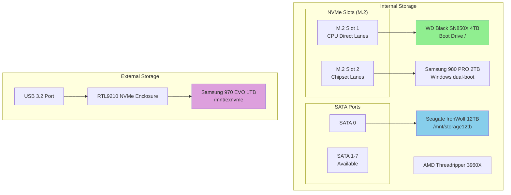
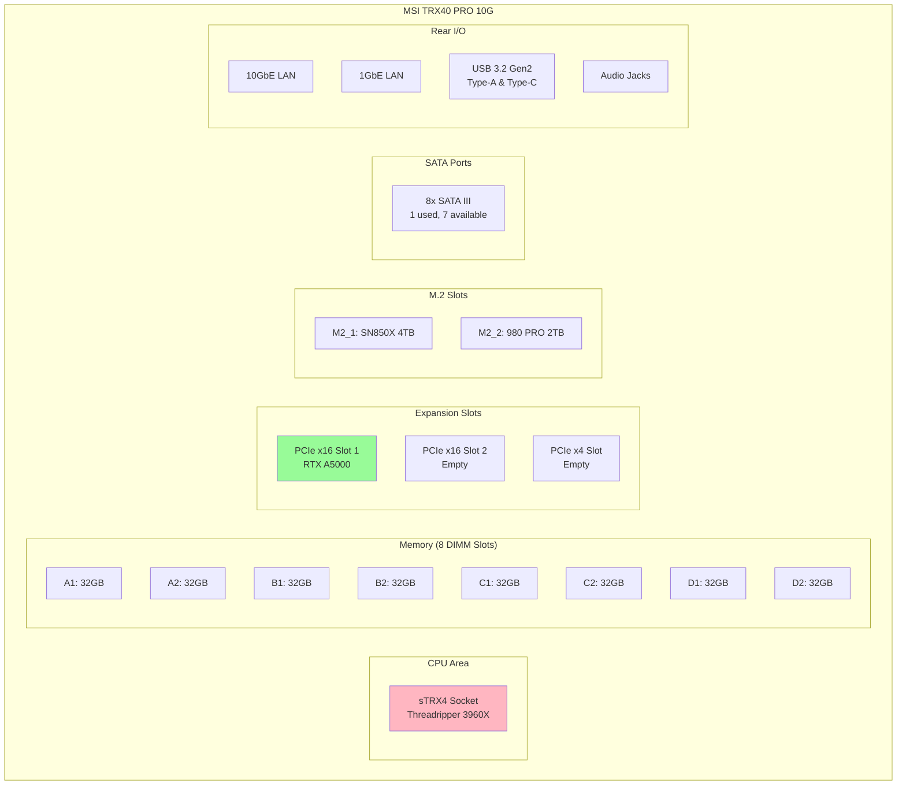

# Workstation Reference

## System Overview

| Component | Model |
|-----------|-------|
| **Chassis** | Desktop Tower (MSI) |
| **Motherboard** | MSI TRX40 PRO 10G (MS-7C60) |
| **CPU** | AMD Ryzen Threadripper 3960X (24-core/48-thread) |
| **RAM** | 256 GB DDR4 (8x32GB) |
| **GPU** | NVIDIA RTX A5000 (24GB VRAM) |
| **PSU** | 850W+ (required for Threadripper + GPU) |

## Storage Layout



## Drive Details

| Drive | Model | Size | Mount | Purpose |
|-------|-------|------|-------|---------|
| nvme0n1 | WD Black SN850X | 4 TB | `/` | **Boot/OS** - Ubuntu 24.04 |
| nvme1n1 | Samsung 980 PRO | 2 TB | (Windows) | Dual-boot Windows |
| sda | Seagate IronWolf ST12000NT001 | 12 TB | `/mnt/storage12tb` | Media, backups, datasets |
| sdb | Samsung 970 EVO Plus (external) | 1 TB | `/mnt/exnvme` | Portable projects |

## Motherboard Layout (MSI TRX40 PRO 10G)



## Hardware Upgrade Procedures

### Adding an NVMe SSD

**Tools needed:** Phillips screwdriver

**Available slots:**
- M.2 Slot 1 (near CPU) - **OCCUPIED** by WD Black SN850X
- M.2 Slot 2 (below GPU) - **OCCUPIED** by Samsung 980 PRO

**To replace an NVMe:**

1. **Shutdown** and unplug power
2. **Ground yourself** - touch the case metal
3. **Remove side panel** (thumb screws on back)
4. **Locate M.2 slot** - has a small screw at the end
5. **Remove heatsink** if present (unscrew)
6. **Remove existing drive:**
   - Unscrew the securing screw
   - Drive will pop up at 30° angle
   - Pull out gently
7. **Install new drive:**
   - Insert at 30° angle into slot
   - Press down flat
   - Secure with screw
8. **Replace heatsink** and close case
9. **Boot and partition:**
   ```bash
   # List drives
   lsblk

   # Partition new drive
   sudo fdisk /dev/nvmeXn1
   # n (new), p (primary), 1, Enter, Enter, w (write)

   # Format
   sudo mkfs.ext4 /dev/nvmeXn1p1

   # Mount
   sudo mkdir /mnt/newdrive
   sudo mount /dev/nvmeXn1p1 /mnt/newdrive

   # Add to fstab for auto-mount
   echo "UUID=$(blkid -s UUID -o value /dev/nvmeXn1p1) /mnt/newdrive ext4 defaults 0 2" | sudo tee -a /etc/fstab
   ```

### Adding a SATA Hard Drive

**Available ports:** 7 of 8 SATA ports free

**Steps:**

1. **Shutdown** and unplug
2. **Mount drive** in 3.5" bay (tool-less clips or screws)
3. **Connect SATA data cable** to motherboard (any port 1-7)
4. **Connect SATA power** from PSU (15-pin connector)
5. **Boot and partition:**
   ```bash
   # Find new drive
   lsblk

   # Partition
   sudo fdisk /dev/sdX
   # n, p, 1, Enter, Enter, w

   # Format
   sudo mkfs.ext4 /dev/sdX1

   # Mount
   sudo mkdir /mnt/storage
   sudo mount /dev/sdX1 /mnt/storage

   # Add to fstab
   echo "UUID=$(blkid -s UUID -o value /dev/sdX1) /mnt/storage ext4 defaults 0 2" | sudo tee -a /etc/fstab
   ```

### Adding RAM

**Current:** 8x 32GB = 256GB DDR4
**Max supported:** 256GB (fully populated)

**Note:** All DIMM slots are occupied. To upgrade, you would need to replace existing modules with higher capacity (if available).

### GPU Upgrade

**Current:** NVIDIA RTX A5000 (24GB) in PCIe x16 Slot 1
**Available:** PCIe x16 Slot 2 (can run second GPU)

**Steps:**

1. **Uninstall old drivers:**
   ```bash
   sudo apt remove --purge 'nvidia-*'
   sudo apt autoremove
   ```
2. **Shutdown**, unplug, open case
3. **Release PCIe latch**, disconnect power cables
4. **Remove old GPU**, insert new GPU
5. **Connect PCIe power cables** (8-pin or 12-pin depending on GPU)
6. **Boot and install drivers:**
   ```bash
   # Auto-install recommended driver
   sudo ubuntu-drivers autoinstall

   # Or specific version
   sudo apt install nvidia-driver-550

   # Verify
   nvidia-smi
   ```

## Connected Peripherals

| Device | Connection | Purpose |
|--------|------------|---------|
| Elgato Stream Deck XL | USB 3.0 | Automation shortcuts |
| Jabra SPEAK 510 | USB | Speakerphone |
| Logitech Unifying Receiver | USB | Wireless keyboard/mouse |
| RTL9210 NVMe Enclosure | USB 3.2 | External SSD |
| MSI Mystic Light | USB (internal) | RGB control |

## Network

| Interface | Speed | Purpose |
|-----------|-------|---------|
| 10GbE (Aquantia) | 10 Gbps | Primary LAN |
| 1GbE (Intel) | 1 Gbps | Backup/management |

## Power Considerations

- **PSU:** Minimum 850W recommended for this configuration
- **GPU TDP:** RTX A5000 = 230W
- **CPU TDP:** Threadripper 3960X = 280W
- **Total system draw:** ~500-600W under load

## BIOS/UEFI Notes

- **Enter BIOS:** Press `DEL` during boot
- **Boot menu:** Press `F11` during boot
- **XMP Profile:** Enable for full RAM speed
- **Secure Boot:** Disabled for Linux compatibility
- **CSM:** Disabled (UEFI only)
